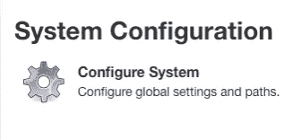
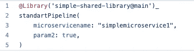

# CI/CD 统一，敏捷软件开发

> 原文：<https://blog.devgenius.io/agile-development-microservices-and-ci-cd-unification-decf08f18d76?source=collection_archive---------12----------------------->


克里斯托夫·迪翁在 [Unsplash](https://unsplash.com?utm_source=medium&utm_medium=referral) 上拍摄的照片

这是一个关于如何创建 Jenkins CI/CD 管道共享库并在微服务中使用它的分步教程。这里有一些简单的步骤，可以引导你找到一个有效的 CI/CD 管道解决方案，实现敏捷原则，提高生产率和质量。

不可否认，敏捷思维正在渗透大大小小的 It 企业。一个小团队致力于一个小的、专门的项目。一个团队拥有并专注于一个项目。这样的项目可以更快地完成。这是微服务架构和敏捷开发的一个好处。

最重要的是，敏捷是一种思考软件开发和部署过程的方式。敏捷认识到目标是交付可工作的软件。

持续的变化和拥抱变化，贡献者之间的合作是敏捷过程不可或缺的一部分。根据这些价值制定原则的敏捷技术正在建立授权和协作的团队。这样的团队在迭代周期中频繁地交付工作软件以适应变化。

DevOps 运动自然而然地支持这些敏捷原则。它的文化拓宽了从编写代码到发布产品的权限。它正在合并分离的部分。开发运维实践，如持续集成、持续交付和部署(CI/CD ),旨在加速交付过程而不影响质量。CI/CD 步骤的自动化使流程频繁运行，并保证获得稳定且可重复的结果。它提高了质量，使整个过程更具成本效益和时间效率。

让许多团队从事不同的产品部分是否意味着有许多具有不同步骤的 CI/CD 管道？

答案是肯定的——您可能会有许多 CI/CD 管道。一个关键因素是，每个管道都有相同的步骤。特定微服务 CI/CD 管道中的每个步骤都实现了与微服务相关的特定逻辑。

使用这样的概念给你带来了统一的优势，并且能够在仪表板中可视化每个构建的变化。

软件开发的“**不要重复自己**”原则是我们在整个项目中每个管道的实现中最好的朋友——相同的步骤，可能有不同的逻辑。你可以在这里阅读更多关于这个原则的内容

[](https://en.wikipedia.org/wiki/Don%27t_repeat_yourself) [## 不要重复自己-维基百科

### “不要重复自己”(干，或者有时“不要重复自己”)是软件开发的一个原则，旨在…

en.wikipedia.org](https://en.wikipedia.org/wiki/Don%27t_repeat_yourself) 

Jenkins 是一个非常流行的开源持续集成(CI)工具。让我们回顾一个基于 Jenkins 中共享库实现的统一微服务 CI/CD 管道的解决方案。

我们应该采取几个步骤:

*   实现共享库
*   配置 Jenkins 使用共享库
*   实现一个微服务管道的例子

我们开始吧

> ***点击关注再也不要错过我的另一篇文章。***

# **实现共享库**

您可以从[这里的](https://github.com/LearnTechnoBios/simple-jenkins-shared-library.git)克隆一个共享库的工作代码示例

您的共享库的代码需要位于“vars”文件夹下。文件应该有扩展名。groovy(在我们的例子中使用 strandartPipeline.groovy)

您应该使用以下签名实现函数“call ”:

```
def call(Map specifiedParams) {}
```

在此函数中使用“管道”、“阶段”、“阶段”标签，如下所示

```
pipeline **{** stages **{** stage('Set Environment Variables') **{** steps **{** script **{** <add your code here>
                **}
            }
        }**
```

你可以在这里找到更多关于声明性管道语法的信息

[](https://www.jenkins.io/doc/book/pipeline/syntax/#declarative-steps/) [## 管道语法

### 最初创建 Jenkins Pipeline 时，选择 Groovy 作为基础。Jenkins 长期以来一直附带一个…

www.jenkins.io](https://www.jenkins.io/doc/book/pipeline/syntax/#declarative-steps/) 

在这。groovy 文件中，您将定义您的统一管道步骤，这些步骤将作为模板在每个微服务管道中使用。

所以务实一点，想想管道流。定义步骤的执行顺序以及它们之间的并行性。

# **配置 Jenkins 使用共享库**

现在我们应该配置 Jenkins 工具来使用这个共享库


**仪表盘- >管理詹金斯**



**- >系统配置- >配置系统**

在 Jenkins UI 上，转到**仪表板- >管理 Jenkins - >系统配置- >配置系统**


在**全局管道库**部分

1.添加一个名称(在我们的例子中使用简单共享库)

2.选择一个**检索方法:**使用"**现代 SCM** "，**源代码管理** " **Git** "并在项目资源库中放置您的 Git 共享库资源库的 URL
(对于我们的示例，使用[https://github . com/LearnTechnoBios/simple-Jenkins-shared-library . Git](https://github.com/LearnTechnoBios/simple-jenkins-shared-library.git))。添加凭据(如果需要)。

3.点击**保存**的修改

# 实现一个微服务管道的例子

现在，我们准备创建一个简单的微服务，并演示在这个微服务中使用统一管道是多么容易。

您可以从这个 [repo](https://github.com/LearnTechnoBios/simple-microservice-1.git) 中克隆一个工作代码示例



Jenkinsfile 示例

您可以在根目录下创建一个简单的项目，并添加一个包含以下内容的 **Jenkinsfile**

要利用通过共享库实现的统一管道的优势，您应该做的就是添加这几行代码。

让我们看看我们有什么:

在**@ Library(')**中，使用在 Jenkins UI 配置中定义的名称(在我们的示例中使用“简单共享库”)后跟分支名称(在我们的示例中使用“main”)

之后，写下。您想要使用的 groovy 文件
(在我们的例子中使用“standartPipelien”)。您还可以发送要在管道步骤中使用的参数(在我们的示例中使用“microservicename”)

# **为简单的微服务定义一个 Jenkins 作业**


Jenkins UI 仪表板->新项目

在 Jenkins UI 上，转到仪表板—>新项目


管道选项配置

添加一个名称并选择一个**管道**选项


在管道段中，从 SCM 中选择**管道脚本。在 **SCM** 中:选择 Git**

在**存储库 URL** 中，使用您的微服务存储库的 URL(对于我们的示例，使用[https://github . com/LearnTechnoBios/simple-microservice-1 . git)](https://github.com/LearnTechnoBios/simple-microservice-1.git))


验证存储库中的根目录下是否有 Jenkinsfile，并在脚本路径中写入“Jenkinsfile”

**保存**修改

让我们看看它是如何工作的。


立即构建菜单配置

进入**仪表盘**->-<您的服务的作业>->-**立即构建**

新的运行开始了，您可以看到所有步骤都是从共享库定义开始的，微服务代码上没有任何额外的代码。


您还可以使用[“蓝海”](https://plugins.jenkins.io/blueocean/) Jenkins 插件
来改善您的用户体验，并查看更生动的管道运行演示。


这是关于如何统一产品中所有微服务的 CI/CD 管道的简短说明。

> 请务必点击关注，千万不要错过另一篇关于技巧和提示、生活经验等的文章！

快乐编码。

由亚历克斯·鲁多伊编辑