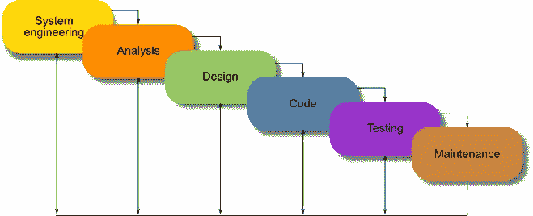
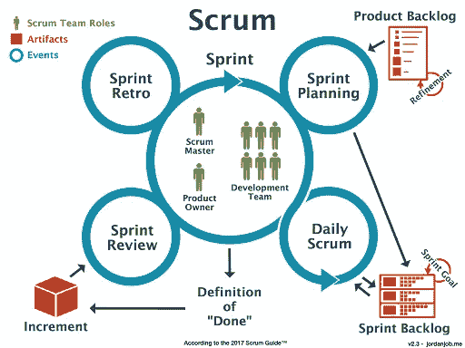
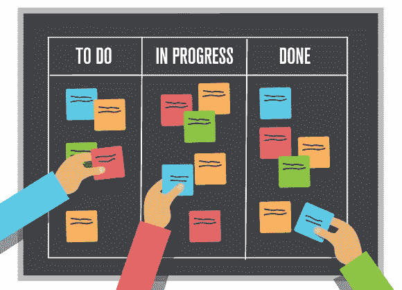

# 使用 Scrum 和看板的敏捷开发

> 原文：<https://blog.devgenius.io/agile-development-with-scrum-and-kanban-9d961a1cd80d?source=collection_archive---------9----------------------->

敏捷项目管理已经被定义在许多正式的定义中。

我发现这是最具启发性的一种方法——一种管理软件开发项目的迭代方法，它关注于持续的发布，并在每次迭代中结合客户的反馈。

我们必须理解的定义是，在敏捷中，我们重视:

*   综合文档之上的工作软件
*   合同谈判中的客户协作
*   流程和工具上的个人交互
*   响应以下计划的变更

# 敏捷为什么重要？

那么，为什么您会决定从您的项目或公司一直使用的风格转变为敏捷项目管理呢？

在过去的几年里，软件开发有了巨大的变化。以前的情况是，团队会把自己锁在办公室里几个月甚至几年，试图开发一个全面的产品。

传统方法的一个例子是在软件开发的早期阶段使用的[瀑布模型](https://www.tutorialspoint.com/sdlc/sdlc_waterfall_model.htm)。在完成前一个阶段之前，一个项目会在不同的阶段移动，而不会进入下一个阶段。在开发软件的任何功能之前，团队会花几个月的时间做几十甚至几百页的综合文档。这是瀑布的一个小图片。

这种方法的坏消息是，在漫长的产品开发周期结束时，客户不会喜欢这个产品，这意味着团队会花所有的时间在错误的产品上。有人会说“浪费所有的时间和资源值得称赞！”。所以团队会再次重复这个循环，结果却发现他们浪费了更多的时间。

但是这是可以用敏捷原则避免的。

敏捷开发通过让产品的实际所有者参与到开发过程中来节省时间和资源。通过这种方式，可以从用户那里反复获得关于产品的反馈。而这就是产品负责人让客户开心所需要的一切。如果客户满意，他们会为软件付费，这就是支付账单的原因！

通过使用 scrum sprints 或者看板方法，产品的最小版本被快速开发出来，然后尽快交付给客户。如果你不熟悉 scrum 或看板，不用担心，我会在接下来的章节中详述。然后，软件在一组迭代中不断改进。

# 敏捷 vs Scrum vs 看板

许多软件工程师将敏捷软件开发与 Scrum 和看板混为一谈。

敏捷软件开发是一个很大的概念，但是你需要知道的是，它只是在实现我们到目前为止讨论的所有内容时所遵循的一套原则。另一方面，Scrum 和看板是可以用来实现敏捷开发目标的框架。

将敏捷开发视为目标，scrum 和看板是实现目标的工具。

我今天的讨论基于 Scrum 和看板，但这并不意味着它们是唯一的敏捷框架。有很多，但这两个是公司里用得最多的。请随意阅读[其他框架](https://www.professionaldevelopment.ie/what-are-agile-frameworks)

## **什么是 Scrum？**

Scrum 更多的是设定目标和实现目标。嗯，所有的框架都是关于实现目标的，但是对于 scrum 来说，在任何阶段/冲刺开始之前，目标设定是关键。

称 sprint 为一小段时间，scrum 团队在这段时间内完成一组固定的工作或一个潜在的可发布产品。sprint 通常是两个星期，或者对于更大的项目来说最多一个月。

使用 scrum，就是通过将项目分成一系列阶段，然后通过冲刺来实现，从而更快地达到目标。

Scrum 可以为早期阶段的项目和软件交付时间很短的短期项目(比如自由职业者的工作)带来显著的进展。它允许团队尽早交付工作软件。

在每个冲刺阶段结束时，软件被交付给客户，以体现 [**敏捷宣言**](https://agilemanifesto.org/principles.html) **的原则。这里有一些让 Scrum 成为 Scrum 的东西。**

**冲刺规划**

scrum 框架从冲刺计划开始，团队(软件开发团队、scrum master 和产品所有者)讨论冲刺中应该包括什么。

此时，产品所有者与团队讨论他们在产品中需要什么。团队的每个成员都要参加这个会议，这一点很重要，因为所有的冲刺计划都是在这个时候制定的，并且在冲刺结束时交付目标之前不会改变。

对于软件开发人员来说，谈论任何会影响软件交付的问题也是很重要的。scrum master 也在这个阶段给团队分配角色。

在冲刺规划的最后，团队中的每个人都应该清楚冲刺的目标。

**短跑单口站立**

在冲刺阶段，团队安排简短的每日会议，也称为站立会议。这些会议让每个人谈论他们的进展，他们前一天做了什么，他们今天要做什么，以及他们发现的任何应该立即解决的挑战。(可能是其他团队成员)。

这个会议非常重要，这样团队就能按计划进行，避免在冲刺阶段找借口。

**冲刺复习**

在 sprint 结束时，团队召开会议(Sprint review ),展示第一次会议预期的工作成果。

然后团队可以向涉众展示产品。

**冲刺回顾**

在这一点上，如果项目还在继续，团队应该有一个 sprint 回顾。团队对自己进行检查，看看是否需要对团队进行任何更改，并讨论在下一次 sprint 中需要改进的地方。

## **什么是看板？**

看板对于大项目来说是一个非常好的框架，因为它允许开发过程中的持续改进和效率。它的主要焦点是允许可视化工作来显示进度，并减少团队成员和项目经理在项目生命周期中面临的压力。

看板包括各种卡片(看板卡)和各种列表/阶段，这些卡片在这些列表/阶段中移动。这种可视化通常发生在看板板上，其目的是:

*   为所有团队成员清晰地设想工作
*   限制在制品(WIP)。这涉及到个人一次所做工作的可视化。它有助于提高团队的生产力。阅读更多关于 [**WIP**](https://kanbanzone.com/resources/kanban/wip-limits/)
*   改善团队之间的协作。
*   消除低效。例如，如果一个“代码评审”列表总是有许多卡片，那么可以直观地看出团队中需要更多的代码评审人员。

一些团队通过在墙上或软板上使用便签来实现看板，这些便签放在所有团队成员都可以看到的地方。便笺被排列成不同阶段的列表，这些阶段可以包括积压、下一个、进行中、完成。阶段的命名转换完全取决于团队的选择。

例如，在 **Up-next** 列表中有一个用于**登录**的卡，如果它是接下来要处理的特性之一，它将被处理它的开发者移动到 **In-progress** 列表，然后移动到随后的列表，直到它被**启动**。

这里有一个看板的例子，不同的团队成员在工作:

**你需要什么工具**

如今，许多数字工具已经被开发出来，以平滑敏捷项目管理。通过****和** [**吉拉软件**](https://www.atlassian.com/software/jira) ，管理数字看板已经变得很容易。Scrum 也可以和这些工具一起使用。您也可以查看此[列表](https://apiumhub.com/tech-blog-barcelona/agile-project-management-tools/)以获取更多工具。**

# ****结论****

**我猜你现在的问题是“**我该用什么？**”。好吧，生产力可能与你使用的框架无关。只要你理解敏捷开发的原则，你就可以让这些框架为你工作。**

**你必须只使用一个框架，这不是基本规则，公司在同一个项目中结合了许多框架，最近有了 Scrumban，它是 Scrum 和看板的混合。**

**只要选择一个框架，使用一段时间，看看它如何有助于项目或公司的成功。**

**希望这对你有帮助。**

**干杯🙂**