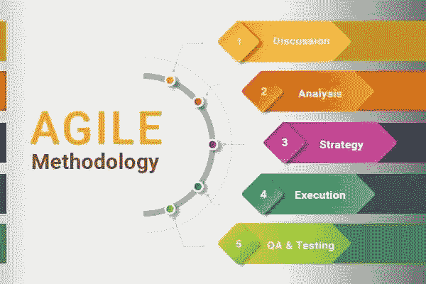

# 敏捷方法论:软件开发的新方法

> 原文：<https://blog.devgenius.io/agile-methodology-new-method-for-software-development-842f34f2cd16?source=collection_archive---------6----------------------->

软件开发的新时代，文档可能会过时。

自从敏捷宣言发表以来，软件开发已经永远地改变了。在这里，我们将讨论敏捷方法如何塑造和改变软件开发。

## 敏捷方法如何改变软件开发？

当技术行业的领导者写下他们的宣言时，他们的声明很简单:他们将关注具有可测试的叙述、前期价值和结果而不是产出的个人。当有计划要制定，过程工具要使用，合同要谈判，并且不断地遵循计划时，这个宣言是革命性的。这在自上而下传递一切的企业文化中是革命性的。但是随着越来越多的项目失败，企业已经转向敏捷方法。这一转变极大地提高了企业项目、创业公司和更多组织的成功率。

另一个方面使参与者相互交流和合作。索尼的随身听就是一个例子。当索尼问用户他们会选择黄色还是黑色时，用户告诉他们只会更频繁地选择黄色。但当索尼向市场推出黄色和黑色随身听时，他们意识到所有售出的随身听都以黑色为主。结果，公司意识到需要一个测试环境。

## 敏捷方法承诺了什么？

整个故事可以这样定义:作为一个角色，我想做一些事情，这样我就可以获得奖励。这意味着锚定用户观点的用户故事将被用于创建可测试的产品。这导致了像精益创业这样的想法的流行。此外，出现了更多的敏捷开发方法来解决不同领域的更多问题。

## 敏捷方法对未来有什么承诺？

敏捷方法承诺未来会有一个更加假设驱动的测试环境。它可能包括访谈、产品设计和产品的市场调查。因为测试驱动的环境增加了，公司变得更加与他们的客户合作。由于未来的任务需要更多的协作，每个实体都将竭尽全力进行协作。更重要的是，企业将会更深入地进入假设检验环境。

你对敏捷方法有什么看法？你会使用敏捷方法吗？在下面的评论区分享你的想法？如果你使用敏捷，请在下面的评论部分分享你的经验。