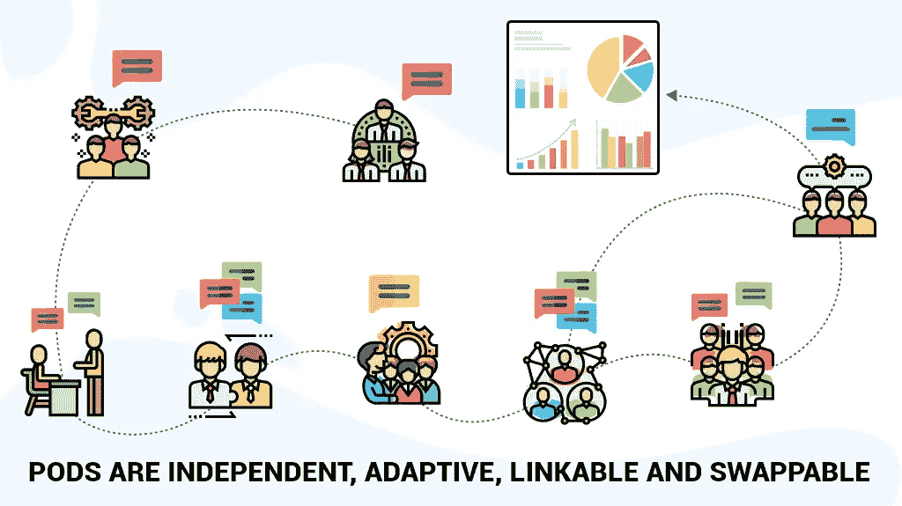
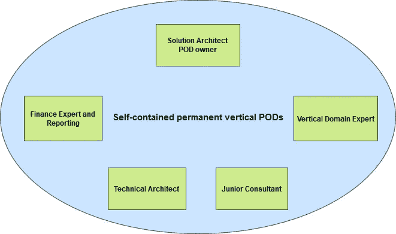

# 敏捷豆荚:组织你的团队释放他们最大的潜力

> 原文：<https://blog.devgenius.io/agile-pods-organize-your-teams-to-unlock-their-maximum-potential-54e5dd769dc3?source=collection_archive---------2----------------------->

敏捷豆荚

随着质量和数量压力的增加，传统的层级部门限制了公司需要的增长，并导致了瓶颈。那么，出路是什么？

摆脱这种复杂的层级管理的方法是转向敏捷的 pod 结构。

## 敏捷豆荚结构:豆荚中的豌豆

正如我们已经知道的，传统的团队结构更像是一个层次结构，其中管理层对任务进行优先排序，并维护整个工作流。这个团队由拥有相似专业知识的成员组成。这种管理对项目有更大的影响，因为团队成员失去了兴趣，离开了工作，进入了一个更加面向增长的环境。他们想打破常规，打破传统结构中单调的工作性质。

所以，从另一方面来说，Pod 结构是对等级制度所带来的瓶颈的一种缓解。基本上，一个 pod 是一个敏捷客户团队，(4-10 人的小组)，成员来自不同的领域(UI/UX 设计师，QA 工程师等)。)将他们的专业知识结合起来，帮助构建定制产品并提出创新的解决方案。

豆荚里的豌豆

一个 pod 是一个跨职能的单元，它被组合起来以适应组织的资源和项目的需要。他们围绕敏捷方法广泛地工作，以有意义的产出带来系统的增长。圆荚体成员是一次被挑选出来的，这使他们与彼此的长处相协调。让团队更加自主和自我管理，独立运作需要时间，但会导致一个更加投入和富有成效的部门。许多大公司，如谷歌、HubSpot，都推崇敏捷的 pod 结构。他们实施它来完成他们或大或小的项目。

***豆荚不是一个过程，而是一种意识形态的转变***

kier 客户服务部的 Ben Hugg 说:“通过让团队负起责任，我们提高了员工对提供优质客户服务的意识和态度，因此客户满意度也有所提高。"

## 波德城堡

pod 由以下团队成员组成:

**1。pod 的中心:**位于 pod 中心的团队是核心团队，负责所有的讨论并做出正确的决策。pod 的效率和能力由这个核心团队决定。当核心团队为他们的 pod 全职工作时，团队成员可以根据所需的专业知识在 pod 之间调换。

**2。外围专家:**当吊舱需要特殊支援时，这支队伍开始发挥作用。这些人是在兼职的基础上被召集的，并且可能同时为多个 pod 工作。例如，这些专家可能是 UI 设计师、自动化工程师或白盒测试人员。

**3。Pod 所有者:**每个 pod 都由一个 pod 领导者或所有者领导，他负责阐明需求，确定工作的优先级，并定期为队列中即将到来的项目让路。pod 负责人充当 Pod 和项目管理团队之间的桥梁。

***吊舱是自成一体的开发团队***

## 为什么我们不停地谈论波德？

Pod 在很多方面为你工作，从让每个人从项目开始就积极主动，直到让每个人都满意地到达客户。

**1。丰富的客户体验:**pod 成员体验到的所有权和灵活性使他们能够理解需求，从而为他们提供最重要的服务。

**2。从激励到保留:**员工经常受到激励他们的令人兴奋的项目的挑战。这打破了工作的单调，给了他们成长的机会。在团队结构的早期，很难留住员工，因为他们的发展机会很小。

**3。与敏捷方法一致:**敏捷交付需要跨职能和自组织团队的协作努力。这种方法支持 pod 结构，在这种结构中，一切都取决于个人的贡献。Pod 文化使组织能够从团队的角度来处理每一个决策。

**4。质量或可伸缩性方面的飞跃:**随着 pod 的每个成员都负起责任，由此产生的效率显著提高，这在传统结构中是被忽略的。每个 pod 都与客户一起工作，并确保让他们在整个旅程中保持愉快。

**5。更少的摩擦确保更好的工作流程:**因为每个人从头到尾都参与其中，所以他们相互交流并同理心一致。将会有更少的信息孤岛，这将带来最好的产品。

**6。灵活性:**可以利用来自多个 pod 的团队成员来完成不同的目标，从而不会破坏整体结构。他们是独立的团队，可以继续进行其他项目，而不是被解散。许多大公司，如谷歌、HubSpot，都推崇敏捷的 pod 结构。

## 我们的 pod 团队如何为您工作？

1.  在 Softobiz，我们的 pod 团队负责特定的项目。当一个项目结束时，同一个团队分配新的项目，而不进行任何更改。

2.一些主题专家，如 DevOps 专家和 IT 支持专家也在一个共享的 pod 中工作，以便他们可以支持所有 pod 采用最佳实践和方法。

3.我们还为 pod 研讨会提供便利，这些研讨会是专门为传授所需技能和增强 pod 心态而设计的。

4.我们保持备用吊舱-在项目处于等待阶段的情况下。我们利用这些豆荚来建立更深刻的技能。

## 最后的想法

pod 通过涉及不同的远程专家来最大限度地发挥潜力，减少对 pod 之外的依赖。产品经理成为 pod 的一部分，这使得理解业务和技术水平变得容易，鼓励围绕产品的团队合作。Pod 结构使其客户从项目起源到最终结果的旅程流畅而灵活。

敏捷 pod 结构具有高度的灵活性，可以独立应对多种挑战。此外，有了敏捷团队，你可以寻找不同的创新和新的机会

## *想知道我们的敏捷 Pod 结构如何为您带来最佳效果吗？*

[请求免费咨询](https://www.softobiz.com/contact-us/)