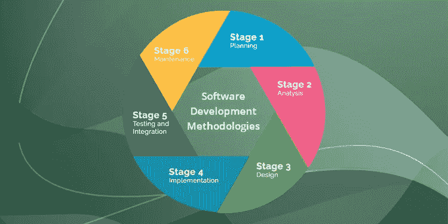

# 敏捷 Scrum 开发…就像一个血汗工厂！

> 原文：<https://blog.devgenius.io/agile-scrum-development-its-like-a-sweatshop-fc897402491a?source=collection_archive---------1----------------------->

## 来吧，伙计

敏捷开发

这可能不是最流行的立场，称敏捷开发方法为血汗工厂工作，因为至少在过去的 20 年里，它已经慢慢地将自己嵌入了企业的主流。它有赖于每两周推出一次新的网络和应用功能，以及漏洞修复。尽管如此，我听说过一些团队在代码修复后立即将代码推向现场。

## 真的是血汗工厂的工作吗？

首先，让我们看看谷歌对血汗工厂的定义:

> 工厂或车间，尤指制衣业，体力劳动者在恶劣的条件下长时间以极低的工资被雇用

好的，让我们把它分成几个部分，这样我们可以做一些比较。

> 工厂或车间，尤指服装业

当然,“血汗工厂”这个词是由服装零售业创造出来的，指的是长时间艰苦的手工劳动。我相信，我们在这里有一个很好的比较，软件开发几乎在每一个存在的行业中进行，为了生产软件，开发人员投入了长期、艰苦的手工工作。

> “体力劳动者以很低的工资长时间受雇”

这可能有点争议，因为“非常低的工资”可能不是一个完美的比较。它不像软件开发人员支付最低工资。是的，实际上有一些收入很高的开发人员，也有一些收入很低的开发人员。

> “在恶劣的条件下”

我对贫困状况的比较围绕着几件事:

首先，提供给开发人员的工具和资源可以有效地完成他们的工作。我已经做了 30 多年的开发人员，为许多行业的许多雇主工作过，一直都是如此。雇主想要更多、更快，但却无法提供合适的环境、硬件、工具和适当的时间来完成项目。

第二，加压锅炉房。是的，我知道不是所有的公司都是一样的，但是有很多公司正在推动他们的开发人员进行两周冲刺，并且期望不管发生什么都保持一定的速度。让我们现实一点，不是所有的开发者生来平等，因此，不是所有的开发者都能在平等的基础上保持相同的速度。

## 让我们更直截了当地看这个问题。

许多公司(不是全部)都在使用基于敏捷 Scrum 的基本开发方法，使用两周冲刺，或者类似的版本。这是最流行的，也是最能为公司和客户服务的，但不一定是开发人员，甚至是设计师、测试人员(QA)等..

公司和客户因为生产速度加快而受益匪浅。公司显然赚了更多的钱，客户也更快地获得了他们的新功能和错误修复。

开发人员被要求更快地生产。开发人员工作时间更长，工作更努力，跳过文档，跳过完整的测试，产生技术债务，处理范围蔓延，感到保持速度不断提高的压力。

开发方法的组成部分

## 开发方法

在瀑布、看板、精益、敏捷以及你能想到的任何其他开发方法出现之前，公司一年只发布几次软件，甚至一年一次。然而，截止日期已经设定，一些压力仍然存在，但是，整个开发过程是能够应用的。有足够的时间来设计/构建、开发/测试等..

技术债务(严重的技术债务)不太常见，当然 bug 仍然很普遍，但从逻辑角度看，与内容或用户界面相比，它似乎不那么普遍，范围蔓延不是一个大问题，最重要的是，开发人员没有感到压力。甚至在那个时候，根据你工作的地方和工作的类型，可能会有一些真正的高压锅炉房。游戏编程就是一个例子。我只能想象那个行业现在是什么样子。

## 你想说什么？我们该怎么办？

是的，我们不能让一家公司在没有某种方法或流程的情况下运营。我们不能让开发人员想花多少时间就花多少时间来开发软件(尽管这很好)。

重点是，今天常见的基于敏捷 Scrum 的迭代开发是一台永不放弃的机器。即使我们抛开它给开发者带来的压力，只看产品本身，也是在生产劣质产品。范围蔓延导致了意大利面条式的代码，没有文档或糟糕的文档导致了新开发人员的加入速度变慢，技术债务直到某些东西实际损坏才被考虑，测试被移交给客户/用户。这是劣质产品，都是打着速度的旗号。这就是敏捷在这一点上对我的意义，速度。

正如我上面提到的，我们仍然需要一个方法论或者过程。我确实欣赏敏捷和迭代开发的某些方面。例如，我们应该能够一年发布两到三次以上的生产就绪软件。我们可以这样做，但我认为更有意义的是，在每次冲刺后，机器需要关闭至少相当于正常冲刺的时间。例如，如果你运行一个普通的两周冲刺，当它结束时，机器关闭一次冲刺。或者甚至，跑两次冲刺，然后关机跑一次冲刺。这里的要点是，开发人员将有时间减压，有时间为下一个 sprint 做适当的计划，有时间回顾上一个 sprint，同样重要的是，有时间解决任何严重的技术债务。

## 把它包起来，这开始变长了！

我知道有一些公司和组织在运行敏捷过程方面非常成功。同样，也有很多人在这方面做得很差。我们也正在经历一个空前的开发人员精疲力竭和开发人员跳槽的高峰。

 [## Scrum 碰到了玻璃天花板

### 许多人相信 Scrum 的力量，但是大多数高层管理者不相信它

medium.com](https://medium.com/serious-scrum/scrum-has-hit-the-glass-ceiling-3610bb978b1d) 

虽然客户/用户很重要，但我们需要公司退一步，认真考虑开发者的福利。尽管有些公司想把软件开发部门当成生产线，但事实并非如此。

感谢阅读。我知道有很多不同的经历和观点。我不认为每个开发人员都经历过我在这里介绍的内容，但我知道，有很多人都经历过我介绍的内容。欢迎在评论区提出你的观点和想法。