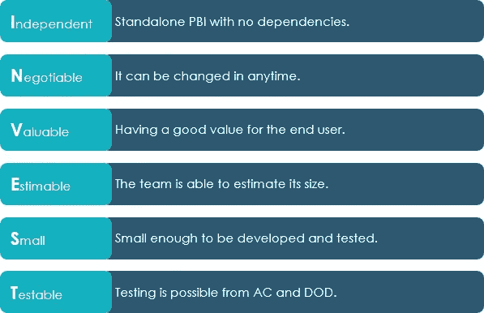
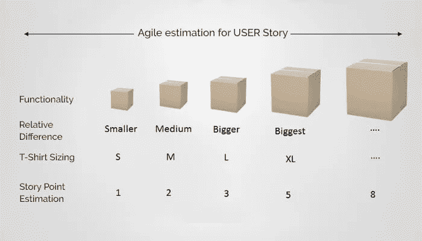
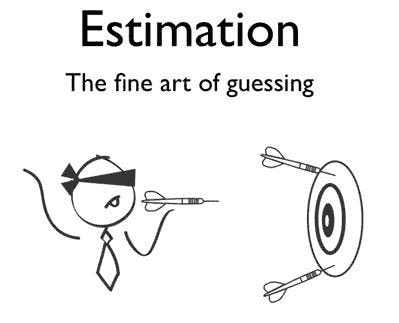
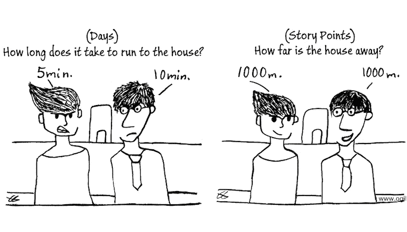
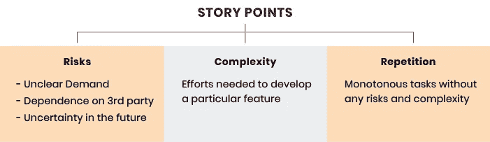
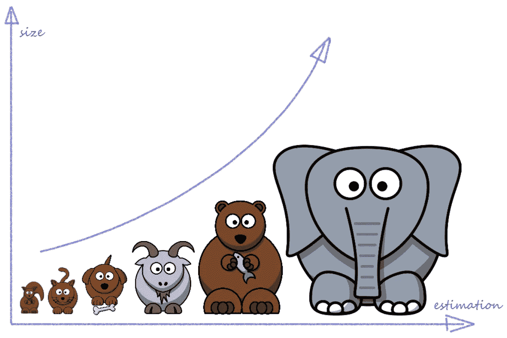

# 敏捷用户故事和评估

> 原文：<https://blog.devgenius.io/agile-user-stories-and-estimations-f2fb70eeacab?source=collection_archive---------4----------------------->

## 什么是用户故事？

用户故事是从最终用户的角度对软件特性的非正式的、一般性的解释。其目的是阐明软件特性将如何为客户提供价值。

人们可以简单地说这是写在卡片上的用户需求，但它不仅仅如此。

敏捷故事将用户放在你正在做的大部分事情的中心，它如何最终帮助最终用户，以用户为中心的标准用非技术语言写在卡片上。

## 什么是敏捷故事？

用户故事是用简单的语言表达的最小的工作单元，它最终会给最终用户带来直接或间接的价值。

用简单的语言描述用户想在软件产品中做什么来获得他们认为有价值的东西。

用户故事通常遵循角色-功能-利益模式(或模板):

*   作为一个[用户类型]，
*   我想要[一个行动]
*   因此[好处/价值]

作为敏捷环境中最小的工作单元，用户故事是增量开发中的关键工具。

## 敏捷故事应该是什么样的？

***投入*** *为用户故事。*

# 用户故事评估

现在我们知道了什么是故事，以及它们应该是什么样子，下一步是评估它们，评估可以在不同的团队中不同地进行。传统上，团队使用小时数进行估算，而“了解变化”团队已经转向故事点、t 恤尺寸等等。

我们需要理解，每个团队都是不同的，在一个团队中，人们对他们的评估可能是不同的，即使是对同一个故事，这完全没问题，不同的视角使评估会议变得有趣。

我发现很多团队很难估计故事，人们有时会有非常不同的数字，有些人可能会感到困惑，不知道要估计什么，有些人可能只是盲目地说出一些数字，这都是公平的，最终如果人们能够诚实地说出为什么他们已经估计到某个数字，这就是团队进行估计所需的全部内容。

故事点可能依赖于多种因素，但是有一些指导方针可以在评估时使用，

很多时候，你可能会听到有人给出更高的估计，理由是“未知因素”，如果我在做任务时看到这一幕，该怎么办？如果……会怎样？

我们通常会尽量避免这些情况，尽量不去估计未知情况，未知情况或未决问题应该在进行估计之前就已经得到澄清，否则随机猜测将成为最好的指示。

*“这个故事太大了，但我的团队只估计到一定的数字。如果人们认为我很奇怪，我该如何证明这一点？”*

估计就是估计，这意味着你认为这个任务是确定的估计，可能是任何事情，无论是小的，中等的，大的，超大的..或者更多，如果我们把它转换成斐波那契数列，它将是 1，2，3，5，8，…

不要犹豫给出你的数字，要么你是对的，要么你会了解到更多的故事，只是要清楚为什么你会有这样的估计。

## 相对指针

吸取过去的经验，这不是你第一次估算，如果是这样的话，为自己设定一个基础，观察几次迭代，看看你的估算是对还是错，并在下一次估算中做出修正。

## 我真的不知道该怎么估计

这可能发生在故事没有适当整理或者有很多未知的讨论范围或领域时，在这种情况下，最好后退一步，再次细化故事，并再次对该故事进行评估。

## **频繁地重新评估故事是一种反模式**

如果你多次看到这个故事在被拾起后被重新评估，这意味着回想起来。这可能是因为故事没有写好，也可能是隐藏的验收标准使故事变大或变小。

## 永不停止的评估会话

你按时完成评估会议了吗？

如果答案是肯定的，很可能我们作为一个团队在促进会议和进行评估方面做得很好，如果事先很好地沟通了故事，并且团队成员积极参与事先阅读故事，我几乎可以保证会议能够及时完成。

但是，如果团队成员第一次看到故事，显然他们会有多个问题，这本身就需要很多时间，此外，有时开发人员也有进入解决方案模式的习惯，你知道接下来会发生什么，无论是评估还是解决方案

它并不是从评估阶段开始，而是在故事处于梳理阶段、开放式问题澄清阶段之前就开始了。提前与团队分享背景，作为团队成员，在进行评估之前不要错过回顾故事，相信我，这很有帮助。

> 估计很难。对于软件开发人员来说，这是工作中最困难的部分，如果不是最困难的话。它必须考虑一系列因素，帮助产品所有者做出影响整个团队和业务的决策。有了这些利害关系，难怪从开发人员到高层管理人员的每个人都倾向于为此而烦恼。但这是错误的。敏捷评估就是:一个评估。不是血誓。——【atlassian.com 

最后，请记住敏捷评估是一项团队运动，每个人都必须尽自己最大的努力来取得成功，感谢你阅读本文，请写下你的收获或不同的想法。