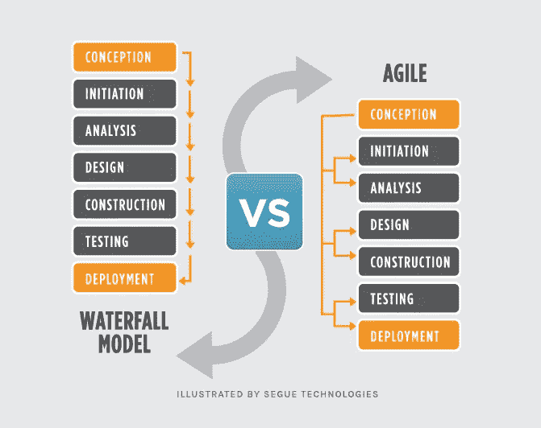
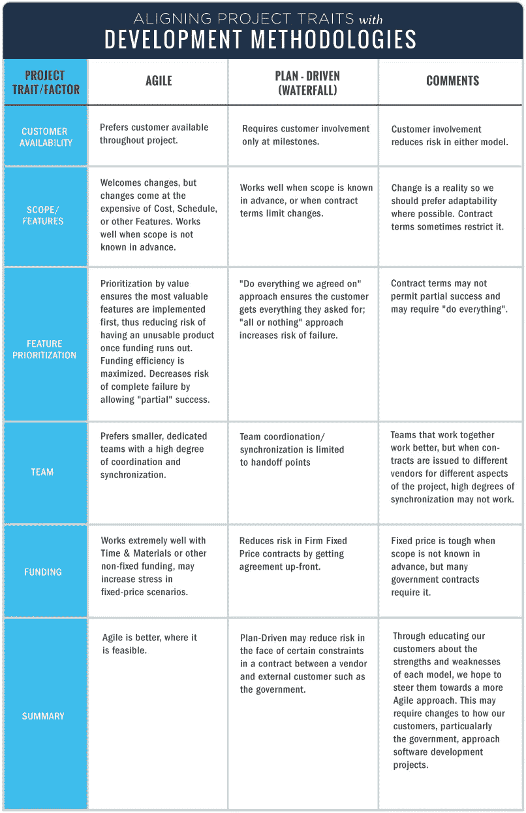

# 敏捷与瀑布方法

> 原文：<https://blog.devgenius.io/agile-vs-waterfall-methodologies-c0dc3b8bcf6?source=collection_archive---------6----------------------->

对于 Segue 的每个项目实现，我们面临的第一个决定是“我们应该使用哪种开发方法？”这是一个引起很多讨论(经常是激烈辩论)的话题。如果这不是你以前工作过的东西，那么开发方法论的定义是合适的；简单地说，这是一种组织软件开发工作的方式。这不是关于项目管理风格或特定技术方法的**而不是**,尽管你会经常听到这些术语被混在一起或互换使用。

最流行的两种基本方法是:

1.  *瀑布:*(唉，好可怕的名字！)，这可能更恰当地称为“传统”方法，以及
2.  *敏捷:*一种特定类型的快速应用程序开发，比瀑布式开发更新，但没那么新，瀑布式开发通常使用 Scrum 来实现。

这两者都是可用的、成熟的方法。我已经参与软件开发项目很长时间了，下面是我对每个项目优缺点的看法。

# 瀑布方法

***瀑布*** 是软件开发的线性方法。在这种方法中，事件的顺序大致如下:

1.  收集并记录需求
2.  设计
3.  代码和单元测试
4.  执行系统测试
5.  执行用户验收测试(UAT)
6.  修复任何问题
7.  交付成品

在一个真正的瀑布式开发项目中，每一个都代表了软件开发的一个不同阶段，并且每一个阶段通常在下一个阶段开始之前结束。在每一个之间通常还有一个级门；例如，在设计开始之前，客户必须审查和批准需求。

瀑布方法有好有坏。在**正**侧:

*   开发人员和客户同意在开发生命周期的早期交付什么。这使得规划和设计更加简单。
*   进度更容易衡量，因为工作的整个范围是预先知道的。
*   在整个开发过程中，团队的不同成员都有可能参与或继续其他工作，这取决于项目的活动阶段。例如，业务分析师可以了解并记录需要做的事情，而开发人员则在从事其他项目。测试人员可以在编码过程中从需求文档中准备测试脚本。
*   除了审查、批准、状态会议等。在需求阶段之后，并不严格要求客户到场。
*   因为设计是在开发生命周期的早期完成的，所以这种方法适用于必须设计多个软件组件(有时是并行的)以便与外部系统集成的项目。
*   最后，基于对**所有**软件可交付成果的更完整理解，软件可以被完整且更仔细地设计。这提供了一个更好的软件设计，减少了“零碎效应”的可能性，这是一种开发现象，当代码段被定义并随后被添加到应用程序中时，它们可能适合也可能不适合。

以下是我们在使用纯瀑布方法时遇到的一些**问题**:

*   一个几乎总是达不到的地方是[需求](https://www.seguetech.com/software-requirements-development/)的有效性。在我看来，以对客户有意义的方式收集和记录需求通常是软件开发中最困难的部分。客户有时会被细节吓倒，在项目早期提供的特定细节是这种方法所需要的。此外，客户并不总是能够从需求文档中可视化应用程序。线框和实体模型会有所帮助，但是毫无疑问，大多数最终用户很难将这些元素和书面需求放在一起，以获得他们将会得到的良好画面。
*   纯瀑布开发的另一个潜在缺点是客户可能会对他们交付的软件产品不满意。因为所有的可交付成果都是基于文档化的需求，所以客户可能直到快完成时才能看到将要交付的内容。到那个时候，改变可能很难实现(而且代价高昂)。

# 敏捷方法

敏捷是一种迭代的、基于团队的开发方法。这种方法强调以完整的功能组件快速交付应用程序。不是创建任务和时间表，所有的时间都被“时间框”成称为“冲刺”的阶段每个 sprint 都有一个确定的持续时间(通常是几周),并有一个可交付成果的运行列表，在 sprint 开始时就计划好了。交付内容根据客户确定的业务价值进行优先排序。如果 sprint 的所有计划工作都无法完成，那么工作的优先级会重新调整，这些信息将用于未来的 sprint 计划。

工作完成后，项目团队和客户可以通过每日构建和冲刺阶段结束时的演示对其进行审查和评估。敏捷在整个项目中依赖于非常高水平的客户参与，尤其是在这些评审期间。

敏捷方法的一些**优势显而易见:**

*   在整个开发项目中，客户有频繁和早期的机会看到交付的工作，并做出决策和变更。
*   通过在整个项目中与项目团队广泛而直接的合作，客户获得了强烈的主人翁感。
*   如果一个特定应用程序的上市时间比在初始发布时发布一个完整的功能集更重要，那么敏捷可以更快地产生一个工作软件的基本版本，它可以在连续的迭代中构建。
*   开发通常更加以用户为中心，这可能是来自客户更多和更频繁的指导的结果。
*   更多敏捷开发的好处，请看敏捷软件开发的 8 个好处

当然，也有**一些缺点**:

*   非常高的客户参与度，虽然对项目来说很重要，但可能会给一些客户带来问题，他们可能没有时间或兴趣进行这种类型的参与。
*   当开发团队的成员完全致力于项目时，敏捷工作得最好。
*   因为敏捷专注于限时交付和频繁的重新优先化，所以一些设定交付的项目可能无法在规定的时间内完成。可能需要额外的冲刺(超出最初计划的)，增加了项目成本。此外，客户的参与通常会导致在整个项目中需要额外的特性。同样，这会增加实施的总时间和成本。
*   当团队成员位于同一个物理空间时，敏捷项目中紧密的工作关系最容易管理，但这并不总是可能的。然而，有多种方式来处理这个问题，如网络摄像头，协作工具等。
*   如果在最初的架构和设计中没有考虑系统的全部范围，敏捷开发的迭代性质可能会导致频繁的重构。没有这种重构，系统会遭受整体质量的下降。这在较大规模的实现中，或者在包含高度集成的系统中变得更加明显。

# 在敏捷和瀑布之间做出选择

那么，我们该如何选择呢？首先，我们通过定义我们自己的过程来稍微改变游戏(这是大多数软件开发组织所做的)。在 Segue，它被称为我们的 ***过程框架*** ，它是传统瀑布方法论的一个变种。我们的修改包括在可能的情况下使用原型制作，以便在设计/开发周期的早期为客户提供更好的成品视图。这有助于提高团队对需求的理解以及与客户的沟通。在应用程序的主要框架按照高级需求完成后，我们继续开发，并联系客户进行需求细化。通过这种方式，我们努力在不损害我们整体系统架构的情况下尽可能地迭代。

在考虑使用哪种方法时，我们会考虑以下因素:

上述因素的权重不同；每一项都根据具体项目和情况进行评估。

尽管我们开始看到各种敏捷方法在企业(甚至国防部和联邦机构)中的大规模采用，但仍然有许多组织缓慢地做出改变。对于组织来说，过渡到结合敏捷和瀑布的混合敏捷方法也是很常见的。[敏捷实践指南](https://amzn.to/2zjznOU)是专门为帮助组织理解和评估敏捷和混合敏捷方法的使用而开发的。开发了[项目管理知识体系(PMBOK)指南](https://amzn.to/2zjznOU)的项目管理研究所(PMI)与敏捷联盟合作，将这两个指南捆绑在一个产品中，以帮助组织、经理和领导层提高开发过程中的敏捷性。

一旦我们决定了使用哪种基本方法，我们就可以进一步细化这个过程，以最好地适应我们的项目目标。最终，尽管我们工作的方式很重要，但是交付一个可靠的、可维护的、让客户满意的产品才是最重要的。

在社交媒体上关注我们:

[脸书](https://www.facebook.com/StackedQA)，[推特](https://twitter.com/stackedqa)， [Instagram](https://instagram.com/stackedqa) ，& [领英](https://www.linkedin.com/company/stackedqa)