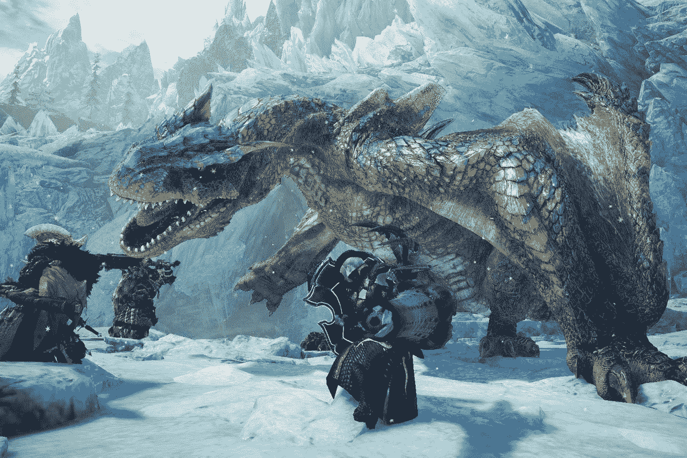
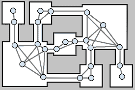
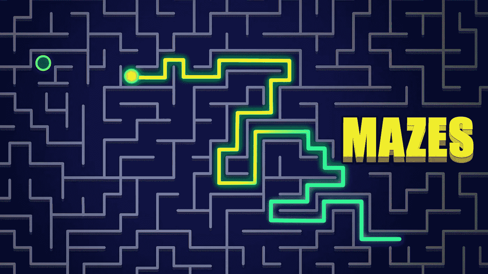
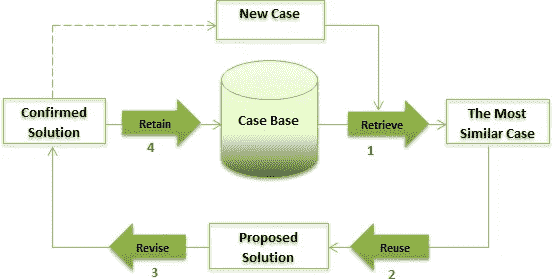
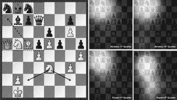
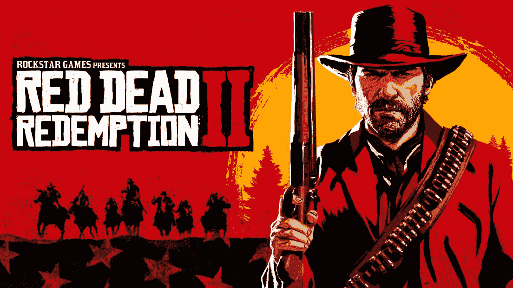
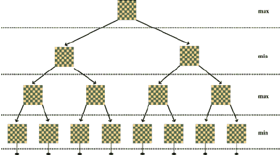

# 游戏中的人工智能算法

> 原文：<https://blog.devgenius.io/ai-algorithm-in-games-db8bf1cc195f?source=collection_archive---------4----------------------->

在这篇文章中，我将向你简要介绍一些在游戏中使用的强大的人工智能算法。

游戏插图中的人工智能

制作游戏是一项具有挑战性的工作。它应该扩大，因为它使人们保持兴趣，并提供更多的困难。电子游戏中人工智能的主要目标是呈现一个强大的对手，以增加玩家的乐趣。如今，许多游戏都是使用人工智能技术和功能创建的。“寻路和有限状态机是商业游戏人工智能的两个主要组成部分，”纽约大学计算机科学与工程系副教授 Julian Togelius 解释说，他专注于人工智能和视频游戏的界面。在玩家和游戏之间建立信任是视频游戏中人工智能元素的目标之一。以下是一些游戏相关的组件。

## **智能特工**

游戏 AI 最常见的应用是 NPC 或非玩家角色。这些游戏中的角色表现得很聪明，就像真实的玩家在控制他们一样。AI 引擎和算法控制这些角色的动作。决策树经常被用来指导这些 NPC 的行为。

大多数游戏中人工智能的目标是创造一个智能代理，有时被称为非玩家角色(NPC)。在游戏世界中，这个代理可能扮演敌人、盟友或公正的角色。从这个角度研究游戏 AI 是特别有益的，因为代理是大多数游戏 AI 的主要焦点。一个代理不断地在三个基本过程中循环。这个过程通常被称为“感觉-思考-行动”循环。除了这三个阶段之外，在这个循环中可能发生的可选的第四个阶段是学习或记忆。

只要看一眼《怪物猎人:世界》就能对 NPC AI 有一个公平的认识。由 AI 驱动的怪物存在于一个有生命的生态系统中，并且有效地独立行动。甚至游戏的导演 Yuya Tokuda 也提到游戏中的 NPC 会随机地互相攻击。他回忆起电子游戏中的一个场景，在这个场景中，他的角色正在与一个怪物战斗，这时另一个怪物突然闯进来，用石头袭击了第一个怪物，然后逃跑了。另一个例子是当玩家和一个怪物战斗时，另一个怪物突然飞了进来，两个怪物开始战斗。

新版本的怪物猎人视频游戏中的怪物可以执行各种各样的动作，并可以根据玩家角色在移动中的位置选择移动。早期版本的怪物猎人视频游戏让怪物做出有限的动作。这使得 NPC 能够在这种情况下做出更难避免、阻止或应对的机动动作。

## **寻路**

从一个地方到另一个地方是寻路的一部分。寻路最重要的方面是整个游戏环境。当你探索游戏区域时，人工智能可以创建游戏的地形或世界。人工智能可以根据从你的行动、游戏风格、游戏中的选择、外观和战术中获得的反馈来构建场景。

实现寻路的方法有很多，但并不是所有的方法都能返回最短的路径，也不是所有的方法都有效或可靠。例如:

*   **随机反推**——取而代之的是，一步一步向前推进。在再次尝试之前，沿意想不到的方向稍微绕道，避开障碍物。一点也不可靠，在许多情况下容易陷入困境。
*   **障碍追踪—** 这是一种不同的技术，类似于随机反推。然而，在检测到碰撞后，物体被四处追踪，就好像右手被粘在墙上一样，你不得不在触摸它的同时移动。一旦没有联系，继续向目标方向行进。你可能会再次陷入各种情况。

扫描地平线以一次发现整个路径的方法:

**广度优先搜索** —当找到一条路径时，停止使用广度优先搜索技术访问图中的每一层孩子。虽然不是很有效，但它在图未加权时找到最短路径，这意味着每个相邻节点之间的距离总是相同的。它可能不会总是发现加权图中的最短路径，但如果存在最短路径，它总是会找到一条。

**深度优先搜索—** 遍历图表的另一种方法称为“深度优先搜索”，它试图首先探索图表内部的深处，而不是一层一层地遍历它。使用堆栈迭代实现这种方法通常更安全，因为如果搜索深度不受约束，它可能会出现问题，尤其是在使用递归实现时，这可能会导致堆栈溢出。

**最佳优先搜索—** 类似于广度优先搜索，最佳优先搜索优先考虑最有希望的邻居。虽然得到的路径可能不是最短的，但它可以比广度优先搜索处理得更快。最佳第一搜索的一个变种是*。

**Dijkstra 方法—**Dijkstra 方法通过跟踪从起点到每个被访问节点的总成本来计算图中的最佳路径。它返回最短路径，并处理加权图。但是，可能需要一段时间才能找到。

**A*** —与 Dijkstra 类似，但也采用启发式方法来确定每个节点靠近目标的可能性。这种方法使得 A*在加权图中查找最短路径的速度大大加快。

我们可以在迷宫类游戏和 packman 游戏上看到这些算法。寻路算法对于迷宫赛跑者在最少的时间内到达目标是必要的。该算法使用从起始节点到目的节点的 NPC。但是，使用错误的算法会延长计算最短路径所需的时间。当我们对比迷宫赛跑者游戏的 A *、Dijkstra 和 BFS 寻路算法时，参与者必须等待更长时间，因为计算过程需要更长时间。在比较算法时，我们看它们所用的时间，它们的路径有多长，它们在当前的计算机系统中使用了多少块。关于这些参数，我们可以选择最适合我们需要的。每种方法的性能可能因游戏的性质、障碍和路径而异。因此，除非我们实现并比较测试结果和所需的计算能力，否则我们无法立刻决定最佳算法。

## **基于案例的推理**

为信息不准确的游戏创建有效的 AI 模型可能会特别困难。考虑到大量可能的移动和综合的不确定性，每一层节点数量的指数级增长使得为这些游戏设计游戏树特别具有挑战性。这个项目旨在提供一个基于案例的推理和人工智能规划的结合，大大缩小游戏树。通过专注于引导我们采取特定策略的动作，而不是考虑所有可能的组合，我们可以有效地忽略无意义的动作。这些策略是通过在 CBR 数据库中寻找与之相似的案例来选择的。一组预期目标形成了战略。人工智能规划负责起草一个战略来完成这些目标。这个设计是一系列引导玩家达到这个目标的行动。通过遵循这些阶段并忽略大量可行的额外移动，该模型创建了增长更慢的游戏树，允许构建更多受相同内存量限制的特征移动。

基于案例的推理是许多老式棋盘游戏和冒险游戏中流行的策略。即时战略游戏领域也利用了 CBR。现代计算机国际象棋系统擅长下棋。CBR 已经成功地应用于计算机游戏中，如国际象棋，在这种游戏中，人类玩家非常依赖他们的知识。基于案例的推理在国际象棋比赛中就是这样工作的。它首先评估棋手的位置，以确定使用 15 个计划中的哪一个，以及计算哪些特定的变化。

玩家的模式帮助他决定走哪一步棋，或者更准确地说，在特定的位置采取哪种策略。RTS 游戏中的游戏流程是同时和连续的，不像例如国际象棋游戏，其中每个玩家等待另一个玩家移动。游戏人工智能必须在一个不可接近的、不确定的、动态的、连续的环境中实时做出决定，由于这种类型的性质，这种环境具有巨大的搜索空间。在这里，传统的搜索技术不再有用。在这种情况下，CBR 只决定视频游戏中的非玩家角色应该如何行为。这些非玩家角色是玩家无法控制的角色。这些都是由行为支配的，行为是由游戏玩家的选择和行为产生的。

## **决策**

人工智能将允许你的选择对游戏有更大的影响。例如，在《红色死亡救赎 2》中，NPC 的互动和行为会受到诸如你戴的帽子或者你的衣服上是否有血迹这样的事情的影响。你的选择可以影响整个游戏世界，因为有一个巨大的潜在结果矩阵。可能有难以置信的错综复杂的因果关系。

## **数据挖掘**

在人工智能的帮助下，游戏开发商和工作室可以对玩家行为进行数据挖掘，以更好地了解用户如何玩游戏，他们最喜欢玩哪些功能，以及他们为什么停止玩游戏。因此，游戏设计师可以增强游戏性或找到收入选项。

## **行为树**

因此，这个名字包含了一个暗示。与有限状态机或用于人工智能编程的其他系统相比，行为树是一种分层节点树，它为人工智能实体调节决策流程。树的分支由不同种类的实用节点组成，这些节点引导人工智能沿着树向下移动，以到达最适合给定环境的命令。树叶代表控制人工智能生物的命令。

开发人员可以建立行为库，这些行为库可以链接起来产生非常真实的人工智能行为，因为树可以是密集的，节点调用执行特定功能的子树。可以先形成一个根本的行为；然后可以创建其他分支来处理实现目标的替代方法，这些分支按其可取性排序。这允许人工智能在特定行为失败时有后备策略。他们在这种情况下最擅长。