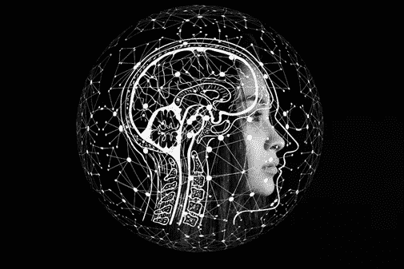
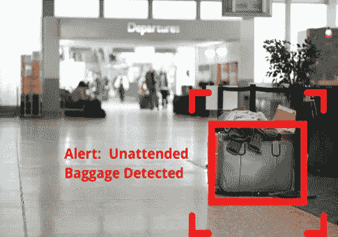

# 基于人工智能的物体检测和识别

> 原文：<https://blog.devgenius.io/ai-based-object-detection-and-recognition-14840c1bada2?source=collection_archive---------7----------------------->

**不断进化的人工智能**

人工智能是当今以技术为主的一代中不断发展的东西。更新的技术一直在开发，这些技术结合了人工智能，大大提高了生活质量，有助于安全和保障，促进娱乐，等等。

由于人工智能是以被自动化的明确意图创建的，并且自动化它所应用的任何东西，它可以被留给自己去辨别和学习。人工智能被应用于帮助安全和生活质量的一种方式是物体识别。

**什么是物体识别？**

[物体识别](https://prisma.ai/products.html)是一种计算机视觉技术，用于识别图像或视频中的物体。物体识别是深度学习和机器学习算法的关键输出。物体检测的目的是帮助机器学习，并教会人类自然发生的事情；能够轻松识别任何视频或图像中的元素，如人、车辆、动物、物体等。因此，通过教授这些东西，人工智能可以学习并获得对图像内容的理解，然后能够分析并展示图像的元素。

这就是物体识别的关键所在。但问题是，谁能欣然提供呢？

**使用深度学习的物体识别的应用**

这项技术的顶级提供商之一是 Prisma A I. Prisma 已经创建了具有人工智能的对象识别，用于监控系统和图像处理，允许系统检测和识别图像或视频中的对象，以及它们的性质。

首先，系统检测它已经被训练识别的物体。处理关于所讨论的对象的信息并接收输入。机器学习算法使用它们的衍生知识从预先记录的数据中确定对象的类型和性质。一旦确定了性质，算法就根据对象的性质决定是否发送警报。这就是这个过程是如何在内部发生的。

因此，该系统能够检测物体在本质上是有害的还是温顺的，例如其中装有炸弹的包，或者被放错地方或丢失的无害钱包。如果检测到潜在的有害或危险物品，该系统会发出警报，并帮助跟踪和定位任何丢失的物品，所有这些都以高速、准确和清晰的方式进行。

**人工智能的未来范围**

物体检测只是 AI 的应用之一。它可以有多种应用方式，在当今世界都是高度功利化的。可以有更多的应用程序结合人工智能来改变今天许多过时系统的面貌并为其带来活力。Prisma AI 继续致力于务实的基于视觉人工智能的解决方案，并只提供最好的解决方案。

