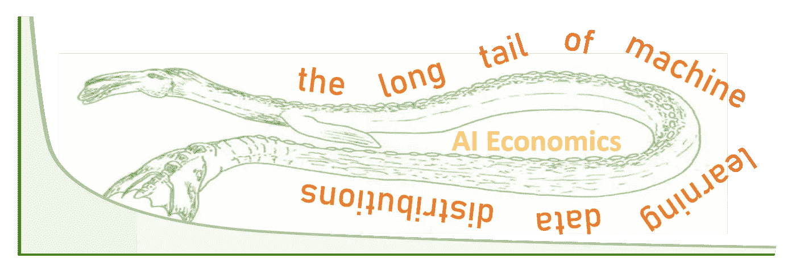
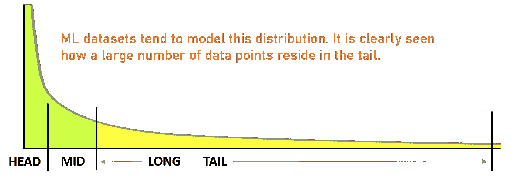
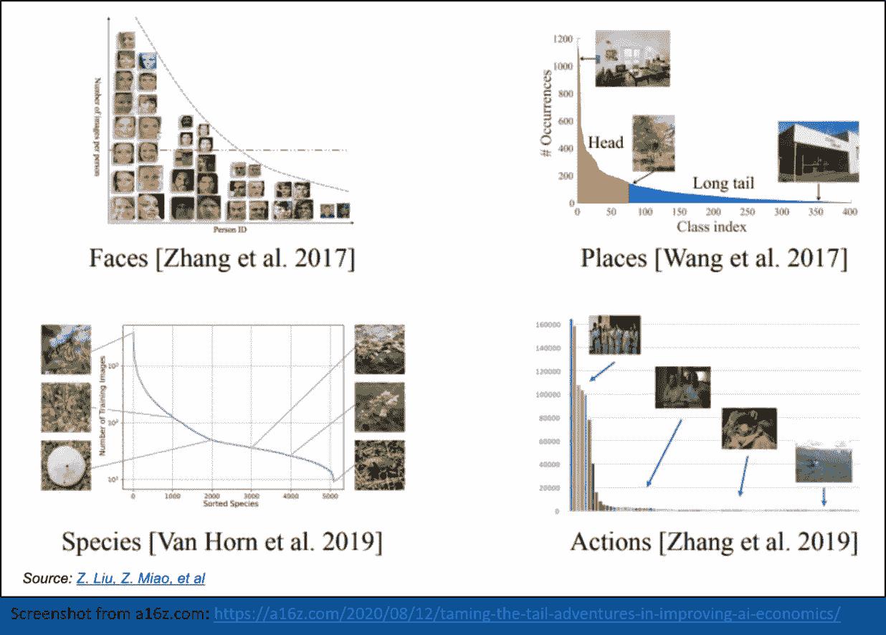
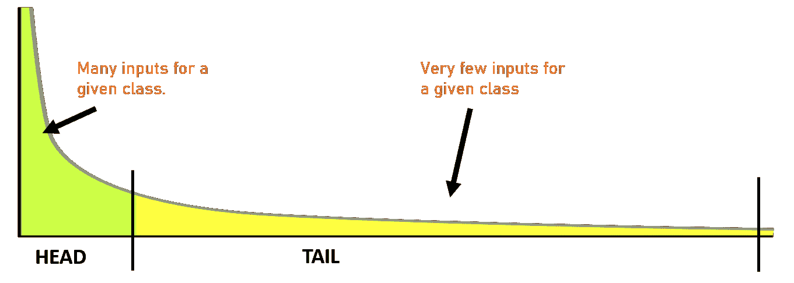
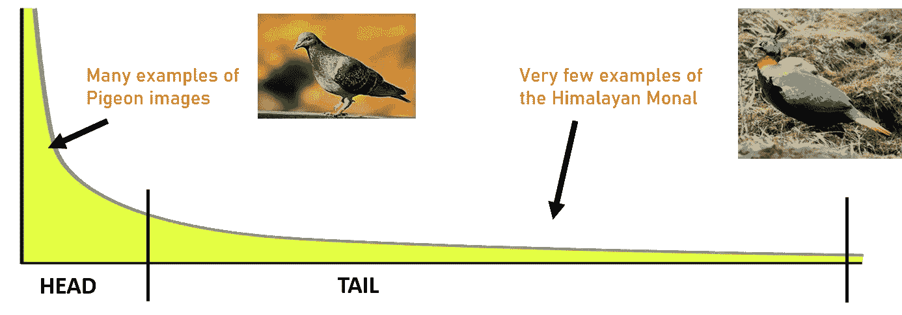
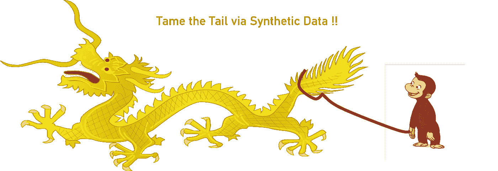

# 人工智能经济学，合成数据和长尾理论。

> 原文：<https://blog.devgenius.io/ai-economics-synthetic-data-the-long-tail-ed23f460a42a?source=collection_archive---------4----------------------->

驯服尾巴！

最近 a16z 的一篇文章雄辩地描述了人工智能中的长尾问题以及它如何影响人工智能商业的经济学。在这篇文章中，我阐述了合成数据是如何成为一个极其有用的工具来帮助缓解问题。

问题中的[文章](https://a16z.com/2020/08/12/taming-the-tail-adventures-in-improving-ai-economics/)基本上谈论了数据的长尾分布在机器学习中是如何普遍，以及当前流行的 ML 技术(监督学习)如何处理它们。

# 什么是数据的长尾分布？

简单地说，这些是数据的分布，如果你选择一个随机的数据点，它很可能在尾部。这里有一张图来帮助解释这种分布。顺便说一句，大量的真实世界(非 ML)数据也模拟了这种分布。

这里有几个真实世界的例子，在各种 ML 数据集中的长尾分布，你可以看到在一些流行的数据集中类的频率。

# 为什么它们有问题？

简而言之，有监督的 ML 模型(迄今为止在生产和研究中最常见的)倾向于更好地学习公共输入的特征(通常在分布的头部发现)。这些模型不能很好地推广到具有稀疏样本(分布的尾部)的输入。

# 鸟类识别器

为了更好地理解这个问题，假设您正在构建一个 ML 程序，当输入鸟的图像时，它可以检测所有类型的鸟(比如说，在印度，实际一点)。你的 ML 模型必须能够在摄像机的任何方向和角度探测到鸟类。当一只鸟在空中飞行时，他们也应该能够把它归入正确的类别。此外，鸟的图像周围会有如此多的人工产物(环境——如树木、灌木、天空、建筑物等等)。

如果我们谈论的是家鸽，与喜马拉雅山的 Monal 相比，可能有足够多的图像可以进行准确的分类。

实际上不可能得到足够多的单幅图像的变化。还要考虑到它主要分布在喜马拉雅山脉，即使在冬天也至少出现在海拔 2000 米的地方！

因此，你的模型可能能够很好地识别鸽子，但是当一个业余观鸟者给它发送一张鸽子的照片时，它可能会失败。

> 上面的例子不是吹毛求疵。在大多数其他数据集中也存在类似的问题。选择一个数据集，我敢肯定你会发现一个让你悲伤的长尾类。

# 对人工智能经济学的影响

a16z 的文章还列出了这个问题的经济影响。我在这里提供了一个直接摘自那篇文章的要点:

*   数据和计算资源的原始成本。有趣的是，人工智能应用的开发成本和失败率可能比典型的软件产品高 3-5 倍。
*   长尾效应会导致基础设施以外的高可变成本。例如，如果发送给聊天机器人的问题因客户而异，即大部分查询在末尾，那么建立一个准确的系统可能需要每个客户的大量工作*。*
*   *更糟糕的是，致力于长尾问题的人工智能企业实际上可能会表现出 [*规模*](https://a16z.com/2019/05/09/data-network-effects-moats/)——这意味着相对于竞争对手，经济状况会随着时间的推移而恶化。[..]在某些时候，开发人员可能需要 10 倍以上的数据来实现 2 倍的主观改善。*

# *驯服尾巴(或者说合成数据能有什么帮助)？*

**

*a16z 的文章还介绍了“从许多从业者那里收集的关于如何思考和解决这些问题的指导”。这些当然非常相关，但在这里我想具体谈谈合成数据如何有所帮助，顺便说一句，这在本文中没有明确处理。*

*为了更多地了解什么是合成数据，你可能想快速浏览一下我几天前写的一篇文章。*

> **很多时候，数据中的长尾分布问题表现为数据缺失。你的模型没有准确地对某些类别进行分类。**

# *将合成数据应用于鸟类识别问题*

*你的问题是你没有足够的喜马拉雅山的单子图像(忘记单子图像的足够多样性)。*

*解决方案:你生成喜马拉雅山 Monal 的合成图像，并在这些图像中注入多样性，形成一个完整的数据集。*

*怎么会？下面是合成数据生成器的一个可能的管道:*

*   *使用像 Blender 这样的 3D 建模工具，用已知的羽毛多样性和其他鸟类变量创建各种 Monal 模型。*
*   *您也可以使用 Unity 创建背景环境来放置 Monal 模型。你也可以在这里使用喜马拉雅山实际位置的图片。*
*   *使用 Blender 和 Unity，你可以将 Monal 模型放置在各种背景之上，还可以改变灯光、云、天气等氛围。每个变化都给你一个图像。*
*   *每个变化中的增强可以给你每个变化的多个训练图像。*

*在这样的数据集上训练您的模型可以确保您的模型概括出长尾样本的足够特征。创建训练集需要一次性成本，但如果创建得当，对合成数据集的扩充会给你带来无穷无尽的变化。增强本身是便宜的。*

*虽然我们讨论了一个假设的鸟类识别问题，但是使用合成数据的解决方案并不是一个思想实验。我的[上一篇文章列举了](https://medium.com/dev-genius/turbo-charge-your-ai-ml-projects-with-synthetic-data-d6225774513c)各种在类似情况下使用合成数据的例子(一些甚至更复杂的用例)。*

**感谢您阅读这篇文章！我欢迎您的任何意见或疑问。我是一名独立的技术顾问，在移动应用、云和微服务架构、机器学习和大数据分析领域经验丰富。最近，我 a)引导、设计并构建了一个医疗保健生物反馈平台，b)构建了一个大数据分析管道，c)开创了自然语言处理领域的新方法，d)使用机器学习帮助自动化业务流程，以及 e)稳定并完善了一个报告主要领域问题的 ETL 测试产品。如果您或您的组织正在寻求数字化转型方面的帮助，* [*给我留言*](https://in.linkedin.com/in/sushrut-mair-3769b62) *！**