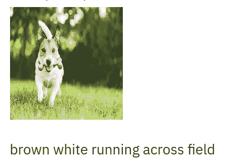
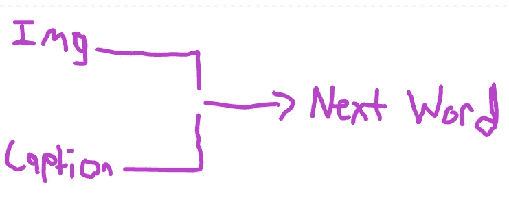
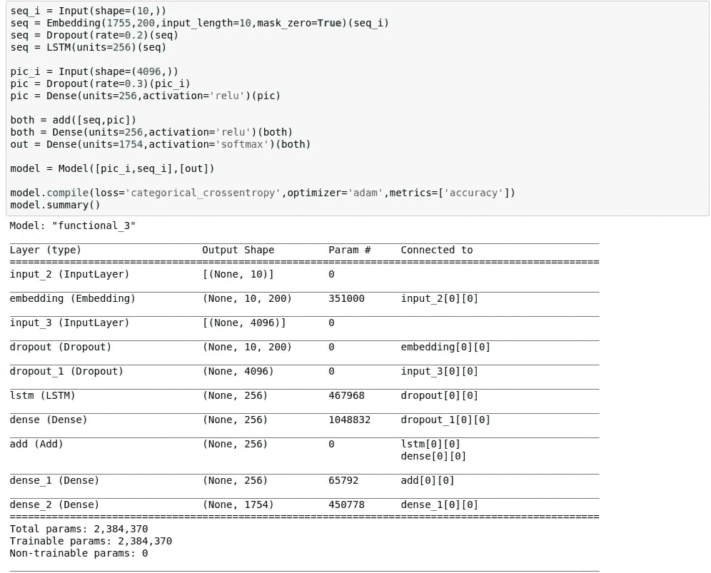

# 使用 Tensorflow/Keras 的人工智能图像字幕

> 原文：<https://blog.devgenius.io/ai-image-captioning-using-tensorflow-keras-1ed20a1a2b37?source=collection_archive---------2----------------------->

考虑上图？你看到了什么？我想我们都知道发生了什么——一只狗在田野里跑。对我们人类来说，给这样的图像加标题很容易，但随着深度学习的力量日益明显，我决定尝试训练一个端到端模型来执行这项任务。下面是我如何使用 Tensorflow/Keras 创建一个自动图像字幕 AI。

首先，我们需要一些数据。我用的是 [Flickr 8k 数据集](https://www.kaggle.com/srbhshinde/flickr8k-sau)；它包含成千上万的图片，每张图片都有几个标题。为什么每张图片有多个标题？嗯，描述一幅图像的方式总是不止一种。再一次，看看顶部的狗图片。我可能会说“一只狗在田野里跑”，但其他人可能会说，“一只棕色的狗带着一根骨头跑。”因此，我们用各种不同的标题来训练我们的模型是很重要的，即使是在看一张图片的时候。下载完数据集后，让我们回顾一下我们的模型将如何构建。

# 怎么做

上面，我们有一个模型架构的(高级)视图。本质上，它获取一个图像，生成一个特征向量，并将其与部分字幕的嵌入连接起来。然后，该连接的向量通过前馈部分，以生成 softmax 输出来预测字幕的下一个单词。每个标题的开头都有“startseq ”,因此模型可以从头开始生成标题，而“endseq”将在结尾，因此我们知道模型何时认为标题结束。例如，可以输入狗图像和‘start seq ’,并且模型可以预测下一个单词是‘dog’。然后，相同的图像和“startseq dog”将被输入，并且该模型可以预测下一个单词是“runs”。最终，该模型会预测“endseq”，表明它认为字幕已经完成。希望到现在为止，您已经有了基本的概念。

该模型是端到端可训练的，实际上非常简单。下面是构建模型的代码。

在预处理数据集之后，我准备开始训练(如果你想看到所有东西的实际代码，请确保在 [Github](https://github.com/zarif101/image_captioning_ai) 上查看这个项目)。训练准确率只有大约 28%，但这没关系，因为正如我们所讨论的，有许多不同的方法来为图像添加标题，如果人工智能没有完全按照我们的方式来添加标题也没关系。这个项目的目标仅仅是生成半可用的标题/描述。一旦我将训练好的模型保存在 h5 文件中，我就使用 [Streamlit](https://www.streamlit.io/) 框架创建一个基本的网页，你可以上传一张图片，并生成一个标题。网站还没有上线，但一旦上线，链接就会出现在这里。

就是这样！我知道我在这里的解释不全面，但这就是我如何用 Tensorflow Keras 创建一个图像字幕 AI。如果你想要细节和代码，请查看 Github 上的项目:【https://github.com/zarif101/image_captioning_ai 

# 结论

结果并不壮观，但我认为这个项目是展示机器学习力量的一个很好的概念证明。它当然可以通过实施注意力来进一步改善，正如我们都知道的，变形金刚也可能产生很好的效果。本帖到此为止，继续创作！

[https://www.pinterest.com/pin/234820568049510183/](https://www.pinterest.com/pin/234820568049510183/)