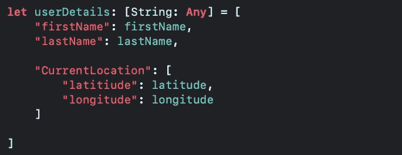
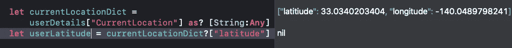
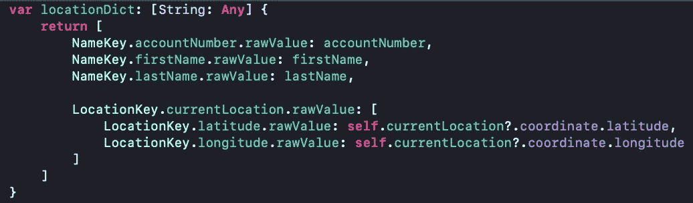
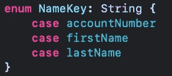
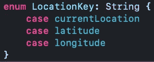
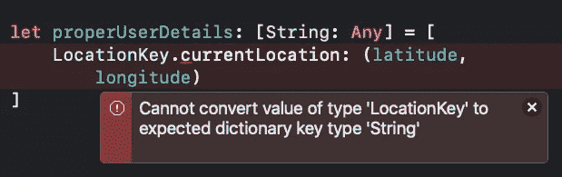
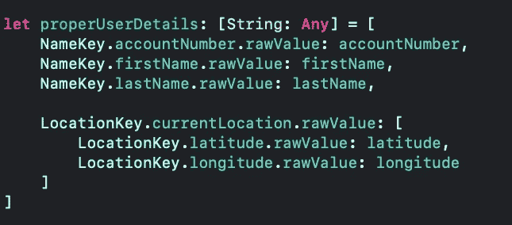
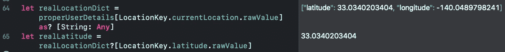

# 没有任何束缚…

> 原文：<https://blog.devgenius.io/aint-got-no-strings-344b30142904?source=collection_archive---------8----------------------->

## 为什么应该使用枚举

## “魔法”字符串在 Swift 中并不那么神奇

不要让魔法线让你看起来很傻

将字符串作为控制应用程序流程的一种方式，无论是你正在检查的一些条件、标识符还是许多其他东西，都不是一种很好的体验。尤其是当你的应用程序越来越大的时候。

我知道我们都曾花时间思考过，“那个标识符叫什么来着？”…然后你回去找，等你找到它并复制它的时候，你已经忘了你最初需要它做什么了。你的思维过程暂时脱轨，因为你不得不停下来思考一些你从未真正需要停下来思考的事情！

更糟糕的是，你确实记得它，却拼错了！呃……邻居走了。现在你的应用崩溃了，因为`"PreformDetailSegue"`不是一个有效的标识符。

这些类型的值就是我们所说的`***Magic Values***` ，因为如果你不熟悉代码库，它们可能会突然出现，并且它们可能会对你的应用程序的开发生命周期产生深远的影响。尽可能避免它们，但不一定要不惜一切代价。

在这个故事中，我们将探索一种简单的方法来避免魔术字符串。

上述情况并不是世界末日。很多事情会让我们的思维过程脱轨，或者让我们不得不回头调试代码。这就是问题的关键。

我们能摆脱的这些事情越多，我们就越能专注于解决手头的问题，而不是记住那个序列标识符是什么。

我们已经有了“决策疲劳”(罗伊·f·鲍梅斯特研究的一个术语)，精神疲劳，大脑模糊，3 点钟的低迷，以及更多要担心的事情。所以，让我们来学习如何消除这些担忧——一点一滴都有帮助！

假设我们正在构建一个包含我们的 ID ( `accountNumber` ) `firstName`、`lastName`、`latitude`和`longitude`的字典。因为字典键必须是可散列的，而字符串是可散列的…然而我们的值，在这种情况下，可以是字符串或双精度，我们将需要一个类型为`[String: Any]`的字典。

我们可以使用普通的字符串作为关键字来构建这个字典，但是这样一来，我们就容易出现输入错误和零值。相反，我们可以快速构建一两个枚举，并使用这些值来代替字符串。这样，我们避免了由打字错误引起的错误(你不会避免打字错误，但至少你会保持一致，并有一个更容易的时间重构！)

## 首先，在 Swift 中构建[String: Any]字典的传统方式:

你发现拼写错误了吗？

我在上面的字典中犯了一个拼写错误。如果你没有发现它，这是纬度键或`latitiude`键。我故意犯这个错误是为了强调一点，但是在开发这个简单的例子时，实际上犯了一个让我头疼了一分钟的错误，迫使我回去检查我的字符串。

如果稍后，我们试图从`CurrentLocation`字典中取出`latitude`键，我们将得到一个零错误。如果我们正确处理它，我们会有意想不到的行为。否则，我们的应用程序将会崩溃。

如您所见，我们的“纬度”值为零，因为我们将其拼写为“latitiude”

让我们完全用枚举键和我们的用户值来构建它。这样，除了编译器错误，我们不可能有任何错误。

没有出错的余地！(编译器错误除外)

# 让我们组织起来

我喜欢为常见用例创建较小的枚举，而不是一个包含所有标识符的大型枚举。随着你的应用程序变得越来越大，你会越来越喜欢这个策略。

## 让我们从第一个枚举 NameKey 开始。

在其中，我们将存储我们的帐号、名字和姓氏。仔细想想，这可以更恰当地命名为 UserIdentifierKey。可能看起来很奇怪，我对 enum 使用了单数形式，因为它包含 key **s** 而不是单个键，但是我遵循了标准的 Swift 命名约定。

这看起来比绳子更好，不是吗？

关键字`enum`将它标识为一个枚举，就像`class`标识一个类一样。然后是名字，就像识别一个类一样(`class SomeViewController: UIViewController`)。接下来的部分有点不一样。通常我们称之为类型，但是对于枚举，我们称之为原始值。

原始值为我们的枚举案例提供了一个关联的类型。通常当我们声明一个带有原始值的枚举时，我们必须给每种情况一个相关的原始值。但是，带有 String 类型的 rawValue 的枚举带有一个与事例名称相关联的自由值。所以上面，`accountNumber`的 rawValue 等于“accountNumber”。如果我们希望它与不同的值相关联，我们可以很容易地做到这一点…但让我们保持简单，继续我们的位置枚举。

## LocationKey 枚举

当我第一次开始使用 enums 时，这部分让我感到困惑。假设我们正在构建一个这样的字典，我会将原始值与字典中的键所代表的值混淆。没那么复杂…我们正在构建一个 enum，只有 表示我们的字符串键，所以它也有一个 String 的 rawValue。

enums 帮助我们保持有序！

现在我们有了一个存放字典中所有字符串值的地方。让我们建立我们的字典。为了得到字符串，我们需要访问每个案例的原始值。如果您忘记了`.rawValue`，并且您明确地将您的字典键入为`[String: Any]`，编译器将会中断您一天的工作，并显示一个错误，告诉您它无法将您的类型`LocationKey`转换为预期的类型:`String`。

LocationKey 类型不是字符串，但它的 rawValue 是！

你要做的是使用`LocationKey.currentLocation.rawValue`。这将访问案例的`rawValue`并将我们的`String`值放在我们想要的位置——我们从未键入单精度(或双精度🤓)引号。

看起来干净多了！

你可以用。大写后。rawValue 如果你想要一个大写首字母，或者打破命名惯例，用一个大写首字母来命名你的 case。在这个例子中，currentLocation 是小写的，尽管在我们的字符串例子中它是大写的。

现在，以后当我们想要取出一个值时，我们只需使用我们的枚举作为字典的键，我们几乎可以保证得到一个值！

## 最后

当你已经做了这么多工作的时候，设置这些枚举看起来似乎太多了，而且它确实让一个简单的任务变得不那么简单了。但是它防止了后续的错误，而后续的错误才是真正问题的开始。

例如，当您开发了这个代码库之后，已经开发了几个代码库，现在是时候回去添加一个特性了，祝您好运记住所有这些字符串值！至少如果你不记得了，或者没有恰当地给你的枚举命名，你可以回去看看，以便快速参考。当然，你可以用你当时创建的字典做同样的事情，但是我们大多数人都把我们的自定义类型放在文件中的特定位置，这样它们更容易被找到。

避免神奇的字符串，尽可能避免神奇的数字。为你的代码库和未来的你工作的其他开发人员会感谢你的。枚举是避免这两者的好方法！