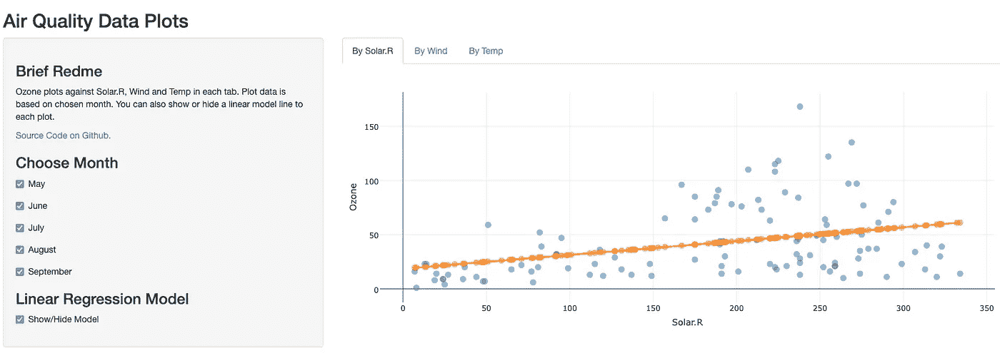

# 使用 R Shiny Webapp 使用 Plotly 绘制空气质量数据集

> 原文：<https://blog.devgenius.io/air-quality-dataset-plot-with-plotly-using-r-shiny-webapp-1578b59fd088?source=collection_archive---------9----------------------->


基拉尼省立公园，2021 年 10 月 5 日

[R 中内置的空气质量数据集](https://www.rdocumentation.org/packages/datasets/versions/3.6.2/topics/airquality)是纽约五月到九月的每日空气质量测量值。质量值包括:

*   臭氧
*   太阳能。稀有
*   风
*   临时雇员

我们将臭氧与其他三种指标进行对比，以了解它们之间的基本关系。它看起来如下:



这个示例 webapp 可以从 shinyapps 网站的[这里](https://fengliplatform.shinyapps.io/c9papp/)访问。

用户界面代码:

```
library(shiny)
library(plotly)

# Define UI for application that draws a histogram
shinyUI(fluidPage(

  # Application title
  titlePanel("Air Quality Data Plots"),

  # Sidebar with a slider input for number of bins
  sidebarLayout(
    sidebarPanel(
        h3("Brief Redme"),
        tags$div(class="header", checked=NA,
                 tags$p("Ozone plots against Solar.R, Wind and Temp in each tab.
                        Plot data is based on chosen month. You can also show or
                        hide a linear model line to each plot."),
                 tags$a(href="https://github.com/fengliplatform/course9/tree/master/shinyapp/c9pApp", "Source Code on Github.")
        ),

        h3("Choose Month"),
        checkboxInput("checkMay", "May", value = TRUE),
        checkboxInput("checkJune", "June", value = TRUE),
        checkboxInput("checkJuly", "July", value = TRUE),
        checkboxInput("checkAugust", "August", value = TRUE),
        checkboxInput("checkSeptember", "September", value = TRUE),

        h3("Linear Regression Model"),
        checkboxInput("checkModel", "Show/Hide Model", value = TRUE)
    ),

    # Show a plot of the generated distribution
    mainPanel(
        tabsetPanel(type = "tabs",
                    tabPanel("By Solar.R", br(), plotlyOutput("solarPlot")),
                    tabPanel("By Wind", br(), plotlyOutput("windPlot")),
                    tabPanel("By Temp", br(), plotlyOutput("tempPlot"))
        )
    )
  )

))
```

服务器端代码:

```
library(shiny)
library(plotly)
library(ggplot2)

data("airquality")

# Define server logic required to draw a histogram
shinyServer(function(input, output) {

    solar.lm <- reactive({
        df <- generate.df()
        s.lm <- lm(Ozone~Solar.R, data=df)
        s.lm.pred <- predict(s.lm, newdata=df)
        df1 <- data.frame(x=df$Solar.R, y=s.lm.pred)
    })
    wind.lm <- reactive({
        df <- generate.df()
        w.lm <- lm(Ozone~Wind, data=df)
        w.lm.pred <- predict(w.lm, newdata=df)
        df1 <- data.frame(x=df$Wind, y=w.lm.pred)
    })
    temp.lm <- reactive({
        df <- generate.df()
        t.lm <- lm(Ozone~Temp, data=df)
        t.lm.pred <- predict(t.lm, newdata=df)
        df1 <- data.frame(x=df$Temp, y=t.lm.pred)

    })
    generate.df <- reactive({
        checked.month <- numeric
        if( input$checkMay) {
            checked.month <- c(checked.month, 5)
        }
        if( input$checkJune) {
            checked.month <- c(checked.month, 6)
        }
        if( input$checkJuly) {
            checked.month <- c(checked.month, 7)
        }
        if( input$checkAugust) {
            checked.month <- c(checked.month, 8)
        }
        if( input$checkSeptember) {
            checked.month <- c(checked.month, 9)
        }

        df <- airquality[airquality$Month %in% checked.month,]
    })

    output$solarPlot <- renderPlotly({
        df <- generate.df()
        df2 <- solar.lm()

        p <- plot_ly(df, x=~Solar.R, y=~Ozone,
                type = "scatter", mode = "markers",
                marker = list(size = 10, opacity = 0.5),
                showlegend = F)
        if (input$checkModel) {
            add_trace(p, x = df2$x, y = df2$y, mode = "lines")
        } else {
            p
        }

    })
    output$windPlot <- renderPlotly({
        df <- generate.df()
        df2 <- wind.lm()

        p <- plot_ly(df, x=~Wind, y=~Ozone,
                     type = "scatter", mode = "markers",
                     marker = list(size = 10, opacity = 0.5),
                     showlegend = F)
        if (input$checkModel) {
            add_trace(p, x = df2$x, y = df2$y, mode = "lines")
        } else {
            p
        }

    })
    output$tempPlot <- renderPlotly({
        df <- generate.df()
        df2 <- temp.lm()

        p <- plot_ly(df, x=~Temp, y=~Ozone,
                     type = "scatter", mode = "markers",
                     marker = list(size = 10, opacity = 0.5),
                     showlegend = F)
        if (input$checkModel) {
            add_trace(p, x = df2$x, y = df2$y, mode = "lines")
        } else {
            p
        }

    })

})
```

快乐阅读！