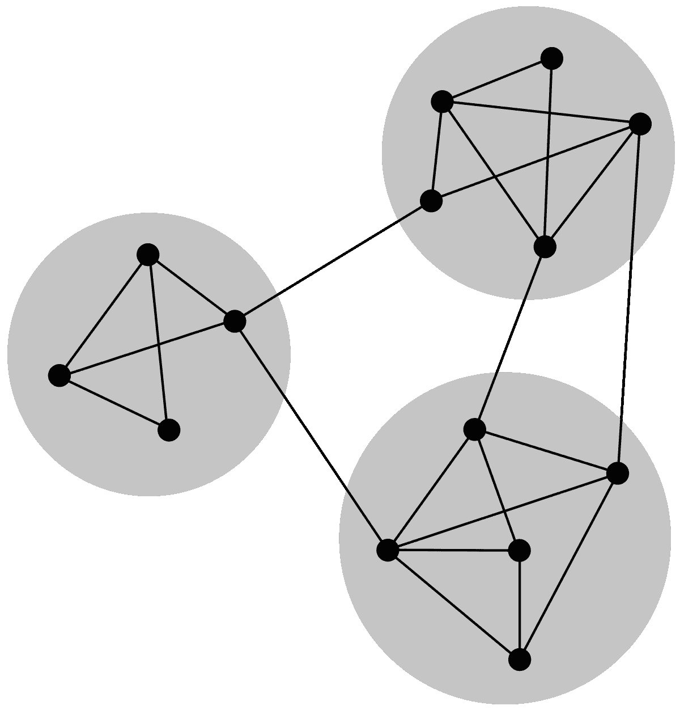
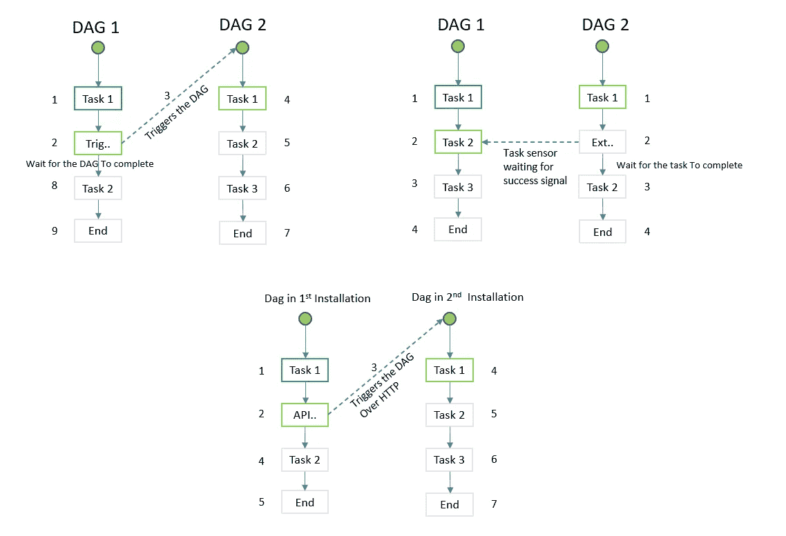

# 气流跨 dag 依赖性

> 原文：<https://blog.devgenius.io/airflow-cross-dag-dependency-b127dd3b69d8?source=collection_archive---------3----------------------->

基于其他一些 DAG 的状态启动 DAG 运行

随着数据网格采用的增加，我们看到了数据系统所有权的分散。同时，我们还需要创建数据的整体视图。因此，不同的 Dag 需要知道其他 Dag 的状态，以便生成其他 Dag 的运行。

Airflow 为我们提供了三种创建跨 dag 依赖性的本机方法。

> 基于推的— TriggerDagRunOperator
> 基于拉的— ExternalTaskSensor
> 跨环境—气流 API (SimpleHttpOperator)

# TriggerDagRunOperator

该操作符允许您在一个 DAG 中有一个任务，该任务触发在**相同气流环境**中另一个 DAG 的执行。这增加了创建复杂管线的灵活性。

**要注意的重要配置**

> conf —将数据发送到调用的 DAG
> execution_date —可以不同，但通常与调用 DAG
> reset_dag_run 保持相同(设置为 True，这允许在同一日期多次运行，重试场景)
> 
> wait_for_completion —如果希望仅在调用的 DAG 完成时触发下行流任务，请将此项设置为 true
> allowed _ States—提供对应于成功(成功，跳过)的状态列表
> failed_states —提供对应于失败的状态列表poke _ interval—如果 wait_for_completion 设置为 true，请将此项设置为合理的值

在此方法中，我们修改 DAG 并设置此依赖关系。如果我们不能修改现有的 DAG，可能代码库被不同的团队拥有。这并不意味着我们不能在这些 Dag 之间创建依赖关系。我们的下一个方法描述了如何通过改变下游 DAG 而不是上游 DAG 来实现这一点。

# 外部任务传感器

该传感器将查找另一个 DAG/任务过去的执行情况，并根据其状态处理其 DAG 中的下游任务。ExternalSensor 将匹配那些共享相同**瞬间**的外部 Dag。换句话说，两个 Dag 需要具有相同的计划间隔。如果不是这种情况，则需要通过`execution_deta` 或`execution_date_fn`来调整时间表。

**需要注意的重要配置:**

> external_task_id—如果您希望 DAG 整体完成，请将此项设置为 none
> execution _ delta—可以为下游 DAG 提供不同的计划(而非)
> execution_date_fn(如果 DAG 之间的执行日期不同，请设置此项)
> check_for_existence —始终将其设置为 True。

ExternalTaskSensor 将只接收与正在检测的“任务/DAG”相对应的成功或失败状态，而不接收任何输出值。如果我们需要根据任务中计算的值做出决策，我们需要添加*branch pythonooperator。*

上述的`TriggerDagRunOperator`和`ExternalTaskSensor`方法设计用于在相同的气流环境中使用 Dag。如果我们需要在两个不同的气流安装中运行的 Dag 之间设置这种依赖关系，我们需要使用气流 API。Airflow API 通过 REST 端点公开平台功能。

# 气流 API

我们可以使用 Airflow API(在 Airflow 2.0+版本中稳定)通过向`DAGRuns`端点发出 POST 请求来触发 DAG 运行。为此，我们可以利用 SimpleHttpOperator。

## SimpleHttpOperator

该操作符用于调用 HTTP 请求并获得响应。

**需要注意的重要配置:**

> endpoint—'/API/v1/DAGs/<dag-id>/Dag runs '
> data—可以有 execution_date
> http_con_id 这样的关键字的 JSON 不同环境的连接详细信息</dag-id>

在上述三种方法中，dag 之间有一种直接耦合。这不是一个理想的解决方案。这个问题也可以从不同的角度来看，其中依赖性解析和 DAG 触发可以从两个系统中抽象到一个集中的系统中。这个中央系统有三个组成部分:

1.  DependencyRuleEngine —用于注册依赖关系。如果我们在 DAG 文档中提到上游— DAG_ID & TASK_ID，则可以自动执行
2.  DependencyEvaluation:将用 dag 和 dag-task 对的状态进行响应。可以连接到后端的气流数据库来获取这些信息。
3.  Executor:这将在一个时间表触发给定依赖项的 DAG 执行。(用于回填支撑)

对最后一部分的想法持开放态度。

谢谢！！！