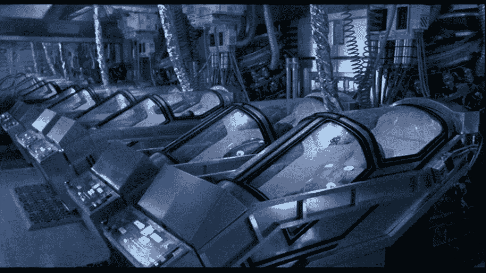
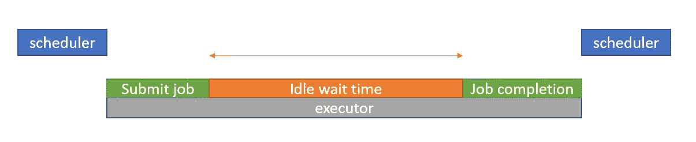
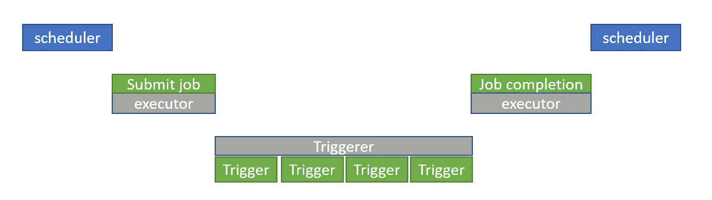

# 气流—可延迟的操作者

> 原文：<https://blog.devgenius.io/airflow-deferrable-operators-5a7c90aaa14f?source=collection_archive---------5----------------------->



图片来源谷歌

通过在任务空闲时释放工作人员来节省资源

气流以工人的概念运作。为了管理任务，它还提供了像槽、池和优先级这样的概念。当一个任务运行时，它会占用一个工作线程。传感器和操作员在运行的整个过程中会占用一个完整的工作插槽，而不管其空闲状态如何。假设我们在一个集群上提交一个 spark 作业，该作业可能需要 70 分钟才能完成，因此在整个 70 分钟内，SparkOperator 会消耗一个 worker 槽。这是一种资源浪费，因为气流除了等待 spark 任务完成之外什么也不做。类似的事情也发生在传感器上。他们继续寻找成功的事件，但是实际的工作在寻找间隔期间只发生一次。休息所有的时间，它只是无所事事。

> 因此，如果实际的工作是在气流之外完成的，那么任务就会闲置，等待完成信号。



传感器有两种运行模式。1.戳& 2。重新计划模式，在重新计划模式中，传感器会自我杀死，并在下一次戳计划中再次活着回来。但是在 Airflow 2.1 之前，我们没有办法优化空闲的工作人员。

在 Airflow 2.2 中，增加了一种新的操作符，称为 Deferrable Operator。这些可推迟的操作符比智能传感器更受欢迎。



## 可推迟的操作员

可延迟的操作符挂起自己并释放工作线程。他们把检查和采取行动的工作交给触发器。一旦操作员推迟了他们自己，他们就进入了一个叫做**推迟的新状态。**在此状态下，操作员将被停止并从其工作插槽中移除。一旦触发器找到其成功的条件检查，它将按照操作员定义的特定方法恢复操作员。

## 触发器

触发器是一小段异步 python 代码，可以快速连续地评估条件。由于占用空间小，数千个这样的小任务可以在一个单亲进程中运行。这个单亲进程被称为触发器服务。

## 触发器服务

类似于调度程序服务，触发器服务运行一个事件循环。这里的不同之处在于，这是一个 aysncio 事件循环。当条件满足时，此流程运行触发器并发出任务恢复的信号。

可推迟操作符的新流程如下所示。

> **运行→延迟→触发→排队**

要使用可推迟操作符，我们需要满足某些先决条件。

*   Python 3.7+(由于 asyncio)
*   气流版本 2.2 以上
*   触发气流装置中的服务启动和运行
*   操作员必须通过调用触发器来推迟自己。`self.defer(trigger, method_name, kwargs, timeout)`。一旦触发完成，`method_name`将成为恢复点。

```
from datetime import timedelta

from airflow.sensors.base import BaseSensorOperator
from airflow.triggers.temporal import TimeDeltaTrigger

**class** WaitOneHourSensor(BaseSensorOperator):
    **def** execute(self, context):
        self.defer(trigger=TimeDeltaTrigger(timedelta(hours=1)), method_name="execute_complete")

    **def** execute_complete(self, context, event=**None**):
        *# We have no more work to do here. Mark as complete.*
        **return**
```

`BaseTrigger`位于`airflow.triggers.base.BaseTrigger`，`TriggerEvent`位于`airflow.triggers.base.TriggerEvent`。

*   触发器是操作员将遵从的核心或定制代码。
*   触发器必须是可序列化的，因为它保存在数据库中。

```
import asyncio

from airflow.triggers.base import BaseTrigger, TriggerEvent
from airflow.utils import timezone

**class** DateTimeTrigger(BaseTrigger):

    **def** __init__(self, moment):
        super().__init__()
        self.moment = moment

    **def** serialize(self):
        **return** ("airflow.triggers.temporal.DateTimeTrigger", {"moment": self.moment})

    **async** **def** run(self):
        **while** self.moment > timezone.utcnow():
            **await** asyncio.sleep(1)
        **yield** TriggerEvent(self.moment)
```

## 提供商提供的运算符

*   databricksubmitrundeferrableoperator
*   BigQueryInsertJobOperator
*   GCSToBigQueryOperator
*   SnowflakeOperatorAsync(来自天文学家)

## 可延迟运算符的优势

*   减少资源消耗—可延迟的操作员可以减少在高并发期间运行任务所需的工作人员/K8s Pod 数量。
*   故障恢复能力—触发器服务在 HA 模式下运行，正常重启，不会出现故障。在基础设施故障的情况下，触发器通过查看数据库来恢复该过程。
*   离事件驱动的 Dag 更近了一步

## 警告

*   不是所有事情都可以推迟。
*   UI 中不存在触发日志

流水线作业快乐！！！