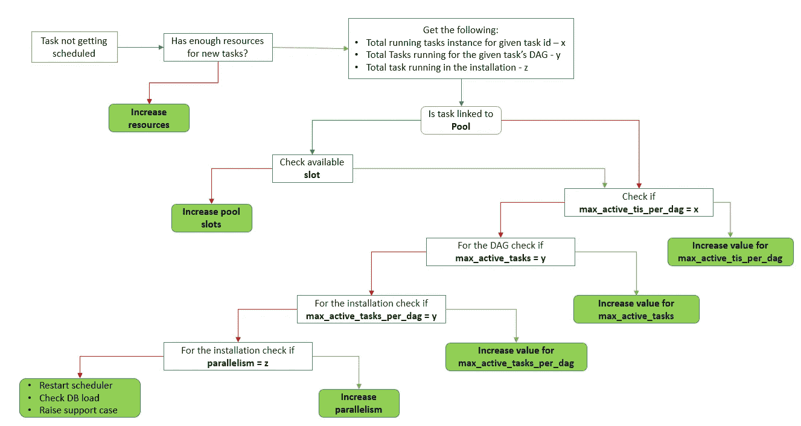

# 气流任务并行性

> 原文：<https://blog.devgenius.io/airflow-task-parallelism-6360e60ab942?source=collection_archive---------3----------------------->


[迈克·埃尼奥](https://unsplash.com/@mikeenerio?utm_source=unsplash&utm_medium=referral&utm_content=creditCopyText)在 [Unsplash](https://unsplash.com/s/photos/railway-track?utm_source=unsplash&utm_medium=referral&utm_content=creditCopyText) 上的照片

如何控制并发

气流允许我们并行运行多个任务。同时，气流是高度可配置的，因此它公开了各种配置参数来控制并行的数量。在这篇博客中，我们将看到控制可以并行运行的任务数量的配置选项列表。

这些配置可以分为三大类

> 安装级别
> DAG 级别
> 任务级别

如果不存在冲突，更具体的配置优先于通用配置(任务> DAG >安装)。在冲突的情况下，最严格的配置生效。

让我们详细了解一下配置。

# 安装级别

## 平行

这定义了在 Airflow 中每个调度程序可以同时运行的任务实例的最大数量。由于这种配置是针对每个调度程序的，如果其他配置允许，拥有两个调度程序将使并发运行任务的最大数量加倍。所有处于`RUNNING, QUEUED`状态的任务都计入该限制。默认值为 32。

## 最大活动任务数

这为 DAG 的所有活动运行定义了处于`RUNNING, QUEUED`状态的任务实例的最大数量。默认值为 16。

早期版本使用`DAG_CONCURRENCY` 进行此设置。

## **默认**_ 池化 _ 任务 _ 槽位 _ 计数

此参数定义池中可用的总插槽数。降低该值会导致并行度降低，因为运行的任务数量较少。默认值为 128。

## 最大有效运行次数每 DAG

这定义了 DAG 的活动 DAG 运行的最大数量。如果达到此限制，计划程序将不再创建任何 DAG 运行。默认值为 16。

## 多个调度程序

借助 Airflow 2.0+可以在 Airflow 中运行多个调度程序。我们可以通过增加调度器的数量来增加任务的并发性。这将增加调度程序级别的任务并发集。这不适用于旧版本(1。*)的气流。



判断气流的并行性配置是否阻碍新任务调度的决策流程

# DAG 级别

## 最大活动任务数

这定义了允许在特定 DAG 的所有活动 DAG 运行中运行的任务实例的最大数量。如果未设置，它将退回到`MAX_ACTIVE_TASK_PER_DAG`。早期版本的 airflow 使用`concurrency`参数来设置这种控制。

## 最大有效运行次数

这定义了给定 DAG 的活动运行的最大数量。如果没有明确设置，默认为`max_active_runs_per_dag`。

```
d = DAG('my_cool_dag', max_active_tasks=10, max_active_runs=2)
d = DAG('my_cool_dag', concurrency=10, max_active_runs=2)
```

# 任务级别

## 泳池

这定义了任务将在哪个池中执行。池可以用来限制一些任务的逻辑集合的并行性。每个任务将从池槽中占用规定数量的槽，当消耗的槽数达到最大槽数时，将不再有任务排队。

一个池的默认插槽数是 128。

## 最大活动时间

这定义了此任务在所有活动 DAG 运行中的活动任务实例的最大数量。在早期版本中，它是使用参数`task_concurrency`定义的。

```
t1 = Operator('task_id', pool='critical', task_concurrency=3)
t1 = Operator('task_id', pool='critical', max_active_tis_per_dag=3)
```

流水线作业快乐！！！