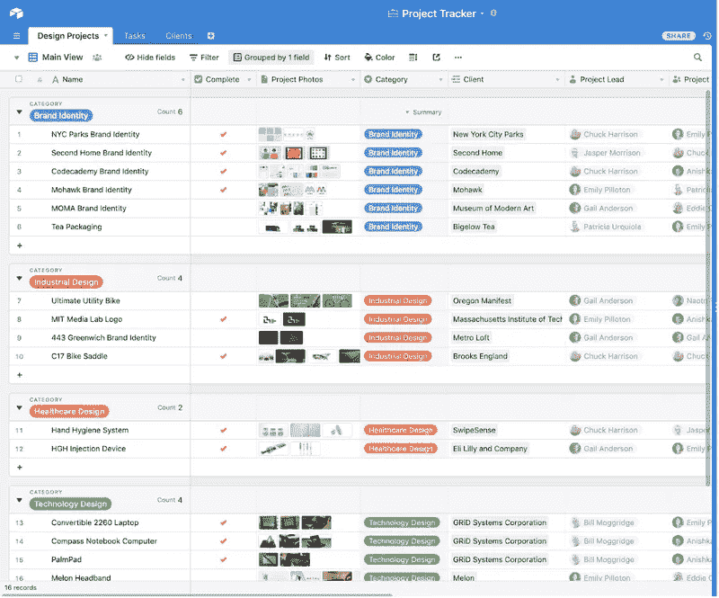

# Airtable:项目规划器

> 原文：<https://blog.devgenius.io/airtable-project-planner-bf45b7821116?source=collection_archive---------4----------------------->

在团队项目中，始终如一且富有成效地组织你的工作流程是至关重要的。您可以使用电子表格，它适用于较小的项目。但是，如果您正在构建一个更复杂的东西，涉及一个更大的团队，该怎么办呢？您肯定可以使用数据库，但这可能太耗时，而且还需要一些 SQL 知识。

这就是项目规划者和组织者发挥作用的地方。

市场提供了大量不同的选择。对于我们当前的项目，我的合作伙伴建议我们使用 [Airtable](https://airtable.com/) ，我发现这个非常直观且易于实现。

Airtable 是一家基于云的软件公司，它将传统的电子表格与数据库相结合。维基百科提到，Airtable 表格中的字段类似于电子表格中的单元格，但具有“复选框”、“电话号码”和“下拉列表”等类型，并且可以引用图像等文件附件。此外，用户可以创建数据库，设置列和记录，并与其他用户协作，这对于团队项目非常有帮助。

使用 Airtable 的示例

Airtable 有一个丰富多彩且简单的用户界面，因此在没有任何 SQL 结构知识的情况下，它很容易设置和使用。

Airtable 有 6 个基本组件:

1.  **库**是包含创建项目所需所有信息的数据库。您可以给它们取任何对您有意义的名称。Airtable 提供了许多带有相关示例数据的模板，强烈推荐您使用这些模板来轻松设置项目。但是，您也可以从零开始、从电子表格或现有基础构建基础。
2.  **工作区**是基地的集合。
3.  **表格**是 Airtable 的电子表格。库是表的集合，每个表包含项目所需的信息类型。
4.  **记录**是表格中的行和单元格。每条记录相当于一个项目。您还可以通过链接在不同表中的记录之间创建关联，这使得获取表之间的信息变得非常容易。
5.  **字段**是表格中的条目。Airtable 目前提供 16 种基本字段类型。例如单行文本、长文本文章、文件附件、复选框等。
6.  **视图**表示查看一些过滤记录的方式。例如，您想要查看某个表格中的所有图像。

希望你喜欢在你的项目中使用 Airtable！

**来源:**

1.  [气动工作台](https://airtable.com/)
2.  [维基百科](https://en.wikipedia.org/wiki/Airtable)
3.  [什么是 Airtable？](https://zapier.com/blog/what-is-airtable/)