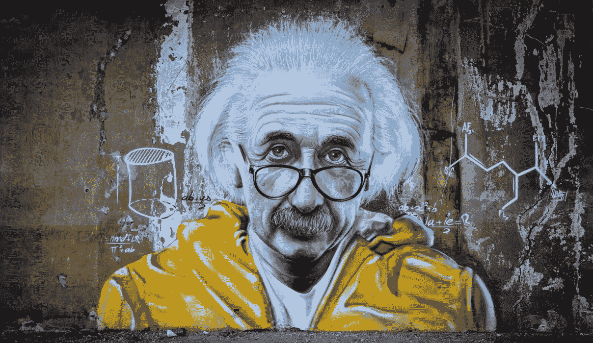

# 阿尔伯特·爱因斯坦，天才背后的故事

> 原文：<https://blog.devgenius.io/albert-einstein-the-story-behind-the-genius-2e99f9612ca5?source=collection_archive---------1----------------------->

阿尔伯特·爱因斯坦是一位出生于德国的物理学家，他发展了相对论，并因对光电效应的解释而获得了 1921 年的诺贝尔物理学奖。爱因斯坦被普遍认为是 20 世纪最有影响力的物理学家。

爱因斯坦的父母是世俗的中产阶级犹太人。他的父亲赫尔曼·爱因斯坦最初是一名羽毛推销员，后来经营了一家还算成功的电化学工厂。

他的母亲，前 Pauline Koch，照顾家庭。他有一个姐姐，玛利亚**(取名为玛嘉)，比阿尔伯特晚出生两年。**

爱因斯坦会写道，两个**奇迹深刻地影响了他生命的最初几年。第一件事是他在五岁时遇到了指南针。他对无形的力量能使指针偏转感到困惑。**

> **这将导致对看不见的力量的终生迷恋。第二个奇迹出现在他 12 岁的时候，他发现了一本几何书，他狼吞虎咽，称之为“他的小神圣几何书”。**

# **阿尔伯特·爱因斯坦的童年**

**爱因斯坦在 12 岁时变得非常虔诚，甚至创作了几首赞美上帝的歌曲，并在上学的路上唱宗教歌曲。然而，在他阅读了与他的宗教信仰相矛盾的科学书籍后，这种情况开始改变。**

**这种对权威的挑战留下了深刻而持久的印象。在 Luitpold 体育馆，爱因斯坦经常感到格格不入，并成为似乎扼杀独创性和创造力的教育制度的受害者。一个老师甚至跟他说，他这辈子什么都不会做。**

**另一个对爱因斯坦有重要影响的是一个年轻的医科学生，马克斯·塔尔穆德**(后来的马克斯·塔尔梅)**，他经常在爱因斯坦家吃晚饭。《塔木德经》成了一个非正式的导师，向爱因斯坦介绍了高等数学和哲学。一个至关重要的转折点发生在爱因斯坦 16 岁的时候。塔木德之前向他介绍了亚伦·伯恩斯坦写的一系列儿童科学书籍。**

**爱因斯坦问了自己一个问题，这个问题将主导他未来 10 年的思考:如果你能沿着一束光走，它会是什么样子？如果光是一种波，那么光束应该是静止的，就像冻结的波一样。但是他从小就知道，静止的光波从来没有被看到过，于是就有了悖论。**

# **阿尔伯特·爱因斯坦在学校不会出类拔萃**

**爱因斯坦的教育因他父亲在商业上的多次失败而中断。1894 年，在他的公司未能赢得慕尼黑市电气化的重要合同后，赫尔曼·爱因斯坦搬到了米兰，和一个亲戚一起工作。爱因斯坦被送到慕尼黑的一家寄宿公寓，预计将完成他的学业。**

**16 岁生日那天，爱因斯坦独自一人，郁郁寡欢，对即将到来的服兵役前景感到厌恶，六个月后，他离家出走，来到吃惊的父母家门口。他的父母意识到了爱因斯坦面临的巨大问题，他辍学了，因为没有就业技能而逃避了征兵。他的前景看起来并不乐观。**

**幸运的是，爱因斯坦能够直接进入 eidgen ssische Polytechnische Schule**(瑞士联邦理工学院)；1911 年，在 1909 年扩展为完全的大学地位后，它在苏黎世被重新命名为 eidgen ssische Technische Hochschule，或“联邦学院”瑞士技术)，如果他通过了非常艰难的入学考试，就没有相当于高中文凭的资格。****

**他的成绩表明，他擅长数学和物理，但法语、化学和生物不及格。由于他在数学方面的优异成绩，他被允许进入理工学院，条件是他必须先完成正规学校教育。**

# **他一生中最快乐的时光**

**他去了瑞士阿劳的一所由约斯特·温特勒开办的特殊高中，并于 1896 年毕业。那时他也放弃了德国国籍。**(他一直没有国籍，直到 1901 年被授予瑞士国籍。)****

**他与曾被关押的温特勒一家成了终生的朋友。**(温泰勒的女儿玛丽是爱因斯坦的初恋；爱因斯坦的姐姐马娅最终嫁给了温特莱尔的儿子保罗；和他的密友米歇尔·贝索会娶他们的女儿大，安娜)。****

**爱因斯坦会记得在苏黎世度过的时光是他一生中最快乐的时光。他遇到了许多学生，这些学生将成为他忠实的朋友。他还见到了他未来的妻子，来自塞尔维亚的物理学同学 Mileva Maric。**

**1900 年大学毕业后，爱因斯坦面临着他一生中最大的危机之一。因为他自学了高级科目，所以经常不及格。这引来了一些老师的敌意。后来，爱因斯坦申请的每一个学术职位都被拒绝了。**

# **阿尔伯特·爱因斯坦的家人**

**与此同时，爱因斯坦与玛丽克的关系加深了，但他的父母强烈反对这段关系。他的母亲尤其反对，因为她的塞尔维亚血统(玛丽克的家庭是东正教基督徒)。然而，爱因斯坦无视他的父母，在 1902 年 1 月，他和玛丽克甚至有了一个孩子，利瑟尔，他的命运是未知的。**

**1902 年，爱因斯坦到达了也许是他一生中的最低点。没有工作她无法嫁给 Maric 养家糊口，父亲的生意也破产了。绝望而失业的爱因斯坦接受了教孩子们冥想的卑微工作，但甚至连这些工作都被解雇了。**

**那年晚些时候，当他在伯尔尼的瑞士专利局获得一个职员职位时，事情发生了转折。大约在那个时候，爱因斯坦的父亲得了重病，就在他去世前，他祝福他的儿子和玛丽克结婚。多年来，爱因斯坦会经历巨大的悲伤，想起他的父亲去世时认为他是一个失败者。**

**有了少量但稳定的收入，爱因斯坦第一次有足够的信心与玛丽结婚，并于 1903 年 1 月 6 日结婚。**

# **他父亲去世时认为他是个失败者**

**他们的孩子汉斯·艾伯特和爱德华分别于 1904 年和 1910 年出生在伯尔尼。回想起来，爱因斯坦在专利局的工作是一件幸事。**

**他很快就审查完了专利申请，这让他有时间做白日梦，去想象自他 16 岁起就一直困扰着他的愿景:**

> **如果你沿着一束光跑会发生什么？**

**在理工学院时，他研究了描述光的性质的麦克斯韦方程，并发现了一个未知的事实，即无论移动多快，光速都保持不变。**

**然而，这违反了牛顿的运动定律，因为在艾萨克·牛顿的理论中没有绝对速度。这种直觉使爱因斯坦阐明了相对论原理:“光速在任何惯性系中都是常数。”**

**1905 年，爱因斯坦在《物理学年鉴》上发表了四篇论文，每一篇都改变了现代物理学的进程。爱因斯坦是第一个整理出整个相对论的人，并意识到这是一个普遍的自然法则，而不是像庞加莱和洛伦兹所认为的那样，是一个奇怪的宇宙运动发明。**

**于是，在 19 世纪，物理学出现了两大支柱:牛顿的运动定律和麦克斯韦的光的理论，而爱因斯坦是唯一一个意识到它们是矛盾的，其中一个必然是浴缸的人。**

# **他的第一部作品，被科学界忽视了**

**起初，爱因斯坦 1905 年的论文被物理学界忽视。这在他受到一位物理学家的关注后开始改变，这位物理学家可能是他那一代最有影响力的物理学家，量子理论的创始人马克斯·普朗克。**

**即使他的名气越来越大，爱因斯坦的婚姻也在破裂。这对夫妇经常为孩子和他们的经济状况争吵。爱因斯坦开始与他的表妹埃尔莎·洛文塔尔发生婚外情，后来与她结婚。当她最终在 1919 年与他离婚时，他同意给她一笔钱，如果他获得诺贝尔奖，她可能会得到这笔钱。**

**1915 年 11 月，爱因斯坦终于完成了广义相对论，他认为这是他的杰作。他的理论还预测了太阳周围可测量的光线偏转。因此，他甚至提出资助一支探险队去测量日食时星光的偏转。**

# **世界声誉和诺贝尔奖**

**爱因斯坦的工作因第一次世界大战而中断。他只是德国四名签署宣言反对德国参战的知识分子之一。**

**战后，两个探险队被派去检验爱因斯坦关于星光在太阳附近被偏转的预言。一个出发去西非海岸的普林西比岛，另一个去巴西北部的索布拉尔观察太阳光线。**

**1921 年，爱因斯坦开始了他的第一次世界旅行，访问了美国、英国、日本和法国。他所到之处，人群数以千计。在旅途中，他收到消息说他获得了诺贝尔物理学奖，但是是因为光电效应而不是他的相对论。在他的获奖感言中，爱因斯坦谈论相对论而不是光电效应，这让观众大吃一惊。**

# **爱因斯坦还创立了新的宇宙学**

**他的方程式预测宇宙是动态的——膨胀或收缩。这与普遍认为它是静态的观点相矛盾。**

**不可避免的是，爱因斯坦的名气和他的理论的巨大成功引起了强烈的反对。纳粹运动在相对论中找到了一个方便的目标，给它贴上“犹太物理学”的标签，并赞助会议和焚书来谴责爱因斯坦和他的理论。**

**1932 年 12 月，爱因斯坦决定永远离开德国(再也不回来)。对爱因斯坦来说，他的生命显然处于危险之中。他的人头甚至被悬赏。**

**爱因斯坦定居在新泽西州普林斯顿新成立的高级研究所，该研究所很快成为全世界物理学家的圣地。**

**爱因斯坦于 1935 年获得美国永久居留权，并于 1940 年成为美国公民，尽管他选择保留瑞士国籍。**

# **职业隔离和他的死亡**

**尽管爱因斯坦继续开拓广义相对论的许多关键点，但他越来越孤立于物理学界。大多数物理学家致力于量子理论，而不是相对论。**

**最后，由于长期未接受治疗的疾病和拒绝接受心脏动脉手术，爱因斯坦于 1955 年因心脏病发作去世。按照他的遗愿，这位伟大的科学家被火化了，骨灰被扔进了新泽西州一条不知名的河里。**

**在火葬之前，普林斯顿医院的病理学家托马斯·斯托尔茨·哈维未经家人同意，取出了他的大脑，加以保存，希望将来能发现是什么让爱因斯坦如此聪明，[的《T3》大英百科全书的](https://www.britannica.com/biography/Albert-Einstein)中写道。**