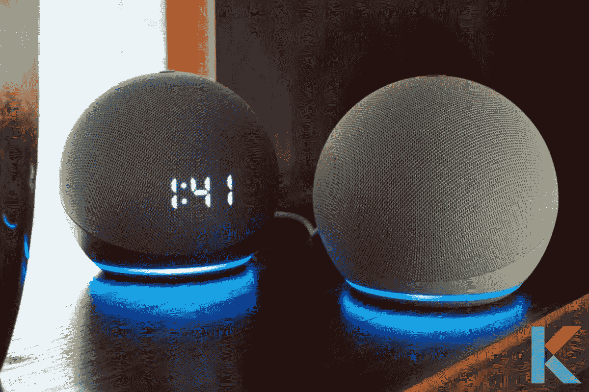
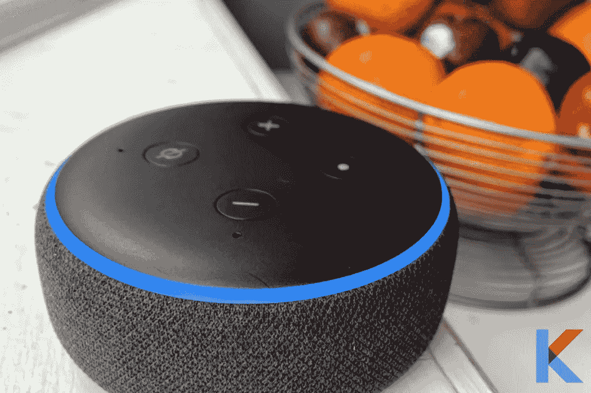
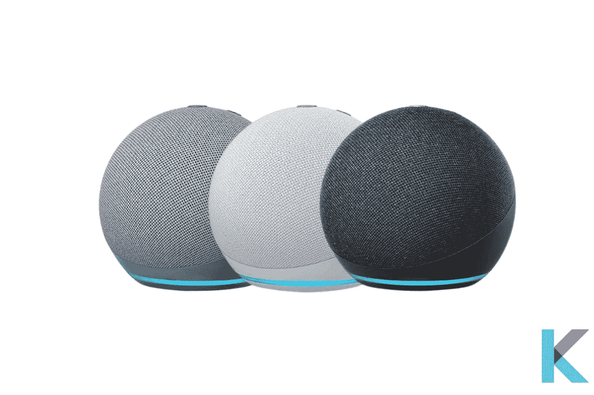
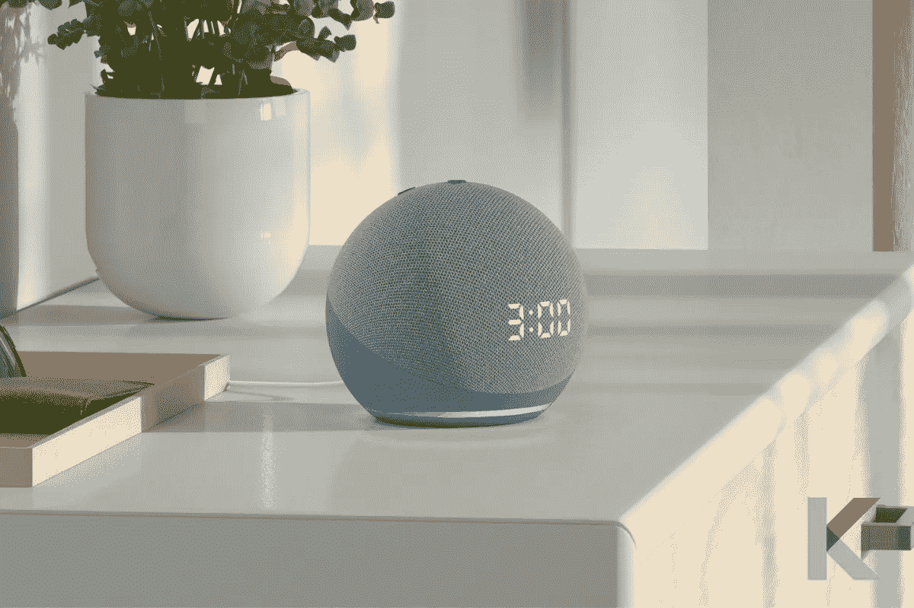
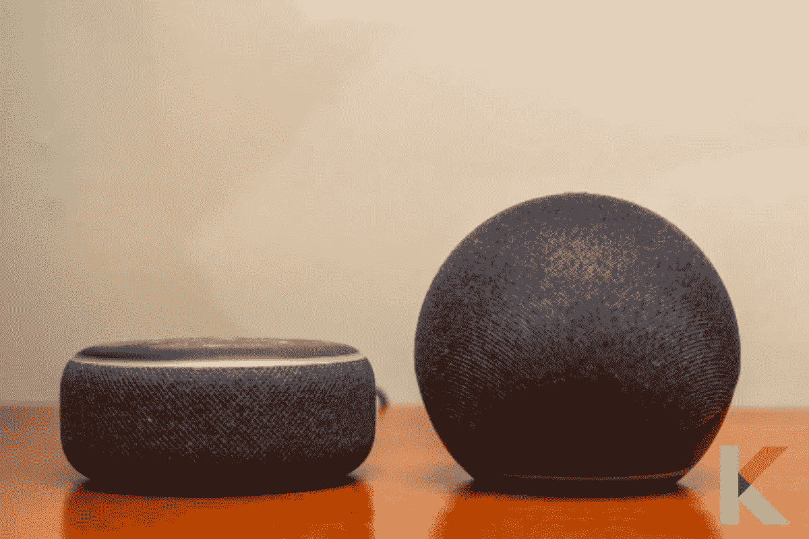
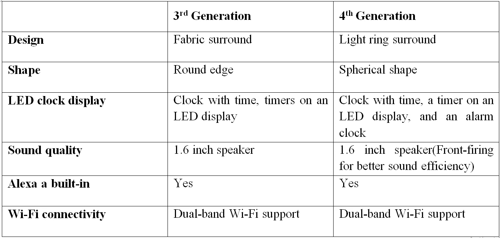
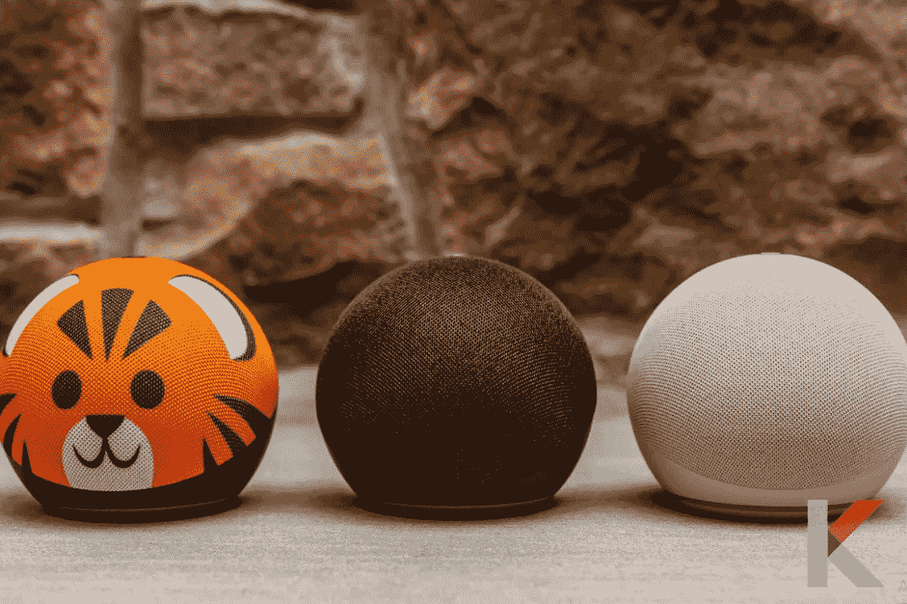
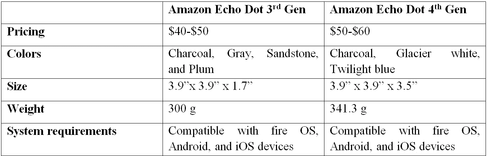

# Alexa 回声点-所有你需要知道的

> 原文：<https://blog.devgenius.io/alexa-echo-dot-a947fe2ee351?source=collection_archive---------8----------------------->

在过去的几年里，智能家居技术越来越成为常态。有许多语音识别设备可以让我们忙碌的生活更加顺畅。像亚马逊的 Echo Dot 这样的智能扬声器是一个很好的开端，因为它价格实惠，操作简单，可以帮助你完成家里的小任务。它们集成了语音识别技术。是的。Alexa 会为你做这些工作，所以你可以放松和照顾东西。

在这篇文章中，我们将深入探讨亚马逊 Echo Dot，并帮助您了解它是什么，最新一代之间的差异，可以做什么，如何设置，以及亚马逊 Echo Dot 的价格范围。

# 亚马逊 Alexa Echo Dot 是什么？

[亚马逊 Echo Dot](https://kodmy.com/alexa-echo-dot/) ，简而言之，是一款流行的声控音箱，配有 [Alexa](https://kodmy.com/alexa-smart-home-devices/) 。它还提供类似的智能家居功能，如语音识别和 Alexa 功能，只是它的形状很小，适合紧凑的生活空间。

不用再担心了。您可以根据自己的喜好选择最佳的智能家居设备。简直牛逼。你现在就可以找到我们的[智能家居设备比较工具 2021](https://kodmy.com/compare/smart-speakers?modelList=echo-dot-4th-gen,echo-dot-4th-gen-with-clock) ，用它来比较任何功能。

Echo Dot 第三代是 Echo Dot 第二代的升级版，它是最受欢迎的智能扬声器，采用织物设计。与 Echo 2 Gen 相比，它还提高了扬声器的质量。此外，Echo Dot 可以创建开始和结束一天的例行程序，并且还内置了多层隐私控制，包括麦克风关闭按钮。

然而，亚马逊 Echo Dot 的最新版本是 Echo Dot 第四代。它具有时尚，紧凑的设计和平衡的低音，声音饱满。和之前的很不一样。Echo Dot 第三代和 Echo Dot 第四代都有相同的 Alexa 技术，但亚马逊在最新的一款上增加了一些新功能，如 Alexa Guard Plus，这是一种基于订阅的家庭安全服务，以及 Care Hub，它允许你使用 Alexa 来关注老年家庭成员。

快一点！ [**从亚马逊**](https://www.amazon.com/gp/product/B08YT2N5SX/ref=as_li_tl?ie=UTF8&camp=1789&creative=9325&creativeASIN=B08YT2N5SX&linkCode=as2&tag=kodmy-20&linkId=7e005260ae6bf1f3b3b6d75f239924f4) 获得 Alexa Echo Dot 4 代。

第三代和第四代 Echo Dots 都在 LED 显示屏上“带有时钟”。此外，带时钟的第三代 Echo Dot 与第三代 Echo 相似。我们注意到的唯一区别是，LED 显示屏除了显示时间外，还可以显示计时器和室外温度，这是一个令人愉快的功能。

快一点！ [**从亚马逊**](https://amzn.to/3AEHC5V) 获得带时钟的亚马逊 Echo Dot 4 代。

还有一款儿童智能音箱。儿童版 Echo Dot 是迄今为止我见过的最可爱的智能扬声器，它有老虎或熊猫的设计和垒球大小。它包括为期一年的亚马逊儿童加计划，其中包括儿童友好的有声读物，技能，游戏以及家长控制。

快一点！ [**从亚马逊**](https://www.amazon.com/gp/product/B084J4QQK1/ref=as_li_tl?ie=UTF8&camp=1789&creative=9325&creativeASIN=B084J4QQK1&linkCode=as2&tag=kodmy-20&linkId=b2c7f718e50707a1a386540d42d5353c) 获得亚马逊 Echo Dot 4 儿童版。

我们来分解一下 Echo Dot 三代和 Echo Dot 四代的区别。

# 第三代 Echo Dot 和第四代 Echo Dot 的区别

**设计:**正如我们之前所说，这种设计令人耳目一新，但它确实让你想起了上一代的 Dot，因为它使用了同样柔和的网格覆盖设计，尽管是在一个受欢迎的转变中采用了不同的几何轮廓。

此外，球形扬声器的上半部分覆盖有织物网，而下半部分由塑料制成，并具有平坦的橡胶底座。与以前的不同，亚马逊 Echo 的标志性环形灯覆盖了基础。像其他回声扬声器一样，它会发出红色、黄色和蓝色的光。

如果你认为球形设计提供的额外高度需要在引擎盖下增加第三个驾驶位，这是可以理解的。第三代和第四代圆点在最宽处的周长几乎相同，但目前的模型几乎是其前身的两倍高，令人生畏。

**按钮和界面:**最新的 Echo Dot 有音量调高/调低、麦克风静音和动作按钮，这些按钮从扬声器顶部的织物中露出来，与以前的 Dot 类似，但这些按钮现在比以前的 Dot 更紧密地聚集在一起。

**音频:**新款 Echo Dot 的听觉略好于前代，但 Alexa 的发声能力有了显著提高。

到目前为止，希望您已经理解了这两者之间的区别。让我们简单看一下。

# 亚马逊 Echo Dot 能做什么？

*   支持 Alexa，所以你可以随时和你的虚拟管家通话。
*   Alexa 拥有超过 60，000 项技能，并且还在不断增加，所以你可以做任何事情，从订购披萨和优步到帮助组织你的一天。
*   与大量智能设备的互操作性无与伦比。
*   大多数其他连接的家庭设备都与此兼容，让您可以免提访问。
*   与联网家庭中的其他 Echo 设备实现完整的内部通信服务，使您无需拿起电话即可拨打和接收电话和消息。
*   通过这种按需联系的突破性变化，你可以查看你的孩子或年长的亲戚。
*   由于体积小，你几乎可以把亚马逊 Echo Dot 放在任何地方，它也是一个一流的旅行套件。
*   您可以开箱即用，因为设置非常简单。

# Alexa 能为你做什么？

总而言之，现在有超过 60，000 种可用的技能，从玩 Jeopardy 到开灯、点披萨和搭车去机场。下面是一些我们最喜欢的 Alexa 技能。

*   亚马逊音乐、Spotify、Deezer、SiriusXM、Pandora、iHeartRadio 和 TuneIn 都在 Echo Dot 上提供音频流。
*   亚马逊继续推出新的智能家居合作伙伴，所以你很难找到一个不支持 Alexa 的合作伙伴。
*   大多数顶级品牌都可以通过 Alexa 进行监管，从最好的智能恒温器到最好的智能灯，再到智能锁、智能插头、智能灯开关和家庭安全摄像头。
*   亚马逊也在研究智能家居例程，可以让你通过一个命令来监控几个智能家居设备，比如“Alexa Goodnight”来关闭所有的灯并锁门。
*   能够使用 Alexa 给其他人打电话和发信息，在其他 Alexa 设备上检查，并向所有 Echo 设备发送消息。

**查看更多** : [*最佳 HomeKit 兼容智能家居设备 2021*](https://kodmy.com/homekit-compatible-smart-devices/) 。

# 亚马逊回声点设置

如果你想设置你的亚马逊 echo dot，你需要在你的移动设备的应用商店下载或更新 Alexa 应用。

1.你必须插上你的回声点设备

2.在您的设备上打开 Alexa 应用程序

3.然后，打开更多并选择添加设备

4.选择亚马逊回声点和更多

5.最后，按照说明设置您的 Echo dot。

# 亚马逊回声点的价格范围

Echo Dot 第四代是一款出色的入门级智能扬声器，它的新设计让我们很少抱怨，并吸引了人们的注意。设计和稍微安静的音质是购买这款扬声器的两个令人信服的理由。如果你想节省更多的钱，第三代网络仍然是一个可行的选择，因为你没有什么可失去的。

# 我们的裁决

你在争论该把哪一款智能音箱带回家吗？Echo Dot 第四代是一款出色的智能扬声器，尽管它采用了新的设计和改进的音频，但如果你正在寻找最物有所值的入门级智能扬声器，它似乎是可选的。在本文中，您可以了解到 Alexa echo dot 4thgen 价格、Alexa echo dot 4 儿童版、Alexa echo dot 3 代与 Alexa echo dot 4 代、Alexa Echo dot 设置、Alexa Echo dot 价格等等。Echo 第三代仍然是一个更好的选择，但音频质量稍低。

如果你对其他[便宜的智能家居小工具](https://kodmy.com/google-nest-mini-setup-and-reviews/)感兴趣，你可以看看这里。