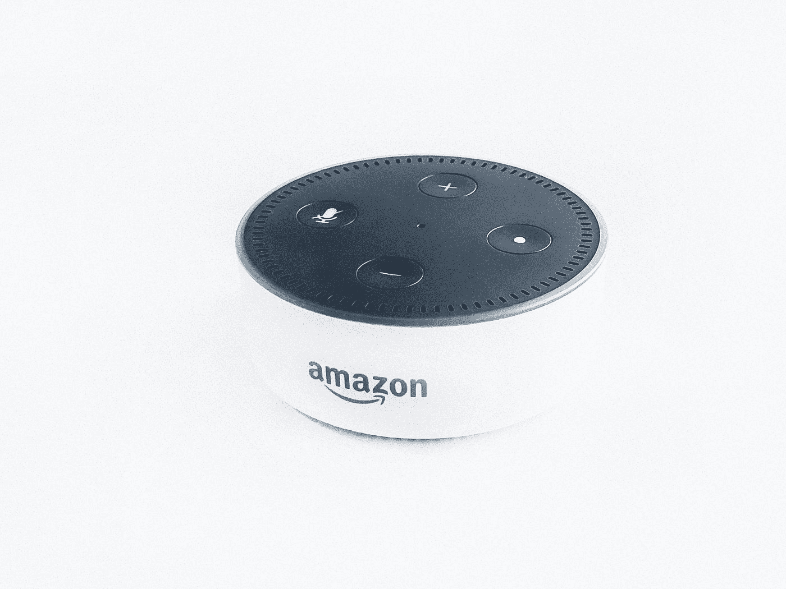
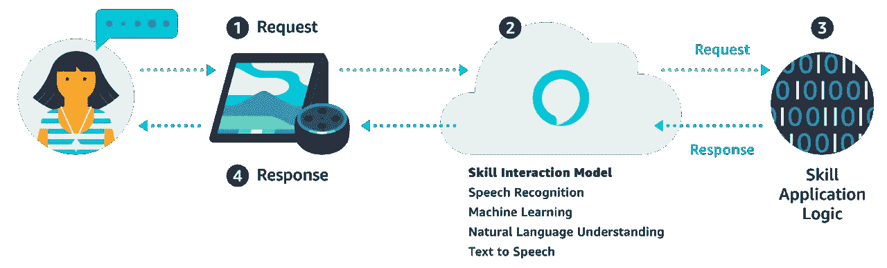
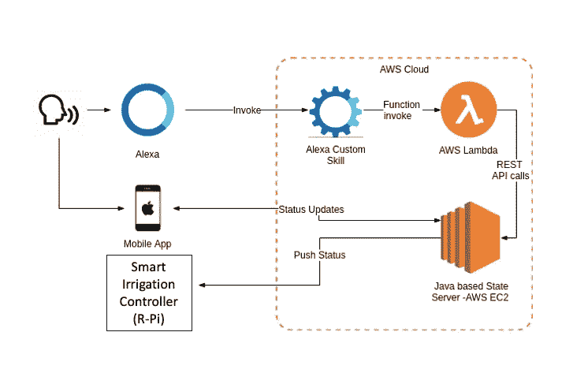

# Alexa 与智能灌溉控制器的集成

> 原文：<https://blog.devgenius.io/alexa-integration-with-smart-irrigation-controller-f18bca3ef6a?source=collection_archive---------11----------------------->

拉胡尔·查克拉博蒂在 [Unsplash](https://unsplash.com?utm_source=medium&utm_medium=referral) 上的照片

与花园互动的新方式。

**注:在阅读本文之前，我建议你阅读我的第一篇文章链接** [**这里**](https://medium.com/dev-genius/i-built-a-smart-irrigation-system-using-only-a-raspberry-pi-ba29282b499e) **以获得更多关于这个主题的背景知识。**

想象一下，当一个人工智能系统给你的花园浇水时，你可以在花园外面的草坪椅子上放松。此外，想象一下只用你的声音就能控制它。幸运的是，物联网技术已经赶上来，使这个梦想成为现实。

进入 2014 年 11 月。亚马逊公布了他们的全新宝贝:Alexa。这是一个时代的开始。个人人工智能在全世界范围内变得商业化。美国各地的家庭都欢迎新的家庭成员。亚马逊因其易于使用的开发者 API 和软件获得了数百万的利润。他们还推出了一个别出心裁的系统，让开发者将自己的产品和命令连接到 Alexa，名为“skills”。

来源:[亚马逊](https://developer.amazon.com/en-US/alexa/alexa-skills-kit/start)

Alexa skills 为通过语音命令控制您的智能灌溉系统提供了基础。使用他们开发者网站上发布的文档，我们可以学习如何创建一个简单的前端和后端应用程序，能够控制客户的灌溉系统。使用预先构建的亚马逊 SDK for node . js，您可以创建一个漂亮的交互式语音界面。使用 Python 和 Java，后端应用程序的构建比以往任何时候都更容易。

资料来源:Priyal wal pita——媒体作家

与我们的智能灌溉控制器的集成看起来主要是这样的:Alexa 设备将作为传入用户请求的“门户”。客户可以用一个简单的命令对 Alexa 说话，比如“给我的花园浇水”，或者“关掉洒水器”AWS 自定义技能将通过 Lambda 处理该请求，并基于我们的函数可以访问的指定首选项创建一个 JSON 输出。然后，python 脚本将对变量进行解码，并为灌溉系统设置所需的状态。

Alexa 自定义技能 API 和 AWS Lambda 有两个主要组件:意图和示例话语。意图是客户语音请求的首要目标。它与所谓的样本话语相关联。这些短语代表客户将用来访问您的技能的语音命令。然后，自定义技能将向我们在 raspberry pi 上的 python 文件发送一个 JSON 请求。

我们的 raspberry pi 上的一个简单脚本将被简化，以解码 Lambda 请求中包含的 json 并对其进行操作。Alexa 技能 API 传递的意图将通过考虑不同的因素来执行。用户传递的意图将被记录。系统将智能地创建关于用户意图的意见，并与记录的意图进行比较。基于此，将完成一个动作。

例如，如果用户请求打开灌溉，树莓 pi 可以根据请求打开水流或使用天气数据与用户协商更合适的浇水时间。

这整个过程也非常模块化，因为有这么多不同的功能可以与 Alexa 技能集成。Alexa 可以联系用户，通知他们智能灌溉控制器设置的当前调度。我们概述的系统创建了用户可以与物联网系统交互的许多不同方式。

亚马逊还创建了一个高度集成的开发生态系统，以便开发人员可以轻松测试他们的后端和前端代码。Amazon 已经考虑了编程体验的许多方面，因此您可以与用户进行各种令人愉快的交互。

照片由[威廉·胡克](https://unsplash.com/@williamtm?utm_source=medium&utm_medium=referral)在 [Unsplash](https://unsplash.com?utm_source=medium&utm_medium=referral) 拍摄

另一个扩展到 Alexa 生态系统的可能领域是将智能灌溉手机应用程序与 Alexa 技能无缝集成。这是在应用程序和支持 Alexa 的设备之间建立互动连续性的一个很好的方式。创建连续性有助于减少用户在应用程序上启用特殊浇水计划或通过语音命令启动自定义浇水会话时可能面临的差异。

将智能灌溉系统与 Alexa 集成的范围和影响也是深远的。数百个设备已经将 Alexa 集成到他们的系统中。Alexa 技能建立在这个庞大的网络上，以完善最终用户体验。为灌溉系统创建一个 Alexa 技能可以帮助用户以各种形式了解事件和通知。这有助于使用户对可能通过灌溉设备出现的重要通知有所了解。

在 [Unsplash](https://unsplash.com?utm_source=medium&utm_medium=referral) 上由 [BENCE BOROS](https://unsplash.com/@benceboros?utm_source=medium&utm_medium=referral) 拍摄的照片

智能家居与浇水设备的集成不会随着 Alexa 而结束。Google Home 和 Siri 等其他设备也可以集成在一起，形成一个更好的生态系统。这将让你的物联网浇水产品接触到更多的受众。

与 Alexa 集成的智能灌溉系统的功能有无限的可能性。例如，用户可以创建家庭自动化，用他们的浇水系统、灯和割草机来创建有凝聚力的场景。用户还可以通过 Alexa 界面获得关于智能灌溉系统计算的定制浇水时间表的建议。

如果你喜欢这篇文章，你肯定会对我的其他文章感兴趣。下面就来看看吧！

 [## 我只用一个树莓做了一个智能灌溉系统。

### 我是这样做的，你也可以这样做

medium.com](https://medium.com/dev-genius/i-built-a-smart-irrigation-system-using-only-a-raspberry-pi-ba29282b499e)