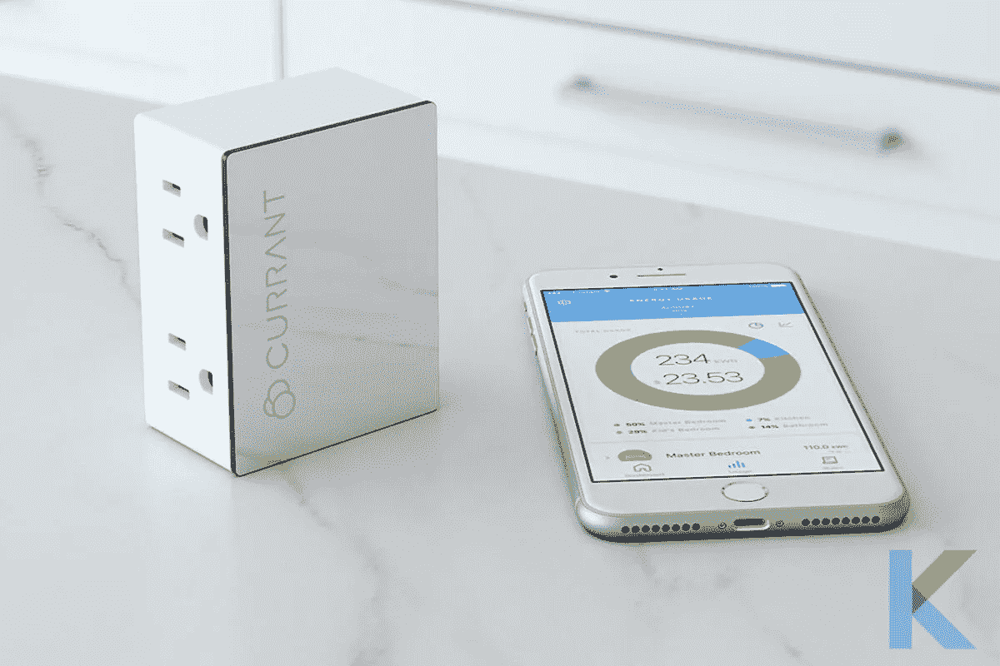

# Alexa 智能家居设备

> 原文：<https://blog.devgenius.io/alexa-smart-home-devices-868450b24551?source=collection_archive---------7----------------------->

太棒了。作为我们的生活助手，Alexa 现在可以做我们想做的任何事情。Alexa 是亚马逊开发的一款声控无线扬声器，响应 Alexa 这个名字。此外，该软件还可以帮助用户使用语音命令与设备进行交流，播放音乐，设置提醒，制作待办事项列表，收听播客，获取天气更新，甚至下亚马逊订单。

# 什么是 Alexa 家用设备？

[Alexa 智能家居设备](https://kodmy.com/alexa-smart-home-devices/)是任何可以链接到您的[智能家居系统](https://kodmy.com/smart-home-technology/)并使用 Alexa 的语音命令与其他设备进行通信的电子设备。

亚马逊的 Echo 智能扬声器由 Alexa 数字助理驱动，也是一款令人难以置信的设备。此外，你可以用它们做不同的事情，包括流媒体音乐，保存购物清单，订购披萨外卖等。

然而，Alexa 在被要求监控你的智能家居时最有用。它还能帮助你完善家庭娱乐系统，提高你的草坪和花园的质量，提高家庭安全性，陪你上路。以下是你可能会考虑购买的一些最好的 Alexa 智能家居设备。

# 最好的 Alexa 智能家居设备

*   **回声秀 5**

配有 5.5 英寸屏幕的 Echo Show 5 智能显示屏是您办公桌的又一大亮点。此外，亚马逊上还有更大的 8 英寸和 10.1 英寸版本。

*   **LIFX 彩色 1000**

你不需要一个桥或智能家居集线器来为 LIFX 灯泡供电，因为它们通过 Wi-Fi 工作。此外，LIFX 灯泡的亮度为 1055 流明，是其最大的特点之一。

*   **汉密尔顿海滩智能咖啡机**

汉密尔顿海滩智能咖啡机是每个想用咖啡开始一天生活的人的好选择。您可以打开和关闭它，也可以使用语音命令更改酿造浓度。这是一种奢侈和舒适，但话说回来，智能房屋中的其他一切也是如此。

*   **Leviton Decora 智能 Wi-Fi 插件插座(型号 DW15P)**

Leviton 的 Decora DW15P 是我们最喜欢的智能插头。此外，很自然地，我们会建议它作为最佳智能插头，与支持 Alexa 的智能扬声器配对。它直接连接到您的 Wi-Fi 网络，无需单独的智能家居集线器。

*   **current WiFi 智能插座**

尽管 Currant WiFi 智能插座只使用一个壁式插座，但它提供了两个独立可控的智能插座。Currant 应用程序还可以跟踪和记录你的能源使用情况，这将帮助你找出如何节省每月电费。

*   **罗技和谐精英万能遥控器**

诚然，罗技的 Harmony Elite 是一个昂贵的选择，但它可以说是市场上最有效的遥控器。这是一个由两部分组成的系统，包括一个带有宽触摸屏和几个按钮的遥控器，以及一个适合您的娱乐中心的集线器。

*   **最佳兼容 Alexa 的门铃摄像头**

Ring 可能没有发明第一个门铃摄像头，但它是第一个将该设备引入大众的公司，并且继续成为行业领导者。Ring 的 Alexa 功能也可以与该公司的泛光灯摄像头配合使用，但它是有限的:你只能将摄像头的实时视频传输到 Echo Show 或 Echo Spot。

*   **八月门铃 Cam Pro 2**

八月门铃凸轮专业，现在在其第二次迭代，是一个很好的伴侣，任何八月智能锁。除了智能手机之外，这款相机还有一个吸引人的工业设计，可以将一张非常简单的图片传输到 Echo Show 或 Echo Spot。

*   **最佳兼容 Alexa 的家庭安全摄像头**

Netgear 的 Alexa 技能没有太大作用，但当你需要一个简短的家庭监控摄像头所见所闻的实时视图时，它很有用。所以，如果你在半夜听到声音，你就不用起床去检查了。

# 如何挑选适合自己的智能家居小工具？

谈到最好的智能家居产品，每个买家都有自己的偏好。你的大部分决定将基于你更喜欢哪个智能家居平台；您将想要购买与您的语音助手一起工作的设备，因此您可以不用手就能建立例程并监控您的设备。

由于几乎每个智能家居设备都可以与 Alexa 配合使用，因此很难确定哪个是最好的。以下是你挑选智能家居产品时需要考虑的一些事情:

**设计**:这是制作精良的产品吗？例如，在智能插头的情况下，它是否足够纤细，不会阻塞你的另一个插座？

**功能**:智能家居设备有哪些功能？智能插头或智能灯上是否有 Home/Away 功能，是否可以编程为在日落时打开？

**价格**:最便宜的智能家居系统往往不是最好的。你可能会被一个 10 美元的小玩意所诱惑，但在购买前要确保它符合要求。

# 如何使用应用程序管理 Alexa 智能家居设备

Alexa 应用程序可以用来组织和控制 Alexa 智能设备，也可以让它们让你的家更智能。此外，拥有多个亚马逊 Alexa 设备的用户可以使用 Alexa 移动应用程序从一个位置访问它们。该应用程序充当所有 Alexa 设备的中心枢纽，使用户能够自定义他们的设置、位置，甚至设备名称。起初，管理多个智能设备很困难，但现在 Alexa 简化了这一过程。

> ***“智能家居技术的现代世界令人着迷，可能性和组合一直在扩大。当智能家居行业扩大时，所提供的服务及其对你日常生活的影响也会扩大。”***