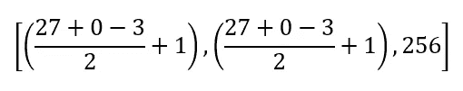

# Alex Net——超越 CNN 的网络

> 原文：<https://blog.devgenius.io/alexnet-the-net-that-surpassed-cnns-5d551ba1b901?source=collection_archive---------5----------------------->

**AlexNet** 是一个卷积神经网络(CNN)架构，由 *Alex Krizhevsky* 、 *Ilya Sutskever* 和 *Geoffrey Hinton* 合作创建。AlexNet 赢得了 **2012 ImageNet 大规模视觉识别挑战赛**。

卷积神经网络(CNN)长期以来一直是物体识别的首选模型，因为它们—

1.  强大的
2.  易于控制
3.  更容易训练。

当应用于数百万张图像时，它们没有表现出任何明显的过度拟合。它们的性能几乎相当于类似规模的传统前馈神经网络。

唯一的问题是它们很难应用于高分辨率的照片。

# AlexNet 架构

AlexNet 是一个 8 层深度神经网络。AlexNets 使用了一些新技术， **RelU** 激活函数和 **Dropout** 层。

1.  **ReLU**

基于 RelU 的深度卷积网络的训练速度比基于 tanh 和 sigmoid 的网络快几倍。在 RelU 之后，函数值没有像 tan h 或 sigmoid 函数那样的范围，所以通常在之后进行归一化。

1.  **辍学**

辍学可以有效地防止神经网络过拟合。通过修改神经网络本身的结构，在神经网络中实现退出。对于特定的一层神经元，在保持输入层和输出层神经元个体不变的情况下，以定义的概率随机删除一些神经元，然后基于神经网络的学习方法更新参数。在随后的迭代中使用再随机化(移除一些神经元，直到训练完成)。

## 体系结构

AlexNet 架构

通过卷积或最大池层后，中间输出图像的尺寸由以下公式产生—

这里，

n =给定的尺寸，

p =该层完成的填充，

f =内核数量，

s =步幅，

k =内核大小。

图像输入尺寸应为 **(227，227)**

尺寸的计算是—

## **CONV 1**

n = 227，p = 0，f = 11，s = 1，k = 96

这相当于— **(55 x 55 x 96)** *【或(55，55，96)哪种符号适合你。】*

## 最大池 1

n= 55，p = 0，f = 3，s = 2，k = 96

结果大小将是— **(27 x 27 x 96)**

## CONV2

n = 27，p = 2，f = 5，s = 1，k = 256

因此，尺寸— ( **27 x 27 x 256)**

## 最大池 2

n = 27，p = 0，f = 3，s =2，k =256

现在的尺寸是——(13 x 13 x 256)

## CONV 3

n = 13，p = 1，f = 3，s = 1，k = 384

最终尺寸— **(13 x 13 x 384)**

## **CONV 4**

n = 13，p = 1，f = 3，s = 1，k = 384

最终尺寸— **(13 x 13 x 384)**

## CONV 5

n = 13，p = 1，f = 3，s = 1，k = 256

现在的大小将是— **(13 x 13 x 256)**

## 最大池 3

n = 13，p = 0，f = 3，s = 2，k = 256

结果大小将是— **(6 x 6 x 256)**

## 致密层

密集层的大小将是——(6 * 6 * 256)=**9216**(神经元)

## 完全连接的层

> 有趣的是，与普遍认为的不同，AlexNet 不是第一个赢得图像识别比赛的 CNN 快速 GPU 实现。K. Chellapilla 等人(2006)在 GPU 上实现的 CNN 比在 CPU 上实现的 CNN 快 4 倍。丹·cireșan 等人(2011 年)在 IDSIA 的深度 CNN 已经快了 60 倍，并在 2011 年 8 月实现了超人的表现。在 2011 年 5 月 15 日至 2012 年 9 月 10 日期间，他们的 CNN 赢得了不下 4 个图像比赛。他们还大大提高了多图像数据库文献中的最佳性能。

我的[***GitHub***](https://github.com/AditiRastogi250701/DIARETDB1)账号上有 AlexNet 在自定义数据集上实现的完整代码。

*感谢阅读！如果您有任何疑问，请随时通过*[***Gmail***](http://aditi2507rastogi@gmail.com/)****或我的* [***LinkedIn 个人资料***](https://www.linkedin.com/in/aditi-rastogi-961789191/)**或*[***GitHub***](https://github.com/AditiRastogi250701)【t5****