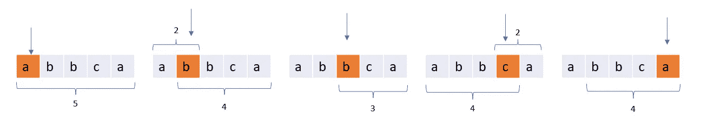

# 算法—贡献模式

> 原文：<https://blog.devgenius.io/algorithm-contribution-pattern-c9c52fcdd8e9?source=collection_archive---------2----------------------->


图片来源 VectorStock.com

子阵列或子矩阵结果的累加

组合模式是我们必须从子数组和子矩阵中积累结果的问题。在这种模式中，我们不是生成所有的子数组或子矩阵，而是计算一个元素作为可能的候选元素在子数组或子矩阵中出现的次数。让我们用一些例子来理解这一点。

# 字符串的总吸引力

字符串的**吸引力**是在字符串中找到的**不同**字符的数量。比如`"abbca"`的诉求是`3`，因为它有`3`鲜明的人物:`'a'`、`'b'`、`'c'`。给定一个字符串`s`，返回其所有子字符串的总吸引力。

## **方法**

在一个子串中，多个相同的字符只能得到一分。
所以我们需要找到所有子串，统计每个字符的权重。如果一个字符出现不止一次，那么它的权重只有一。对于那些我们有重复字符的情况，我们可以认为第一个出现的得到要点。对于每个字符`s[i]`，子串必须在`s[i]`之前开始以包含`s[i]` ，并且需要在`s[i]`的`last`出现之后结束，否则最后出现的字符`s[i]`将得到分数。总共有`i - last[s[i]]`可能的开始位置、
和`n - i`可能的结束位置，所以`s[i]`可以贡献`(i - last[s[i]]) * (n - i)`点。



## **代码实现**

```
def appealSum(s):
    from collections import defaultdict
    last_seen = defaultdict(lambda: -1)
    res, n = 0, len(s)
    for idx, char in enumerate(s):
        res += (idx - last_seen[char]) * (n - idx)
        last_seen[char] = idx
    return resprint(appealSum("abbca"))
```

# **统计给定字符串的所有子字符串的唯一字符**

让我们定义一个函数`countUniqueChars(s)`，它返回`s`上唯一字符的数量。例如，如果`s = "LEETCODE"`叫`countUniqueChars(s)`，那么`"L"`、`"T"`、`"C"`、`"O"`、`"D"`在`s`中只出现一次，所以`countUniqueChars(s) = 5`是唯一的字符。给定一个字符串`s`，返回`countUniqueChars(t)`的和，其中`t`是`s`的子串。测试用例的生成使得答案符合 32 位整数。

请注意，有些子字符串可以重复，因此在这种情况下，您还必须计算重复的子字符串。

## **接近**

与上一个问题类似，我们可以计算 S 中的每个字符，有多少个子串是唯一字符，而不是计算所有唯一字符和所有可能的子串。对于每一个 char，我们都进行计数并不断添加到 res 中，它将成为我们的答案。当我们看到一个字符被重复时，我们会找到该字符在子串中唯一的子串的数量，但它不再是`last_occurence -second_last_occurence`。我们还需要添加新添加的人物`current_idx — last_occurence`。

## **代码实现**

```
def uniqueLetterString(s):
    index_map = {c: [-1, -1] for c in s}
    res = 0
    current = 0
    for idx, char in enumerate(s):
        second_last_occurence, last_occurence = index_map[char]
        num_removed = last_occurence - second_last_occurence
        num_added = idx - last_occurence
        index_map[char] = [last_occurence, idx]

        current += num_added - num_removed
        res += current
    return res

print(uniqueLetterString("LEETCODE"))
```

# 有效子阵列的数量

给定一个整数数组`nums`，返回*非空* ***子数组*** *的个数，子数组最左边的元素不大于子数组*中的其他元素。

## 方法

我们需要找到第一个元素最小的所有子数组。换句话说，我们需要为每个元素找到下一个更小的元素。直到该索引(下一个更小的元素)为止，所有子阵列将具有作为最小值的数目，因此所有这样的贡献将被计数。


为了找到下一个最小的元素，我们使用[单调堆栈](/monotonic-stack-algorithm-pattern-7bfac59157c2)。

## 代码实现

```
def validSubarrays(nums):
    stack = []
    next_smaller = [len(nums)] * len(nums)
    for i, v in enumerate(nums):
        while stack and stack[-1][1] > v:
            next_smaller[stack.pop()[0]] = i
        stack.append([i, v])
    return sum([v - i for i, v in enumerate(next_smaller)])
```

# 子阵列最小值之和

给定一个整数数组 arr，求`min(b)`的和，其中`b`覆盖`arr`的每个(相邻)子数组。由于答案可能较大，返回答案**模** `10^9 + 7`。

## **接近**

在这个问题中，我们需要找出有多少个子数组包含这个数，并且这个数是最小的。为了找到它，我们从索引开始，向数组的左边移动，直到找到第一个值小于当前 num 的索引。这决定了在 num 最小的地方有多少个可行的左子阵列。类似地，我们可以通过移动到索引的右侧并找到第一个较小的数字来计算可行的右侧子数组的数量。


## 代码实现

```
def sumSubarrayMins(nums):
    n = len(nums)
    nums.append(0)
    res = 0
    mod = 1000000007
    stack = [-1]

    for i, num in enumerate(nums):
        while stack and nums[stack[-1]] > num:
            idx = stack.pop()
            res += nums[idx] * (i - idx) * (idx - stack[-1])

        stack.append(i)

    return res % (mod)print(sumSubarrayMins([3,1,2,4]))
```

# 子阵列范围之和

给你一个整数数组`nums`。`nums`子阵列的**范围**是子阵列中最大和最小元素之间的差值。返回所有*`nums`*子数组范围的****之和。******

## ***接近***

*类似于上一个问题，我们计算一个单元对一个子阵列的最小元素有多少次贡献。此外，我们将细胞贡献的次数计算为子阵列的最大值。因为我们需要每个数组中最大值和最小值之间的差值，所以我们减去所有最小值的贡献，然后加上所有最大值的贡献。*

**

## *代码实现*

```
*def subArrayRanges(nums):
    res = 0
    inf = float('inf')
    A = [-inf] + nums + [-inf]
    s = []
    for i, x in enumerate(A):
        while s and A[s[-1]] > x:
            j = s.pop()
            k = s[-1]
            res -= A[j] * (i - j) * (j - k)
        s.append(i)

    A = [inf] + nums + [inf]
    s = []
    for i, x in enumerate(A):
        while s and A[s[-1]] < x:
            j = s.pop()
            k = s[-1]
            res += A[j] * (i - j) * (j - k)
        s.append(i)
    return resprint(subArrayRanges([1,2,3]))*
```

# *所有子矩阵之和*

*给定一个 2D 矩阵 **A** 的维数 **N*N** ，我们需要返回所有可能的子矩阵之和。*

## ***接近***

*如果我们生成所有的子矩阵，它将给出 n⁴.的时间复杂度如果我们计算一个单元在所有子矩阵中出现的次数，我们可以减少，我们可以找到它在总和中的贡献。我们采取如下图所示的方法。*

**

## *代码实现*

```
*def subMatricesSum(A):
    m, n = len(A), len(A[0])
    res = 0
    for i in range(m):
        for j in range(n):
            res += A[i][j]*(i+1)*(j+1)*(m-i)*(n-j)
    return resprint(subMatricesSum([ [1, 1], [1, 1]]))*
```

*如果你觉得这有用，请鼓掌！！*