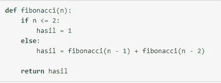

# 算法策略和各种算法

> 原文：<https://blog.devgenius.io/algorithm-strategy-and-various-algorithms-bdbb7eb811fe?source=collection_archive---------0----------------------->


来源:[http://news . unair . AC . id/2020/01/24/pene muan-proses-paralel-menggunakan-algorit ma-alpha-miner-baru/](http://news.unair.ac.id/2020/01/24/penemuan-proses-paralel-menggunakan-algoritma-alpha-miner-baru/)

在我们了解算法策略之前，我们需要知道上面每个单词的意思。

*   战略:是为实现特定目标而对活动进行的周密计划。
*   算法:是通过计算解决问题的正确步骤序列。

因此，算法策略是解决问题的方法或技术的集合，以实现指定的，在这种情况下，方法或技术的描述是在解决问题的正确计算步骤的序列中陈述的。

# 算法策略目标

有两个原因(Levitin，2003):

1.  为新问题设计算法提供指导。
2.  可以根据底层设计思想对算法进行分类。

# 通用策略算法

有几种公认的算法策略。可以根据客观目标使用这种策略，包括分而治之、贪婪、动态规划和最小生成树/MST。

## 各个击破

分治算法是计算机科学领域中非常流行的算法。分而治之是一种算法，其原理是将太大的问题分解成几个小部分，以便更容易解决。分治算法的一般步骤:

*   划分:将问题划分为几个与原问题相似但规模更小(理想情况下规模差不多)的子问题。
*   征服:解决(递归地)每个努力问题。
*   组合:将每个子问题的解组合起来，从而形成原问题解。

一般的分而治之方案:


算法应用:

最小和最大发行

问题:例如，已知具有 n 个元素的表 A 已经包含整数值。我们要同时确定表中的最小值和最大值。假设表 A 包含以下元素:


分治算法的基本思想是:


除法表的大小可以做得很小，以便更容易地找到最小值和最大值。在这种情况下，选择的小尺寸是 1 个元素或 2 个元素。

# 贪婪的

贪婪算法是一种通过在每一步找到最大临时值来使用问题解决方法的算法。这个临时最大值被称为局部最大值。在大多数情况下，贪婪算法不会产生最优解，贪婪算法通常会在相当短的时间内提供接近最优值的解。

贪婪算法的一般模式

贪婪算法由元素组成，贪婪算法应用中使用的元素包括:

1.  候选集

包含构成解的元素的集合

2.解集

被选为问题解决方案的集合。

3.选择功能

选择最有可能达到最优解的候选项的函数。

4.可行性函数

一种功能，检查所选的候选对象是否能提供可行的解决方案。关键是候选项以及已经形成的一组解是否不违反现有的约束。

5.求解函数

返回布尔值的函数。如果已形成的解集是完整解，则为 True 如果解集不完整，则为 False。

6.目标函数

在寻找解决方案(优化)时，贪婪算法仅使用 2 种优化问题，即:

*   最大值化
*   轻视

## 贪婪算法实现

贪婪策略:在每一步，从剩余的硬币中选择价值最大的硬币

```
function CoinExchange (input C: Coin_set; A : integer) → Coin_set
{
determine the optimal solution of the optimization problem with a greedy algorithm
Input: candidate set C
Output: solution set S
}
Declaration
S : Coin_set
x : Coin
Algorithm:
S {}
while (∑(value of all coins in S) A) and (C {} ) do
x The coin that has the greatest value
C C — {x}
if (∑ (value of all coins in S) + value of coins x A then
S S {x}
endif
end while
if (∑ (value of all coins in S) = A then
return S
else
write("no solution")
endif
```

# 动态规划算法

动态规划(以下简称“DP”)是一种算法设计技术，通过将问题分解为许多子问题来解决非常复杂的问题。DP 和分而治之(以下简称“D&C”)的主要区别在于，在 DP 中我们复用了之前已经做过的子问题的计算结果。使用动态编程算法的一个例子是斐波那契数列。求解斐波那契数列的算法如下。



# 最小生成树

最小生成树(Minimum spanning tree)是一种寻找可以同时连接网络中所有点直到获得最小距离的连接路径的技术，当然每个节点一定不能以循环的方式连接。求最小范围有两种算法，即 Prim 的算法和 Kruskal 的算法。

## Prim 算法

Prim 算法是图论中的一种算法，用于为互连的加权图找到最小生成树。这意味着边的子集形成包含节点的树，其中树中所有边的总权重被最小化。如果图是不连通的，那么对于其中一个连通的部分，它只有一个最小生成树。这种算法是由数学家沃伊奇·贾尼克在 1930 年发明的。

一般来说，Prim 的算法如下:


示例:


## 克鲁斯卡尔算法

Kruskal 算法是图论中的一种算法，在加权图中寻找最小生成树进行连接。这意味着找到构成包含每个顶点的树的边的子集，其中树中所有边的总权重最小。

一般来说，Prim 的算法如下:


示例:


本文已在印尼文[这里](https://agungprabowo8800.medium.com/strategi-algoritma-dan-macam-macam-algoritma-a26b55309e0b)发表

谢谢你。