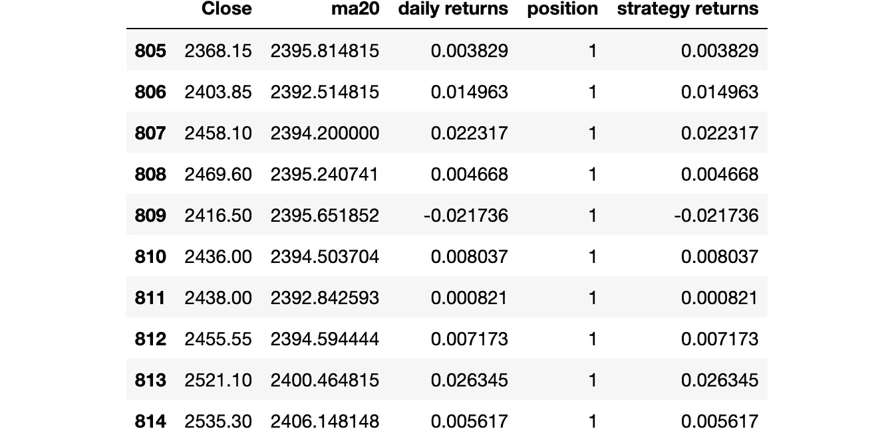
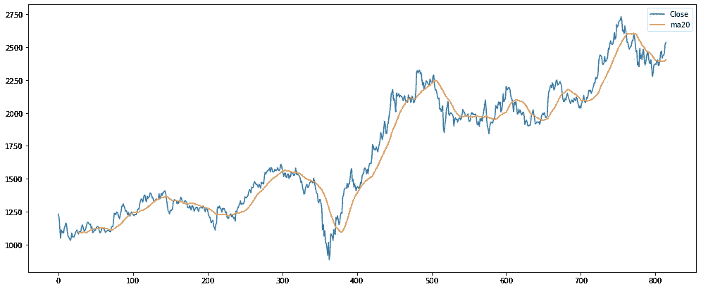
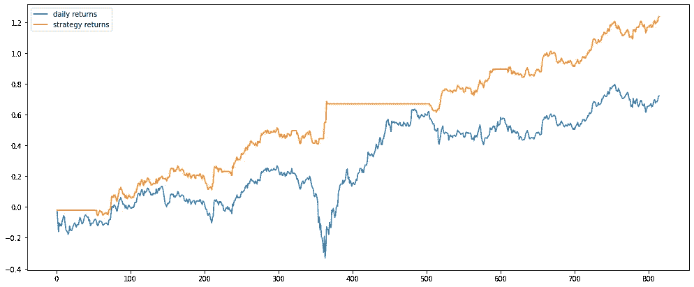

# python 中的算法交易——低买高卖策略回溯测试

> 原文：<https://blog.devgenius.io/algorithmic-trading-backtesting-a-simple-buy-low-sell-high-strategy-in-python-cb1f9692984e?source=collection_archive---------2----------------------->


在 [Unsplash](https://unsplash.com?utm_source=medium&utm_medium=referral) 上由 [Austin Distel](https://unsplash.com/@austindistel?utm_source=medium&utm_medium=referral) 拍摄的照片

## 介绍

在本文中，我将展示如何使用 python 对简单的移动平均策略进行回溯测试。预测股票市场价格极其困难，但是通过转换股票价格变量可以推断出许多真知灼见。在这个例子中，我们探索移动平均线，这是一个很好的动量指标。动量是非常均值回归的，可能会提供低买高卖的机会。

## 步伐

1.  导入必要的库
2.  下载 OHLCV 数据
3.  构建数据框
4.  事件驱动测试
5.  结果
6.  结论

## 第一步。导入必要的库

## 第二步。下载 OHLCV 数据

## 第三步。构建数据框

那么这里的直觉是什么呢？均线是建立动量策略的好方法。如果当前价格高于过去几天的平均价格，这意味着股票被高估，预计会出现修正。同样，当当前价格低于移动平均价格时，股票被低估，可能很快会有一个调整。

所以，这里的策略是当当前价格低于移动平均线时做多。对于这个例子，我们将考虑 27 天移动平均线。

```
Std on daily returns  : 0.0217
Mean on daily returns : 0.0009 

     Close  ma20  daily returns  position
0  1231.70   NaN            NaN         0
1  1205.10   NaN      -0.021833         0
2  1122.25   NaN      -0.071227         0
3  1048.85   NaN      -0.067641         0
4  1109.40   NaN       0.056125         0
5  1090.05   NaN      -0.017596         0
6  1102.10   NaN       0.010994         0
```

## 第四步。事件驱动的回溯测试

在这一步中，对每日数据进行迭代。移动平均数据列用于决定是做多还是做空，它存储在仓位数据列中。



## 第五步。结果



Reliance 每日股价及其 20 天移动平均线



比较每日回报和策略回报

## 第六步。结论

```
Buy and hold returns = 72.19 %
Strategy returns = 123.64 %
```

*   这些股票，如果被购买和持有，将在 800 个工作日内收回初始投资的 72%。
*   该策略获得了初始投资的 125%的回报。
*   请注意，该策略没有实施交易成本，这将完全改变结果
*   如果回溯测试在历史数据上表现良好，并不保证它在未来数据上会给出相同的结果。很明显，通过改变天数，回报可能会有很大差异。这也可能取决于在某个时间段内观察到的总体库存趋势。
*   最好对不相关的股票投资组合实施策略，因为这样可以降低分散投资和对冲的风险。
*   可以优化上述策略，并添加更多的 alpha 和风险度量源，以提高回报、夏普比率并降低风险。

代码片段可以在以下位置找到:[https://github . com/karthikramx/back testing-Buy-Low-Sell-High](https://github.com/karthikramx/Backtesting-Buy-Low-Sell-High)