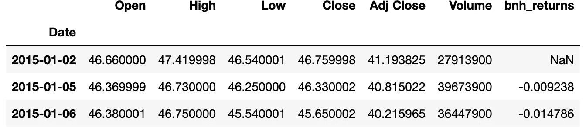
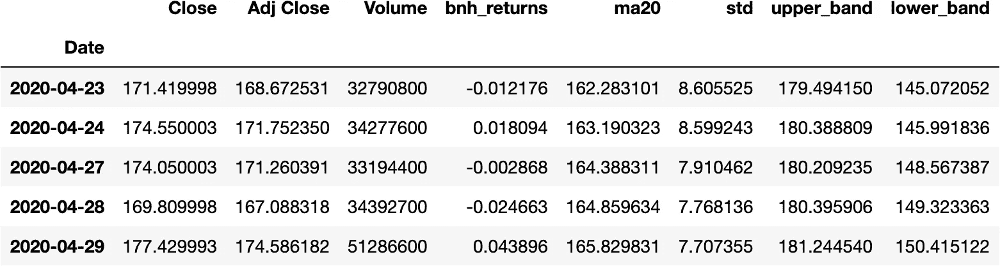
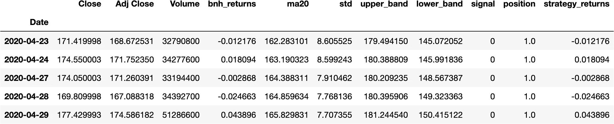
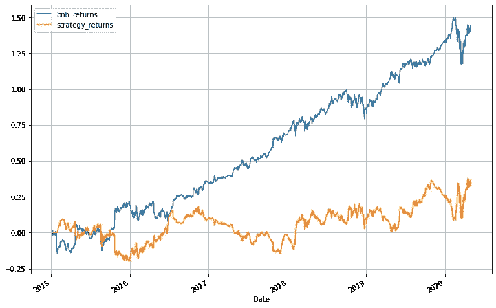
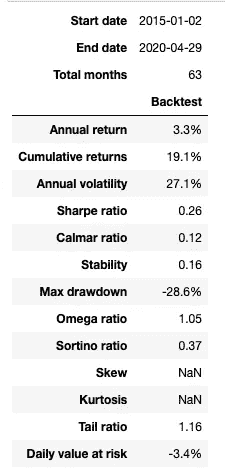
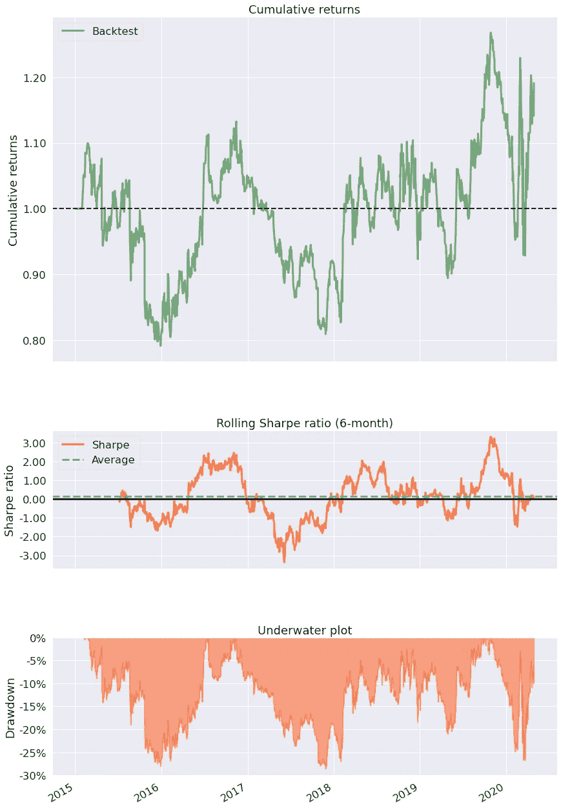

# 算法交易——回测 python 中的策略

> 原文：<https://blog.devgenius.io/algorithmic-trading-backtesting-a-strategy-in-python-3a136be16ece?source=collection_archive---------0----------------------->


马克西姆·霍普曼在 [Unsplash](https://unsplash.com?utm_source=medium&utm_medium=referral) 上的照片

**Intro**
本文的目标是描述如何在 python 上回测基于技术指标的策略。我将特别使用基于布林线的策略来创建信号和位置。

**策略描述**
在调整后的收盘价上创建 20 天(+/- 2 标准差)布林线。当价格从顶部穿过较低波段时买入，并持有直到价格下一次从下方穿过较高波段。当价格从下方穿过上带时卖出，并持有直到价格下一次从顶部穿过下带。

下面是创建你自己的回溯测试代码的步骤。

1.  导入必要的库
2.  下载 OHLCV 数据
3.  计算每日回报
4.  创建基于策略的数据列
5.  创建战略指标
6.  创建信号和位置
7.  分析结果

**步骤 1:导入必要的库**

**第二步:下载 OHLCV:(开盘，高，低，收盘，成交量)数据**
我用雅虎财经 python API — yfinance 来获取数据。有很多资源可以获得历史数据，以便对你的策略进行回溯测试。

```
[*********************100%***********************]  1 of 1 completed
```

**第三步:计算每日回报**
这一步计算每日回报，以便与买入并持有策略进行比较。买入并持有策略成为比较策略的基准。换句话说，它检验策略的表现是否优于简单地买入并持有股票。一个好的策略本质上会比买入并持有策略表现更好。



**第四步:创建基于策略的数据列**
下一步是创建指标来生成策略的条件。对于布林线策略，涉及到 20 天均线，20 天均线的标准差，上波段，下波段的标准差。[ma20，标准，高频段，低频段]



**第五步:创建战略指标**
以下是创建战略最关键的部分。它包括

*   生成策略中提到的多头和空头信号
*   用前向填充替换零，以生成多头和空头头寸
*   将位置移动 1，以表示从一天收盘到第二天收盘价格的回报计算

信号本质上是表示需要采取的行动的指示器(例如:买或卖)。头寸是你在买入或卖出(即做多或做空)后维持的头寸。



**第六步:创建信号和头寸**
下一步是使用累积回报来比较策略表现。
这涉及头寸与日收益的逐元素乘法。

```
Buy and hold returns: 1.4441301364703079
Strategy returns: 0.3712255745848457

<AxesSubplot:xlabel='Date'>
```



**第七步:分析结果**

对于这一步，我使用 pyfolio。Pyfolio 是一个 Python 库，用于金融投资组合的性能和风险分析

```
pf.create_simple_tear_sheet(df['strategy_returns'].diff())
```



投资组合结果



来自 pyfolio 的结果是不言自明的。

历史数据上的“布林线”策略并不比买入并持有策略表现更好。买入并持有的累计日收益占初始投资的 1.44 倍，布林带策略收益占初始投资的 0.37 倍。

出于显而易见的原因，人们不应该采取策略 **live** ，即使它在回溯测试中有很大的回报。这涉及各种风险，如不考虑交易成本和股价动量。

还可以通过检查各种策略参数的回报来优化策略的性能。

各种其他技术指标可以结合使用，以创建可以降低风险和提高性能的信号。实时策略应该执行止损和止损开关，以防策略失控。

这个代码片段可以在以下位置找到:[https://github . com/karthikramx/algorithm-Trading-back testing-python-example](https://github.com/karthikramx/Algorithmic-Trading-Backtesting-python-example)