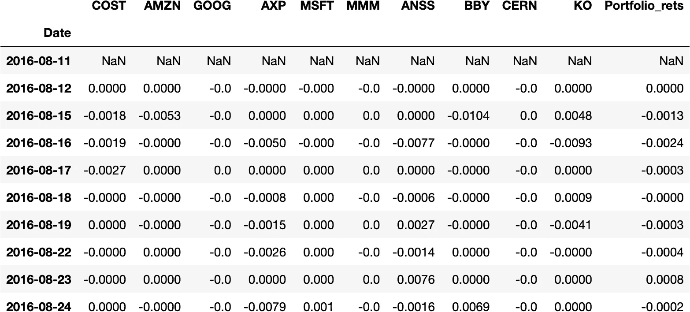
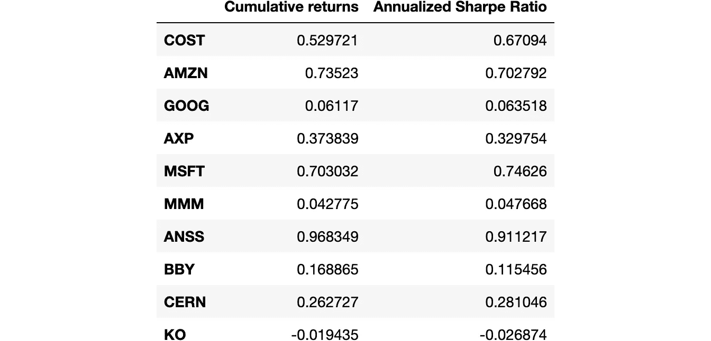
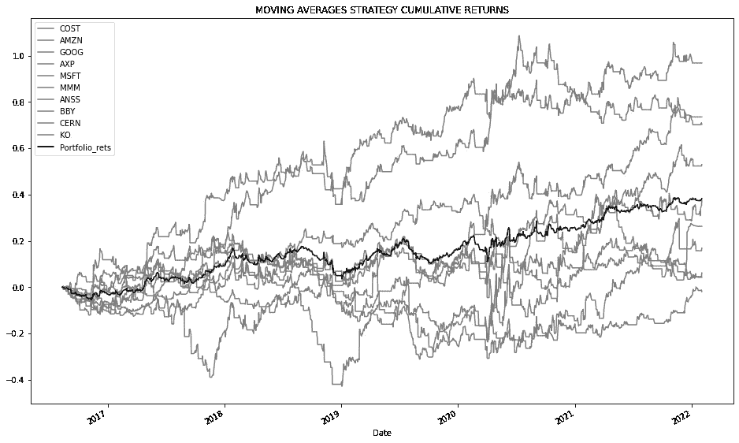

# 算法交易——用 Python 对股票组合进行回溯测试

> 原文：<https://blog.devgenius.io/algorithmic-trading-backtesting-portfolio-of-stocks-in-python-9be75ce9f232?source=collection_archive---------1----------------------->


[斯科特·格雷厄姆](https://unsplash.com/@homajob?utm_source=medium&utm_medium=referral)在 [Unsplash](https://unsplash.com?utm_source=medium&utm_medium=referral) 上拍照

## 介绍

这篇文章描述了如何在股票投资组合上测试你的算法交易策略。投资组合降低了风险，而不仅仅是将一种策略应用于一只股票。优化投资组合可以带来更高的回报，降低整体风险(提高夏普比率)。

我强烈建议您浏览一下我以前的文章，以便更好地理解这篇文章。

*   [用 python 对策略进行回溯测试](/algorithmic-trading-backtesting-a-strategy-in-python-3a136be16ece)
*   [python 中的低买高卖策略回溯测试](/algorithmic-trading-backtesting-a-simple-buy-low-sell-high-strategy-in-python-cb1f9692984e)
*   [优化 python 中的策略](/optimizing-trading-strategies-using-python-ff419f1f3ffb)

## 要遵循的步骤

1.  去拿工具
2.  创建应用于投资组合的必要功能
3.  将策略应用于投资组合股票并建立头寸
4.  结果和图

## 第一步。去拿工具

导入必要的库。Yfinance 用于下载历史 OHLCV 数据。

## 第二步。创建应用于投资组合的必要功能

在这一步中，我们创建了可能需要在所有股票上调用的各种函数。这可能有助于我们以后将这个功能封装到一个类中。(如果需要的话)创建以下函数

*   获取每日数据
*   移动平均策略函数
*   计算累积回报
*   计算年化份额

## 第三步。将策略应用于投资组合股票并建立头寸

在这一步中，我们定义投资组合并迭代其中的股票，依次下载数据并应用移动平均策略。



个人和投资组合策略回报

**第四步。结果和图**

在这一步中，将投资组合的累积回报和年化夏普比率与个股表现进行比较。

从图中可以直观地观察到，与个股表现相比，投资组合几乎没有变化。

单个股票的平均年夏普比率约为 0.38，而投资组合的年夏普比率为 0.72。这表明投资股票组合可以降低风险。

通过使用 CAMP(资本资产定价模型)和 Kelly 标准等各种技术优化投资组合，可以获得更高的回报。

创建性能数据框



个人表现

比较指标:投资组合与个股

```
Cumulative returns                              : 0.382
Annualized Sharpe Ratio                         : 0.384Cumulative returns MA Stretegy                  : 0.382
Annualized sharpe ratio MA Strategy             : 0.719
```



您可以在以下位置找到代码片段:[https://github . com/karthikramx/algorithm-Trading-back testing-Portfolio-of-Stocks-Python](https://github.com/karthikramx/Algorithmic-Trading-Backtesting-Portfolio-of-Stocks-Python)

在你有兴趣应用无监督的机器学习算法来构建股票的多元化投资组合时，我欢迎你在这里阅读我关于它的文章:[https://blog . dev genius . io/creating-a-diversified-stock-portfolio-using-clustering-analysis-aa E5 af 284 B1 f](/creating-a-diversified-stock-portfolio-using-clustering-analysis-aae5af284b1f)