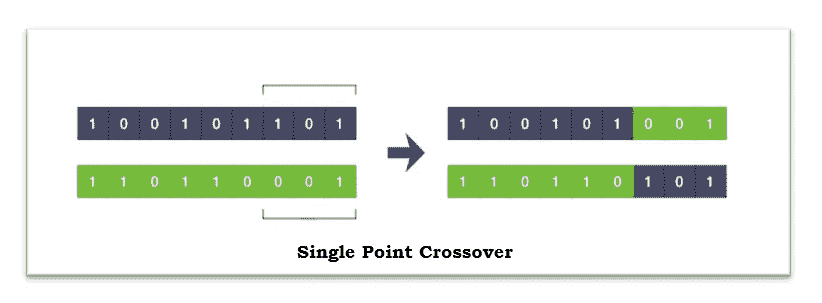

# 算法交易(下)

> 原文：<https://blog.devgenius.io/algorithmic-trading-part-ii-4143ad34c509?source=collection_archive---------9----------------------->

## 使用进化计算进行交易策略的参数优化

这个系列的第一部分可以在这里找到: [***算法交易——一种大众还无法接触到的新奇事物***](https://medium.com/@rai28.avi/algorithmic-trading-a-novelty-still-inaccessible-to-the-masses-39317c0b1c20?source=friends_link&sk=e1bb29d53c25dd4a637b803586435b84) ***。***

**先决条件**:

*   对市场指标和策略有基本的了解
*   关于面向对象编程的基础知识(关于类和对象的基本概念)

我在 Symphony fin tech**担任软件开发实习生期间的工作主要集中在开发一个功能，该功能允许用户根据相关股票的历史数据(回溯测试)的策略表现，为任何给定的基于指标的信号(预定义或用户设计)的理想参数集获得特定于股票的建议。**

对于任何给定的指标，参数值的所有可能组合将意味着处理一个巨大的搜索空间；因此，强行通过该过程意味着缓慢的性能。每个参数的引入将导致搜索空间增加另一个维度，导致运行程序所需的时间随着每次这样的增加而呈指数增加。由于执行时间非常重要，因此为作业训练基于神经网络的模型似乎不符合问题的要求。另外，在这样一个梯度定义不明确的系统中，基于导数的方法被证明是有问题的。遗传算法以巨大的搜索空间和离散的成本函数为这种可修改的问题陈述提供了有效和自适应的方法。

例如:考虑一个本身使用三个参数的指标，从而给出一个三维网格。对于参数集的每个可能的值集，在这个网格中有一个小立方体代表那些值集。如果我们考虑一个小的搜索空间，其中三个参数中的每一个都有 100 的取值范围，那么可能性的总数就是⁰⁶.

我们将在下面讨论遗传算法的概念。为了让您尽可能多地了解该特性的工作原理，我们将介绍用 C#实现的相同内容。如果您对 GA 的概念和该特性的内部工作方式不感兴趣，可以跳过下面的两个部分，直接跳到部署部分，在那里我解释了用户如何访问和使用该特性。

# 遗传算法

遗传算法是进化算法的一个子类，广泛用于优化目的。这些都是受到生物进化现象的启发。这些算法通过模仿繁殖和自然选择的原理来构成搜索和优化过程。因此，了解一点达尔文的进化论就变得至关重要。我们不会深入讨论 GA 的生物学对应性，因为这超出了本博客的范围，但是我们将浏览理解我们的库的这一特性所需的主要概念。

与他们不同，我们算法中的个体不会通过点燃体内的 CFL 来进化。

## 达尔文的进化论

*   在繁殖过程中，父母会将一些特征传递给后代。
*   在有性生殖中，后代的染色体是父母的混合。
*   编码在基因中的特征会传递给后代，并倾向于繁殖到下一代。
*   变异(突变)自然存在于所有产生新特征的物种中。
*   后代的特征部分遗传自父母，部分是在繁殖过程中产生的新基因的结果。
*   经过长时间，变异可以积累并产生新的物种。
*   更健康的个体存活时间更长(自然选择)。
*   自然选择的过程，“选择”出最适应环境的个体。

记住这几点，我们现在可以讨论如何找到解决方案。在搜索空间中，我们关注两种类型的搜索

*   本地搜索
*   全局搜索

顾名思义，前者是一个更保守的搜索过程，主要局限于当前最佳解决方案的周围。在 GA 的上下文中，这是通过使用交叉算子来实现的。后者是跨越整个领域的更全面的搜索过程。这由变异操作符处理。在解释所涉及的操作符以及它们是如何使用的之前，我们需要知道什么是适应度函数。

## 适应度函数

问题陈述中要优化的函数称为目标函数(OF)。使用目标函数导出适应度函数。它被用来评估在该过程中形成的每个个体，并形成自然选择的基础。如果问题陈述涉及最大化 OF，则适应度函数被认为与目标函数相同，即

最大化类型问题的适应度函数

另一方面，如果 PS 涉及 of 的最小化，我们通过考虑 of 的原始值的倒数(在分母上加 1 以说明该函数在某些点上的值为零)将它转换为最大化问题，然后将 OF 的修改值作为适应度函数:

极小化问题的适应度函数

在我们的例子中，我们有一个最大化类型的问题；因此，目标函数可以作为适应度函数。因此，我们可以互换使用这两个术语。虽然我会尽力不去做；).

# 遗传算法的算子

## 选择

这是基于自然选择的原则"*一个更健康的个体有更长的生存时间，也更适应环境*该操作符用于识别当前批次中更有可能对最终解决方案的开发做出贡献的个体(最适合的个体)。基于每个个体的适合度值(从适合度函数获得)对个体进行排名。然后，前几个个体被选择用于进一步的后代形成和保持进化。

基于他们的健康值对个人进行排名。

## 交叉

交叉算子形成了完整的 GA 算法的基础，该算法便于从父母的遗传信息形成后代。它通过简单地交换父母双方的某些部分，用父母的染色体产生孩子的染色体。如果染色体被分成两部分(断点可以在任何地方)并交叉，这被称为单点交叉，如附图所示。有各种各样的方法将染色体分成更多的部分。在 XFinChart 库中，我们使用单点交叉。

LHS 上的数字描绘了亲代染色体，RHS 代表了杂交后产生的相应后代。

## 变化

变异算子通过对交叉产生的后代进行一些改变来为下一代提供独特性。它照顾到达尔文理论中提到的'*变异*的概念。这确保了后代的属性不仅仅局限于他们父母所拥有的特征。实现变异算子有多种方法，即随机复位、交换、置乱等。在 XFinChart 库中，我们利用随机重置突变，这涉及到改变染色体的随机基因。

通过使用随机重置突变来修改基因，染色体被突变。

交叉和变异算子有助于实现搜索空间的遍历，以寻找最适合的解决方案。它以提高解决方案质量(适合度值)的方式进行。

因为我们已经讨论了继续讨论所需的大部分主题，所以我们可以在问题陈述中贯彻 GA 的应用。我们将从制定 PS 开始。

注意:你可能会在博客中多次遇到“信号”这个词。我所说的信号是指涉及一个指标的交易策略的执行。

**问题陈述:**给定一个基于指标的市场策略，优化信号的参数值，以最大化根据历史数据对策略进行回溯测试所获得的利润。

(稍后，我们将讨论将交易的其他统计项与利润一起纳入目标函数。)

# 履行

GA 环境中的群体包括需要调整的一组变量，以便最大化适应度函数。

例如，在移动平均线交叉策略中，参数是长期和短期移动平均线的时间周期。因为我选择了一个只包含两个参数的策略，所以网格是二维的。每增加一项，我们的搜索空间就会增加一个维度。

群体中的每个个体都涉及一组参数值；在 GA 术语中，这种表示被称为染色体，而单个组件被称为基因。将其可视化为一个值数组，每个值对应于指标的一个参数。这种表示允许我们将一个点从 n 维空间转换到 1 维结构。每个这样的数组都指向 n 维搜索空间中的一个特定点。我们首先需要定义一个随机选择的群体，并将其提供给算法来播种流程，如下面的代码片段所示。读者不必担心片段的最后一行。它只是给参数分配一个随机的允许值。

相邻的代码片段显示了算法如何计算个体的适应值。方法分别使用 RunBackTesting 和 FitnessValue 计算总体回测统计量和最终的适应值。您可能不理解该函数的确切工作方式，但我会尝试告诉您它实际打算执行什么。

OptimizationDetail 类是 XFinChart 库的固有类，它存储关于特定参数的信息，这有助于定义优化过程中使用的搜索空间的限制。TSOptimizationInfo 是一个存储信息的类，例如指示器的参数列表和定义完整 GA 算法设置所需的各种其他信息。这些类的对象在 ComputePopulationFitness()函数中使用。

该过程的第一步(有效地)包括基于它们的适应值(通过使用包含在基因中的参数值计算适应函数获得)对所有染色体进行排序。确定固定数量的最适合的染色体，从而形成交配池。这个数字是由用户设置的保留率捕获的(不要担心，稍后也会解释)。它决定了来自交配群体的新一代的比例。剩下的来自繁殖(交叉+变异)的后代。交配群体中的个体将作为下一代的父母。

下一步包括利用交配池中的染色体形成后代。因此，交叉算子开始发挥作用，它使用亲代染色体的遗传编码产生后代。交配池中的个体在这一步中充当父母。在库中实现了单点杂交(涉及染色体的两个相等部分)。

如果你有一点分析优化过程或数据分析的经验，你肯定会很清楚全局最大值/最小值和局部最大值/最小值的概念。但对其他人来说，前者是你需要一个算法来实现的决定性点，而后者只是搜索空间中其他地方的某个点，这可能会给出到达所需点的错误警报。因此，为了避免收敛到局部最大值，下一步变得越来越重要。变异算子的实现确保了算法继续探索未知的领域，寻找更好的解集的可能性。随机重置突变的程序指示我们使用交叉获得一组早期产生的染色体，并从中随机改变一些基因。

在相邻的片段中，随机基因、随机染色体的值根据参数的允许范围被重新分配为随机值。要突变的染色体数量取决于另一个可定制的变量，称为突变率，它决定了要突变的后代(通过交叉生成)的百分比。

我们现在附加上来自交配池和突变的结果种群集。这标志着一代人过程的结束，从而为我们提供了一个新的种群。

同样的过程被一次又一次地应用于新形成的群体，因此每次都产生新的一代。在每一代的这个完整过程中，算法试图使用操作符找到最优的染色体。经过一定数量的代后，最佳拟合染色体的适应值变得恒定，表明算法已经达到了最大值。

# 部署

为了成功的部署，我们需要适当地设置一组变量，以确保我们得到期望的结果。这些是从你打算访问遗传算法类的地方开始设置的。

应该通过在 filename 变量中指定完整路径来加载包含数据的数据文件。如果文件与用户当前运行的程序位于同一文件夹中；确切的文件名可以单独使用。

接下来，我们需要将文件中的数据加载到一个数据结构中，该数据结构可以很容易地用于进一步的操作。TimeDataSeries 类为这项工作提供了理想的数据结构。它还根据用户的要求向用户提供各种选项，如杆压缩类型、杆类型等。代码片段的第二行将数据(以 OHLCVO 列的形式)加载到上述类的对象中。

用户需要配置他们形成的策略。在 *StrategyConfigData* 类中有定制任何此类策略配置参数的选项。其中一些描述如下。另一个这样的参数是' *OrderExecutionAt'* ，通过它用户可以设置交易是必须在当前棒线的*收盘*时发起还是在下一个棒线的*开盘*时发起。有许多这样的选项供用户配置他们的策略。您可以简单地通过这个类的对象来设置这些参数中的任何一个。

接下来，用户需要设置工具细节，其中用户提供关于相关股票的信息。它由一个特定于证券的唯一 ID 组成，设置证券交易的交易所、数据的单位大小和到期时间。

现在，用户需要使用下面的代码注册要在*信号注册管理器*中使用的信号。此外，信号名称需要单独指定。在代码中，我们使用名为 TestSignal 的双 EMA 交叉信号。

如果您已经直接进入部署部分，那么您需要知道 OptimizationDetail 类是 XFinChart 库的固有类，它存储关于特定参数的信息，这有助于定义优化过程中使用的搜索空间的限制。TSOptimizationInfo 是一个存储信息的类，例如指示器的所有参数列表以及定义完整 GA 算法设置所需的各种其他信息。下一个片段描述了如何设置它。在 OpmizationDetail 对象中存储参数信息时，数据的顺序应该是参数名、其允许范围的下限、其允许范围的上限、增量值。增量值存储允许值的精度。例如:如果参数只能取整数值，那么它应该设置为 1，如果参数的范围是[5，100]并且值可以是 5，5.1，5.2，…..则增量值将被设置为 0.1，依此类推。因此，增量值参数期望值为 1/0.1/0.01/…等等，这取决于需求。

然后，存储参数细节的这些对象中的每一个都作为优化变量被添加到 TSOptimizationInfo，这意味着 GA 程序将运行以获得这些参数的最优集合。请注意，如果没有作为优化变量添加到 TSOptimizationInfo 类的对象中，该参数将不会被考虑用于流程。

用户打算在 OF 中灌输的统计变量以下列方式指定。为了在目标函数中设置一个基于范围的项，也就是说，如果用户要求某个统计数据在一个特定的范围内，那么必须同时提供上限和下限，如代码片段的第二行所示。对于 of 中的最小化/最大化术语，只需指定名称。

现在，用户必须设置的最终配置是核心 GA 参数，之后我们只需要运行算法，这非常简单，可以通过下面的代码清楚地理解。如果对这些参数的定义有疑问，请参考前面章节中提到的理论。

现在，在程序完成运行之后，程序将给出关于算法已经实现的最终结果的信息，例如，of 中包括的项的值和信号的参数值的推荐集合。现在 XFinChart 库还允许你进入一个更小更集中的搜索空间，这可能有助于你进一步的分析。要获得压缩的搜索空间，请提供下一个代码片段中描述的命令。

## 什么进一步？

在我们遇到的大多数 GA 应用中，期望的结果是我们最终使适应度函数给出最大值(提醒:即使最小化类型 PS 也转换成这种形式)的点。但是在我们的上下文中，我们发现在算法运行的过程中，算法遇到多个这样的染色体，这些染色体具有不同的基因，这些基因具有等于最大适应值的适应值或者接近最大适应值。在开发这个特性时，我们的唯一意图不仅仅是为分析师提供搜索空间中的一个点，这给了我们这个值，而且我们还对找出所有遇到的具有良好适合值的点感兴趣。这为分析师提供了一个更集中的搜索空间，去除了许多噪声，从而允许分析师在这个压缩的搜索空间上进行个性化的额外分析。这种缩减的程度可能是巨大的，特别是在分析师运行复杂算法或使用具有多个参数的指标导致搜索空间容纳一百万个点的情况下，从而导致系统的过程繁重、繁琐且耗时。该功能将使流程在更短的时间内运行，从而提高效率。

这个系列的第一部分可以在这里找到: [***算法交易——一种大众还无法接触到的新奇事物***](https://medium.com/@rai28.avi/algorithmic-trading-a-novelty-still-inaccessible-to-the-masses-39317c0b1c20?source=friends_link&sk=e1bb29d53c25dd4a637b803586435b84) ***。***

要了解更多关于设计指标或使用 XFinChart 库中预定义模板的信息，请浏览以下 [**博客**](https://medium.com/@aniket.mishra1203/xfinchart-charting-library-an-introduction-part-1-6429dd0ac2b8) **。**

谢谢！