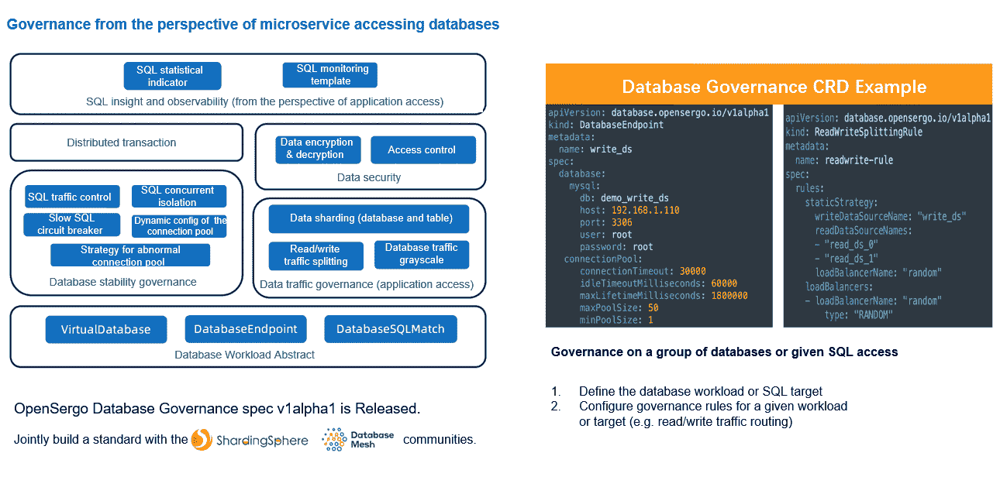

# 阿里云的 OpenSergo & ShardingSphere 发布了面向微服务的数据库治理标准——结合了 Database Plus 和 Database Mesh 概念

> 原文：<https://blog.devgenius.io/alibaba-clouds-opensergo-shardingsphere-release-database-governance-standard-for-microservices-c5964db01499?source=collection_archive---------8----------------------->

# 背景

近日，[阿里云](https://us.alibabacloud.com/?utm_key=se_1007722888&utm_content=se_1007722888&gclid=Cj0KCQiAyMKbBhD1ARIsANs7rEE71bHtu1aPbMS_E5-awHyWwTtyRn8CfmMU0qD1eH2hKSVEIDxcxaIaAuAVEALw_wcB)的 [OpenSergo](https://opensergo.io/) 和 [ShardingSphere](https://shardingsphere.apache.org/) 联合发布了微服务的数据库治理标准。通过结合[数据库加](https://medium.com/faun/whats-the-database-plus-concepand-what-challenges-can-it-solve-715920ba65aa?source=your_stories_page-------------------------------------)和[数据库网格](https://medium.com/faun/shardingsphere-database-mesh-4ad75bf4bac8?source=your_stories_page-------------------------------------)概念，这两个社区已经标准化了现有的数据库治理概念、模式和路径，进一步完善了云原生环境下的数据库治理生态系统。



***两个社区的创始人都表达了他们对 ShardingSphere 社区和 OpenSergo 社区合作的看法:***

**张亮，Apache ShardingSphere 社区的 PMC 主席:**

在微服务领域，服务之间的交互和协作已经逐渐完善，但是服务访问数据库仍然没有有效的标准。作为 Being，ShardingSphere 一直遵循着**“连接、增强和可插拔”**的设计理念。“连接”是指提供标准化的协议和接口，打破开发语言访问异构数据库的壁垒。OpenSergo 提出面向微服务的治理标准，并主动将数据库访问纳入标准，这是很有前瞻性的。我很高兴看到 ShardingSphere 和 OpenSergo 合作建立微服务标准，这是访问数据库的一个关键入口。

**OpenSergo 社区创始人赵艺豪:**

在微服务治理中，除了微服务本身的治理，处理微服务对数据库的访问也是保证业务可靠性和连续性的关键一步。作为数据库治理领域的顶级项目，ShardingSphere 集成了大量的最佳实践和技术经验，这是对 OpenSergo 的补充。在此背景下，我们与 ShardingSphere 社区合作，从微服务的角度共同构建数据库治理标准，让企业对不同的数据层框架和流量进行统一规范的治理和管理。

> ***注:*** *本文中的数据库治理包括微服务系统中数据库治理的各个方面。所有的业务信息和关键数据都需要一个健壮稳定的数据库系统，因为它是最重要的国家终端。*

# 数据库在微服务系统中越来越重要

为了满足灵活的业务需求，应用程序架构可以从单片转变为面向服务，然后再转变为面向微服务。在这种情况下，用于存储核心数据的数据库成为分布式系统的焦点。

企业利用微服务分离服务，采用分布式架构，实现多个服务间的松耦合、服务的灵活调整和组合、系统的高可用性。特别是，面对快速变化的业务，微服务确实带来了巨大的好处。

但是，服务分离后，其对应的底层数据库也应该分离，以确保每个服务的独立部署。这样，每个服务都可以是一个独立的单元，最终实现微服务。在这种情况下，数据库变得越来越复杂:

*   从单片到面向微服务的架构模式的转变，导致服务日益复杂，需求多样化，基础设施规模更大，服务之间的调用关系复杂，对底层数据库性能的要求更高。
*   不同的事务通常涉及多个服务，但是确保服务之间的数据一致性是一个挑战。
*   跨多个服务查询数据也很有挑战性。

对于大多数后端应用程序，它们的系统性能改进主要局限于数据库。特别是在微服务环境中，处理数据库性能治理是团队的首要任务。数据库治理自然成为微服务治理不可或缺的一部分。

在数据库治理方面，我们现在主要关注**读/写拆分、分片、影子数据库、数据库发现和分布式事务**。同时，如何使用数据库和实际数据库存储节点依赖于**虚拟数据库和数据库端点**。

针对上述问题，OpenSergo 和 ShardingSphere 吸取了后者的数据库治理经验，发布了微服务下的**数据库治理标准。通过这样做，他们可以规范数据库治理方法，降低该领域的准入门槛，提高微服务的业务适用性。**

# ShardingSphere 的数据库流量治理策略

1.  **虚拟数据库**

在数据库治理中，无论是读/写分割、分片、影子数据库还是加密、审计和访问控制，它们都必须作用于特定的数据库。这里这样的逻辑数据库称为虚拟数据库，即 virtual database。

从应用的角度来看，虚拟数据库是指一组特定的数据库访问信息，可以通过绑定相应的治理策略来实现治理能力。

**2。数据库端点**

在数据库治理中，虚拟数据库声明逻辑数据库对应用程序可用，但实际上，数据存储依赖于物理数据库。这里称为数据库访问端点，即 DatabaseEndpoint。

DatabaseEndpoint 对应用程序来说是不可感知的。只能通过特定的治理策略绑定到 VirtualDatabase，然后连接使用。

**3。读写拆分**

读/写拆分是一种常用的数据库扩展方法。主数据库用于事务性读/写操作，而辅助数据库主要用于查询。

**4。碎片**

数据分片是一种基于数据属性的扩展策略。一旦计算出数据属性，请求就被发送到特定的数据后端。目前，分片由分片键分片和自动分片组成。使用分片键的分片需要指定要分片的表或列以及用于分片的算法。

**5。加密**

为了满足审计安全性和合规性的要求，企业需要为数据存储提供严格的安全措施，如数据加密。

数据加密解析用户输入的 SQL，并根据用户提供的加密规则重写 SQL。

通过这样做，明文数据可以被加密，明文数据(可选)和密文数据都可以存储在底层数据库中。

当用户查询数据时，加密只是从数据库中取出密文数据，解密，最后将解密后的原始数据返回给用户。

**6。影子**

影子数据库可以在灰度环境或测试环境下接收灰度流量或数据测试请求，结合影子算法灵活配置多种路由方式。

**7。数据库发现**

数据库自动发现可以根据数据库的高可用性配置来检测数据源状态的变化，然后相应地调整流量策略。

例如，如果后端数据源是 [MySQL](https://www.mysql.com/) MGR，您可以将数据库发现类型设置为 MySQL。MGR，指定`group-name`并配置相应的心跳间隔。

**8。分布式交易**

它可以声明与分布式事务相关的配置。用户无需额外配置即可声明交易类型。

# 数据库治理示例

```
# Virtual database configuration
apiVersion: database.opensergo.io/v1alpha1
kind: VirtualDatabase
metadata:
  name: sharding_db
spec:
  services:
  - name: sharding_db
    databaseMySQL:
      db: sharding_db
      host: localhost
      port: 3306
      user: root
      password: root
    sharding: "sharding_db"  # Declare the desired sharding strategy.
---
# The database endpoint configuration of the first data source
apiVersion: database.opensergo.io/v1alpha1
kind: DatabaseEndpoint
metadata:
  name: ds_0
spec:
  database:
    MySQL:                 # Declare the backend data source type and other related information.
      url: jdbc:mysql://192.168.1.110:3306/demo_ds_0?serverTimezone=UTC&useSSL=false
      username: root
      password: root
      connectionTimeout: 30000
      idleTimeoutMilliseconds: 60000
      maxLifetimeMilliseconds: 1800000
      maxPoolSize: 50
      minPoolSize: 1      
---
# The database endpoint configuration of the second data source
apiVersion: database.opensergo.io/v1alpha1
kind: DatabaseEndpoint
metadata:
  name: ds_1
spec:
  database:
    MySQL:                              # Declare the backend data source type and other related information.
      url: jdbc:mysql://192.168.1.110:3306/demo_ds_1?serverTimezone=UTC&useSSL=false
      username: root
      password: root
      connectionTimeout: 30000
      idleTimeoutMilliseconds: 60000
      maxLifetimeMilliseconds: 1800000
      maxPoolSize: 50
      minPoolSize: 1
---
# Sharding configuration
apiVersion: database.opensergo.io/v1alpha1
kind: Sharding
metadata:
  name: sharding_db
spec:
  tables: # map[string]object type
    t_order:
      actualDataNodes: "ds_${0..1}.t_order_${0..1}"
      tableStrategy:
        standard:
          shardingColumn: "order_id"
          shardingAlgorithmName: "t_order_inline"
      keyGenerateStrategy:
        column: "order_id"
        keyGeneratorName: "snowflake"
    t_order_item:
      actualDataNodes: "ds_${0..1}.t_order_item_${0..1}"
      tableStrategy:
        standard:
          shardingColumn: "order_id"
          shardingAlgorithmName: "t_order_item_inline"
      keyGenerateStrategy:
        column: order_item_id
        keyGeneratorName: snowflake
  bindingTables:
  - "t_order,t_order_item"
  defaultDatabaseStrategy:
    standard:
     shardingColumn: "user_id"
     shardingAlgorithmName: "database_inline"
  # defaultTableStrategy: # Null means none 
  shardingAlgorithms: # map[string]object type
    database_inline:
      type: INLINE    
      props: # map[string]string type
        algorithm-expression: "ds_${user_id % 2}"
    t_order_inline:  
      type: INLINE    
      props:
        algorithm-expression: "d_order_${order_id % 2}"      
    t_order_item_inline:
      type: INLINE    
      props:
        algorithm-expression: "d_order_item_${order_id % 2}"
  keyGenerators: # map[string]object type
    snowflake:
      type: SNOWFLAKE
```

# 关于 Apache ShardingSphere

[Apache ShardingSphere](https://shardingsphere.apache.org/) 是一个分布式数据库生态系统，可以将任何数据库转换为分布式数据库，并通过分片、弹性伸缩、加密等特性增强它&。

Apache ShardingSphere 遵循 Database Plus 概念，旨在在分散的异构数据库之上构建一个生态系统。它侧重于如何充分利用数据库的计算和存储能力，而不是创建一个全新的数据库。它更重视多个数据库之间的协作，而不是数据库本身。

🔗 [**Apache ShardingSphere 有用链接**](https://linktr.ee/ApacheShardingSphere)

# 关于 OpenSergo

[OpenSergo](https://opensergo.io/) 是一个开放的通用服务治理规范，面向分布式服务架构，覆盖全链路异构生态系统。

它是基于行业的服务治理场景和实践形成的。OpenSergo 最大的特点是用一套统一的配置/DSL/协议定义服务治理规则，面向多语言异构架构，实现全链路生态覆盖。

无论微服务语言是 Java、Go、Node.js 还是其他某种语言，也无论是标准微服务还是基于 Mesh 的访问，开发者都可以使用同一套 OpenSergo CRD 标准配置。

这使得开发人员可以对每一层实施统一的治理和控制，从网关到微服务，从数据库到缓存，从服务的注册和发现到配置。

↓↓[**OpenSergo GitHub**](https://github.com/opensergo/opensergo-specification)