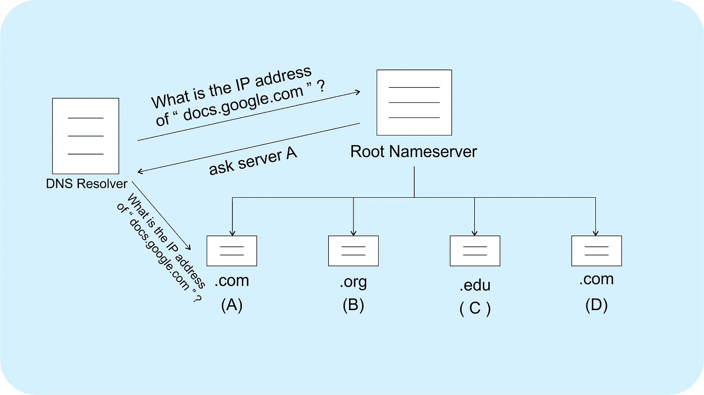
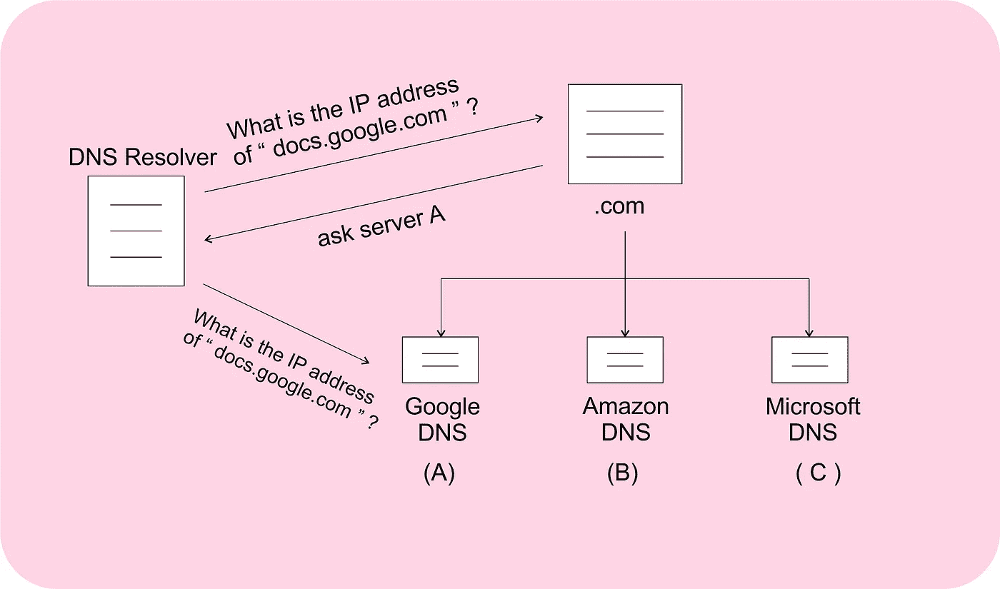
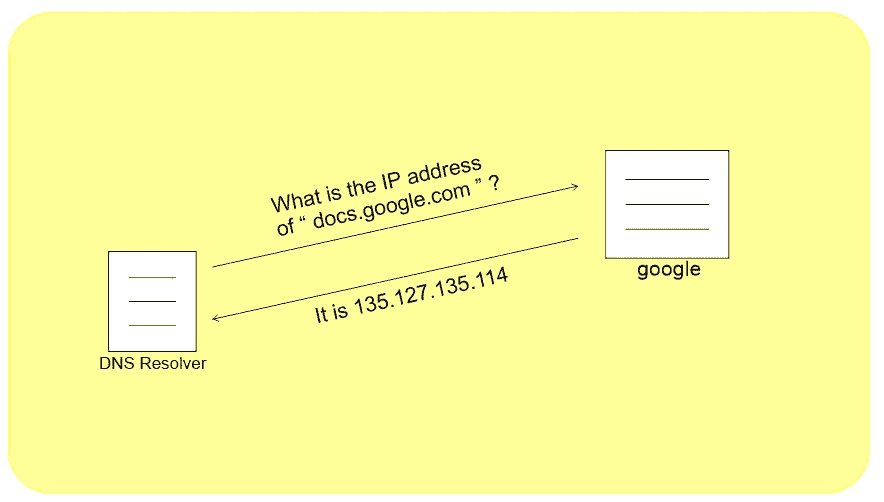

# 关于 DNS 层次结构的所有信息

> 原文：<https://blog.devgenius.io/all-about-dns-hierarchy-36fabfcdc1f1?source=collection_archive---------2----------------------->

照片由[乔丹·哈里森](https://unsplash.com/@jordanharrison?utm_source=medium&utm_medium=referral)在 [Unsplash](https://unsplash.com?utm_source=medium&utm_medium=referral) 上拍摄

可能我们都知道这样一个事实:每当我们试图访问 something.com 时，这个“something . com”必须被转换成一个类似“103.217.135.125”的 IP 地址，这样我们的浏览器，比如 Chrome，才能知道要联系哪个服务器。

在本帖中，我们将讨论从“something.com”到“103.217.135.125”的转换是如何发生的。

# DNS 缓存

所以，你打开任何一个网络浏览器，比如 Chrome，搜索“docs.google.com”。众所周知，要显示“docs.google.com”上的内容，您的浏览器需要知道服务于“docs.google.com”域名的服务器的 IP 地址。在第一步，你的电脑在本地(你自己的电脑)的 DNS 缓存中查找是否已经存储了“docs.google.com”的 IP 地址。每当你试图访问一个域名时，比如“docs.google.com ”,你的电脑就会通过我们将要讨论的 DNS 查询找到相应的 IP 地址，并将该 IP 地址存储在它的**本地 DNS 缓存**中一段预定义的时间，之后它就会被删除。您可能在不久前访问过“docs.google.com ”,其 IP 地址在本地缓存中可用，在这种情况下，您的浏览器将简单地从您的本地 DNS 缓存中获取 IP 地址，我们就完成了。

但是，假设本地缓存没有存储“docs.google.com”的 IP 地址，现在怎么办？在这种情况下，你的电脑会联系你的 [ISP](https://whatismyipaddress.com/isp) 的**递归 DNS 解析器**。这个 DNS 解析器的目的是给你任何域名的 IP 地址，比如“docs.google.com”。如果 DNS 解析器已经知道它自己的本地缓存中的答案(在过去为您的 ISP 的另一个用户或您服务时存储的)，它将简单地返回您想要的 IP 地址。然而，在另一种情况下，它将执行一个 **DNS 查询**并获取您想要的 IP 地址。

> 使用 ISP 的 DNS 解析器是可选的，你可以随时使用任何公开可用的 DNS。通过在网络设置中将 DNS 设置为“8.8.8.8”并将二级 DNS 设置为“8.8.4.4”，可以使用谷歌的 DNS 解析器。

# DNS 查询

当您的 ISP 的 DNS 解析器不知道与某个域相关联的 IP 地址时，它会向**权威 DNS 服务器层级**发出 **DNS 查询**。这个 DNS 层次结构肯定会知道与互联网上任何可用域相关联的 IP 地址，因为任何组织(比如 Google)使用的每个域都必须向互联网注册商之一注册。互联网注册服务商(如 [MarkMonitor](https://clarivate.com/markmonitor) )可以被视为 ICANN 认可的域名批发商，他们与感兴趣的组织(如本案例中的谷歌)进行沟通，并通过注册管理执行机构(如 [Verisign](https://en.wikipedia.org/wiki/Verisign) )将适当的 **DNS 记录**输入所需的 **TLD 注册管理机构**。现在，当 google.com 的 DNS 记录就绪时，可以进行 DNS 查询来获得所需的 IP 地址。在这篇文章的其余部分，我们将理解这个 DNS 查询是如何工作的。

## 顶级域名

任何像“docs.google.com”这样的域名都是由称为域的不同组件组成的，例如，“com”、“google”和“docs”是“docs.google.com”的组成域。最右边的域名(com)是**顶级**域名，之后是**二级域名** (google)，然后是**域名** (docs)。这种结构可以用二级子域名、三级子域名等等无限扩展，但是由于大型域名难以记忆，它们失去了意义，因为在这种情况下记忆 IP 地址可能实际上更容易。

顶级域名(或 TLD)可分为两组，**国家代码 TLD**(或 ccTLDs)和**通用 TLD**(或 gTLDs)。ccTLDs 是为特定国家保留的顶级域名，例如。在(印度)。英国(uk)或。jp(日本)。另一方面，gTLDs 是通用顶级域名，如。com，。edu。org，或者。net，任何人都可以使用。

这些顶级域名由**互联网名称与数字地址分配机构** **(ICANN)** 进行全球维护。每个顶级域名都有自己的一套域名服务器，有助于 DNS 解析。例如，有一组域名服务器需要解决”。com”域名**只有**，而另一组域名服务器将解析**只有**。org”域名。

> 可用顶级域名的设置不是静态的，ICANN 定期注册新的名称空间。在这里，您可以找到所有可用顶级域名的[列表。](https://data.iana.org/TLD/tlds-alpha-by-domain.txt)

## 根名称服务器

这些“顶级域名服务器”之上的一级是**根域名服务器**。这些根域名服务器的唯一目的是了解哪些顶级域名服务器可以解析特定的 TLD。因此，如果有人联系这些根域名服务器来解析“google.com”或“amazon.in”，根域名服务器可以将他们引向”。com”和”。在“名称服务器”中。因此，为了解析任何域名，DNS 解析器将联系最近的根域名服务器之一，并且将发生以下过程。

> 有 1000 多个根域名服务器，仅使用 13 个地址标签，分布在全球不同的位置。每个地址标签可以被认为是一对 IPv4 和 IPv6 地址，并且指向共享该标签的根名称服务器的集群。这些根域名服务器由各种组织管理，如美国国家航空航天局、美国陆军(研究实验室)和互联网系统联盟等。以下是 [13 个根域名服务器 IP](https://www.iana.org/domains/root/servers)的列表。

## DNS 解析

现在，我们可以说，我们已经解决了顶级域名，我们知道该向哪个服务器请求所有的”。请注意，这个过程到目前为止对所有的域名都是一样的。com”域名，如“google.com”、“amazon.com”等。现在我们将看到如何进一步解决二级域名，在我们的示例“docs.google.com”中是“google”。虽然 ICANN 管理顶级域名，但二级域名由拥有它们的组织管理，例如，谷歌管理“google.com”，而亚马逊管理“amazon.com”和“amazon.in”。如今，大多数组织都有自己的二级域名，不像顶级域名在不同组织之间共享。此外，所有的组织都需要有一个私有或共享的 DNS，为什么？我们一会儿再讨论。

每当一个组织，例如谷歌，想要使用一个域名提供服务，比如“google.com ”,它必须向 ICANN 注册该域名。我们可以说，经过一个法律程序，ICANN 将注册谷歌名称服务器的 IP 地址与所有"。com "名称服务器。本次注册后，所有的”。名称服务器将知道谷歌的 DNS 的 IP 地址(不是“8.8.8.8 ”,它是一个 DNS 解析器),因此可以解析域“google.com”或子域“docs.google.com”。二级域名将像这样解析，

> 要使用“google.in”，谷歌必须向 ICANN 注册为”。在“名称服务器。

太好了！！所以，在寻找“docs.google.com”的同时，我们终于到达了谷歌自己的域名服务器(或 DNS)。如今，大多数组织在其生态系统中管理单个根域(“google.com”)和多个子域(“docs.google.com”或“mail.google.com”)。组织的 DNS 将知道与所有这些子域相关联的 IP 地址，因此我们的 DNS 解析之旅的最后一步将是，

现在，当 DNS 解析器知道“docs.google.com”的 IP 地址时，它会在本地内存中缓存相同的地址一段预定义的时间，称为 TTL(生存时间)，然后将 IP 地址返回到您的计算机。注意，这个 TTL 周期是由域名所有者指定的(在“docs.google.com”的情况下是 Google)。您的计算机还会在相同的 TTL 期间将 IP 地址保存在自己的本地缓存中。这样，如果你经常访问同一个域名，它的加载速度会比其他用户很少访问的域名快一些。

我将在这里结束这个已经很大的帖子，感谢您的阅读。别忘了给点掌声(出自 **50** )。