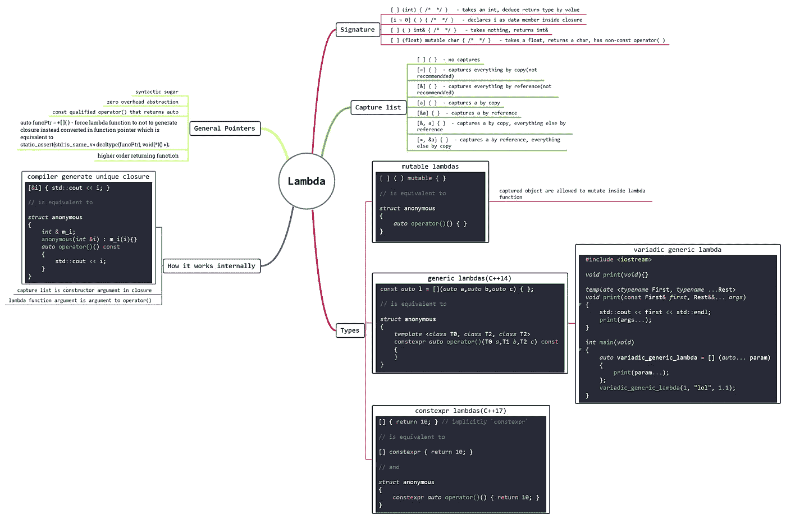
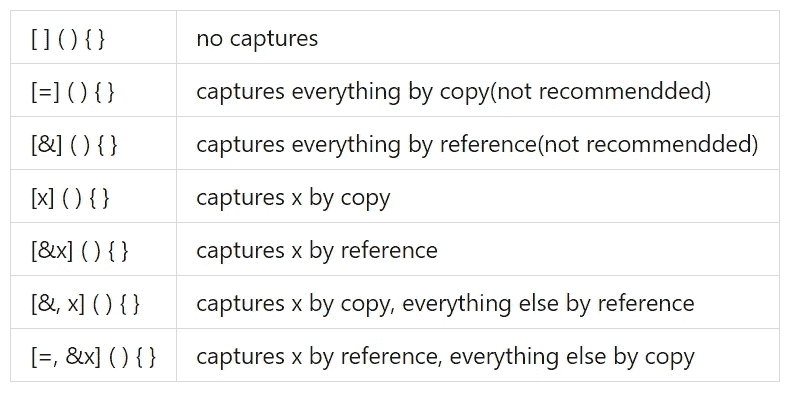

# 关于 C++中 Lambda 函数的所有内容(从 C++11 到 C++20)

> 原文：<https://blog.devgenius.io/all-about-lambda-function-in-c-e3addcc93fa7?source=collection_archive---------0----------------------->



Lambda 函数是[现代 C++](http://www.vishalchovatiya.com/21-new-features-of-modern-cpp-to-use-in-your-project/) 在 C++11 中引入的一个相当直观的概念。在这里，我们不仅会看到 C++中的 Lambda 函数的例子，还会看到它在内部是如何工作的。这篇文章的标题有点误导，因为 Lambda 并不总是被合成以精确地发挥其表达式的功能。但为了简单起见，我一直保持这种方式。所以从现在开始，我将交替使用 Lambda 函数&表达式。

我还创建了一个 Lambda 表达式的思维导图，你可以在上面看到(如果你看不到，可以在新标签页打开)。

这是我的[博客](http://www.vishalchovatiya.com/learn-lambda-function-in-cpp-with-example/)的交叉帖子。

# 什么是 Lambda 函数？

Lambda 函数是一小段代码，它

*   不值得命名(未命名、匿名、一次性等。无论你怎么称呼它)，
*   并且通常不被重复使用。

换句话说，就是句法糖而已。Lambda 函数语法定义为:

```
[ capture list ] (parameters) -> return-type  
{   
    method definition
}
```

*   通常，Lambda 函数的返回类型是由编译器自己评估的，我们不需要明确指定尾部返回类型，即`-> return-type`。
*   但是在一些复杂的情况下，编译器无法推导出返回类型，我们需要指定。

# 为什么我们应该使用 Lambda 函数？

C++包括许多有用的通用函数，如`std::for_each`，非常方便。不幸的是，它们使用起来也很麻烦，尤其是当你想要应用的函子是特定函数所独有的时候。以下面的代码为例:

```
struct print
{
    void operator()(int element)
    {
        cout << element << endl;
    }
};int main(void)
{
    std::vector<int> v = {1, 2, 3, 4, 5};
    std::for_each(v.begin(), v.end(), print());
    return 0;
}
```

*   如果你只在特定的地方使用一次`print`,那么仅仅为了做一些琐碎的一次性的事情而写一整个类似乎有些矫枉过正。
*   然而，对于这种情况，内联代码会更合适&这可以通过如下 Lambda 函数来实现:

```
std::for_each(v.begin(), v.end(), [](int element) { cout << element << endl; });
```

# Lambda 函数内部是如何工作的？

```
[&i] ( ) { std::cout << i; }// is equivalent tostruct anonymous
{
    int &m_i;
    anonymous(int &i) : m_i(i) {}
    inline auto operator()() const
    {
        std::cout << m_i;
    }
};
```

*   编译器为每个 Lambda 函数生成唯一的闭包。秘密泄露了。
*   捕获列表将成为闭包中的构造函数参数。如果您将参数捕获为值，那么在闭包内会创建相应的类型数据成员。
*   你甚至可以在 Lambda 函数参数中声明变量/对象，这将成为`operator()`的参数。

# 使用 Lambda 函数的好处

*   零成本抽象。是啊！你没看错。它不会影响你的性能&和正常功能一样快。
*   代码变得紧凑、结构化和有表现力。

# C++中的 Lambda 函数及实例

## 捕捉对象

```
int main()
{
    int x = 100, y = 200; auto print = [&]() { // Capturing object by reference
        std::cout << __PRETTY_FUNCTION__ << " : " << x << " , " << y << std::endl;
    }; print();
    return 0;
}
```

输出:

```
main()::<lambda()> : 100 , 200
```

*   如上所述，我们在捕获列表中提到了`&`，它捕获变量`x` & `y`作为参考。类似地，`=`表示通过值捕获，这将在闭包内创建相同类型的数据成员&复制赋值发生。
*   下表显示了同一的不同使用情形:



## λ作为参数

```
template <typename Functor>
void f(Functor functor)
{
    std::cout << __PRETTY_FUNCTION__ << std::endl;
}/* Or alternatively you can use this
void f(std::function<int(int)> functor)
{
    std::cout << __PRETTY_FUNCTION__ << std::endl;
} 
*/int g() { static int i = 0; return i++; }int main()
{
    auto lambda_func = [i = 0]() mutable { return i++; };
    f(lambda_func); // Pass lambda
    f(g);           // Pass function
}
```

输出:

```
Function Type : void f(Functor) [with Functor = main()::<lambda(int)>]
Function Type : void f(Functor) [with Functor = int (*)(int)]
```

*   你也可以将 Lambda 函数作为一个参数传递给其他函数，就像上面我编写的普通函数一样。
*   如果你注意到了，这里我在捕获列表中声明了变量`i`，它将成为数据成员。而且每次调用`lambda_func`，都会返回&递增。

## 捕捉`this`指针

```
class Example
{
public:
    Example() : m_var(10) {} void func()
    {
        [=]() { std::cout << m_var << std::endl; }();
    }private:
    int m_var;
};int main()
{
    Example e;
    e.func();
}
```

*   `*this*`也可以使用`[this]`、`[=]`或`[&]`捕捉指针。在任何一种情况下，类数据成员(包括*私有*)都可以像在普通方法中一样被访问。
*   如果你看到 Lambda 表达式行，我在 Lambda 函数声明的末尾使用了额外的`()`,用于在其后调用它。

# 不同类型的 Lambda 表达式

## 通用 Lambdas

```
const auto l = [](auto a, auto b, auto c) {};// is equivalent tostruct anonymous
{
    template <class T0, class T1, class T2>
    constexpr auto operator()(T0 a, T1 b, T2 c) const
    {
    }
};
```

*   C++14 中引入的通用 Lambda 可以用`auto`说明符捕获参数。
*   从 C++14 开始，Lambda 也可以在编译时计算。如果你不知道`constexpr`关键字，那么我已经为这里的写了一篇单独的文章。

## 可变通用λ

```
void print() {}template <typename First, typename... Rest>
void print(const First &first, Rest &&... args)
{
    std::cout << first << std::endl;
    print(args...);
}int main()
{
    auto variadic_generic_lambda = [](auto... param) {
        print(param...);
    };
    variadic_generic_lambda(1, "lol", 1.1);
}
```

*   具有可变参数包的 Lambda 将在许多场景中有用，如调试、不同数据输入的重复操作等。

## `mutable`λ

```
[]() mutable {}// is equivalent tostruct anonymous
{
    auto operator()()
    {
    }
};
```

*   允许捕获的对象在 Lambda 函数中变异。我们已经在上面看到了一个这样的例子。我希望你注意到了。如果您还没有，请查看“Lambda 作为参数”中的示例。

## Lambda 作为函数指针

```
#include <iostream>
#include <type_traits>int main()
{
    auto funcPtr = +[] {};
    static_assert(std::is_same<decltype(funcPtr), void (*)()>::value);
}
```

*   你可以通过在 lambda 前面添加`+`来强制编译器生成 lambda 作为函数指针，而不是闭包。

## 高阶返回 Lambda 函数

```
const auto less_than = [](auto x) {
    return [x](auto y) {
        return y < x;
    };
};int main(void)
{
    auto less_than_five = less_than(5);
    std::cout << less_than_five(3) << std::endl;
    std::cout << less_than_five(10) << std::endl;
    return 0;
}
```

*   再进一步，Lambda 函数也可以返回另一个 Lambda 函数。这将为代码的定制、代码表达性和紧凑性(顺便说一句，没有这样的词)打开无限可能的大门。

# constexpr Lambda 表达式

从 C++17 开始，lambda 表达式可以声明为 [constexpr](http://www.vishalchovatiya.com/when-to-use-const-vs-constexpr-in-cpp/) 。

```
constexpr auto sum = [](const auto &a, const auto &b) { return a + b; };
/*
    is equivalent to

    constexpr struct anonymous
    {
        template <class T1, class T2>
        constexpr auto operator()(T1 a, T2 b) const
        {
            return a + b;
        }
    };
*/
static_assert(sum(10, 10) == 20);
```

*   即使不指定`constexpr`，如果恰好满足所有 [constexpr 函数要求](https://en.cppreference.com/w/cpp/language/constexpr)，函数调用操作符无论如何都会是`constexpr`。

# 模板 Lambda 表达式

*   正如我们在上面的通用 lambda 函数中看到的，我们可以将参数声明为`auto`。然后由编译器&进行模板化，推导出合适的模板类型。但是没有办法改变这个模板参数并使用真正的模板参数。例如:

```
template <typename T>
void f(std::vector<T>&    vec){
    //. . .
}
```

*   你如何为上面的函数写 lambda，这个函数采用`T`类型的`std::vector`？在 C++17 之前，这是一个限制，但在 C++20 中，这是可能的，如下所示:

```
auto f = []<typename T>(std::vector<T>&  vec){
    // . . .
};

std::vector<int> v;
f(v);
```

*   还有其他小的变化，你可以在这里阅读。

# 结束语

我希望你喜欢这篇文章。我试图用几个简单的小例子来涵盖 Lambda 的大部分复杂性。考虑到代码的可表达性和易维护性，你应该在你想到的任何地方使用 Lambda，就像你可以在智能指针的自定义删除器中使用它一样&与大多数 STL 算法一起使用。