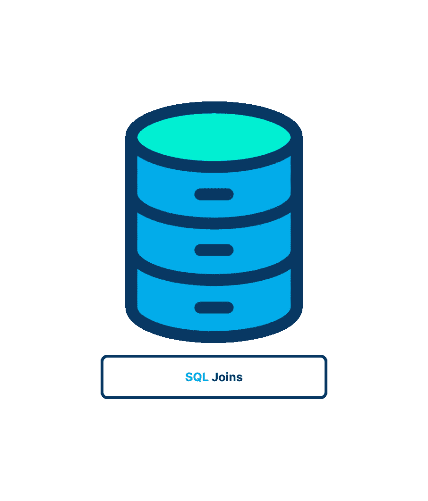
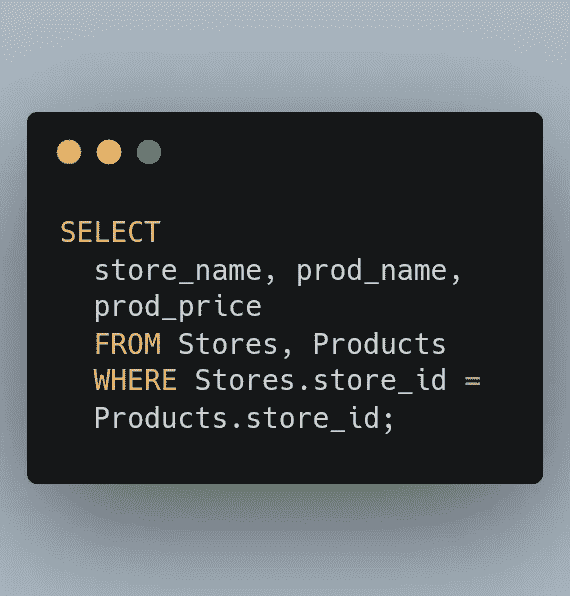
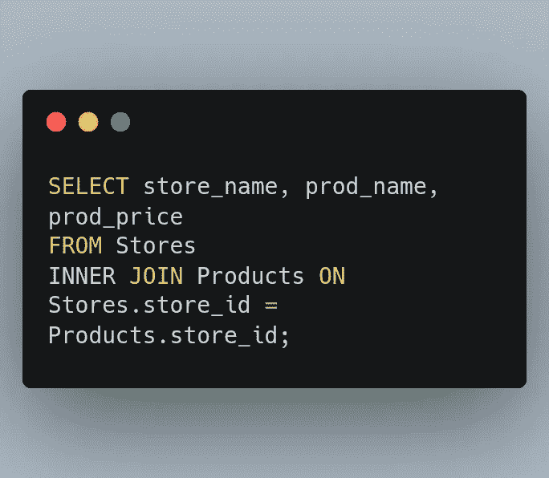
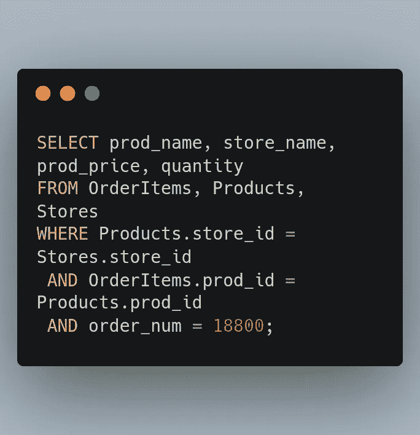
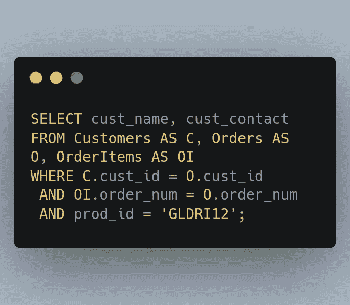
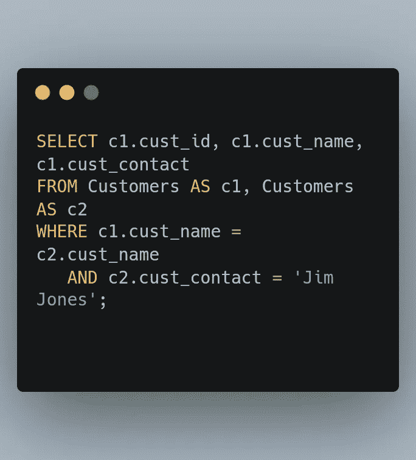
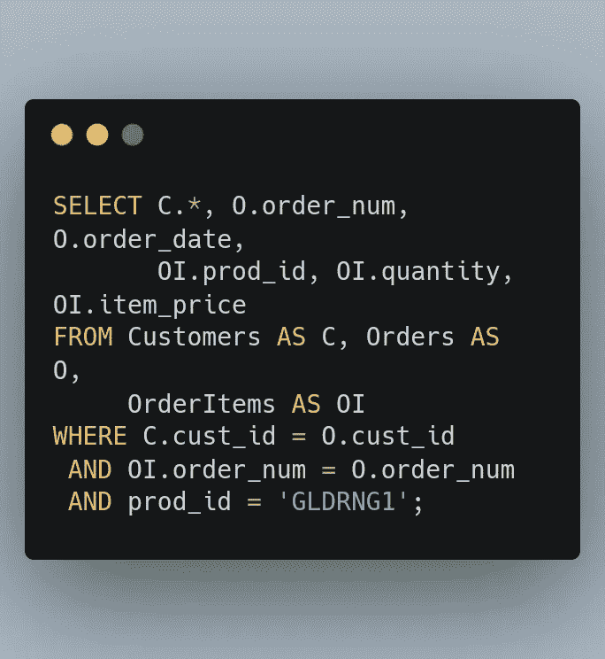
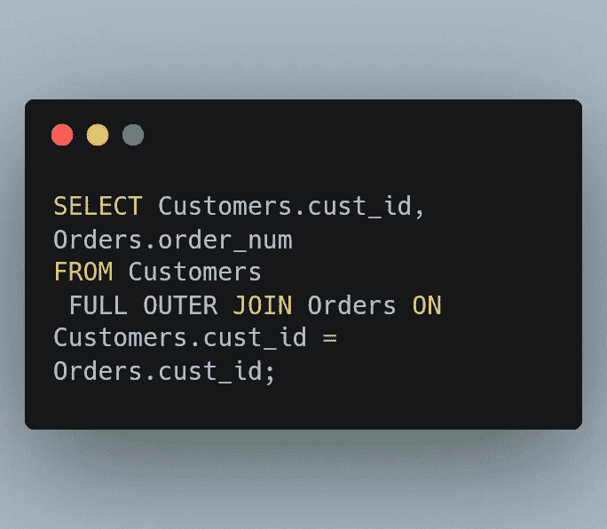
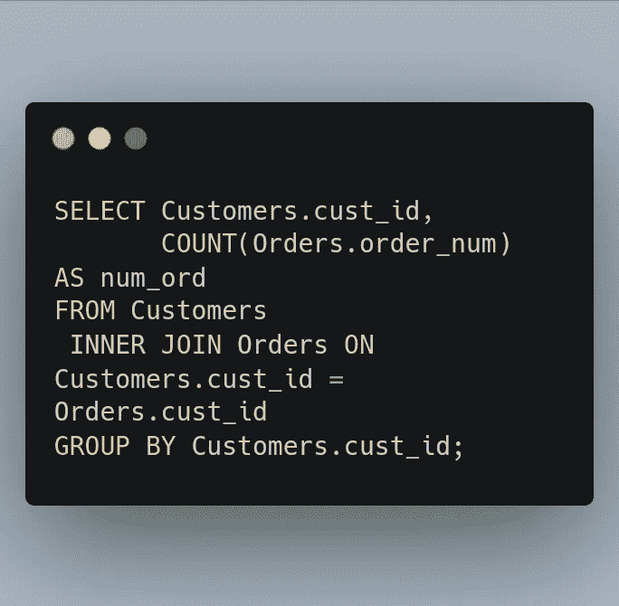

# SQL 连接的美丽世界

> 原文：<https://blog.devgenius.io/all-about-sql-joins-f9abd2982616?source=collection_archive---------7----------------------->

连接的美丽世界，今天就让我们深入了解一下吧！

S 根据组合记录的预期结果，QL 连接被分为四种类型，这些记录来自两个或多个使用连接函数中涉及的表的公共列的表。内部联接用于查找具有相同值的记录，左联接用于在两个表中获取左侧表中的所有记录并仅获取右侧表中的匹配值，而右联接用于获取右侧表中的所有记录并仅获取左侧表中的匹配记录，最后，执行完全联接以检索两个表中的所有记录，无论它们是否匹配。

我们将学习交叉连接、内部连接、自身连接和外部连接！

# **了解加入**

为什么**会加入**？

将数据划分到多个表中可以实现更高效的存储、更容易的操作和更大的可伸缩性。然而，这些优势是有代价的。

什么是**加入**？

联接是一种在 SELECT 语句中关联或联接表的机制(因此称为联接)。您可以使用特殊的语法连接多个表以返回一组输出，并且该连接会动态地关联每个表中的正确行。

**注**:理解 join 不是物理实体；也就是说，它不存在于数据库表本身中。DBMS 根据需要创建一个连接，并在查询执行期间保持它。

**创建连接**

创建连接非常简单。您必须指定将要包含的所有表，以及它们之间的相互关系。

示例:

什么是**笛卡尔乘积**

不包含联接条件的表关系的结果。检索的行数是第一个表的行数乘以第二个表的行数。

什么是**交叉连接**

返回笛卡尔积的联接类型有时称为交叉联接。

什么是**内部联接**

**内部连接**用于从两个表中返回满足指定条件的行。这是最常用的连接操作，可以认为是默认的连接类型。

内部连接进一步分为三个子类型:

1.  θ连接
2.  自然连接
3.  等价连接

**θ加入**

**Theta Join** 允许你根据 Theta 条件合并两个表格。对于所有比较运算符，θ连接功。它由符号表示。θ连接是连接操作的一般情况。

> `A ⋈ A.column 2 > B.column 2 (B)`

**对等连接**

*等联接* —基于两个表之间相等性测试的联接。这种类型的联接也称为内部联接。事实上，对于这些连接，您可以使用稍微不同的语法，显式地指定连接的类型。

当θ连接只使用等价条件时，它被称为**等价连接**。等价连接是 RDBMS 中最难有效实现的操作，这也是 RDBMS 出现严重性能问题的原因之一。

> `A ⋈ A.column 2 = B.column 2 (B)`

**自然连接**

**自然连接**不使用任何比较运算符。这种类型的连接中的属性应该具有相同的名称和域。自然连接中的两个关系之间应该至少有一个公共属性。

它对出现在两个关系中的属性执行选择，形成相等，并消除重复的属性。

示例:

**连接多个表格**

在 SQL 的 SELECT 语句中，可以连接的表的数量没有限制。创建连接的基本规则保持不变。首先列出所有的表，然后定义它们的关系。

**注意**:要连接的 Postgres 最大表数是 61

**注意**:一个连接中的最大表数

ANSI SQL 中可以连接的表的数量没有限制，但是请检查 DBMS 中的实现。

示例:

**使用表格别名**

示例:

**注意**:同样值得注意的是，表别名只在查询执行期间使用。与列别名不同，表别名永远不会返回给客户端。

**使用不同的连接类型**

让我们看看自连接、自然连接和外部连接。

什么是**自我归附**

顾名思义，自连接将表连接到自身。要使用自联接，表中必须有一列(我们称之为 X)作为主键，另一列(我们称之为 Y)存储可以与 X 列中的值匹配的值。对于任何给定的行，X 列和 Y 列不必具有相同的值，Y 列甚至可以为空。

示例:

假设您想向 Jim Jones 在同一家公司工作的所有客户联系人发送一封邮件。该查询要求您首先确定 Jim Jones 为哪家公司工作，然后确定哪些客户为该公司工作。解决这个问题的一种方法如下:

**注意**:自连接经常被用来替换那些从与外部语句相同的表中检索数据的语句。尽管最终结果是一样的，但许多 DBMSs 处理连接的速度要比子查询快得多。通常值得对两者进行测试，看看哪一个性能更好。

什么是**自然联结**

自然联接是一种只选择唯一列的联接。对于一个表，这通常通过使用通配符(SELECT *)和所有其他表的列的显式子集来实现。

自然连接连接两个具有相同属性名和数据类型的表。生成的表将具有两个表的所有属性，但每个公共列只有一个副本。

**内部** vs **自然**连接

内部联接根据 on 子句中显式指定的列联接两个表。结果表将包括两个表中的所有属性，包括公共列。

示例:

**外部联接**

大多数联接将一个表中的行与另一个表中的行相关联。但是有时，您希望包含没有相关行的行，因此您使用了**外部**连接。

示例:

**注意** : **SQLite 外连接**

SQLite 支持`LEFT OUTER JOIN`，不支持`RIGHT OUTER JOIN`。幸运的是，如果您确实需要 SQLite 中的`RIGHT OUTER JOIN`功能，有一个非常简单的解决方案，只需翻转表的顺序。

**完全外部连接**

当左(表 1)或右(表 2)表记录中有匹配时，`FULL OUTER JOIN`关键字返回所有记录。

示例:

**注意**:Maria db、MySQL 或 SQLite 不支持`FULL OUTER JOIN`语法。

**注意**:关键字`FULL OUTER JOIN`返回两个表中所有匹配的记录，不管另一个表是否匹配。因此，如果“客户”中的行与“订单”中的行不匹配，或者“订单”中的行与“客户”中的行不匹配，这些行也将被列出。

**使用聚合函数连接**

示例:

# 摘要

正如你所看到的，当你学习连接时，它并不可怕，❤️

我希望你对这篇文章感兴趣！