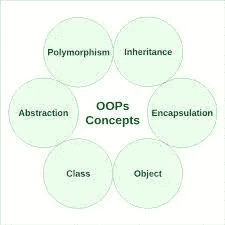

# 你需要知道的所有计算机科学语言概念

> 原文：<https://blog.devgenius.io/all-computer-science-language-concepts-you-need-to-know-6791db1147b0?source=collection_archive---------14----------------------->


顶级编程语言

这是我关于计算机科学语言的第一系列博客。在这个系列中，我们将回顾一些有趣的编程语言的兴衰、一些最佳实践以及一些技巧和建议。

*—我是 FANNG 或 MAANG 或 FLAG 的一名软件工程师。关注我，了解更多有趣的技术故事和博客。*

# 为什么要知道一些编程范式？

无论你是正在寻找一门新的 CS 语言学习的计算机科学学生，还是想要准备你的技术面试，你肯定应该知道一些编程范例及其细微差别。如果你碰到一个类似*的问题“什么是过程语言？”*在采访中*，*看懂这个博客你应该就能回答了。如果你想在空闲时间像我一样学习一些编程语言，你可能也会发现这篇文章很有用。

下面的帖子将遵循以下格式来解释一些流行的编程图。

*   有哪些具体的编程图？
*   为什么学习很重要？
*   怎么才能学会呢？
*   有什么有趣的历史背景吗？

# 面向对象语言

## **什么是面向对象编程？**

面向对象编程(OOP)是一种计算机编程模型，它围绕数据或对象而不是功能和逻辑来组织软件设计。对象可以定义为具有唯一属性和行为的数据字段。

OOP 关注于开发人员想要操作的对象，而不是操作它们所需的逻辑。这种编程方法非常适合大型的、复杂的、经常更新或维护的程序。这包括制造和设计程序，以及移动应用程序；例如，OOP 可以用于制造系统仿真软件。

流行的 OOP 语言:CPP，Java，Python，Scala，Visual Basic。网

## 面向对象编程的结构是什么？

面向对象编程的结构或构建块包括以下内容:



OOP 概念

*   **类**是用户定义的数据类型，充当单个对象、属性和方法的蓝图。
*   **对象**是用特别定义的数据创建的类的实例。对象可以对应于现实世界的对象或抽象实体。最初定义类时，描述是唯一定义的对象。
*   **方法**是在描述对象行为的类中定义的函数。类定义中包含的每个方法都以引用实例对象开始。此外，对象中包含的子例程称为实例方法。程序员使用方法来实现可重用性，或者一次将功能封装在一个对象中。
*   **属性**在类模板中定义，代表对象的状态。对象将在属性字段中存储数据。类属性属于类本身。
*   我们将在以后的博客中讨论抽象、多态、继承和封装。

我们将使用一个简单的 Java 来演示上面的结构。

```
/*
* Bicycle is a class/blueprint. It can be used to creat objects or 
* instances. 
*
* speed is an atrribute or field that is encapsulated by Bicycle.
*
* speedUp() is the method of Bicycle, which can be invoked by 
* Bicycle object. 
*/
public class Bicycle {private int speed; public Bicycle(int startSpeed) {
        speed = startSpeed;
    }

    public void speedUp(int increment) {
        speed += increment;
    } public void getSpeed(int increment) {
        return speed;
    }        
}
```

## 为什么学习很重要？

以下是几个主要原因。

第一，在行业内，软件工程师不了解基本的 OOP 概念是不可能工作的，至少在大多数情况下是这样。即使是前端开发人员也需要了解 OOP 概念，比如 React。许多大型科技公司(如亚马逊)使用纯面向对象的 Java 作为他们的后端系统或微系统。

其次，如果你是一名学生，并计划寻找暑期实习生或新毕业的软件工程师职位，了解 OOP 是必须的。可能有几种方法可以测试你。一种是面试官可能会直接问与 OOP 相关的每个概念，简单地说就是“*什么是类？*【to】*什么是接口，我们什么时候使用它？*”。或者，在 Leetcode 风格的问题中，您可能要测试一个必须用一些 OOP 设计模式编写的流类型的服务。

第三，在大多数学院/大学里，Java 是作为入门课开设的，而 OOP 肯定是在这门课上全面介绍和教授的。通常会提供替代的介绍类，比如 Python。" *Python vs Java* "如果你致力于计算机科学，就选择 Java。大多数人认为 Java 比 Python 难多了。然而，如果你懂 Java，Python 是一门非常容易掌握的语言，但反之则不然。然而，如果你对成为一名软件工程师很有信心，尝试 Python 类也是一个不错的选择；然后以后再挑 Java。

# OOP 的优势？

## 模块性

当使用面向对象的编程语言时，当出现问题时，您确切地知道在哪里查找。“哦，车上的物体坏了？问题肯定出在汽车类！”你不必一行一行地检查你所有的代码。

这就是封装的妙处。对象是自包含的，每一部分功能都做自己的事情，而不去管其他部分。此外，这种模块化允许 IT 团队同时处理多个对象，同时最小化一个人重复其他人的功能的机会。

## 复用性

假设除了您的汽车对象之外，一个同事需要一个赛车对象，另一个需要一个豪华轿车对象。每个人都单独构建他们的对象，但是发现它们之间的共性。事实上，每个对象只是一种不同的汽车。这就是继承技术节省时间的地方:创建一个泛型类(Car ),然后定义继承泛型类特征的子类(RaceCar 和 Limousine)。

如果您想对所有汽车对象进行更改，而不管其类型如何，该怎么办？这是 OOP 方法的另一个优点。对您的 car 类进行更改，所有 Car 对象将简单地继承新代码。

## 灵活性

举个例子，你现在只需要几个驱动程序或函数，比如" *driveCar "、" driveRaceCar* 和" *DriveLimousine* 。“*赛车手*与*豪华车手*有一些共同的特征，但是其他的东西，像*赛车头盔*和*饮料赞助*，都是独一无二的。

这就是面向对象编程的多态性发挥作用的地方。因为单个函数可以变形以适应它所在的任何类，所以您可以在父 Car 类中创建一个名为" *drive* "的函数，而不是" *driveCar* 或" *driveRaceCar，*"而只是" *drive* "这一功能将与*赛车驱动*、*豪华轿车驱动、r* 等等一起工作。事实上，你甚至可以选择“racecar . drive(*myRaceCarDriver*)”或者“limo . drive(*my chauffeur*)”

## 效率

许多人避免学习 OOP，因为学习曲线似乎比自顶向下编程更陡峭。但是花时间掌握 OOP，你会发现它是开发大型项目的更简单、更直观的方法。

面向对象编程最终是把一个巨大的问题分解成可解决的块。对于每个小问题，你写一个类来完成你的要求。然后——最棒的是——您可以重用这些类，这使得解决下一个问题更快。

这并不是说 OOP 是编写软件的唯一方法。但是像 C++、C#和 Java 这样的语言成为严肃软件开发的首选是有原因的。

# 函数式编程范式

## 具体编程图是什么？

函数式编程是一种编程范式，在这种编程范式中，我们试图以纯数学函数的风格来绑定一切。它是一种声明式的编程风格。它的主要焦点是“解决什么”，而命令式风格的主要焦点是“如何解决”。它使用表达式而不是语句。对表达式求值以产生一个值，而执行一个语句来分配变量。这些函数有一些特殊的功能，下面将讨论。

Lambda calculus 是由阿隆佐·邱奇开发的一个框架，用于研究函数计算。堪称世界上最小的编程语言。它给出了什么是可计算的定义。任何能用 lambda 演算计算的东西都是可计算的。它的计算能力相当于图灵机。它为描述功能及其评估提供了一个理论框架。它构成了当前几乎所有函数式编程语言的基础。事实:艾伦·图灵是阿隆佐·邱奇的学生，他发明了图灵机，奠定了命令式编程风格的基础。

函数式编程语言的要点:

*   函数式编程是一种编程范式，在这种编程范式中，我们试图将一切都绑定在纯数学函数中。
*   它是一种声明式的编程风格。它的主要焦点是“解决什么”，而命令式风格的主要焦点是“如何解决”
*   函数式编程(通常缩写为 FP)是通过组合纯函数、避免共享状态、可变数据和副作用来构建软件的过程。
*   与命令式或面向对象的代码相比，函数式代码往往更简洁，更可预测，也更容易测试

函数式编程的理想是所谓的*纯函数*。纯函数是其结果仅取决于输入参数的函数，并且其操作不会引发任何*副作用*，也就是说，除了返回值之外，不会产生任何外部影响。

支持函数式编程的编程语言:Haskell、JavaScript、Scala、Erlang、Lisp、ML、Clojure、OCaml、Common Lisp、Racket

## **为什么学习很重要？**

任何 FP 语言的目标都是模仿数学概念的使用。然而，在函数式编程中，计算的基本过程是不同的。函数式编程的主要特点是:

**数据是不可变的:**函数中的数据是不可变的。在函数式编程中，我们可以很容易地创建一个新的数据结构，但我们不能修改现有的数据结构。

**可维护性:**函数式编程为开发人员和程序员带来了极大的可维护性。我们不需要担心在给定函数之外意外进行的更改。

**模块化:**这是函数式编程最重要的特征之一。这有助于我们将一个大项目分解成更简单的模块。这些模块可以单独测试，这有助于减少花费在单元测试和调试上的时间。

有很多 Quant 公司大量使用函数式编程，比如[简街](https://www.janestreet.com/) (OCaml)。

趣闻:*第一种高级函数式编程语言 LISP 是由***在麻省理工学院(MIT)时为 IBM 700/7000 系列科学计算机开发的。**

## *函数式编程的优势*

*   *它帮助我们以更简单的方式有效地解决问题。*
*   *它提高了模块化。*
*   *它允许我们在程序中实现 lambda 演算来解决复杂的问题。*
*   *一些编程语言支持嵌套函数，这提高了代码的可维护性。*
*   *它把复杂的问题简化成简单的部分。*
*   *它提高了开发人员的生产率。*
*   *它帮助我们快速调试代码。*

*下面是解决*“查找最长子串回文”的 Haskell 代码示例。*你可以感受到代码的简单和美丽。*

```
***clean** **=** map toLower **.** filter isAlpha

**palindrome** str **=** str **==** reverse str

**substrings** **[]**     **=** **[]**
**substrings** (x**:**xs) **=** substrings' (x**:**xs) **++** substrings xs **where**
  substrings' **[]**     **=** **[]**
  substrings' (y**:**ys) **=** [y] **:** [ (y**:**s) **|** s **<-** substrings' ys ]

**longest** **[]**     **=** **[]**
**longest** (x**:**xs) **=** **if** length x **>** length max **then** x **else** max
  **where** max **=** longest xs

**longest_palindrome** xs **=**
  longest (filter palindrome (substrings (clean text)))

**main** **=** print (longest_palindrome text)*
```

# *过程程序设计*

## ***具体编程图是什么？***

*过程化编程是一种编程范式，源于结构化编程，基于过程调用的概念。过程，也称为例程、子例程或函数，只包含一系列要执行的计算步骤。它也称为内联编程，采用自顶向下的方法。它是写一个指令列表，告诉计算机一步一步做什么。它依赖于程序或常规。它是一种编程范式，建立在程序是要执行的指令序列的思想之上。他们着重于将程序分解成命名的指令集，称为过程，类似于函数。过程可以存储不能从过程范围之外访问的本地数据，也可以访问和修改全局数据变量。*

## ***程序化编程的一些关键标准是什么？***

*   *程序是由指令序列组成的。代码和机器之间存在最小的抽象。*
*   *过程是由多组指令组成的逻辑块，可以从代码中的其他位置调用。*
*   *过程可以接受参数并向调用者返回值。此外，函数可以访问和修改全局范围内的变量。*
*   *过程语言遵循结构化编程实践，使用基于块的控制流，而不是`goto`命令。*

## *优势*

*   *过程式编程非常适合通用编程*
*   *编译器和解释器的编码简单，易于实现*
*   *关于经过测试的算法，有大量的书籍和在线课程资料，这使得学习起来更加容易*
*   *源代码是可移植的，因此，它也可以用于不同的 CPU*
*   *代码可以在程序的不同部分重用，而不需要复制它*
*   *通过过程化编程技术，内存需求也大幅减少*
*   *可以很容易地跟踪程序流程*

# *编译语言*

## *具体编程图是什么？*

***编译语言**是一种编程语言，其中源代码被翻译成机器码，机器码存储在一个单独的文件中。编译语言倾向于让开发人员对硬件方面有更多的控制，比如内存管理和 CPU 使用。然而，编译后的代码依赖于硬件。*

*汇编、COBOL、PL/I 和 C/C++都是通过编译器运行源代码来翻译的。这会产生非常高效的代码，可以执行任意次。编译源代码时，翻译的开销只发生一次；此后，只需要加载并执行它。*

## *为什么学习很重要？*

*编译语言是非常常见的语言。，比如 C 或者 C++。它与 Java 或 OOP 是非常不同的范例。在编译语言中，你会知道什么是编译器；也许它能激发你自己写一个有趣的编译器。更具体地说，你将知道学习如何将源代码编译成目标代码，然后如何将代码链接到一个可执行文件，该文件可以像普通程序一样运行。一旦你理解了整个过程，你就不仅仅是学习了一种或几种语言，而且还写出了更高效的代码。*

**有两种类型的软件工程师。一个知道 C；另一个没有。**

*此外，许多大型科技公司大量使用 C++。不仅如此，顶级对冲基金交易公司可以像 HRT (Hudson River Trading)一样为新的毕业生职位支付高达 70 万美元，他们使用 C++是因为它的效率。*

*更多的，如果你在疑惑 Linux 是如何工作的，那么你应该学习 C，懂 C 或者 C++可以给你更多的机会，比如成为一名基础设施工程师。*

*没完没了地说，你应该而且必须学习 C/C++和编译语言。我个人是 C/C++的忠实粉丝，过去几年一直在基础设施工程领域。当然，我一直很享受。*

# *解释语言*

## *具体编程图是什么？*

*解释语言经常与编译语言相比较。解释语言是这样一种语言，其中指令不直接由目标机器执行，而是由一些其他程序(通常用本机语言编写)读取和执行。例如，相同的“+”操作将在运行时被解释器识别，然后解释器将使用适当的参数调用自己的“add(a，b)”函数，然后执行机器代码“add”指令。解释程序一行一行地运行一个程序，并执行每个命令。在这里，如果作者决定使用不同种类的橄榄油，他可以刮掉旧的，添加新的。你的翻译朋友可以及时向你传达这一变化。*

## ***解释语言的优势***

*与编译语言相比，解释语言给程序带来了某些额外的灵活性。在解释器中比在编译器中更容易实现的特性包括(但不限于):*

*   *平台独立性(例如，Java 的字节码)*
*   *评估器的反射和反射使用(例如一阶评估函数)*
*   *动态打字*
*   *易于调试(用解释语言更容易获得源代码信息)*
*   *小程序大小(因为解释语言具有选择指令代码的灵活性)*
*   *动态范围界定*
*   *自动内存管理*

## *为什么学习很重要？*

*Python 是一种解释语言，这意味着 Python 程序的源代码被转换成字节码，然后由 Python 虚拟机执行。这不同于主要的编译语言，如 C 和 C + +，因为 Python 代码不需要像这些语言的代码一样被构建和链接。*

*毋庸置疑，Python 无处不在，你必须学习它。无论你是数据科学家还是软件工程师，还是 CS 学生，Python 都是必须要学的。*

# *结论*

*以上是最基本的编程语言概念。当然，我还有更多要说和讨论的。在未来，我将发布一系列文章来讨论最流行的语言，讨论它们的优缺点或局限性。更重要的是，我将发布一长串关于如何编写更好的 Python、C++和 Java 代码的最佳实践。*

*订阅，不要错过任何有趣的内容。*