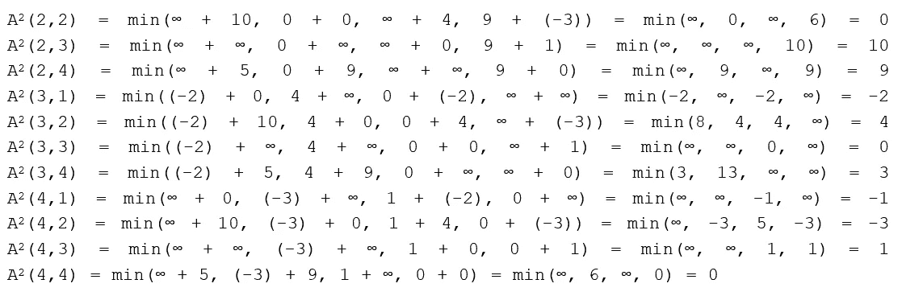

# 所有对最短路径矩阵乘法

> 原文：<https://blog.devgenius.io/all-pairs-shortest-path-matrix-multiplication-95dd35446ea7?source=collection_archive---------3----------------------->

你将看到一个图表，你的目标是使用动态规划找到所有的最短路径对。

第一步是创建一个矩阵，其中行数和列数等于顶点数，然后用初始数据填充它。对于一跳可到达的每个顶点，您将用边权重填充它。如果一个顶点不能一跳到达，你将用无穷大填充它，如果一个顶点试图到达它自己，你将用零填充它。让我们通过算法来填充初始矩阵。

我们将从填充所有的零开始。零会在对角线的下方。为什么？查看 A *1* (1，1)的第一个条目，您正试图从顶点 1 到顶点 1。那东西有多重？零。对于(2，2)，(3，3)和(4，4)也是如此。

接下来让我们来检查一个 *1* (1，2)。一跳就可以从顶点 1 到 2。边权重为 10。

接下来，我们来看看 A *1* (1，3)。因为你不能从顶点 1 一跳到达顶点 3，所以你输入无穷大。

让我们填写其余的字段。

*   从 1 到 4，A *0* (1，4) = 5
*   从 2 到 1，A *0* (2，1) = ∞
*   从 2 到 3，A *0* (2，3) = ∞
*   从 2 到 4，A *0* (2，4) = 9
*   从 3 到 1，A *0* (3，1) = -2
*   从 3 到 2，A *0* (3，2) = 4
*   从 3 到 4，A *0* (3，4) = ∞
*   从 4 到 1，A *0* (4，1) = ∞
*   从 4 到 2，A *0* (4，2) = -3
*   从 4 到 3，A *0* (4，3) = 1

接下来，让我们从编程和可视化的角度来看这个算法。

我们首先尝试获取 A *0* (1，1)的值。如果我们遵循 for 循环，k 将等于 1，然后 2，然后 3，最后 4，而 I 和 j 的值不变。

接下来，插入这些条目的值。

最小值为 0。因此，我们取零值，并将其插入到一个 *1* (1，1)中

接下来，我们将检查 A1(1，2)，但这次我们将直观地进行检查。我们在前面的例子中所做的是遍历与条目对应的行和列。因为我们查看了条目(1，1)，所以我们将第一行和第一列的值相加，然后得到这些条目的最小值。让我们从突出显示第一行和第二列开始，因为我们正在处理 entry (1，2)。

如果我们遍历该算法，我们将(1，1)加到(1，2)、(1，2)加到(2，2)、(1，3)加到(3，2)和(1，4)加到(4，2)。

最小值是 2，所以我们用 2 来更新 A *2* (1，2)。

让我们也为第一行可视化地填写其余的单元格。接下来是 A2(1，3)。

最小值是 6，所以我们用 6 来更新 A *2* (1，3)。接下来是 A *2* (1，4)。

最小值是 5，所以我们用 5 来更新 A *2* (1，4)。接下来是一个 *2* (2，1)。

值仍然是无穷大，所以我们用∞更新 A *2* (2，1)。接下来是一个 *2* (2，2)。

对于构建一个 *2* 的迭代的剩余部分，我将列出项目，您可以通过矩阵 A *1* 来验证它们。

最终产品如下所示:

我们不断重复这个过程，直到我们能够观察到两种情况之一:

*   从先前矩阵到当前矩阵的条目不会改变
*   对角线上有一个负值。这表示一个负循环，数值将无限下降。

A *2* 矩阵到底是什么？它是两个 A *1* 矩阵的修正矩阵乘法的结果。要查找的下一个矩阵是一个 *4* 。这将通过两个 A *2* 矩阵相乘来实现。让我们来看一下整个过程。

由于矩阵与之前的版本不同，我们还没有完成。移动到 A *8* 的时间到了。

因为 A4 和 A8 之间没有变化，所以不需要进一步的操作。

*如果你喜欢你所读的，看看我的书，* [*算法说明*](https://www.amazon.com/Illustrative-Introduction-Algorithms-Dino-Cajic-ebook-dp-B07WG48NV7/dp/B07WG48NV7/ref=mt_kindle?_encoding=UTF8&me=&qid=1586643862) *。*

迪诺·卡希奇目前是 [LSBio(寿命生物科学公司)](https://www.lsbio.com/)、[绝对抗体](https://absoluteantibody.com/)、 [Kerafast](https://www.kerafast.com/) 、[珠穆朗玛生物科技](https://everestbiotech.com/)、[北欧 MUbio](https://www.nordicmubio.com/) 和 [Exalpha](https://www.exalpha.com/) 的 IT 负责人。他还担任我的自动系统的首席执行官。他有十多年的软件工程经验。他拥有计算机科学学士学位，辅修生物学。他的背景包括创建企业级电子商务应用程序、执行基于研究的软件开发，以及通过写作促进知识的传播。

你可以在 [LinkedIn](https://www.linkedin.com/in/dinocajic/) 上联系他，在 [Instagram](https://instagram.com/think.dino) 上关注他，或者[订阅他的媒体出版物](https://dinocajic.medium.com/subscribe)。

阅读迪诺·卡吉克(以及媒体上成千上万的其他作家)的每一个故事。你的会员费直接支持迪诺·卡吉克和你阅读的其他作家。你也可以在媒体上看到所有的故事。