# 使用 Git w/GitHub——分叉、克隆、推送和拉取，实现有效的协作

> 原文：<https://blog.devgenius.io/all-things-github-forking-cloning-pushing-pulling-d253bc71f5cf?source=collection_archive---------12----------------------->

*我的远程协作 Git 和 GitHub 基础入门的第 3 部分*


欢迎回到我的 Git 和 Git Hub 入门系列。如果您刚刚开始使用 git，我邀请您阅读我的前两篇文章，这两篇文章将带您浏览

[什么是 Git / GitHub，如何安装 Git？](https://medium.com/@tait.hoglund/source-control-with-git-and-github-part-one-11b602d9d60f)
[如何建立你的仓库& Git 工作流程](https://medium.com/@tait.hoglund/source-control-with-git-github-part-2-8e8ab28db30f)

在我结束这篇关于 Git 和 GitHub 的初级读本时，我们终于了解了 GitHub，以及它为什么有用，以及如何使用 GitHub，从而使您远程处理的内容不必留在本地机器上。

相反，GitHub 允许您访问项目或团队成员的远程工作，这样每个人都可以进行更改和编辑，因为许多项目需要几十个开发人员。


您将需要复制您的 http 地址，以便从您的 CLI 执行拉入

在这短短 5 分钟的阅读中，您可以轻松地派生一个存储库，克隆它，将内容下载到您的本地机器，并将更改推回到 GitHub 存储库:

# 先决条件

*   Git 的工作知识(见我的零件[一](https://medium.com/@tait.hoglund/source-control-with-git-and-github-part-one-11b602d9d60f)和[二](https://medium.com/@tait.hoglund/source-control-with-git-github-part-2-8e8ab28db30f)开始)
*   GitHub.com 账户(使用[个人访问令牌](https://medium.com/@tait.hoglund/remote-authentication-using-personal-access-tokens-on-github-com-e707646d2f8b)进行远程认证)
*   Linux 命令行命令和 CLI 的舒适性

# 在 GitHub 上派生一个存储库

当你想要一个*完全分离的*和*当前存在的一个项目的完整副本时，分叉是有帮助的。*

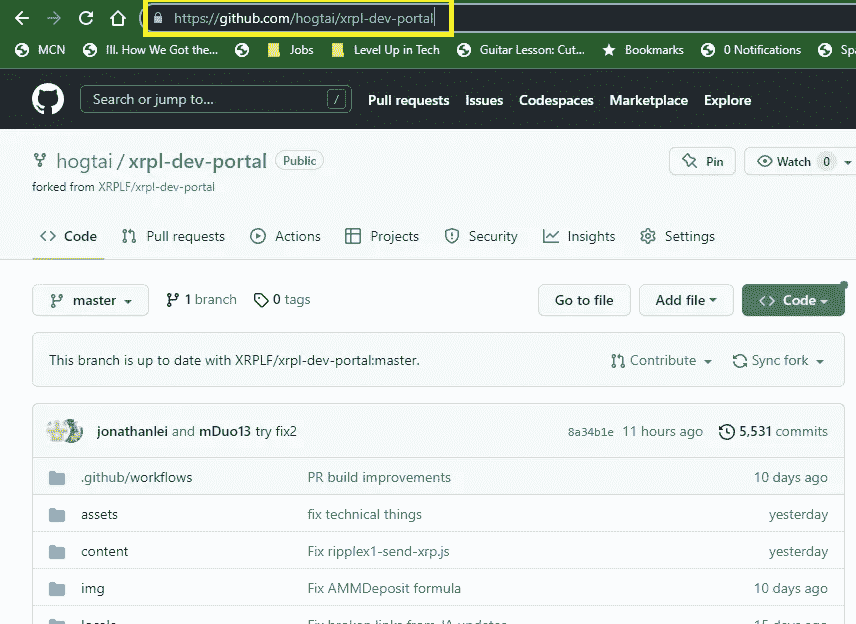

相反，*克隆会创建一个始终链接到其父节点的副本，该副本将继续与原始副本同步。*

# 如何派生一个存储库？

要派生一个存储库，使用搜索特性来查找您想要派生的项目。我是 XRP 总账项目的忠实粉丝，因此我将导航到该存储库并“分叉”回购

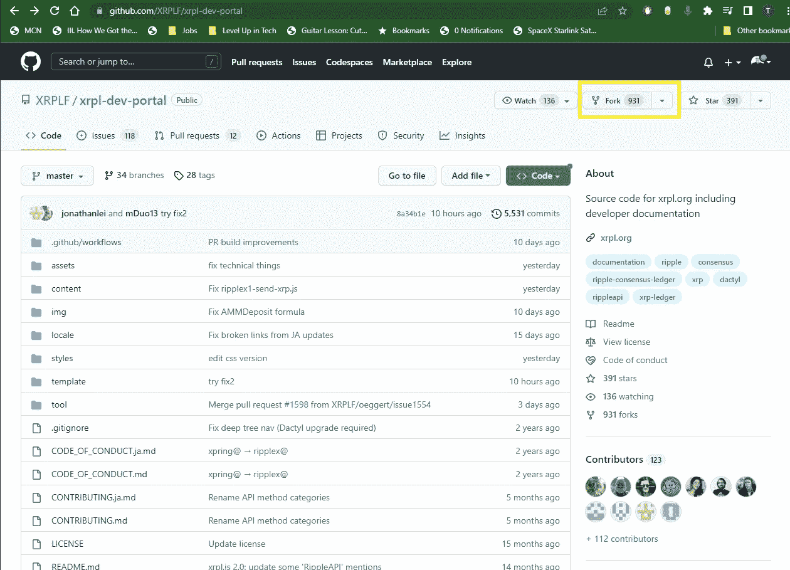

一旦在回购上，找到右上角附近的叉按钮。点击分叉。

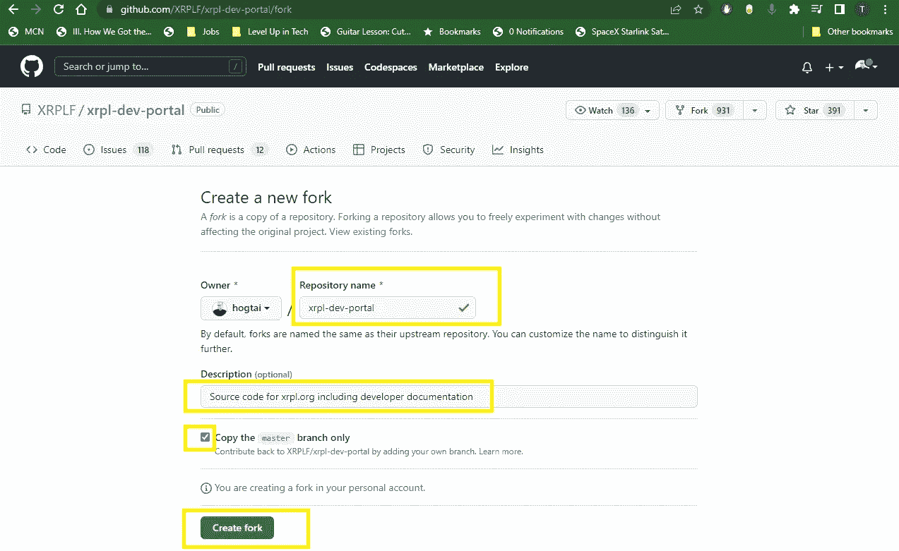

命名您的 repo，如果您喜欢，可以添加描述，并确保在单击“创建分支”之前复制主分支

您可以通过重新访问 repo 页面查看新的分叉存储库来验证您的分叉是否成功

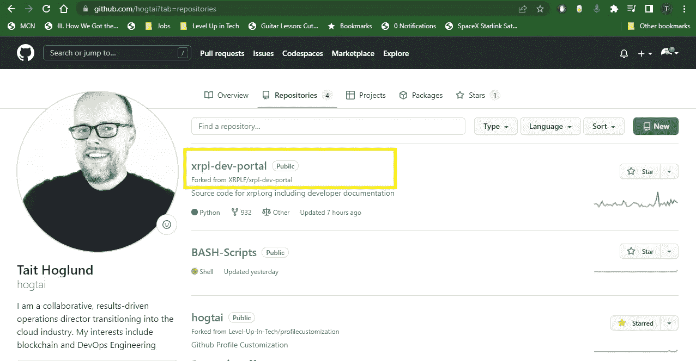

# 克隆存储库

同样，您只需要克隆一个您想要继续跟踪父存储库的存储库。在使用命令行之前，请使用浏览器找到您想要克隆的存储库的 URL:


您将需要复制您的 http 地址，以便从您的 CLI 执行拉入

现在回到你的命令行。确保您位于要将存储库克隆到的工作目录中，然后使用“git clone”命令执行克隆，包括目标存储库的 URL:

```
git clone https://github.com/hogtai/xripl-dev-portal
```

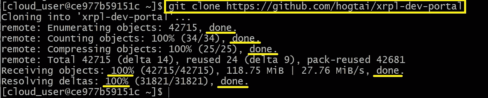

最后，您可以使用“ls”和“cd”命令进一步验证结果:

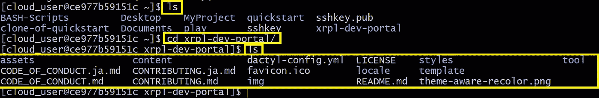

# 在本地 GitHub 上拉一个库

启动“拉”将获取存在于 GitHub 云上的代码，并将它的副本移动到我们的本地机器或云服务器，以便我们可以在本地处理代码。

一旦我们分叉、克隆或创建了自己的存储库，我们就可以转到 CLI 并执行“git pull remote (HTTPS 地址)”命令，将这些文件下载到我们的本地机器或云实例:


您将需要复制您的 http 地址，以便从您的 CLI 执行拉入

```
git pull remote https://github.com/hogtai/xrpl-dev-portal
```

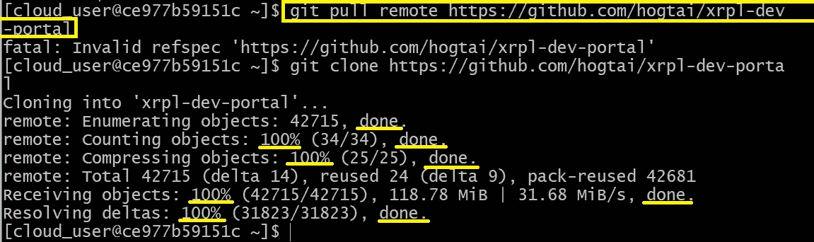

成功的“拉动”应该是什么样子

在命令行中验证成功拉入:

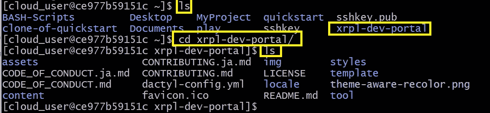

嘣！都在那了！

# 将更改“推”回您的 GitHub 库

现在你已经有了你的文件，并且你已经在本地处理了它们，你如何把它们推回到 GitHub？扰流板警告:使用按压命令

注意:请确保您是项目所有者或者您的项目拥有推送权限，并且在将任何更改推回 GitHub 之前，您已经适当地暂存和提交了文件

下面是如何使用“git push origin”命令将更改推回 GitHub:

```
git push origin --all
```

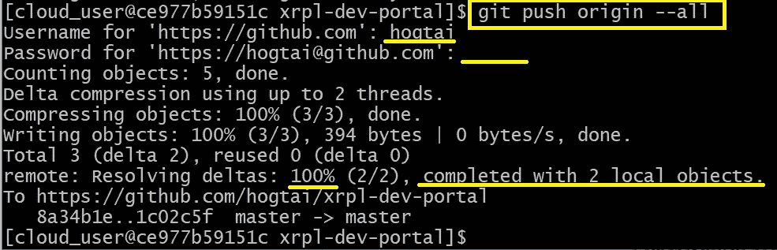

系统会提示您输入您的 GitHub 用户名。对于密码，您的 GitHub 密码在 CLI 中不起作用，请使用您的“个人访问令牌”来代替。

我们还可以通过在浏览器中访问 GitHub 并访问我们的存储库来验证我们的推送是否成功:

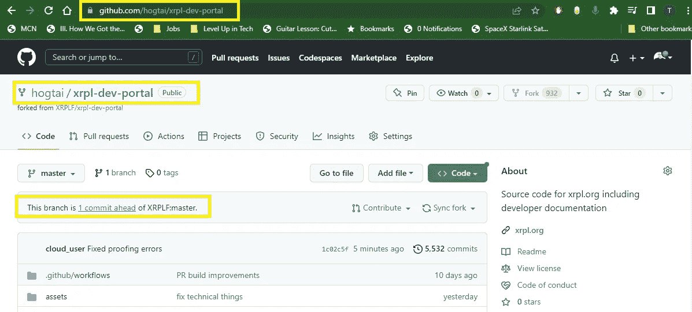

我们可以看到我们的提交被成功地推回到 GitHub

如果我们点击“1 提前提交”链接，GitHub 会显示这次推送更改了哪些代码。

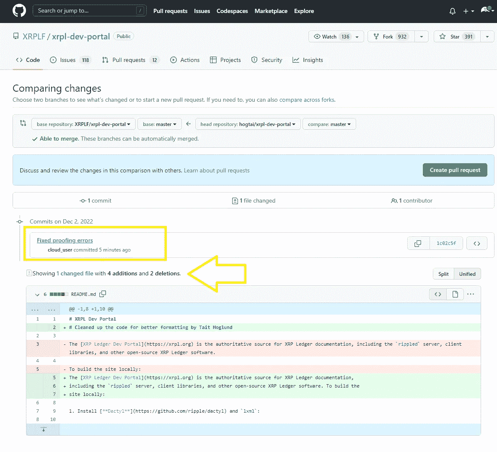

# 在 GitHub 上打开拉请求

最后，你可以通过打开一个关于你的变更的“拉请求”,让你的团队知道你已经推动的变更。一个 Pull 请求让项目参与者知道您正在请求您的变更已经准备好被合并到主分支中。

一旦您的代码已经过适当的测试和审查，这通常是实现之前的最后阶段。

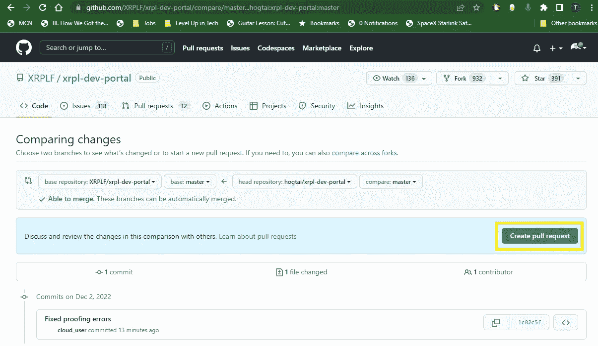

要提交用于合并的“拉”请求，请导航到您的提交，然后选择绿色的“创建拉请求”按钮

填写提交的 Pull 请求表单，等待批准或进一步讨论。

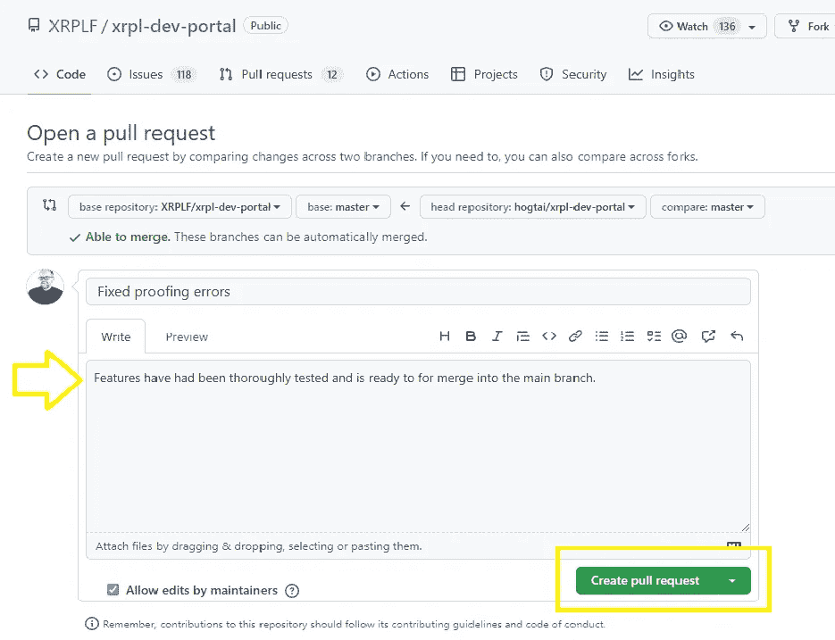

写一个简短的描述供审查

感谢阅读！如果您发现这个由三部分组成的系列对您的 Git / GitHub 之旅有帮助，请留下您的评论。前进！