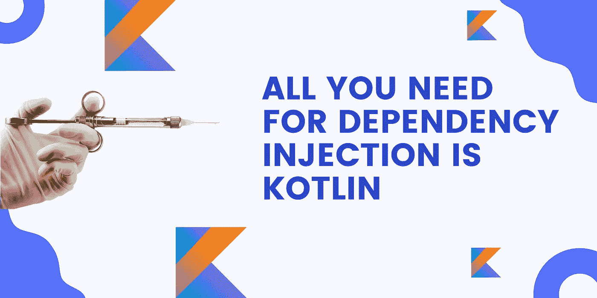

# 依赖注入所需要的就是 Kotlin

> 原文：<https://blog.devgenius.io/all-you-need-for-dependency-injection-is-kotlin-831b235bb45b?source=collection_archive---------3----------------------->

你可能想知道什么是最适合你的 Android 项目的依赖注入库。匕首，剑柄，银，还是柯丁？我无法回答这个问题。您应该选择适合您的项目、经验和期望的内容。但是如果我告诉你你不需要任何库呢？你在科特林有你需要的一切！你不会有一些新奇的东西，比如开箱即用，但是在大多数项目中，你也不会用到它。当然，你仍然可以在将来改进你的方法。

**最简单的依赖注入是构造函数中的默认参数值。**

看看这有多简单:

你可以看到有一个`Graph`物体，但这也是 Kotlin 的一个非常简单的主图。该图是单例的，具有单例范围。😉
你可以为网络和数据库创建任意多的图形对象。像在所有 DI 库中一样组织它。

您还可以将一些既不是单例也不是新实例的对象传递给一个 ViewModel，就像另一个 ViewModel 一样。为此，您可以使用定制工厂为视图模型编写自己的扩展`by viewModels`:

同样的方法也适用于其他类型的视图模型委托:

仅此而已。这就是你在项目中作为依赖注入所需要的。

好了，你可能还想使用更多的东西— [SavedStateHandle](https://developer.android.com/topic/libraries/architecture/viewmodel-savedstate) 。如果是，那么更好是一个小的不同的方法。我们可以提供函数来提供视图模型工厂，而不是重写委托。

告诉我你对这些方法有什么看法？哪个更适合你？你在项目中使用什么作为依赖注入？

加入我的**代码端**！
一切顺利，
阿图尔

*原载于*[*https://www.thecodeside.com*](https://www.thecodeside.com/2022/02/09/all-you-need-for-dependency-injection-is-kotlin/)*。*