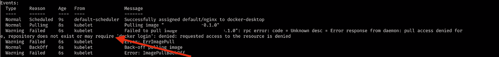
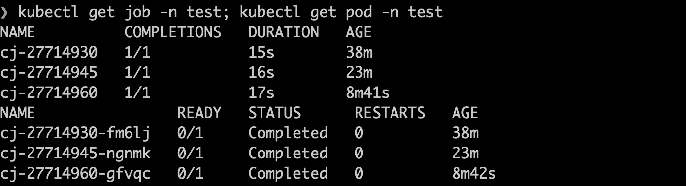
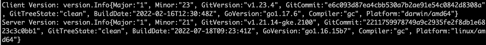
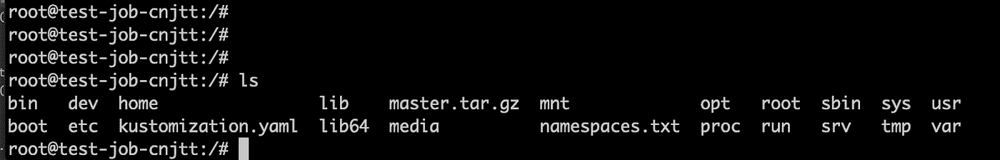
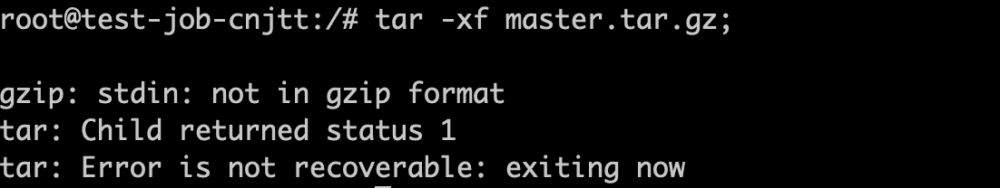
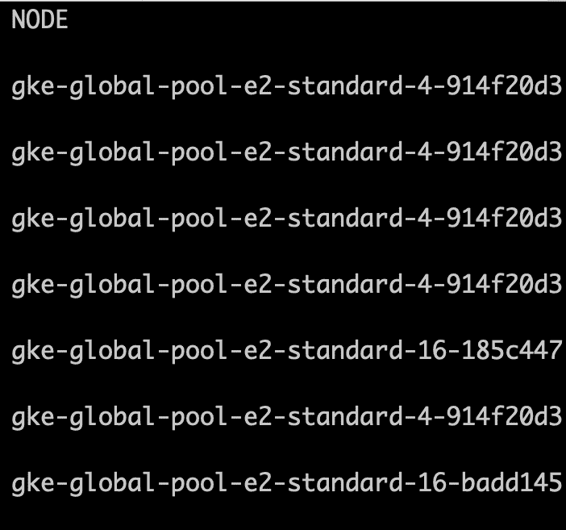

# 关于调试 Kubernetes Cronjob，您需要知道的全部内容

> 原文：<https://blog.devgenius.io/all-you-need-to-know-about-debugging-kubernetes-cronjob-61989a998513?source=collection_archive---------2----------------------->

## Kubernetes cron job/部署调试中使用的演练工具、配置和知识


来自 Unsplash， [@marcuslofvenberg](https://unsplash.com/photos/wf4nPeExY_k)

随着 Kubernetes 成为部署应用程序的事实上的标准，使用 CLI 进行部署和调试无疑已经成为开发人员的必备技能，尽管它过去只是 DevOps 的一项技能。

我今年早些时候通过的[认证 Kubernetes 管理员](https://medium.com/codex/ready-to-win-the-cka-certificate-4f77960c5878?source=your_stories_page-------------------------------------) (CKA)中的故障排除任务已经提示了还有哪些技能需要学习。

> cka 拥有履行 Kubernetes 管理员职责的技能、知识和能力。

然而，调试在生产中要复杂得多，涉及各种工具和主题。在本文中，我们将经历一次成功的 cronjob 部署和调试，涉及 cronjob 测试、Git、环境变量、RBAC、Pod 资源配置、日志记录等。，看看我们能从这种做法中学到什么。

# 创建 Cronjob

这是我们创建的一个 cronjob，用来替代一个 Gitops 工具的部分功能，这个工具有一个短期内无法恢复的问题。cronjob 包含一个 bash 脚本，需要它来完成以下任务。

*   每 10-15 分钟跑一次
*   在 Git repo 中下载 YAML 文件
*   用`kustomize`构建下载的文件
*   使用内部工具改变和验证 YAML
*   `kubectl apply`文件到集群

第一个版本已经完成:`job`基于内部公司`cloud-sdk`创建一个包映像，然后执行一些 bash 命令的容器。

# 应用 Cronjob

`kubectl apply`把文件送到集群。cronjob 配置为每 15 分钟运行一次，即每小时的第 0 分钟、第 15 分钟、第 30 分钟和第 45 分钟。如果我们在`kubectl apply`时错过了这些时间点，我们最多需要等待 15 分钟让它自动执行。

cronjob 表达式配置可以在这里测试[。](https://crontab.guru/#0/15_*_*_*_*)

每次 cronjob 执行都会创建一个相应的`job`，然后它会启动一个 pod 执行。

是时候看看我们应用的 cronjob 的结果了。

**所有 pod 执行失败！**

运行`kubectl get events -n test`进行调试！



我们得到一个典型的 Kubernetes pod 启动错误，`**ImagePullBackOff**`、**、**两个最常见的 pod 启动错误之一，`ImagePullBackOff`和`ErrImagePull`，它们是由以下原因触发的

*   错误的图像地址
*   错误的标签或没有默认标签，导致不存在链接的图像
*   不可访问的图像或不允许访问者

由于 pod 无法启动并且没有可用的日志，我们可以运行`kubectl describe`或`kubectl events`来获取更多信息。它返回`does not exist or no pull access`，但是 URL 被确认是正确的。因此，我们只需要找到执行 cronjob 创建的服务帐户，并授予它权限。(关于 Google 容器注册表映像的权限，请参考文档[访问控制和 IAM](https://cloud.google.com/container-registry/docs/access-control) )。

最后，我们可以了解到，GKE 集群有一个默认的 IAM 服务帐户`**cluster@<project-id>.iam.gserviceaccount.com**` **，它是在创建集群**时同时创建的，因此，一旦我们的 IAM 服务帐户从映像所有者那里获得了`storage.get`权限，我们就可以让 cronjob 成功运行。

随着权限的到位和 cronjob 的运行，pod 将在☕️.咖啡上完成



# 容器中的日志记录和调试

pod 启动后执行是否正确？

对于 bash 脚本，我们可以直接检查日志进行验证，包括 pod 日志和作业日志。

```
kubectl log cj-27714930 -n test
```

然后显示几十行错误日志。让我们看看他们的一部分。

```
gzip: stdin: not in gzip format
tar: Child returned status 1
tar: Error is not recoverable: exiting now
Error from server (Forbidden): namespaces is forbidden: User "system:serviceaccount:test:default" cannot list resource "namespaces" in API group "" at the cluster scope
error: no objects passed to apply
```

有点麻烦。我该如何处理这些错误呢？

首先，通过直接删除当前 cronjob 或使用以下命令挂起它来挂起它。

```
kubectl patch cronjobs cj -p '{"spec" : {"suspend" : true }}' -n test
```

GIT 下载成功了吗？**踏入容器**。有两种方法可以做到。

*   使用`kubectl exec -it`启动 bash 并访问 pod 容器。
*   使用`kubectl debug`创建一个临时容器来调试。

```
kubectl debug --image=busybox --target=cj -ntest -it cj-27714960-gfvqcDefaulting debug container name to debugger-fps7r.error: ephemeral containers are disabled for this cluster (error from server: "the server could not find the requested resource").
```

然而，我当前的集群不支持在 Kubernetes 1.22 中发布的[短暂容器](https://kubernetes.io/docs/concepts/workloads/pods/ephemeral-containers/)，直到 1.25 才变得稳定。所以在尝试之前，记得用`kubectl version`检查您当前的集群和 kubectl 版本。



在我们进行唯一的选择之前，问问我们自己是否有办法避免每隔 15 分钟就测试 cronjob？

答案是肯定的。**我们可以基于 cronjob 创建一个** `**job**` **，让一个 pod 立即启动运行程序**。我们可以通过在脚本中添加`sleep 1h`来延长容器的存在，避免调试因容器操作的停止而中断。

```
# create test job
k create job test-job --from=cronjob/cj -n test# step into the test container
k exec -it job/test-job  -ntest -- /bin/bash
```

现在，我们可以访问容器并运行 bash 命令。跑`kubectl exec -it job/test-job -ntest — /bin/bash`



我们可以发现下载的 git 包`master.tar.gz`已经在那里了，但是直接运行`tar`命令就会出现上面的错误。



退出容器，在本地重试测试，发现下载的包大小不同。仔细检查我的命令，我们可以看到有一个`GITHUB_AUTH_TOKEN`变量，它是 GitHub 身份验证的 Github 开发者令牌。

在容器中，`echo $GITHUB_AUTH_TOKEN`发现不存在变量，这是 pod 中常见的错误:**环境变量没有映射到容器。**

有三种方法可以解决这个问题。

*   将明文直接粘贴到 bash 脚本中。
*   创建一个`ConfigMap`来保存令牌，并将其作为环境变量映射到容器。
*   创建一个`Secret`来保存令牌，并将其作为环境变量映射到容器。

显然，第一种和第二种方法是不安全的，而第三种方法是最好的，尽管仍然需要限制当前名称空间中对`Secret` 的访问权限，以确保只有少数管理员可以访问它。

创建了`secret`之后，我们现在只需要向 cronjob 添加以下环境变量引用。

```
env:
  - name: GITHUB_AUTH_TOKEN
valueFrom:
secretKeyRef:
name: githubtoken
key: GITHUB_AUTH_TOKEN
optional: false
```

重新应用 cronjob 并测试。解压成功！

# 没有权限

不幸的是，另一个错误发生了。

```
Error from server (Forbidden): namespaces is forbidden: User "system:serviceaccount:test:default" cannot list resource "namespaces" in API group "" at the cluster scope
```

`ServiceAccount`在运行时没有足够的权限，这是另一个典型的 Kubernetes pod 错误。

在配置 cronjob 容器时，没有设置`serviceAccountName`字段，将使用默认的 SA 来运行这个 pod。并且该 SA 没有授予任何额外的 RBAC 权限，因此在执行`kubectl apply namespace <namespace>`时会报告一个错误。

因此，解决方案很简单:**授予 SA 一个适当的角色**。

```
apiVersion: rbac.authorization.k8s.io/v1
kind: RoleBinding
metadata:
name: test-default
namespace: test
roleRef:
apiGroup: rbac.authorization.k8s.io
kind: ClusterRole
name: admin
subjects:
  - kind: ServiceAccount
name: default
namespace: test
```

当然，我们可以通过给予 SA“非常”大的权限来实现，比如这里的`admin`。但是我们应该始终采取最佳实践，这是 3 个步骤。

*   为运行当前作业定义独占服务协议
*   定义一个只包含当前作业所需权限的角色或`clusterrole`
*   绑定服务协议和角色

现在让我们配置一个更好的 RBAC。

应用`rbac.yaml`，更新 cronjob 中的`serviceAccountName`。

# 查看作业日志

现在，我们可以通过不断打印日志来监视整个作业的执行。

`kubectl log`在工作上比荚更有效率。如果我们通过 pod 查看日志，您需要事先获得带有`kubect get pods`的名称，因为 pod 名称每次都会改变。而`kubectl logs job/test-job`可以让我们通过命令历史节省精力。

```
kubectl logs job/test-job -n test
```

`kubectl log`命令还提供了各种标志来帮助我们读取日志。

*   `-f/–follow`实时观察日志的标志。
*   `--tail=10`仅查看最近 10 条日志，关注最新日志。
*   `--container`如果有多个容器，让我们只关注我们需要的容器。

我在调试中使用的最有效的日志命令是

```
kubectl logs job/test-job -ntest -f –tail=10
```

# OOMKilled

几分钟后，pod 突然出现故障，现在处于`OOMKilled`状态。

让我们找出这个经典 pod 问题的原因和解决方案。

如果没有设置所需的资源使用，新创建的 pod 将被随机分配给某个节点。如果该节点没有执行所需的内存，就会出现`OOMKilled`。运行`kubectl get node -owide -n test`找出节点。



我们可以通过添加下面的请求配置，将 pod 分配给具有足够资源的节点，从而轻松解决这个问题。

```
resources:
  requests:
    memory: 1Gi
    cpu: 500m
```

重新涂抹，观察一段时间。现在是庆祝成功的时候了！

# 结论

Kubernetes 调试是令人疲惫的，但可以从这些常见问题中总结出很多，如 ImagePullOff、GKE 权限、GIT 包解压缩、RBAC 和 OOMKilled。随着不断的学习，我们最终可以写出自己的“手册”，这将使我们在未来的 Kubernetes 调试中更加自信。

感谢阅读！

# 参考

[https://kubernetes . io/docs/tasks/debug/debug-application/debug-running-pod/# periodic-container](https://kubernetes.io/docs/tasks/debug/debug-application/debug-running-pod/#ephemeral-container)

[如何对 Kubernetes (alexellis.io)上的应用程序进行故障排除](https://blog.alexellis.io/troubleshooting-on-kubernetes/)