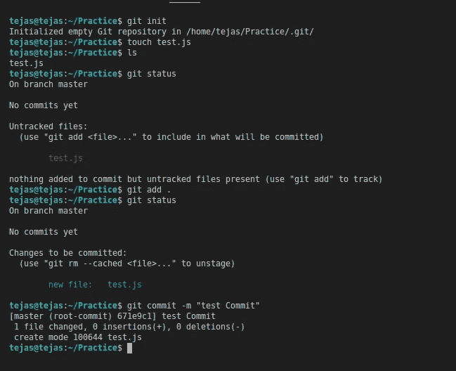

# 开始使用 GIT 所需要知道的一切。

> 原文：<https://blog.devgenius.io/all-you-need-to-know-about-git-662586a546bb?source=collection_archive---------23----------------------->

分布式版本控制管理系统。


Git 是一个分布式的版本控制系统，这篇文章涵盖了你在任何项目中需要了解的所有内容，这些项目中有许多人参与编写代码，并且独立或相关地处理应用程序的不同部分。使用 git 可以做很多事情，但是这里我只提到最重要和最常用的 git 命令和应用程序。

此外，我们将研究一些在使用 git 管理工作时会遇到困难的场景。所以让我们开始吧…

# 以下是你需要知道的 git 的基本命令/应用。

初始化一个新的空 git 储存库。它将创造一个”。git”文件夹，该文件夹将包含所有必要的元数据。

```
$ git init
```

当您在目录中进行更改(如创建新文件和文件夹或更改现有文件和文件夹)时，请检查本地存储库的状态:

```
$ git status
```

git 不会跟踪您创建的新文件，除非您使用 add 命令跟踪它们。此外，如果您对远程存储库中已有的跟踪文件进行了更改，您需要将这些文件添加到临时区域。

```
$ git add .// "." will add all the untracked and unstaged files to the staging area, to add specific files mention the filenames instead of the "."
```

现在，准备提交临时区域。“commit”命令用于将您的更改保存到本地存储库中。

```
$ git commit -m "commit message"//"-m" sets the commit message.
```



现在，您可以将您的提交推送到您在 GitHub、GitLab 或 BitBucket 等上创建的远程存储库。但是如果您还没有克隆您的存储库，那么首先您需要使用以下命令添加一个远程设备:

```
$ git remote add <remote name> <remote URL>#Verify new remote
$ git remote -v
```

要将提交推送到此远程:

```
$ git push <remote name> <branch name>
```

其他有用的命令:

```
// To create and checkout to a new branch
$ git checkout -b <branch name>// To checkout an existing branch
$ git checkout <branch name>// To delete a branch locally
$ git checkout <some other branch name>
$ git branch -D <branch to delete>// To clone a repo
$ git clone <url>// To pull the latest changes in a branch
$ git pull <remote name> <branch name>// To see the changes in the local
$ git diff// To see a list of commits 
$ git log
```

# 现在让我们来看看在使用 git 时可能遇到的一些场景。

# **案例一:**

假设你一直在做一个项目，其他人也在为这个项目做贡献，你为自己剪下一个分支，以对你的工作做出特定的改变，另一个从事其他任务的人也从主分支剪下另一个分支，并在其中做出一些改变。现在您已经完成了分支中的工作，并希望将其与主分支合并。

***对此有两种处理方式:***

**a.** 你可以总是保持你的分支和主分支的基础，这样你就可以在主分支中进行所有的更新。这可以通过下面的命令来完成。

```
$ git pull <remote name> <main branch name> --rebase
```

**b.** 如果你忘记了用主分支重新设置当前分支的基础，并继续在这个新分支中提交你的代码，那么你当前工作的分支将不会有被推入主分支的最新更新，这可能会在你试图将分支合并到主分支时导致冲突。现在，您可以再次运行点“a”中给出的命令，用“main”重新调整您的代码，您将看到冲突，必须通过接受或拒绝更改来解决它们，然后使用以下命令将其合并到 main 中:

```
// after resolving the conflicts, you need to add the changes using git add and then continue the merge
$ git rebase --continue// In case you realise there is something going wrong with the rebasing
$ git rebase --abort// checkout into the destination branch and merge 
$ git checkout <main branch name>
$ git merge <your branch name>
```

或者，您可以直接运行 merge 命令，一次性解决所有冲突。在重置基础的过程中，您可能会遇到一些冲突，您必须解决这些冲突并提交已解决的更改。

# **案例二:**

如果您将提交推送到远程，但不想提交这些更改，您可以将该提交恢复并跳转到之前的提交。这可以通过以下命令完成(小心使用):

```
// --hard will reset everything and bring the head back to another commit, it will not keep the changes.$ git reset --hard <commit-hash>// --soft will reset the head to another commit and will stage the changes from the previous head till the resetted commit, you can edit those and use those changes again.$ git reset --soft <commit-hash>
```

# **案例三:**

如果您提交了一些东西，但是键入了错误的消息或打字错误:

```
$ git commit --amend -m "new commit message"
```

但是，如果您已经提交了提交，则在使用以下命令修改提交后，您必须再次强制提交:

```
$ git push <remote name> <branch name> -f
```

# **案例 4:**

如果您在本地的一个分支中提交，但希望将其推送到其他分支，您可以执行以下操作。

```
$ git push <remote-name> <branch with new changes>:<branch you are pushing to>
```

# 案例 5:

如果您想要挑选特定提交的更改并进一步使用它，或者在另一个分支中进行相同的提交，您可以按如下方式挑选该提交:

```
$ git cherry-pick <commit hash>
```

# 案例 6:

如果在将您的分支合并到主分支之前，您需要清理您的提交或者更改提交消息，或者将多个提交合并为一个提交，等等..中，有一个选项，可以对您想要合并分支的分支进行交互式重新定基，这可以使用以下命令来完成:

```
$ git rebase -i <branch to merge in>---------
you will see all the commits that you have made in your branch
------------------
below options you can use to edit your commits
---------# Rebase <range of commits> onto <main commit>
#
# Commands:
# p, pick <commit> = use commit
# r, reword <commit> = use commit, but edit the commit message
# e, edit <commit> = use commit, but stop for amending
# s, squash <commit> = use commit, but meld into previous commit
# f, fixup <commit> = like "squash", but discard this commit's log message
# x, exec <command> = run command (the rest of the line) using shell
# b, break = stop here (continue rebase later with 'git rebase --continue')
# d, drop <commit> = remove commit
# l, label <label> = label current HEAD with a name
# t, reset <label> = reset HEAD to a label
# m, merge [-C <commit> | -c <commit>] <label> [# <oneline>]
# .       create a merge commit using the original merge commit's
# .       message (or the oneline, if no original merge commit was
# .       specified). Use -c <commit> to reword the commit message.
#
# These lines can be re-ordered; they are executed from top to bottom.
#
# If you remove a line here THAT COMMIT WILL BE LOST.
#
# However, if you remove everything, the rebase will be aborted.
#
# Note that empty commits are commented out
```

# — — — — — — — xxx— — —

我希望这篇文章对你开始使用 git 足够有用。
一个以图形格式查看和跟踪所有提交和分支的好方法是，您可以使用“ [gitk](https://git-scm.com/docs/gitk) ”。

```
// To view the history of commits of a particular branch
$ gitk // To see the history of the complete repository and all the branches
$ gitk --all
```

如果你喜欢的内容，请随时点击拍手👏按钮。
谢谢，干杯！！