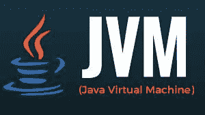
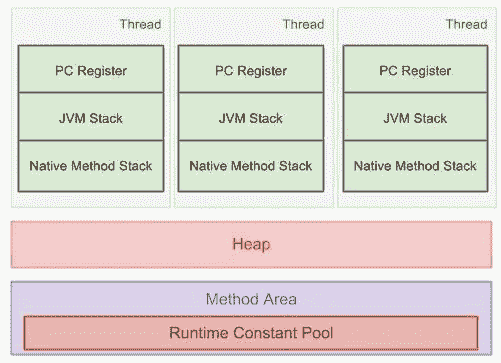
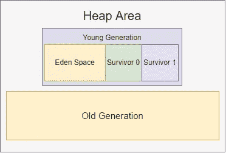
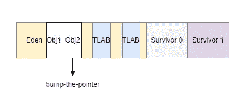

# 关于 JVM 缓存管理和垃圾收集(使用命令)Pt，您需要知道的全部内容。1/2

> 原文：<https://blog.devgenius.io/all-you-need-to-know-about-jvm-cache-management-and-garbage-collection-with-commands-pt-1-2-6bb8d18cd4e2?source=collection_archive---------7----------------------->



# JVM 结构

我以前写过一篇关于 JVM 的简要概述:

[](https://medium.com/@wdn0612/java-backend-developer-interview-questions-pt-1-10-1c74c76442bd) [## Java 后端开发人员面试问题(Pt。1–10)

### 1.JVM 的作用是什么？JVM 是 Java 虚拟机的简称。它为 Java 代码提供了一个运行时环境…

medium.com](https://medium.com/@wdn0612/java-backend-developer-interview-questions-pt-1-10-1c74c76442bd) 

在这里，我们将更深入地研究 JVM 运行时数据区。在这一部分，我们将主要介绍**缓存管理**和**垃圾收集**。第 1 部分将关注 JVM 缓存管理，第 2 部分(即将推出)将讨论 JVM 垃圾收集。这两个概念在 JVM 性能优化中都很重要。正确的理解和适当的配置将使您的 Java 应用程序适应更大的数据流量并允许更快的执行。



## 方法区域

方法区域存储与类相关的信息，例如类名、类中的静态变量、最终变量、类中的字段、方法信息等。例如，当我们使用 getters、setters 或其他与业务逻辑相关的方法时，它们驻留在方法区域中。方法区域在线程之间共享。在 Hotspot VM 中，方法区域对应于永久生成。

**JVM 方法区域配置**

*   **Maxsize**

```
-XX:MaxPermSize <value>
```

*   **最小尺寸**

```
-XX:PermSize <value>
```

## 堆区域

堆区域由线程共享。它是在 JVM 启动时构造的。使用“new”创建的所有实例都分配在堆区域中。

**堆大小配置**

```
-Xms <value>
-Xmx <value>
```

-Xms 是 JVM **s** 启动时获取的堆大小。它默认为物理内存的 1/64，但小于 1GB。-Xmx 是允许的最大堆大小。它默认为物理内存的 1/4，但小于 1GB。默认情况下，当剩余堆空间小于 40%时，JVM 会将堆大小增加到-Xmx 值。我们可以用**-XX:minheafpreeratio**来控制这个比例。如果剩余的堆大小大于 70%，JVM 会将堆空间减少到-Xms 值。我们可以用 **-XX:MaxHeapFreeRatio** 来控制这个。



*   **年轻一代**

创建实例时，会在年轻一代中分配(但大实例可以在老一代中分配)。当年轻一代需要回收时，触发次要垃圾回收(Young GC)。

年轻一代包括伊甸园空间和两个同等大小的幸存者空间(S0 和 S1)。

**年轻一代规模配置**

```
-Xmn <value>
```

**幸存者空间/伊甸园空间配置**

```
-XX:SurvivorRatio=<value>
```

*   **老一代**

当实例在年轻的一代中存活了一定的时间而没有被清除时，它们将被提升到老的一代。这意味着老一代存储的实例在较小的 GC 之后仍然存在。如果超过某个阈值，新实例将被分配到旧代中。在旧的一代满了之后，它触发垃圾收集，这就是所谓的主要垃圾收集。

**老一代实例阈值配置**

```
-XX:PretenureSizeThreshold=<value>
```

## JVM 堆栈

应用程序中的每个线程将占用 JVM 堆栈中的一个堆栈。当每个方法被执行时，一个堆栈帧将被执行。堆栈帧由局部变量、操作数堆栈、帧数据、出口地址等部分组成。当调用一个方法时，堆栈帧进入线程堆栈。完成后，堆栈帧退出堆栈。

## 本机方法区域

本地方法是那些用 java 以外的语言编写的方法。本地库通过 JNI (Java 本地接口)或 JNA(Java 本地访问)链接到 Java 程序。本机方法也与每个线程相关联。

## **PC 寄存器**

PC 寄存器主要存储当前执行线程的行号。因为它记录了每个线程的行号，所以 PC 寄存器是线程私有的。由于 PC 寄存器只记录当前指令的地址，所以它是 JVM 中唯一没有定义 OutOfMemoryError 的区域。

## 举个例子…

假设我们有以下代码:

```
String myName = new String("DN Tech")
```

1.  *我的名字*是当前线程中的引用。它将存储在 JVM 堆栈的局部变量中。
2.  *new String("DN Tech")* 是实际的对象实例，它将被存储在堆区域中。
3.  堆区还记录了与该对象相关的地址，如 *equals()* 和 *indexof()* ，但实际的方法实现和数据都存储在方法区。

# JVM 缓存分配



Java 实例大多在堆区。由于堆区域是在线程之间共享的，所以堆分配需要引入锁来确保线程安全，这导致实例创建的成本更高。为了提高分配效率，HostSpot 虚拟机年轻一代中的 Eden 空间使用了两种技术来实现这一点——指针碰撞和 TLAB(线程本地分配缓冲区)。Bump-the-pointer 旨在跟踪创建的最后一个实例，因此当创建一个新实例时，我们只需要检查最后一个实例之后是否有足够的空间。TLAB 属于多线程。它将在 Eden Space 中为每个新线程创建一个新空间。TLAB 的大小可以使用**-XX:TLABWasteTargetPercent**(默认为 1%)进行配置。通常，JVM 会优先分配 TLAB。如果实例太大或者没有空间留给 TLAB，JVM 将继续在堆区域中分配。

我希望这篇文章对你有所帮助。如果你像我一样渴望学习一些与技术相关的东西或定期反思工作和生活，请关注我的频道，了解我日常工作和生活中的最新灵感。

**接下来**:关于 JVM 缓存管理和垃圾收集(用命令)Pt 你需要知道的一切。2/2(即将推出)

演职员表:
[https://stack overflow . com/questions/18824798/what-is-difference-before-Java-method-and-native-method](https://stackoverflow.com/questions/18824798/what-is-difference-between-java-method-and-native-method)
[https://www . hackere earth . com/practice/notes/runtime-data-areas-of-Java](https://www.hackerearth.com/practice/notes/runtime-data-areas-of-java/#:~:text=5.Native%20Method%20Stack,is%20used%20for%20native%20methods)
[https://blog.csdn.net/suifeng3051/article/details/48292193](https://blog.csdn.net/suifeng3051/article/details/48292193)