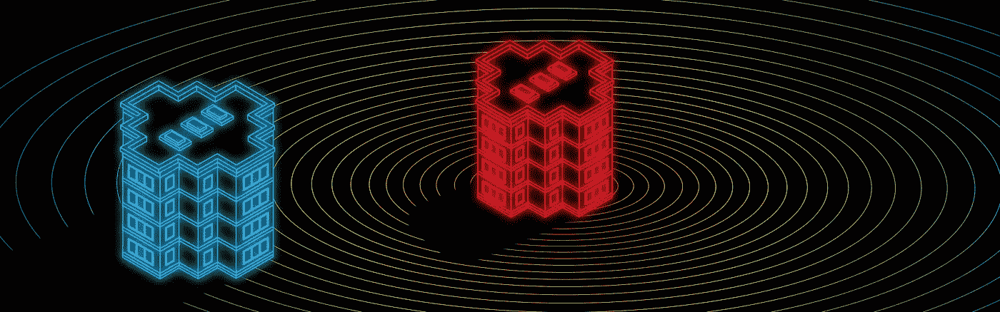
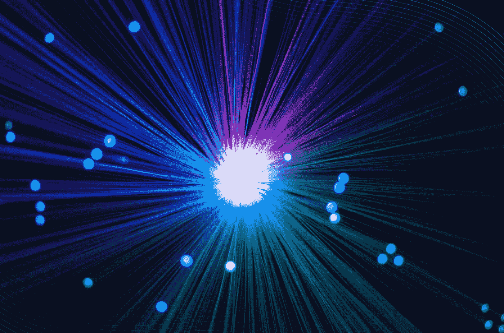
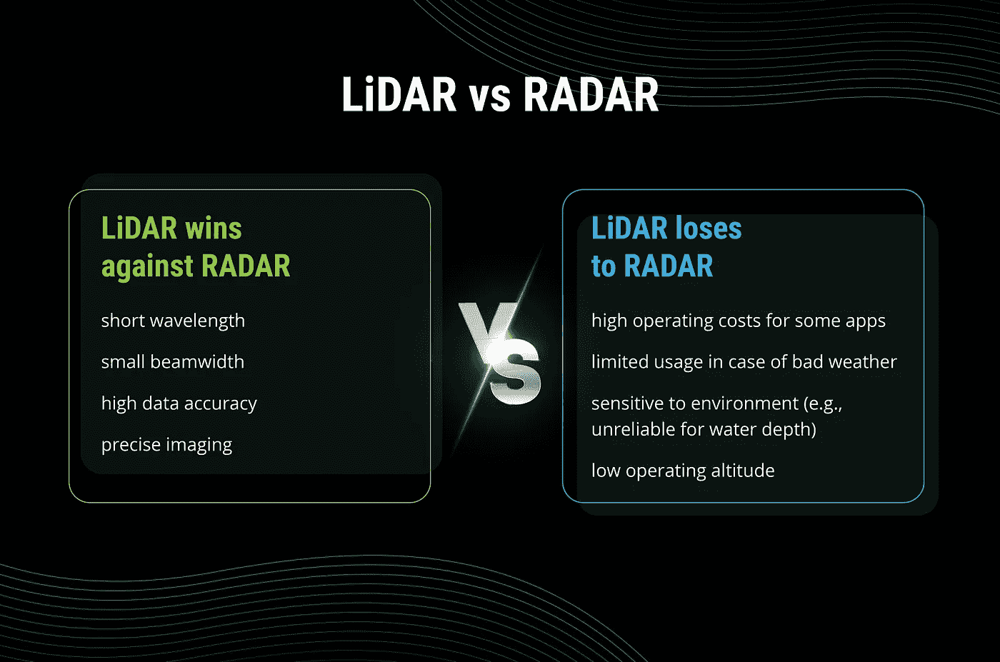
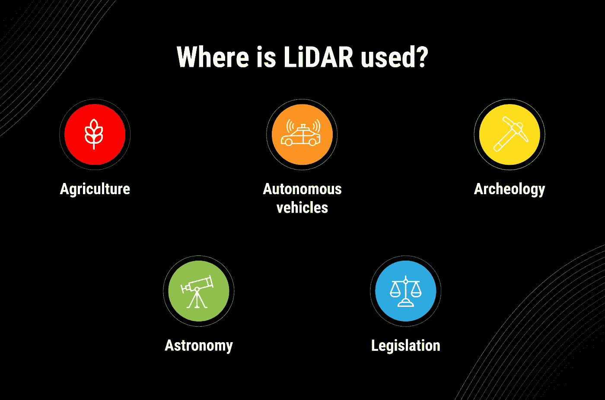
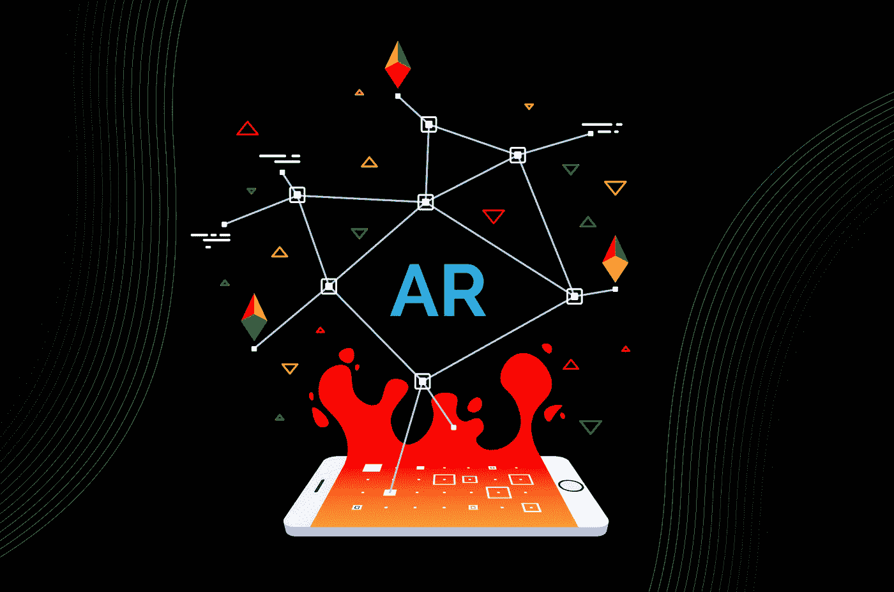

# 关于激光雷达你需要知道的

> 原文：<https://blog.devgenius.io/all-you-need-to-know-about-lidar-cadd7da25678?source=collection_archive---------28----------------------->

## 👉从激光雷达的历史到它进入移动世界的大门— [Emerline](https://emerline.com/) 准备向您介绍激光雷达技术，并展示它如何加速 3D 扫描过程。

# 先从要领说起:激光雷达有什么实际用途？

创建一个提供虚拟家庭内部装饰或家具目录的市场，而完全不涉及设计师的努力，怎么样？

利用增强现实和混合现实眼镜的力量进行 3D 游戏？再说一次，没有必要在乏味的设计过程上花费太多时间。

准备详细的公寓平面图，以传达该地的氛围，并提供准备好存储、导出或与室内建筑专家共享的 3D 模型，以进一步实时展示他们的设计理念？

如今，随着先进的激光雷达传感器集成到手机摄像头中，所有这些用例都变得不那么简单了。通过与 Emerline 的 R&D 团队合作，实现了额外的简单性——我们正在深入研究这项技术，探索其隐藏和显而易见的潜力，并创建在 AR 世界中产生影响的解决方案。

实际上，Emerline 实现了用于创建 3D 布局的激光雷达扫描。该技术可以获得全彩色扫描的 3D 房间(涉及神经网络)，识别独立的 3D 对象，并在需要时对每个对象进行分类。

*Emerline 展示了激光雷达如何有助于快速 3D 扫描。*

新的 AR 维度，游戏行业的更多机会，先进的虚拟市场，3D 房屋和公寓，以及由混合现实驱动的下一代 3D 模型——这种整体的“未来即现在”概念听起来很有希望。那么是什么让激光雷达成为 3D 扫描的新浪潮呢？

在强调了我们的激光雷达实践经验之后，我们准备好揭示技术本身。

# 什么是激光雷达？

## 它有多老了？

事实上，这项技术并不新鲜——第一台激光雷达或光探测和测距原型出现在 1961 年，由休斯飞机公司为军事用途创造。然后有一个美国太空计划，其中激光雷达技术涉及月球表面测绘。今天，激光雷达的应用领域不仅限于太空，还包括考古、地理、林业、激光制导、自主机器等。

## 激光雷达是如何工作的？

简而言之，[激光雷达](https://en.wikipedia.org/wiki/Lidar)是一种遥感方法，旨在“通过用激光照射目标，并用传感器测量反射来测量距离。激光返回时间和波长的差异可以用来制作目标的数字三维图像。”

激光雷达的关键组件包括扫描仪和激光器。它们都有助于精确的数据收集，以及光学和光电探测器。

根据功能的不同，激光雷达解决方案分为:

**机载**(一种动态多传感器系统，使用导航单元(GNSS，IMU)测量信号从信号源到返回传感器的飞行时间；一般安装在直升机/无人机上，收集必要的数据)；

**地面**(另一个术语是地形激光雷达；机载激光雷达的地面选项，安装在移动的车辆上，用于地形或景观制图。它可以快速识别各种道路资产和基础设施。工作原理与机载类似——激光信号根据返回激光脉冲的延迟来测量距离)**。**

# 激光雷达有哪些利弊？

不要混淆激光雷达和雷达——虽然听起来很相似，但它们是不同的概念，具有不同的工作机制。

让我们仔细看看每一个的功能算法。

激光雷达发射的激光信号到达物体，反射并返回接收器。激光雷达和雷达的核心区别在于，后者使用无线电波而不是声音，同时遵循相似的物体探测目的和相同的工作原理。

激光雷达技术的一些独立优势之一是有机会与其他数据源集成。它自动化并简化了复杂的数据分析和处理。虽然面临明确的环境限制，但激光雷达传感器不受几何失真的限制，这使得激光雷达技术在其他数据收集形式中脱颖而出。

至于有效的应用领域，在距离优先于目标观察的情况下，雷达无疑是首选。当我们需要识别物体类型时，激光雷达及其基于光的原理更加有效。

# 激光雷达有哪些顶级用途？

是时候探索从光探测和测距中获益最多的领域了。调查环境并制作其 3D 模型在哪里变得至关重要？以下是最受欢迎的行业，它们积极利用激光雷达的力量来完成任务。

## **农业**

当谈到表面和地面时，这是第一个联想。激光雷达可以很好地分析土壤质量、作物状况和田地状况(定期和在不同的生长阶段)，以实现令人印象深刻的收获。激光雷达也有利于进行精确的作物分类和确定合适的种植区域。

## **自动驾驶汽车**

由于激光雷达传感器，自动驾驶汽车的想法已经付诸实践。这就是这些车辆类型“看到”周围环境和行人、障碍物或其他车辆的方式。从精确导航和障碍物探测到自适应巡航控制，这些都是激光雷达的责任范围。

## **考古学**

激光雷达已经证明了其在微地形相关任务中的价值——考古学家近距离观察表面，定义地形可变性，并检查植被结构。

## **天文学**

美国宇航局提到激光雷达是提供安全登陆月球表面的车辆的核心技术。即使在 20 世纪末，使用激光雷达技术绘制地形图也相当普遍。如上所述，这已经是历史了。

## **立法**

为了简化法律强化活动，激光雷达系统旨在捕捉犯罪现场，以 3D 方式可视化指纹，并进行精确的法医检查。激光脉冲也可以测量速度，因此超速的司机数量减少了。

在关注使用激光雷达的关键行业的同时，我们可以继续讨论越来越多的激光雷达应用示例。这项技术已经在生物、采矿、运输、媒体和娱乐等领域扎根。

嗯，我们已经到了问题的核心。激光雷达对 AR 意味着什么？苹果为什么把希望寄托在它身上？激光雷达扫描仪是否有机会在数字世界取得突破？

# 苹果和激光雷达

激光雷达扫描仪征服了苹果产品——在新的 iPad Pro 中实现，它也将丰富手机的功能。说实在的，激光雷达展示了一个 AR 体验的新时代，同时提供了对场景更详细的理解。ARKit 的改进包括更准确的动作捕捉和更好的整体性能。

计算高度或面积变得像 ABC 一样简单，3D 游戏获得了难以置信的逼真对象。

激光雷达扫描仪会宣称成为移动领域的游戏规则改变者吗？就目前而言，这绝对是一种创建前沿 AR 应用程序的创新方式。Emerline 与这项最新技术的传播保持同步，并深入研究其实际用途。

如果你对激光雷达驱动的 iOS 应用程序感兴趣，或者想了解更多关于移动激光雷达的信息，你可以自由地[联系我们的专家](https://emerline.com/company/contacts)。我们准备提供更多的信息，并向您展示它是如何工作的。

*最初发表于*[*https://emerline.com*](https://emerline.com/blog/core-facts-about-lidar-you-should-know)*。*