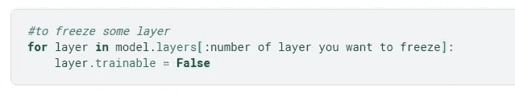

# 关于迁移学习，你需要知道的是

> 原文：<https://blog.devgenius.io/all-you-need-to-know-about-transfer-learning-4a7e3cbaf1dd?source=collection_archive---------7----------------------->


# 目录

*   1.介绍
*   1.1.什么是迁移学习？
*   1.2.迁移学习的需要
*   1.3.限制
*   2.使用预训练模型
*   3.微调最后一层
*   4.冻结一些层和微调模型层的其余部分
*   5.仅使用模型架构，从头开始学习权重

# 1.介绍

## 1.1 什么是迁移学习？

*迁移学习就像站在巨人的肩膀上*

在迁移学习中，我们使用预先训练的知识或权重，并在数据集上调整或微调模型

转移学习是一种实际上把已经完成的工作转移到不同领域的方法
例如- **Imagenet** 包含猫、狗、公共汽车和许多日常物品的常规图像。我们在这些图像上训练模型，并在疟原虫检测或任何其他任务中使用该知识

*迁移学习在计算机视觉和 NLP 任务中非常流行。在自然语言处理中，我们可以使用基于变压器的模型，如 BERT
在本教程中，我们将重点关注计算机视觉*

ImageNet 是一个图像分类问题，包含超过 1400 万张图像和 1000 个类别

## 1.2.迁移学习的需要？

1.  如果我们的数据集真的很小
2.  低计算能力
3.  如果我们的数据集与预训练数据相似，那么我们只需微调我们的模型，这将节省大量时间

## 1.3.限制

1.  数据集与训练前的数据完全不同

# 2.使用预训练模型

在预训练模型中，我们完全使用图像净重，而没有对模型进行任何微调。**这种方法的问题**是我们只能根据预先训练的模型权重被训练的类别来分类或执行任务
imagenet 1000 类别-[https://gist.github.com/yrevar/942d3a0ac09ec9e5eb3a](http://In pretrained model we use imagenet weight completely without any fine tuning of model.Problem with this approach is that we can only classify or perform task based upon the classes in which pretrained model weights are train imagenet 1000 classes-https://gist.github.com/yrevar/942d3a0ac09ec9e5eb3a)

## 从维基百科下载图片进行分类

1.微型货车
2。滑行
3。哈巴狗

```
*#mini-van*
!wget https://upload.wikimedia.org/wikipedia/commons/b/b4/Bloody_Bridge_car_park%2C_May_2010_%2806%29.JPG
*#Taxi*
!wget https://upload.wikimedia.org/wikipedia/commons/e/ef/NYC_Taxi_Ford_Crown_Victoria.jpg
*#pug dog*
!wget https://upload.wikimedia.org/wikipedia/commons/f/f0/Mops_oct09_cropped2.jpg
```

## 重要的模型参数

1.  **权重**-由于我们在这里使用预训练模型，我们设置了 weight='imagenet'。如果我们设置 weight='None ',那么我们就不能使用预训练权重。
2.  **include _ top**-是否包含网络顶部的 3 个全连通层。因为我们想在没有训练的情况下进行分类，所以我们必须设置 include_top='True '。如果我们设置 include_top='False ',那么我们必须为预训练模型添加密集层和输出层，这在预训练中是不需要的，我们将在微调最后一层&中看到 include_top='False ',冻结一些层，微调其余的层。
3.  **input_shape**-图像的输入大小，因为我们设置了 include_top='True '和 weights= 'imagenet '，那么 input _ shape 必须是'(224，244，3)'。如果 weights='imagenet '和 include_top='True ',则我们无法对自定义图像形状进行训练或分类。如果您想根据自定义图像大小进行训练，请确保 weights 不等于“imagenet ”, include _ top 不等于“True”。权重必须为零或 include_top='False '
4.  当我们设置 include_top='True '时，那么 classes='1000 '和 classifier_activation='softmax '

```
from keras.applications.vgg19 import VGG19
*# load the model*
model = VGG19(weights= 'imagenet',include_top=True,input_shape=(224,224,3))
model.summary()from keras.preprocessing.image import img_to_array
from keras.preprocessing.image import load_img
import numpy as np
from keras.applications.vgg16 import preprocess_input
from tensorflow.keras.applications.mobilenet import decode_predictions
def make_classification(image):
    pred = model.predict(image)
    pred_classes = decode_predictions(pred, top=5)
    for i **in** pred_classes[0]:
        print(i)

def preprocess(image_name):
    image = load_img(image_name, target_size=(224, 224))
    image = img_to_array(image)
    image = np.expand_dims(image, axis=0)
    image = preprocess_input(image)
    return imagemini_bus='Bloody_Bridge_car_park,_May_2010_(06).JPG'
pubg_dogs='Mops_oct09_cropped2.jpg'
taxi='NYC_Taxi_Ford_Crown_Victoria.jpg'

*#classifing mini_van* 
print("for mini bus")
image=preprocess(mini_bus)
make_classification(image)
print("**\n**")
print("**\n**")
*#classifing pubg_dogs* 
print("for pubg dogs")
image=preprocess(pubg_dogs)
make_classification(image)
print("**\n**")
print("**\n**")
*#classifing taxi* 
print("for taxi")
image=preprocess(taxi)
make_classification(image)
print("**\n**")
print("**\n**")
```


输出

为了解释`3.Fine tuning Last layer,4.Freezing some layer and Fine tuning rest of model’s layer` & `5.Use only model architecture and learn weight from scratch`的概念，我将使用来自 kaggle- [链接](https://www.kaggle.com/c/aerial-cactus-identification)的空中仙人掌数据

## 数据准备

```
import pandas as pd
train=pd.read_csv("/kaggle/input/aerial-cactus-identification/train.csv")train.head()has_cactus=train['has_cactus'].value_counts()
print(has_cactus)import tensorflow as tf
from tensorflow.keras import Sequential
from tensorflow.keras.layers import Flatten,Dense,Conv2D,MaxPooling2D,ZeroPadding2D,Dropout
from tensorflow.keras.preprocessing.image import ImageDataGeneratordatagen=ImageDataGenerator(rescale=1/255,validation_split=0.30)train["has_cactus"]= train["has_cactus"].apply(str)bs = 64
train_generator = datagen.flow_from_dataframe(
    dataframe = train,
    x_col = "id",
    y_col = "has_cactus",
    subset = "training",
    batch_size = bs,
    target_size=(32,32),
    *#seed = 1,*
    shuffle = True,
    class_mode = "categorical")

valid_generator = datagen.flow_from_dataframe(
    dataframe = train,
    x_col = "id",
    y_col = "has_cactus",
    subset = "validation",
    target_size=(32,32),
    batch_size = bs,
    shuffle = True,
    class_mode = "categorical")
```

# 3.微调最后一层

在这一点上，我们将使用所有卷积层的 imagenet 权重，并添加输出层，然后我们将训练最后一层

# 重要的模型参数

1.  **weights**-由于我们正在微调我们的模型，我们将设置 weight='imagenet'。如果我们设置 weight='None ',那么我们就不能使用在 imagenet 上训练的 weight。
2.  **include _ top**-是否包括网络顶部的 3 个全连接层不包括。这里，我们在自定义数据集上微调模型的最后一层，因此我们需要根据数据集中的类数量添加输出层。这里，我们将设置 include_top='False '
3.  **input _ shape**-由于我们设置了 include_top='False ',因此我们对 vgg19 的任何图像大小进行训练，图像大小不应小于 32x32。
4.  因为我们已经设置了 include_top='False '，所以不需要在这里传递类的数量，我们将在密集层中传递类的数量，对于 classifier_activation 也是如此

```
#importing model
from tensorflow.keras.applications.vgg19 import VGG19#downloading the model with imagenet weightsmodel = VGG19(weights= 'imagenet',include_top=False,input_shape=(32,32,3))
```

## 使层可训练=假或冻结卷积层

这将使每一层不可训练


```
*#to freeze some layer*
for layer **in** model.layers[:]:
    layer.trainable = False
```

这里 layer_n='False '意味着你不想训练那个层，你也可以说我们已经冻结了那个层
。当 layer_n='True '意味着你想训练那个层
为 include_top= 'False ',那么我们只有卷积层，我们已经冻结了那些层

```
for layer **in** model.layers:
    sp=' '[len(layer.name):]
    print(layer.name,sp,layer.trainable)
```


输出

```
from tensorflow.keras.models import Model
x = Flatten()(model.output)

prediction = Dense(2, activation='softmax')(x)

*# create a model object*
model = Model(inputs=model.input, outputs=prediction)model.summary()
```

编译模型

```
model.compile(loss='categorical_crossentropy', optimizer="adam", metrics=['accuracy'])
```

模型训练

```
history = model.fit_generator(train_generator,
                         steps_per_epoch = len(train_generator),
                         epochs = 5,
                         validation_data = valid_generator,
                         validation_steps = len(valid_generator),
                         verbose=1)
```

绘制训练和验证曲线

```
import matplotlib.pyplot as plt
def plot_learningCurve(history, epoch):
    *# Plot training & validation accuracy values*
    epoch_range = range(1, epoch+1)
    plt.plot(epoch_range, history.history['accuracy'])
    plt.plot(epoch_range, history.history['val_accuracy'])
    plt.title('Model accuracy')
    plt.ylabel('Accuracy')
    plt.xlabel('Epoch')
    plt.legend(['Train', 'Val'], loc='upper left')
    plt.show()

    *# Plot training & validation loss values*
    plt.plot(epoch_range, history.history['loss'])
    plt.plot(epoch_range, history.history['val_loss'])
    plt.title('Model loss')
    plt.ylabel('Loss')
    plt.xlabel('Epoch')
    plt.legend(['Train', 'Val'], loc='upper left')
    plt.show()

plot_learningCurve(history, 5)
```


输出

# 4.冻结一些层和微调模型层的其余部分

在这种情况下，我们将冻结一些层和微调其余的层。在开始层模型了解边缘和圆度。

## 重要的模型参数

1.  **权重**-由于我们正在微调我们的模型，我们将设置 weight='imagenet'。如果我们设置 weight='None ',那么我们就不能使用在 imagenet 上训练的权重。
2.  **include _ top**-是否包括网络顶部的 3 个完全连接的层不包括。这里，我们在自定义数据集上微调模型的最后一层，因此我们需要根据数据集中的类数量添加输出层。这里，我们将设置 include_top='False '
3.  **input _ shape**-由于我们已经设置 include_top='False '那么我们对 vgg19 的任何图像大小进行训练，图像大小不应小于 32x32。
4.  因为我们已经设置了 include_top='False '，所以不需要在这里传递类的数量，我们将在密集层中传递类的数量，对于 classifier_activation 也是如此

```
from tensorflow.keras.applications.vgg19 import VGG19
#downloading the model with imagenet weightsmodel = VGG19(weights= 'imagenet',include_top=False,input_shape=(32,32,3))
```

# 使 layer.trainable = False 或冻结一些层

在这里，我们包括 _top=False，所以我们只有一个卷积层，我们通过制作层来冻结开始的 8 层。可训练= 'False'
**代码:**



```
*#to freeze some layer*
for layer **in** model.layers[:8]:
    layer.trainable = False
```

这里 layer_n='False '表示您不想训练该层，您也可以说我们已经冻结了该层
。当 layer_n='True '表示您想要将该层
训练为 include_top= 'False '时，我们只有卷积层，并且我们已经冻结了开始 8 层

```
for layer **in** model.layers:
    sp=' '[len(layer.name):]
    print(layer.name,sp,layer.trainable)
```


输出

```
from tensorflow.keras.models import Model
x = Flatten()(model.output)

prediction = Dense(2, activation='softmax')(x)

*# create a model object*
model = Model(inputs=model.input, outputs=prediction)
model.summary()
```

编译模型

```
model.compile(loss='categorical_crossentropy', optimizer="adam", metrics=['accuracy'])
```

模型训练

```
history = model.fit_generator(train_generator,
                         steps_per_epoch = len(train_generator),
                         epochs = 5,
                         validation_data = valid_generator,
                         validation_steps = len(valid_generator),
                         verbose=1)
```

绘图训练和测试精度

```
import matplotlib.pyplot as plt
def plot_learningCurve(history, epoch):
    *# Plot training & validation accuracy values*
    epoch_range = range(1, epoch+1)
    plt.plot(epoch_range, history.history['accuracy'])
    plt.plot(epoch_range, history.history['val_accuracy'])
    plt.title('Model accuracy')
    plt.ylabel('Accuracy')
    plt.xlabel('Epoch')
    plt.legend(['Train', 'Val'], loc='upper left')
    plt.show()

    *# Plot training & validation loss values*
    plt.plot(epoch_range, history.history['loss'])
    plt.plot(epoch_range, history.history['val_loss'])
    plt.title('Model loss')
    plt.ylabel('Loss')
    plt.xlabel('Epoch')
    plt.legend(['Train', 'Val'], loc='upper left')
    plt.show()

plot_learningCurve(history, 5)
```


输出

## 5.仅从头开始使用模型架构和培训

## 重要的模型参数

1.  **权重**-因为我们从头开始训练我们的模型，所以我们将设置权重=‘无’。
2.  **include _ top**-是否包含网络顶部的 3 个全连通层。这里我们设置了 include_top=True，它将添加完全连接的层。如果你愿意，你可以设置 include_top=False，然后你必须定义输出层和密集层
3.  **Input _ shape**-当我们设置 include_top='False '或 weights= 'None '时，输入图像的大小，然后我们对 vgg19 的任何图像大小进行训练，图像大小不应小于 32x32。
4.  **类** =2
5.  **分类器 _ 激活** =softmax

```
from tensorflow.keras.applications.vgg19 import VGG19#here weight is None
model = VGG19(weights= None,include_top=True,input_shape=(32,32,3),classes=2,classifier_activation="softmax")
```

使所有层可训练

```
for layer **in** model.layers:
    sp=' '[len(layer.name):]
    print(layer.name,sp,layer.trainable)
```


输出

编译模型

```
model.compile(loss='categorical_crossentropy', optimizer="adam", metrics=['accuracy'])
```

模型训练

```
history = model.fit_generator(train_generator,
                         steps_per_epoch = len(train_generator),
                         epochs = 5,
                         validation_data = valid_generator,
                         validation_steps = len(valid_generator),
                         verbose=1
```

绘制训练和测试曲线

```
import matplotlib.pyplot as plt
def plot_learningCurve(history, epoch):
    *# Plot training & validation accuracy values*
    epoch_range = range(1, epoch+1)
    plt.plot(epoch_range, history.history['accuracy'])
    plt.plot(epoch_range, history.history['val_accuracy'])
    plt.title('Model accuracy')
    plt.ylabel('Accuracy')
    plt.xlabel('Epoch')
    plt.legend(['Train', 'Val'], loc='upper left')
    plt.show()

    *# Plot training & validation loss values*
    plt.plot(epoch_range, history.history['loss'])
    plt.plot(epoch_range, history.history['val_loss'])
    plt.title('Model loss')
    plt.ylabel('Loss')
    plt.xlabel('Epoch')
    plt.legend(['Train', 'Val'], loc='upper left')
    plt.show()

plot_learningCurve(history, 5)
```


输出

# 结束注释

1.  在本笔记本中，我们使用了 VGG19，但是您可以使用任何适用于所有型号[https://keras.io/api/applications/](https://keras.io/api/applications/)的模型程序
2.  **input_shape**-输入图像的大小，我们设置 include_top='True '和 weights= 'imagenet '，那么 input _ shape 必须是'(224，244，3)'。如果 weights= 'imagenet '和 include_top='True ',则我们无法训练自定义图像形状。如果您想根据自定义图像大小进行训练，请确保 weights 不等于“imagenet ”, include _ top 不等于“True”。权重必须为零或 include_top='False


3.如果 layer_n='False '表示您不想训练该层，当 layer_n='True '表示您我们想要训练该层时，您也可以说我们已经冻结了这些层

**代码**


Kaggle 笔记本-[https://www . ka ggle . com/rahulanand 0070/all-you-need-know-about-transfer-learning-CNN/Notebook](https://www.kaggle.com/rahulanand0070/all-you-need-to-know-about-transfer-learning-cnn/notebook)