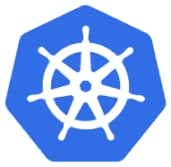

# 开始使用 Kubernetes (Kubelet)的所有信息

> 原文：<https://blog.devgenius.io/all-you-need-to-know-to-get-started-in-kubernetes-kubelet-f470dc384033?source=collection_archive---------15----------------------->

读完这篇文章后，您将对 kubernetes 集群中的 kubelet 组件有一个较高层次的理解。您还将学习如何根据您设置集群的方式来安装它。

如果你想从这篇文章中得到最大的收获，我强烈推荐我的文章，这篇文章简要概述了 kubernetes 架构。 [**链接此处**](https://medium.com/dev-genius/the-kubernetes-cluster-architecture-simplified-3c4a5fb41449)



让我们开始吧。

这个 **kubelet** ，就像是这艘船上的船长(工人节点)。他们领导船上的所有活动，并且是与主船(主节点)的唯一联系点。

kubelet 的职责如下:

*   做所有必要的文书工作来成为集群的一员。
*   按照船长**调度程序**的指示在船上装卸集装箱。
*   定期发回关于船和船上集装箱状况的报告。
*   向 kubernetes 集群注册节点。


库伯莱的责任

当 kubelet 收到在节点上加载容器或 POD 的指令时，它会请求容器运行时引擎(可能是 Docker)提取所需的映像并运行实例。

然后，kubelet 继续监控 POD 和其中的容器的状态，并及时向 **kube-api 服务器**报告。

# 你如何安装 kubelet？

如果您使用 kubeadm 工具来部署您的集群，它不会自动部署 kubelet。

这就是和其他组件的区别。

您必须总是在您的 worker 节点上手动安装 kubelet。下载安装程序，解压并作为服务运行。

```
wget [https://storage.googleapis.com/kubernetes-release/release/v1.13.0/bin/linux/amd64/kubelet](https://storage.googleapis.com/kubernetes-release/release/v1.13.0/bin/linux/amd64/kubelet)
```

您可以通过在 worker 节点上列出流程并搜索 kubelet 来查看正在运行的 kubelet 流程和有效选项。

```
ps -aux | grep kubelet
```

我们将在另一篇文章中更深入地探讨 kubelets，如何配置它们，生成证书，以及如何 TLS 引导 kubelets。

*最初发表于* [*我的博客*](https://luispreciado.blog/posts/kubernetes/core-concepts/kubelet) *。*