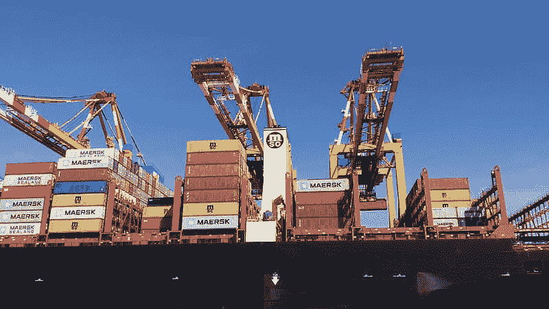
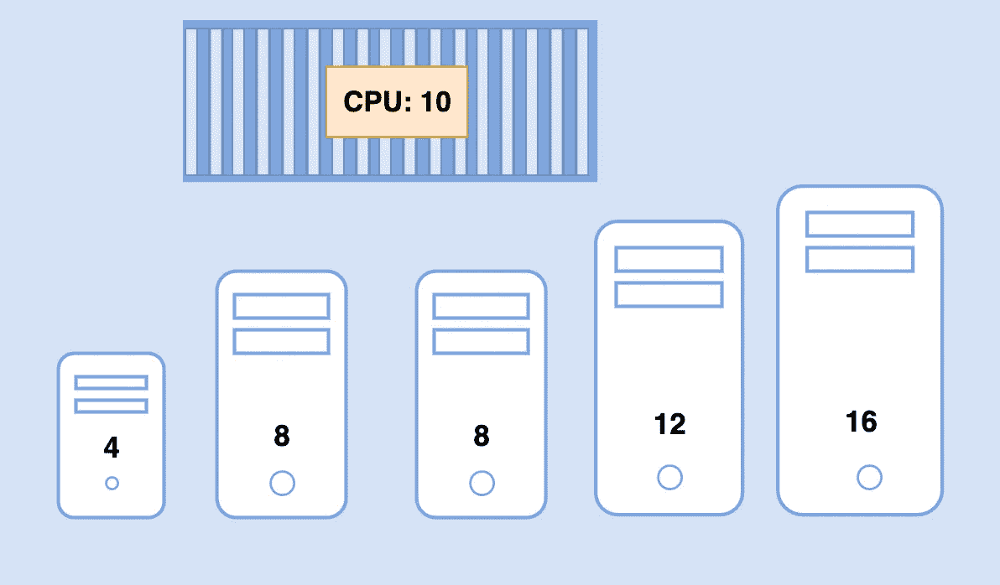
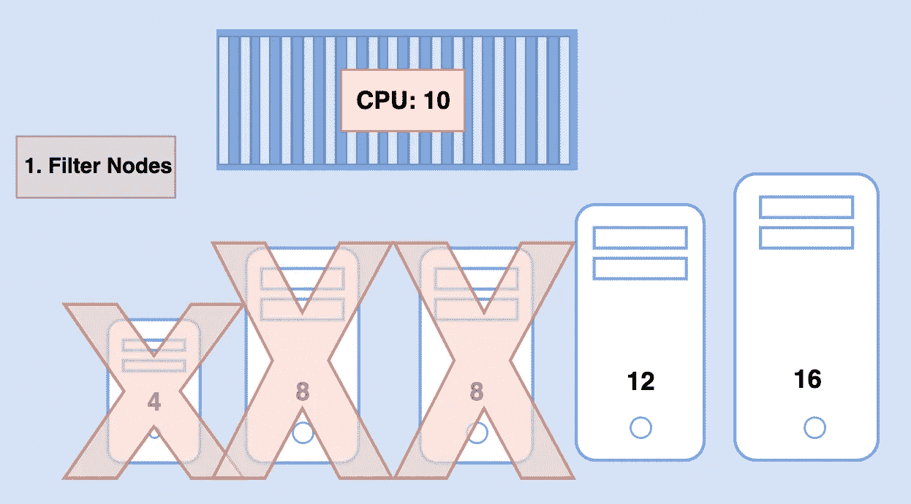
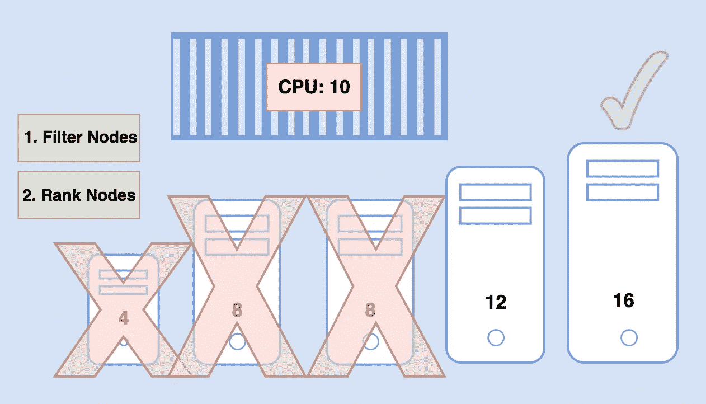

# 开始使用 Kube 调度程序(Kubernetes)所需要知道的一切

> 原文：<https://blog.devgenius.io/all-you-need-to-know-to-get-started-with-the-kube-scheduler-kubernetes-8d9b18bc97fe?source=collection_archive---------7----------------------->

我们来谈谈 Kubernetes 中的 Kube 调度程序。

读完这篇文章后，你会有:

*   从高层次理解 kube 调度程序。
*   已安装 kube 调度程序。

如果您想重温 kubernetes 集群的整体架构，我建议您查看我以前的文章，因为它将帮助您从这篇文章中获得最大收益。[链接此处](https://medium.com/dev-genius/the-kubernetes-cluster-architecture-simplified-3c4a5fb41449)

***kubernetes 调度器负责调度节点*** *上的 pod。*

现在，为了清楚起见，调度器**只负责决定哪个 pod 在哪个节点**上。它实际上并没有把 pod 放在节点上，那是 kubelet 的责任。

船上的 **kubelet** 或“船长”(节点)是在船上创建 pod 的人。调度程序只决定哪个舱去哪里。



# 为什么需要一个调度程序？

当有许多船和许多集装箱时，你要确保正确的集装箱最终到达正确的船上。

用 kubernetes 的话来说:您希望确保正确的 pod 最终出现在适当的节点上。

例如:

*   可能有不同大小的船只和集装箱。
*   你要确保船有足够的容量来容纳那些集装箱。
*   不同的船可能去不同的目的地。

你要确保你的集装箱被放在正确的船上，以便它们最终到达正确的目的地。

如前所述，在 kubernetes 中，调度程序根据某些标准决定将 pod 放在哪个节点上:

*   您可能有不同资源需求的 pod，
*   您可以让群集中的节点专用于某些应用程序。

# 调度程序如何分配这些单元？

调度程序会查看每个单独的 POD，并尝试找到托管它的最佳节点。

让我们看一个例子来说明:



蓝色的大 POD 有一组上面描述的 CPU 和内存需求。

调度程序通过两个阶段来确定 pod 的最佳节点:

1.  调度程序会尝试过滤掉不符合此 pod 配置文件的节点。
2.  调度程序对节点进行排序，以确定最适合 pod 的节点。

对于第一步，不具有 pod 所请求的足够 CPU 和内存资源的节点将被丢弃。

所以前三个小节点被过滤掉了。我们现在剩下两个可以放置 POD 的节点。



现在，调度程序如何从剩余的两个 pod 中选择一个呢？

在第二步中，使用优先级函数在 0 到 10 的范围内给节点分配分数。

调度程序计算将 pod 放在节点上后节点上的空闲资源量。

在这种情况下，如果将 pod 放在右边的设备上，右边的设备将有 6 个空闲 CPU，比另一个设备多 4 个，因此它获得了更好的等级。

所以它“赢”了。



这就是调度程序在高层次上的工作方式。

此外，这些可以定制，您也可以编写自己的调度程序。

在排班方面还有很多话题需要讨论，例如:

*   所需资源
*   限制
*   污点和宽容
*   节点选择器
*   相似性规则

这些将会在接下来的文章中更详细的讨论。

现在，我们将继续关注高级调度程序。

# 你如何安装 kube-scheduler？

从 kubernetes 发布页面下载 kube-scheduler。提取它并将其作为服务运行:

```
wget [https://storage-googleapis.com/kubernetes-release/release/v1.13.0/bin/linux/amd64/kube-scheduler](https://storage-googleapis.com/kubernetes-release/release/v1.13.0/bin/linux/amd64/kube-scheduler) kube-scheduler.service
```

# 如何看待 kube-scheduler 服务器选项？

如果使用 kubeadm 工具进行设置，kubeadm 会将 kube-scheduler 作为一个 pod 部署在主节点上的 kube-system 名称空间中。

您可以在位于以下位置的 pod 定义文件中看到这些选项:

```
cat /etc/kubernetes/manifests/kube-scheduler.yaml
```

此外，通过列出主节点上的流程并搜索 kube-scheduler，您可以看到正在运行的流程和有效的选项。

```
ps -aux | grep kube-scheduler
```

*原载于* [*我的博客*](https://luispreciado.blog/posts/kubernetes/core-concepts/schedulers) *。*