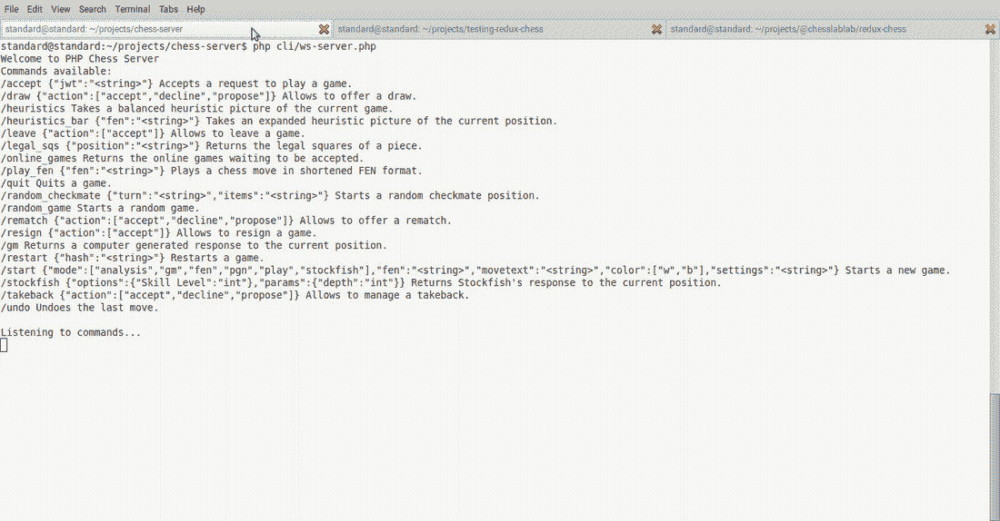
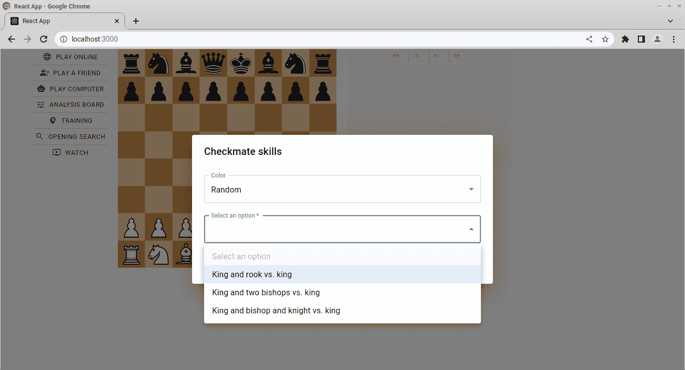
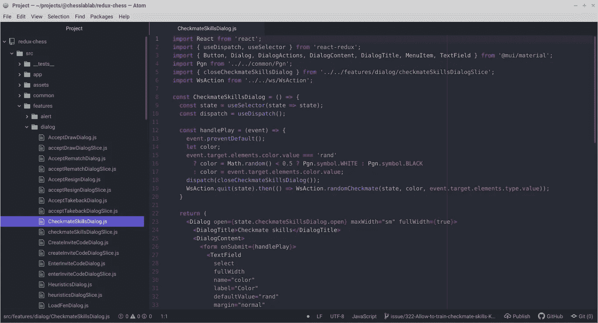
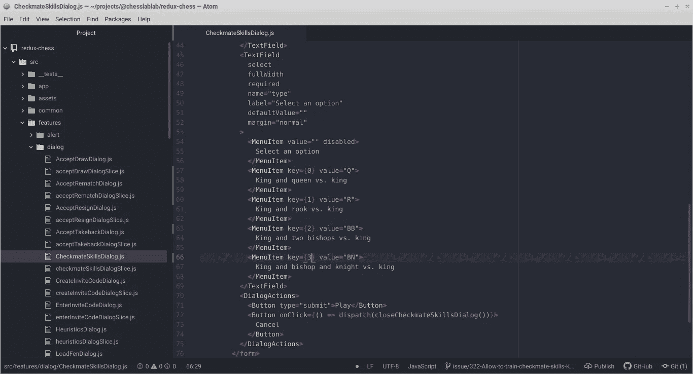
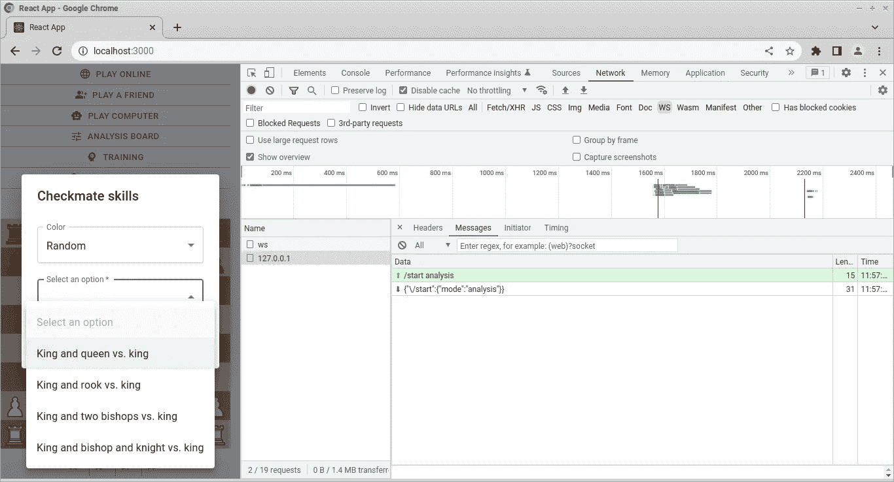
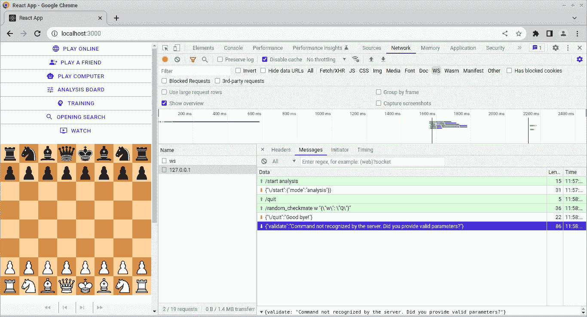
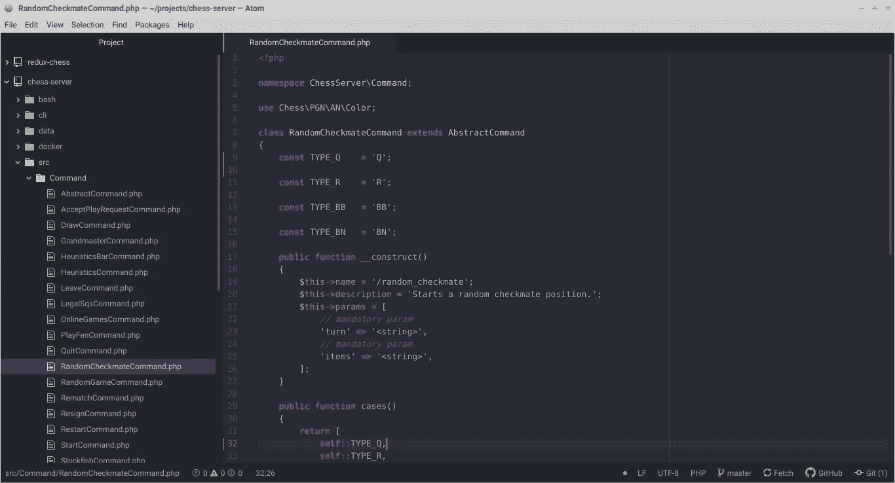

# 允许训练将死技能:国王和王后对国王

> 原文：<https://blog.devgenius.io/allow-to-train-checkmate-skills-king-and-queen-vs-king-7d4d3f662602?source=collection_archive---------8----------------------->

## 让我们用几句话来解决这个问题


亚历山大·密尔斯在 [Unsplash](https://unsplash.com/s/photos/checkmate?utm_source=unsplash&utm_medium=referral&utm_content=creditCopyText) 上拍摄的照片

嗨，朋友们，一切都好吗？我希望你今天过得愉快。

这是“让我们开门见山”系列的第一篇文章，我们用几句话解决了 GitHub 上的问题。挑战在于如何用大约 500 字或更少的文字解释如何解决 ChesslaBlab 问题。

欢迎投稿！

[](https://programarivm.medium.com/solving-issues-on-github-in-few-words-e63a115a3260) [## 用几句话解决 GitHub 上的问题

### 让我们开门见山吧

programarivm.medium.com](https://programarivm.medium.com/solving-issues-on-github-in-few-words-e63a115a3260) 

今天，我们将增加一个惊人的新功能来帮助玩家提高他们的将死技能。

[](https://github.com/chesslablab/redux-chess/issues/322) [## 允许训练将死技能:国王和王后对国王问题# 322 chess lab/redux-国际象棋

### 现在国王和王后对战国王将死的训练不能在训练>将死上进行…

github.com](https://github.com/chesslablab/redux-chess/issues/322) 

假设这是一个全栈 SPA，我们将同时处理应用程序的前端和后端。

[](https://github.com/chesslablab/chess-server/issues/82) [## 允许训练将死技能:国王和王后对国王问题# 82 chess lab/国际象棋服务器

### 此时您不能执行该操作。您已使用另一个标签页或窗口登录。您已在另一个选项卡中注销，或者…

github.com](https://github.com/chesslablab/chess-server/issues/82) 

如果你是 ChesslaBlab 的新手，并从零开始一步一步地遵循本教程，请确保首先阅读 Redux Chess 测试应用程序的 [README.md](https://github.com/chesslablab/testing-redux-chess) 。

## 让我们从前端开始。

请打开一个 Linux 终端。

建议在控制台上打开两个新的附加选项卡:一个用于象棋服务器，另一个用于 Redux 象棋应用程序。你应该会同时打开三个标签，如下图所示。



**图一**。[棋牌服务器](https://github.com/chesslablab/chess-server)、 [Redux 棋牌测试 App](https://github.com/chesslablab/testing-redux-chess) 和 [Redux 棋牌](https://github.com/chesslablab/redux-chess)

启动 chess 服务器和测试应用程序后，可以在浏览器中查看该应用程序。



**图二**。目前，有三种不同的将军可供训练

首先要做的是点击第三个标签，根据[投稿指南](https://github.com/chesslablab/redux-chess/blob/master/CONTRIBUTING.md)创建一个新的 PR 分支。

```
$ git checkout -b issue/322-Allow-to-train-checkmate-skills-King-and-queen-vs-king
```

值得一提的是“国王和王后对抗国王”将死与“国王和车对抗国王”将死非常相似，所以检查一下后者是如何实现的以找出现在需要做什么改变可能是个好主意。

然后用 Atom 打开需要修改的文件。



**图 3** 。src/features/dialog/checkmateskillsdialog . js

让我们给菜单增加一个新选项。



**图 4** 。菜单中添加了一个新选项

如果您已经熟悉 React，您可能已经注意到菜单项的关键属性也被更新了，以便可以唯一地标识所涉及的元素；否则，将触发下一个警告。

```
react-dom.development.js:67 Warning: Encountered two children with the same key, `.$.$0`. Keys should be unique so that components maintain their identity across updates. Non-unique keys may cause children to be duplicated and/or omitted — the behavior is unsupported and could change in a future version.
```

就是这样！记得刷新测试应用程序，以查看浏览器中的更改，如 [README.md](https://github.com/chesslablab/testing-redux-chess) 文件中所述。

```
$ npm run publish:npm --prefix /home/standard/projects/@chesslablab/redux-chess
$ npm run update:local:redux-chess
$ npm run restart --port=3000
```



**图 5** 。新选项国王和王后对国王在浏览器中查看

我们只需要在 React 代码中做一点小小的改变，但是，如果选择“国王和王后对国王”选项，象棋服务器现在会用一条确认消息来响应:“服务器不识别命令。您提供了有效的参数吗？



**图 6** 。服务器无法识别命令。您是否提供了有效的参数？

## 现在让我们在后端工作。

服务器上的代码也需要更改，以便创建包含皇后的随机将死位置。

`cd``~/projects/chess-server`文件夹，创建一个新的 PR 分支。

```
$ git checkout -b issue/82-Allow-to-train-checkmate-skills-King-and-queen-vs-king
```

`Type_Q`常量被添加到`ChessServer\Command\RandomCheckmateCommand`文件中。



**图 7** 。Type_Q 常量被添加到 RandomCheckmateCommand 中

恭喜你。这就是我们在 GitHub 上实现该功能并解决问题所需的全部内容。当然，记得在发送拉取请求之前，一定要提交更改并把你的 PR 分支推到远程。