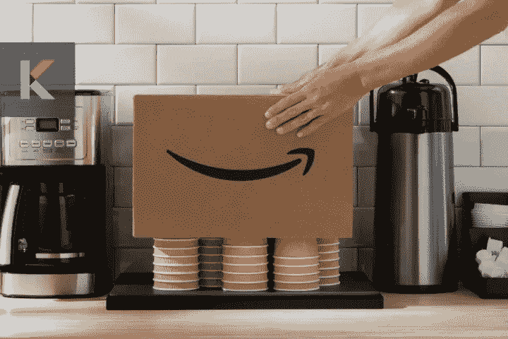
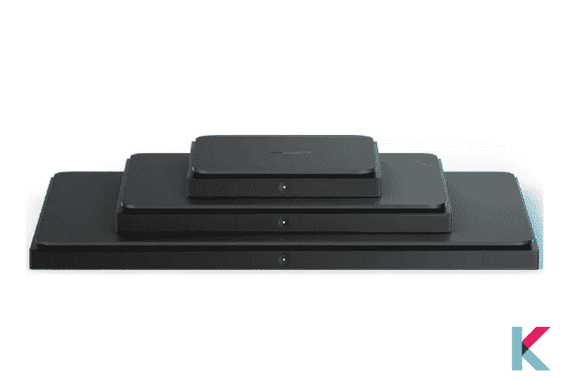
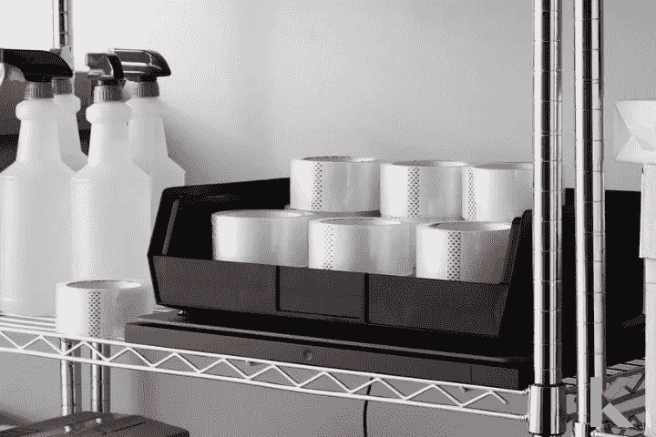
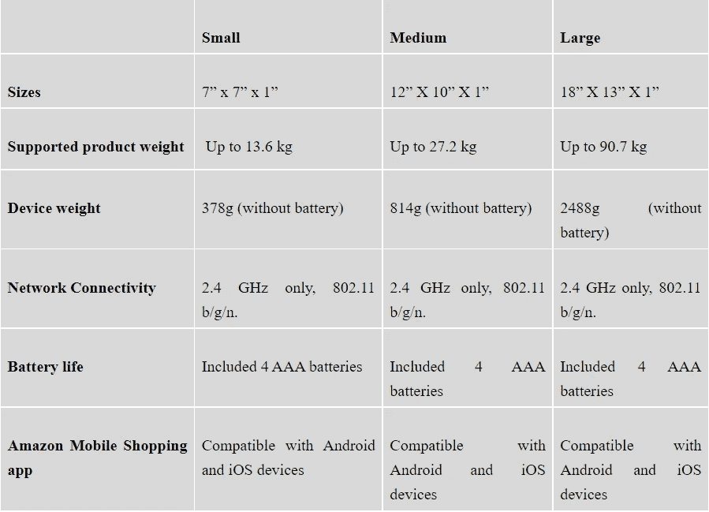

# 亚马逊 Dash 智能货架——智能在线购物

> 原文：<https://blog.devgenius.io/amazon-dash-smart-shelf-b935b0900610?source=collection_archive---------3----------------------->

网上购物增长迅速。超过 60%的美国人至少在网上购物过一次。亚马逊 Dash 智能货架体现了这一趋势。看起来，这个概念既简单又巧妙。由于其互联网连接，秤会自动重新订购您需要的物品，因此您永远不会缺货。声音不错。是时候了解一下你的亚马逊 Dash 智能货架了。

## ***在这篇文章中，你会学到，***

亚马逊 Dash 货架是什么？

亚马逊 Dash 货架的利弊

亚马逊 Dash 智能货架的特点

当你开始的时候，

如何设置亚马逊 Dash 货架？

如何

*   访问您的设备设置
*   重命名您的设备
*   更改您的重新排序设置
*   更新您的 Wi-Fi 设置
*   上传或查看您的产品重量

价格和可用性

# 亚马逊 Dash 货架是什么？

亚马逊 Dash Shelf 是[亚马逊的联网秤](https://kodmy.com/amazon-dash-smart-shelf/)，当供应不足时，它会自动回购你在上面储存的任何东西。它就像一个空的亚马逊仓库货架。

**检查智能设备的兼容性**

如果你有谷歌助手，那么你可以用谷歌助手检查智能设备的兼容性。而且，不仅是谷歌助手，你还可以检查设备与 Alexa 和 Siri 的兼容性。您现在可以[在 Play store](https://play.google.com/store/apps/details?id=com.knovik.canda) 上下载带有谷歌助手的智能设备检查器。

[从 Play Store 下载](https://play.google.com/store/apps/details?id=com.knovik.canda)

[从应用商店下载](https://apps.apple.com/us/app/canda-compatibility-checker/id1630339464)

这个架子有很多，它的目的是补充非耐用品，如日常用品或宠物食品。你再也不用看菜单了，Dash 智能搁板会帮你搞定。还有，你不再购物了。

Dash 产品链接到亚马逊的 Dash 补货服务(DRS)。这个货架足够聪明，可以知道你在亚马逊上的东西快用完了。你什么都不用做。当负载达到极限时，它会自动重启。此外，它对中小型企业也很有帮助。并且，它可以把你的房子变成一个[智能家居](https://kodmy.com/smart-home-technology/)。

有时，您可能想知道 Dash Smart 搁板适合哪些产品。您可以从数千种受支持的产品中进行选择，如办公必需品、餐具和清洁用品。此外，你可以在亚马逊应用程序中找到产品的完整列表，并前往设备设置找到它们。

但是，您可以存储许多不同的产品，一次只能存储一种产品。重新订购后，您可以在 24 小时内取消或更改订单。而且，当产品达到其推荐的再订购水平时，它会再订购或通知您。您也可以使用亚马逊应用程序更改重新排序设置。

还记得你如何在亚马逊上按下破折号按钮来订购某种快用完的家用产品吗？与专用于单个产品的原始 Dash 按钮不同，Dash Smart Shelf 可以配置为监控某个产品，并根据需要为其他产品重新分配任务，而无需显示产品的品牌。

Dash Smart 搁板上有一个 LED 指示灯。当您使用电池电源时，它会在大约 10 秒后关闭，以延长电池寿命。

*   白色闪烁:设备开启
*   蓝色闪烁:连接到蓝牙或 wifi，准备设置
*   白色固体:连接到 wifi
*   白色闪烁，然后绿色:在自动上传之间上传库存
*   黄色闪烁，然后绿色:重新校准成功
*   红色闪烁:未连接 wifi

相反，请点击此处查看我们的[智能灯光调光开关 2022](https://kodmy.com/smart-light-switch-dimmer/) 文章和[最佳智能照明 2022](https://kodmy.com/the-best-smart-lighting-2021/) 文章。

快一点！你可以[从亚马逊花 19.99 美元](https://amzn.to/3qHWb6M)买到亚马逊 Dash 货架。

# 亚马逊 Dash 货架的利弊

# 赞成的意见

*   **方便**

设置后，您可以浏览与该小工具兼容的产品。有数以千计的产品，分为不同的类别，如食品和饮料，个人护理，以及办公和 IT 用品。

*   **操作简单**

智能货架操作起来超级简单。此外，秤使用四节 AAA 电池，大约每两年更换一次。这个小工具用来知道何时重新订购产品的主要信号是重量。

*   **规模和经济性**

自动补给秤有三种不同的尺寸，因此您可以将它放在调味品等小件商品和卫生纸等大件商品下面。

# 骗局

*   **忘了买最好的便宜货吧**

尽管这些货架不贵，但从长远来看，它们可能很贵。该设备没有扫描交易的程序，因为它连接到亚马逊的 Dash 补货服务，该服务会自动对设定的产品进行重新订购。

# 亚马逊 Dash 智能货架的特点

# 当你开始的时候，

1.为您的 Dash 智能搁板找到正确的位置

它可以用在平坦的表面上，例如茶水间、搁板和电线架。但是，有必要有一个强大的 2.4 千兆赫无线网络连接。此外，仅用于室内使用，最高温度为 40–80°f。

2.打开它

作为第一个选择，如果您正在使用电池，您必须移除塑料标签来激活它们。此外，作为下一个选项，如果您正在使用墙壁电源，您可以使用微型 USB 电源适配器插入设备。

# 如何设置亚马逊 Dash 货架？

在整个设置过程中，您必须确保仪表板智能搁板上没有任何东西。

*   打开蓝牙
*   接下来，在应用商店下载最新版本的亚马逊购物应用
*   打开应用程序，登录您的亚马逊账户
*   选择菜单图标
*   选择“程序和功能”下的“智能重新排序设备”。否则，选择“查看所有程序”。
*   设置新设备，然后从“小”、“中”或“大”中选择“Dash 智能搁板大小”。
*   按下设备按钮并保持五秒钟。然后释放它。你可以看到一个蓝色的手电筒。
*   按照说明连接到无线网络
*   您可以在应用程序中看到可用的产品，并从中选择您的产品。安装后，您可以将产品放在设备上。如果您还没有产品，可以在安装结束时下订单。
*   调整再订购设置后，确认付款和地址详情。

# 如何

## 访问您的设备设置

要访问设备设置，您必须首先打开亚马逊应用程序，然后选择菜单图标。然后，在“程序和功能”下，选择“智能重新订购设备”。最后，您可以选择您的 Dash 智能搁板。

## 重命名您的设备

要重命名您的设备，请打开亚马逊应用程序，然后访问设备设置。之后，您可以选择编辑名称。

## 更改您的重新排序设置

如果您想更换与 Dash 智能搁板搭配使用的产品，您可以随时更换。首先，您想访问设备设置，然后点击当前产品。在这里，您可以浏览可用产品并选择新项目。

## 更新您的 WiFi 设置

要更新无线设置，请转到设备设置的无线部分，您可以按照屏幕上的说明进行操作。

## 添加或删除存储容器

还有另一种方法可以将您的物品保存在存储容器中，您可以将其中一个放在设备顶部，而不会减轻重量。

首先，您要确保您要使用的容器是空的，并将其放在您的设备上。接下来，您可以连续按下设备正面的按钮 4 次。现在，你必须等灯闪黄然后变绿。是时候使用你的容器了。访问设备设置以确认您当前的库存读数为 0%。如果您想要停止使用容器，可以将其从设备中移除。然后再次按下按钮 4 次，等待灯闪烁黄色然后绿色。

## 上传或查看您的产品重量

电池供电时，Dash Smart Shelf 每天一次，墙壁供电时，每小时一次，会自动上传您产品的重量。如果您想密切关注您的供应，您可以在自动上传之间随时上传重量。你只想按一次按钮。然后等待灯闪白光，然后变绿。你可以在亚马逊应用程序中的设备设置中查看最近的上传。

# 价格和可用性

这款智能搁板有三种尺寸，小号、中号和大号。这个便宜。关于设计没什么好说的。这是一个扁平的黑色塑料秤。它依靠四节 AAA 电池运行，可持续使用两年。

*   价格:19.99 美元
*   哪里买:[亚马逊](https://amzn.to/3qHWb6M)
*   颜色:黑色

***雄霸天下***

亚马逊 Dash 智能货架并不适合所有人，但它是未来的发展方向。它会让你的生活变得更好，你可以在正确的时间点任何东西。你现在可以用亚马逊 Dash 货架了。