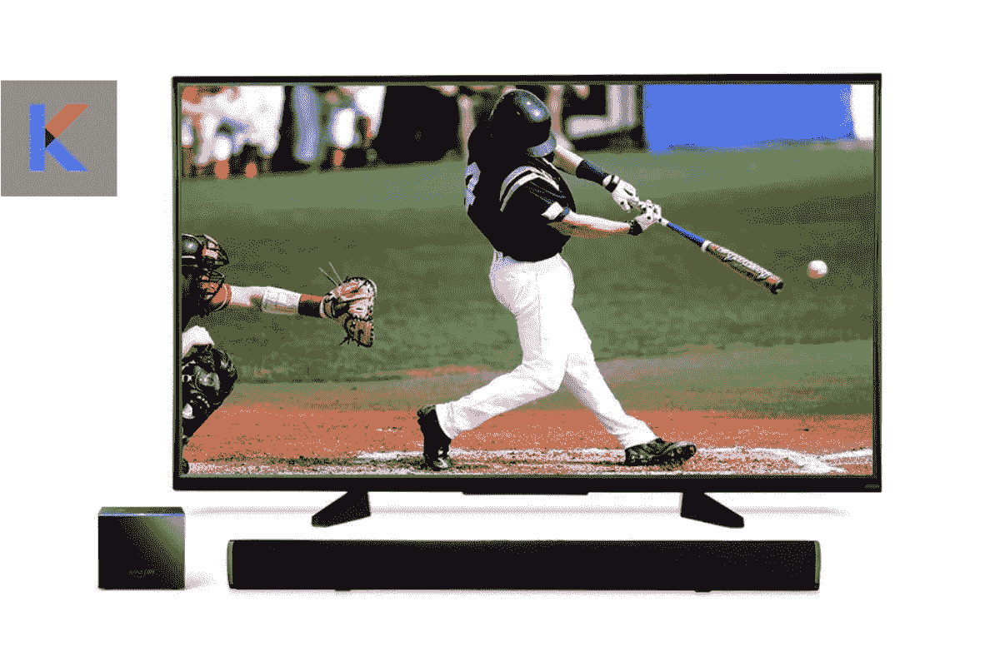
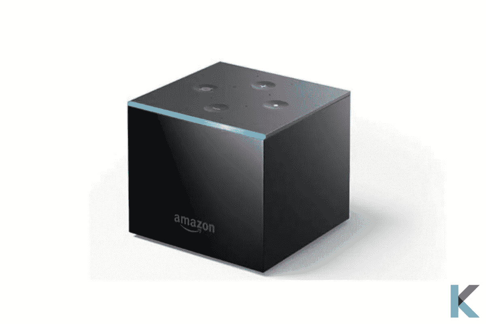
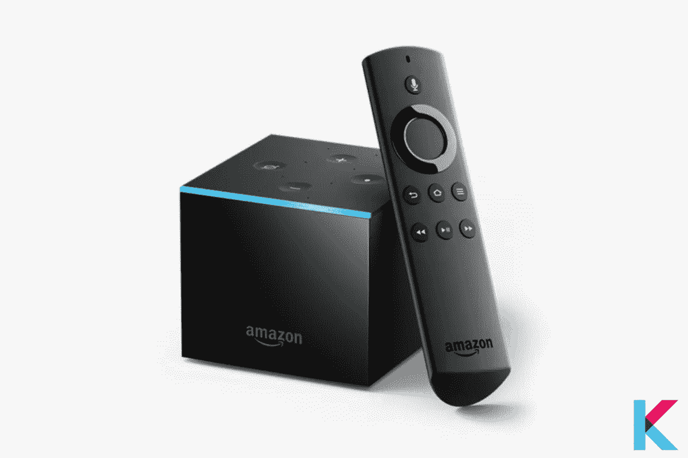
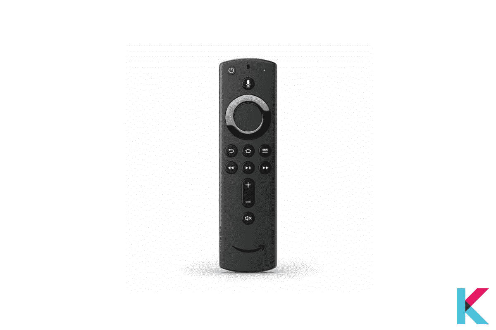
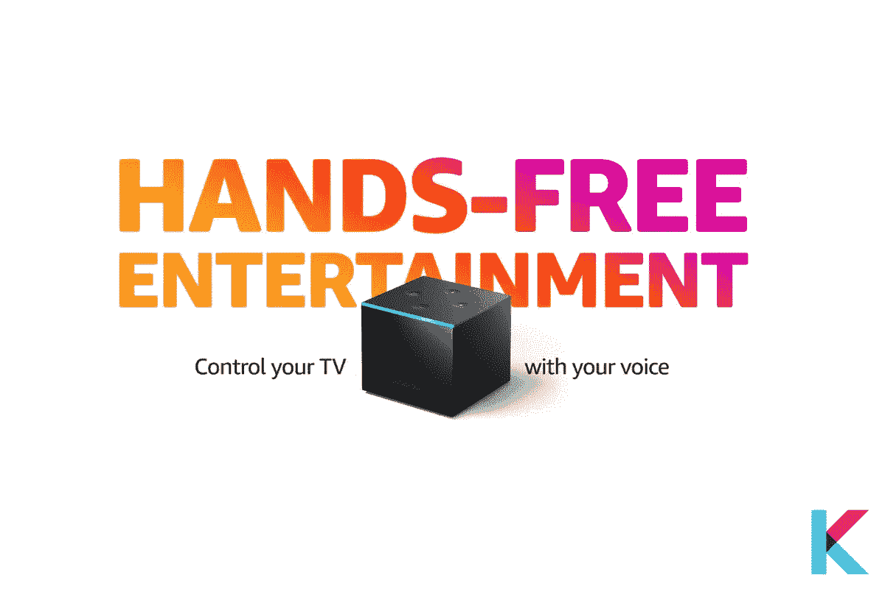
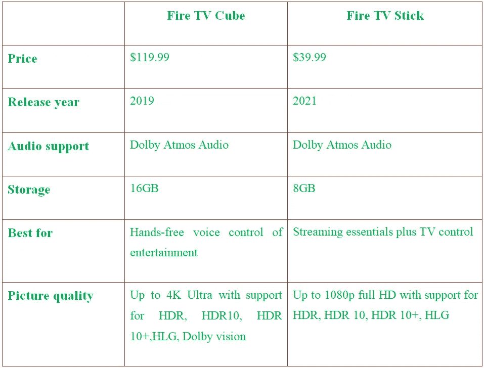
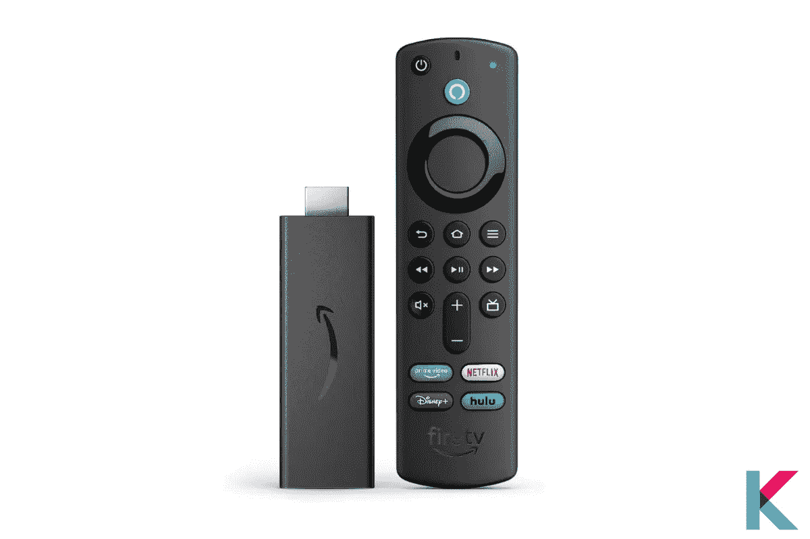

# 亚马逊 Fire TV cube(第二代)—完整评论

> 原文：<https://blog.devgenius.io/amazon-fire-tv-cube-2nd-generation-complete-review-afee5e5b619c?source=collection_archive---------6----------------------->

亚马逊近年来开始销售视频流媒体设备。此后，该公司修改了 Fire TV 型号，以跟上当前消费电子产品的趋势。然后，由于 Alexa 的成功，亚马逊的电视设备开始通过语音控制发挥作用。还有亚马逊 Fire TV Cube 就是其中著名的流媒体设备。

亚马逊 Fire 电视魔方

在这篇文章中，

*   亚马逊 Fire TV cube 是什么？
*   亚马逊 Fire TV cube 的利弊
*   亚马逊 Fire TV cube 规格是什么？
*   有哪些兼容亚马逊火立方的电视？
*   亚马逊 Fire TV cube 应用
*   亚马逊 Fire TV Cube 遥控器
*   亚马逊 Fire TV cube 是如何工作的？
*   兼容亚马逊 Fire TV cube 的设备？
*   如何设置亚马逊 Fire TV Cube
*   亚马逊 Fire TV cube 和 Fire Stick 的价格对比
*   火立方比火棍好吗？

# 亚马逊 Fire TV cube 是什么？

亚马逊 Fire 电视魔方

亚马逊 Fire TV cube 是一款智能电视流媒体盒子，配有 [Alexa](https://kodmy.com/the-best-alexa-compatible-devices-in-2021/#alexa) 。这是一个黑色的小盒子，有闪亮的哑光黑色塑料，大约 86 毫米宽，77 毫米高的立方体。它还支持各种服务和应用程序，无延迟性能，视频和音频标准，并具有 snappy。一个 Alexa 回声点配合消防电视立方体。此外，立方体顶部的一个灯条显示 Alexa 正在做什么，用警告点亮橙色，或在收听时点亮蓝色。

而且，它是最强大的 fire TV 流媒体设备。你可以要求 Alexa 播放你的节目，打开电视。太神奇了！您可以用声音控制兼容的条形音箱和 A/V 接收器，并更换卫星频道或有线电视。当电视关闭时，你可以让 Alexa 关灯，查看天气等。

Cube 支持高端音频和音频格式以及 4K 超高清内容、杜比视界、HDR 和 HDR10+。它还免费播放冥王星电视、IMDb 电视等节目。在音频方面，您有标准立体声、7.1 或 5.1 环绕声。还有，你有杜比的 Atmos 格式。网飞、Apple TV 和 Prime Video 都支持杜比全景声和 Vision。

# 亚马逊 Fire TV cube 的利弊

**优点**

*   它包括一个语音遥控器
*   您可以控制的不仅仅是电视
*   它有一个原生的 YouTube 应用
*   4K·HDR 回放
*   电视/AV 控制中心
*   杜比全景声，杜比视觉支持
*   合适的用户界面和性能

**缺点**

*   语言识别并不理想
*   主屏幕主要是亚马逊的内容
*   不附带 HDMI 电缆
*   有点贵
*   这个软件有一些缺陷
*   比大多数设备都大

# 亚马逊 Fire TV cube 规格是什么？

带遥控器的亚马逊 Fire TV Cube

亚马逊 Fire TV Cube 可以控制您的电视、A/V 接收器和有线电视盒。太神奇了！cube 和 Alexa 可以运行你的整个智能家居。

***尺寸:***86.1 毫米 x 86.1mm 毫米 x 76.9mm 毫米

***音频:*** 杜比 Atmos，7.1 环绕声，2ch 立体声，HDMI 音频直通高达 5.1。

***视频:*** 4k 超高清，1080p，HDR，HDR 10+

***Wi-Fi:*** 双频双天线 Wi-Fi (MIMO)比标准 Wi-Fi 具有更快的传输速度和更少的掉线。

**重量:*重量:*465 克**

***内存:*** 16GB(内部)

# 有哪些兼容亚马逊火立方的电视？

使用 Fire TV Cube 上的 Alexa，您可以控制三星、索尼、LG、Vizio 等领先品牌的兼容电视、条形音箱和 A/V 接收器。此外，通过康卡斯特、DISH、DIRECTV/AT&T U-verse 等公司的有线电视或卫星电视盒，你可以观看直播电视。

# 亚马逊 Fire TV cube 应用

当我们考虑 Fire TV cube 应用程序时，Fire TV cube 提供了所有电视应用程序。有几个亚马逊 Fire TV Cube 和视频应用程序，如 Prime Video、网飞、Hulu、HBO NOW、Showtime Anytime、NBC Sports、FOX Sports、Philo、Youtube TV 和 Pluto TV。

此外，它还支持多种音乐、娱乐和游戏应用，如 Crossy Road、最终幻想 VI、《我的世界》、疯狂出租车、Spotify、亚马逊音乐和 Pandora。

# 亚马逊 Fire TV Cube 遥控器

亚马逊 Fire TV Cube 遥控器

亚马逊 Fire TV Cube 自带遥控器。遥控器顶部有一个电源按钮和一个 Alexa 麦克风按钮。此外，还有一个导航轮，然后是主页、后退、菜单、前进、后退、播放/暂停和静音按钮。

你可以用你的声音来控制你的消防电视立方体。但是那些不喜欢和 Alexa 说话的人可以用遥控器。此外，还有 iOS 和 Android 的 Fire TV 应用程序来控制您的 Fire TV。

# 亚马逊 Fire TV cube 是如何工作的？

亚马逊 Fire 电视魔方

如果你不想让设备的麦克风一直开着，以便免提访问 Alexa，你可以使用遥控器上的按钮来按需召唤 Alexa。在繁忙的环境中，您还可以使用它更可靠地提供语音命令。

任何以前使用过 Fire TV 设备的人都会认出这个遥控器。它有一个用于导航、音量和播放控制的 D-Pad，快速主页和后退按钮，以及用于 Prime Video、网飞和亚马逊音乐的热键。还有一个专用的应用程序抽屉按钮，这在新的 Fire TV UI 上很有用，因为只有几个应用程序可能会显示在主屏幕上。

# 兼容亚马逊 Fire TV cube 的设备？

任何带有 HDMI 连接器、有线/卫星盒、A/V 接收器和条形音箱的电视都可以与 Fire TV Cube 配合使用。Alexa 还可以用来操作兼容的智能家居功能，如智能[锁](https://kodmy.com/smart-lock-for-smart-life/)、灯、[恒温器](https://kodmy.com/the-best-alexa-compatible-devices-in-2021/#best%20alexa)等等。

蓝光/DVD 播放器、投影仪和通用遥控器与 Fire TV Cube 不兼容。Alexa 还没有完全取代你的手指。

# 如何设置亚马逊 Fire TV Cube

立方体比 Fire 电视棒更难设置，因为它不会像电视棒一样立即启动，而且你必须考虑它的红外接收器。它必须能清晰地看到你的遥控器，所以要让它看得见。如果您想利用 4K 功能，您还需要使用附带的以太网适配器。

一旦你已经连接好了你的连接并且能量流向了立方体，你将需要通过设置的软件方面。它会要求你连接到互联网，选择某些应用程序/频道，并登录到你的亚马逊帐户。

当您从亚马逊订购立方体时，您将已经登录到您的 prime 帐户。首先，您希望从那里设置一个向导。它可能会完成同步其他附件的过程。然后，你要记得打开其他配件的 HDMI CEC。现在很多设备都配有这种 CEC，但是买之前要检查一下。

我们建议使用 Fire TV Cube 的捆绑交流适配器，而不是电视的 USB 电源，USB 电源可以像任何设备配置一样随电视开关。此外，我们更喜欢使用以太网电缆通过 Wi-Fi 直接连接互联网，但我们理解干扰娱乐中心布线的阻力。

Amazon Fire TV cube 设置中包括几个组件。

*   消防电视立方体
*   Alexa 语音遥控器
*   快速入门指南
*   USB 电源线
*   红外延长线
*   交流电源电缆
*   2 节 AAA 电池
*   以太网适配器

此外，你还需要一些设备，比如带有 HDMI 端口和 Wi-Fi 网络或以太网互联网端口的电视。

# 亚马逊 Fire TV cube 和 Fire Stick 的价格对比

亚马逊 Fire TV cube 和 Fire Stick 的价格对比

# 火立方比火棍好吗？

亚马逊消防棒

由于其免提控制，Fire TV Cube 是最受欢迎的流媒体设备。很多人欣赏。因此，如果您连接兼容设备，它可以控制您的整个智能家居。

Fire 电视棒要便宜得多，除了免提控制和智能家居连接之外，它几乎可以执行 Cube 所做的一切。

如果你已经有一个 Echo 或一个智能助理在操作你的智能家居，你就不需要这个立方体了。它们都是很好的选择，也是使用一个紧凑的基本设备将电视转换成智能电视的优秀解决方案。

# 我们的选择

我们推荐使用[亚马逊 Fire TV Cube](https://kodmy.com/amazon-fire-tv-cube/) 。它是一个神奇的工具，不仅可以控制你的电视和娱乐中心，还可以用你的声音控制你的整个家庭。这也是一个梦幻般的直上电视流媒体。

Fire TV Cube 是流媒体设备系列中较为昂贵的一款，但我们认为它不会很快过时。就性能和寿命而言，您将物有所值。如果你已经和 Alexa 有了认真的联系就更好了。

然而，我们对 Fire TV Cube 的一个批评是，尽管 Alexa 的语音识别非常出色，但它仍然低于谷歌。然后用手选择。