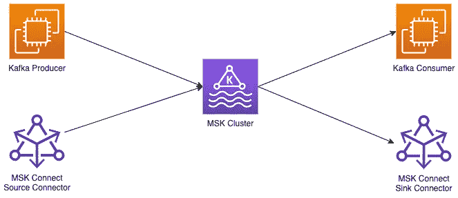

# 亚马逊 MSK 提示和怪癖

> 原文：<https://blog.devgenius.io/amazon-msk-tips-quirks-7b1e56d53296?source=collection_archive---------2----------------------->

不是对卡夫卡本身的介绍。



作者用 draw.io 做的图

偶尔，我会写一些我作为 DevOps 工程师和解决方案架构师在日常工作中遇到的有趣的事情。

最近，我一直在开发一个将流数据加载到数据仓库的解决方案。因为大多数时候，一个挑战有更多的解决方案，特别是这一次，我正在考虑 Kinesis Firehose & S3 或 Apache Kafka(准确地说是亚马逊 MSK)的组合，SaaS vs PaaS(尽管亚马逊 MSK 也有无服务器选项)。

长话短说，对于我手头的用例来说，使用 Kafka 以及 Kafka Connect sink connectors 来完成这项工作更有意义。

在这篇文章中，我将介绍一些我在 AWS 中实现时遇到的怪癖和技巧。

## 1.客户端身份验证

亚马逊 MSK 提供 4 种客户端认证方法:

1.  未经认证—请不要
2.  [SASL](https://en.wikipedia.org/wiki/Simple_Authentication_and_Security_Layer) 与[急停](https://en.wikipedia.org/wiki/Salted_Challenge_Response_Authentication_Mechanism)——基本上是用户名&密码与 AWS 秘密管理器中每个用户的秘密
3.  使用 AWS IAM 的 SASL—使用 IAM 身份以及允许操作的策略`kafka-cluster:*`。类似于 Kafka ACLs 的访问控制，在集群/主题/消费者群体/交易级别。
4.  TLS 客户端证书—需要 Amazon 证书管理器(ACM)中的私有证书颁发机构(CA)。这是一种更昂贵的认证方法，因为 ACM 中的私有 CA 的起价是 400 美元/月，而且您还需要为 CA 颁发的证书数量付费

在这个列表中，很明显，首选的方法是那些涉及 SASL。Amazon 一如既往地将其集成到他们的云中，并添加了对 IAM 的支持。Kafka ACLs 不适用于 IAM 认证的客户端，因此您可以将 Kafka 属性`allow.everyone.if.no.acl.found`设置为`false`。

唯一的问题是 Amazon 只有一个库来支持客户端的这种认证方法，只针对 Java 客户端，这里是库仓库[这里是](https://github.com/aws/aws-msk-iam-auth)。

如果您有其他技术堆栈客户端，例如 Go 或 Rust，您将不得不满足于 SASL/SCRAM 认证或自己编写 IAM 逻辑。

这就把我们带到了单子上的下一点。

## 2.Kafka 管理实例

因为您可能会使用 **SASL/SCRAM** 认证，所以您可能希望使用 Kafka ACLs 设置对 Kafka 资源的最低特权访问。为此，您需要一个可以连接到 MSK 集群的实例，并具有超级用户权限来设置这些 ACL。当你这么做的时候，你可能不想将`auto.create.topics.enable`设置为`true`。

因为您不能远程访问 MSK Kafka 集群的代理节点，所以您需要一个实例来管理 Kafka。

我的建议是:

*   Kafka 超级用户/管理员的 IAM 角色— `kafka-cluster:*`权限
*   AWS Cloud9 环境，只有 Kafka 管理员可以访问
*   在 Cloud9 环境中，从[这里](https://archive.apache.org/dist/kafka/3.2.0/kafka_2.12-3.2.0.tgz)安装 Kafka 工具，并在 **libs** 子目录中添加来自亚马逊的 MSK IAM auth 库(在点#1 链接)
*   使用 AWS 安全令牌服务(STS)来承担 Kafka 管理员角色
*   将下面的客户端配置文件用于 **kafka-*** shell 命令

```
security.protocol=SASL_SSL
sasl.mechanism=AWS_MSK_IAM
sasl.jaas.config=software.amazon.msk.auth.iam.IAMLoginModule required;
sasl.client.callback.handler.class=software.amazon.msk.auth.iam.IAMClientCallbackHandler
```

你可能会问，Terraform 呢？我只能找到一个管理 Kafka 资源的平台提供商，[这里](https://github.com/Mongey/terraform-provider-kafka)。这个不像预期的那样支持 IAM 认证，所以无论如何，你必须手动创建一个具有 SASL/SCRAM 认证的管理员用户并为其设置适当的 Kafka ACLs。

## 3.秘密管理器中的 Kafka 用户

这是一个有趣的问题，你应该意识到 MSK 在这方面的局限性。根据 [AWS 文件](https://docs.aws.amazon.com/msk/latest/developerguide/msk-password.html#msk-password-users):

*   移除用户(解除密码与 MSK 集群的关联)不会关闭现有连接，因此如果您想要强制阻止用户，您将需要使用 Kafka ACLs
*   对用户机密的更改可能需要 10 分钟才能在 Kafka 中反映出来，因此请注意，如果您想要使用机密旋转，您可能需要在客户端中处理这一点
*   MSK 用户的 AWS 机密管理器机密必须使用 KMS CMK，而不是默认的机密管理器密钥—这是因为您需要允许 MSK 的服务角色(*role/AWS-service-role/Kafka . Amazon AWS . com/AWSServiceRoleForKafka*)使用密钥进行解密，`kms:Decrypt`
*   AWS Secrets Manager secrets for MSK 用户必须有一个名字前缀`AmazonMSK_`——如果你试图在 AWS 的所有资源中遵循一个命名约定，这是相当烦人的
*   MSK 集群可以拥有多达 1000 个用户，如果您需要扩展更多，您要么做错了什么，要么需要考虑拥有单独的集群

## 4.为客户端使用安全组

当您创建您的 MSK 集群时，您可能会为它创建一个安全组，允许您想要的身份验证方法进入特定端口(9096 用于 SASL/SCRAM，9098 用于 SASL/IAM)。
补充说明:不需要为集群的安全组添加任何出口规则。代理之间以及代理和 ZooKeeper 节点之间的连接是在 AWS 的主干网络上实现的(在您的 AWS 帐户中不可见)。

对于入口规则，除非您处理的网络设置中 VPC 可通过 VPN、直接连接或中转网关访问(在这种情况下，您需要在安全组规则中指定 IP CIDR 块)，否则您可以执行以下操作:

*   为 Kafka 客户端创建另一个安全组
*   允许从 Kafka 客户端安全组进入 Kafka 集群安全组
*   允许从 Kafka 客户端安全组出口到 Kafka 集群安全组
*   任何 Kafka 客户端都需要将 Kafka 客户端安全组附加到其弹性网络接口(ENI)

## 5.MSK 连接自定义插件

一旦你的 Kafka 集群*开始运行*，你将需要生产和消费数据。一种方法是使用[卡夫卡连接](https://kafka.apache.org/documentation.html#connect)。

> Kafka Connect 是一个工具，用于在 Apache Kafka 和其他系统之间可伸缩且可靠地传输数据

亚马逊有一个运行无服务器 Kafka Connect 集群的托管服务，亚马逊 MSK 连接。

在 MSK 连接中，您有 3 种资源可以使用:

*   连接器—定义 Kafka 连接集群的连接器本身
*   自定义插件——定义 JAR 或 ZIP 档案(针对多个 JAR)的资源，其中包含将在 Kafka Connect 集群中运行的连接器编译代码
*   工作机配置—在连接器中启动的工作机配置

虽然 worker 配置是可选的，但自定义插件不是。您需要首先配置这个资源，以便将它用于连接器 1。创建定制插件资源时，通过指定存储它们的 S3 桶和键，将 JAR 或 ZIP 存档传递给它。

您需要注意的一点是，在撰写本文时，AWS 文档中没有明确说明这一点，尽管自定义插件是用 S3 中的对象构建的，并维护对该对象的引用，但对该对象的任何更新都不会反映在自定义插件中。因此，仅仅在 S3 更新包并期望在下次重启时连接器会使用新的包是不够的。

您实际上需要重新创建(或创建一个新的)定制插件资源，然后重新创建(或创建一个新的)连接器本身。
请注意，如果自定义插件资源创建了活动的连接器，那么它就不能被删除，所以您需要先删除连接器。

## 6.MSK 连接主题

每个连接器都将在 Kafka 和一个消费者组中创建自己的主题集，这是连接器正常运行所必需的。

主题:

*   _ _ Amazon _ MSK _ connect _ configs _ $ connector name _ $ connector uid
*   _ _ Amazon _ MSK _ connect _ offsets _ $ connector name _ $ connector uid
*   _ _ Amazon _ MSK _ connect _ status _ $ connector name _ $ connector uid

使用者组:连接-$connectorName

当对 MSK 集群的 MSK 连接连接器使用 IAM 身份验证时(推荐)，您需要在连接器的 IAM 策略中指定这些主题&使用者组。AWS 文档使用更开放的策略类型，允许对`__amazon_msk_connect_*`进行主题操作，但是您可以通过使用更具体的主题名称来加强安全性。

我们可以从上面的列表中发现，当我们重新创建一个连接器时，尽管我们可能使用相同的名称，但是将会创建一组新的主题，因为它们的名称中有连接器的惟一 ID。如果您发现自己经常重新创建一个连接器，那么这些可能需要定期清理。

*数据源*连接器将利用偏移主题，因此如果您希望重新创建的连接器从上一个连接器停止的地方恢复，您需要在 worker 配置中指定`offsets.storage.topic`属性来使用特定的主题，而不是默认的主题。

*Data sink* 连接器并不为此使用 offsets 主题，而是利用消费者组协议，因为消费者组只包含连接器名称(也不包含其 UID)，它将开箱即用，从上一个连接器停止的地方恢复。当然，只要连接器名称保持不变。

## 7.将 AWS Secrets Manager 用作 Kafka 配置提供程序

Kafka 连接器支持配置提供者( [ConfigProvider 接口](https://kafka.apache.org/27/javadoc/org/apache/kafka/common/config/provider/ConfigProvider.html))，因此您可以将敏感信息具体化，而不是在连接器的配置中以纯文本的形式保存它们。

AWS Secrets Manager 已经有一个这样的配置提供程序，这里是。

例如，如果您对数据库使用连接器(用于源数据或接收数据),您可能希望从 Secrets Manager 之类的服务中读取数据库访问凭据，而不是在连接器配置中以纯文本形式显示用户名和密码(在 AWS 控制台中可见)。

AWS 文档在这方面非常清楚，也有一些例子，所以请查看以了解更多信息。

# 结论

像其他托管服务一样，亚马逊 MSK 有其特定的内部工作方式，你在使用它时需要了解，以免以后遇到麻烦。也就是说，除了实际的第三方服务，在这种情况下，阿帕奇卡夫卡，它提供的。

随着我在生产中运行 Kafka 和向系统添加更多功能时面临更多挑战，我可能会在未来就这个主题写更多文章。