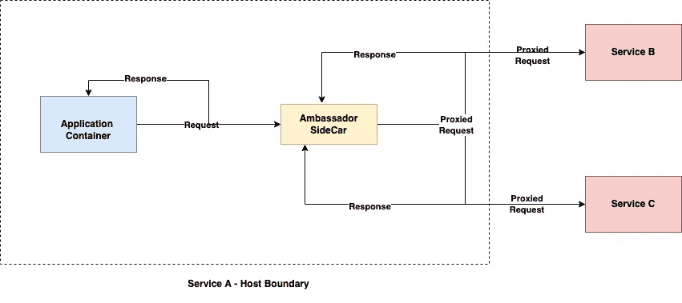
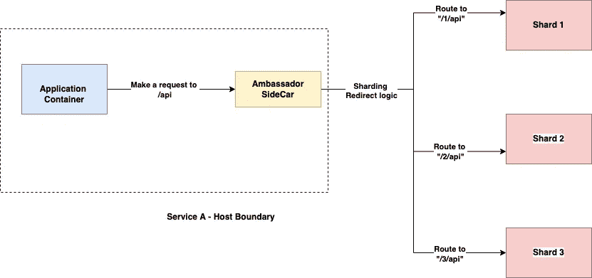

# 大使模式 101

> 原文：<https://blog.devgenius.io/ambassador-pattern-101-399fd38b0662?source=collection_archive---------8----------------------->

这篇博客是我们从零开始讨论 101 个概念的系列文章的一部分，读者的入门知识有限。本文属于 ***中级*** 系列，因为它涉及对**大使模式**的理解——主要用作与业务应用程序/客户机协同运行的独立代理服务。

101 系列中的一些早期博客如下:

[**API 101**](/api-101-773ec501b485) [**异步通信 101**](/async-communication-101-b04d5c95333a)[**数据库 101**](/database-101-13d593ec4078)[**数据库设计 101**](/database-design-101-7c019d69b97f) **[**部署策略 101**](/deployment-strategies-101-ee2badd60799)**

# 什么是大使模式？

Ambassador 是 [s **ide-car 模式**](https://docs.microsoft.com/en-us/azure/architecture/patterns/sidecar) 的一个特例，它使用一个公共的协同定位服务/容器(在基于 Kubernetes/Docker 的部署的情况下)来卸载公共客户端连接功能，例如**监控、日志、路由、安全性、弹性**。大使服务通过提供 L7 特性，如 **HTTP 重试、断路器模式、请求头修改等，充当用多种语言和框架编写的遗留服务的可重用代理解决方案。** Ambassador 版本和基础设施可以独立于业务应用程序/容器进行发布和扩展，这使其成为满足业务领域非功能性需求的合适选择。

# 大使当边车

# 顺序流程

1.  应用程序容器通过**大使代理**向远程**服务 B/服务 C** 发送请求
2.  代理边车将跟踪信息添加到请求头中。还通过为 [**相互 TLS**](https://www.cloudflare.com/en-in/learning/access-management/what-is-mutual-tls/#:~:text=Mutual%20TLS%2C%20or%20mTLS%20for,TLS%20certificates%20provides%20additional%20verification.) **添加证书来加密请求。**另外开始测量请求延迟。
3.  远程**服务 B/服务 C** 接收请求，并在发回响应消息之前验证请求头。
4.  大使端汽车接收返回的响应并记录请求等待时间。
5.  应用程序容器接收最终的响应。

# 用例

1.  当遗留服务以多种语言构建，并且为每个客户端添加网络/路由功能的开发时间和成本与添加到通用的基于代理的解决方案相比非常高时。
2.  当常见的非功能性架构模式(如 c **电路中断、应用程序插装、速率限制**具有独立于客户端应用程序的策略时。
3.  具有分片数据库/消息传递层和多个正在运行的基础设施实例/节点的应用程序，因此需要使用通用组件对配置进行抽象。

# 应用程序分片示例

# 限制

1.  具有关键延迟要求和端到端往返的应用程序请求可能会受到额外的侧车代理的影响
2.  具有与客户端代码/语言深度集成的连接需求的应用程序以及通过代理隔离请求是不可伸缩的。

# 摘要

我们讨论了 Ambassador 模式的基础知识，这是一种流行的设计模式，有助于在不构建基于端到端服务网格的集成解决方案的情况下，实现遗留应用程序需求的现代化。在 Kubernetes 世界中，大使代理可以作为服务清单文件部署，并随应用程序单元一起扩展

*如需反馈，请留言至****Amit[dot]894[at]Gmail[dot]com****或联系*[*https://about.me/amit_raj*](https://about.me/amit_raj)*的任何链接。*