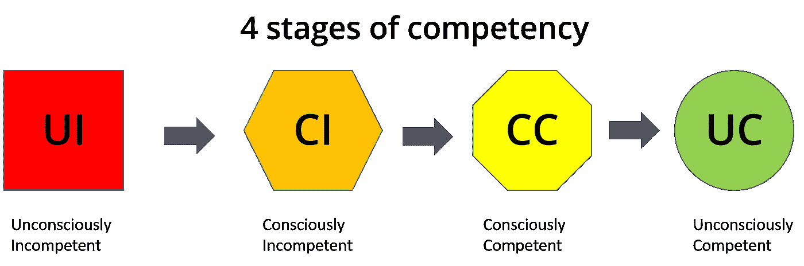
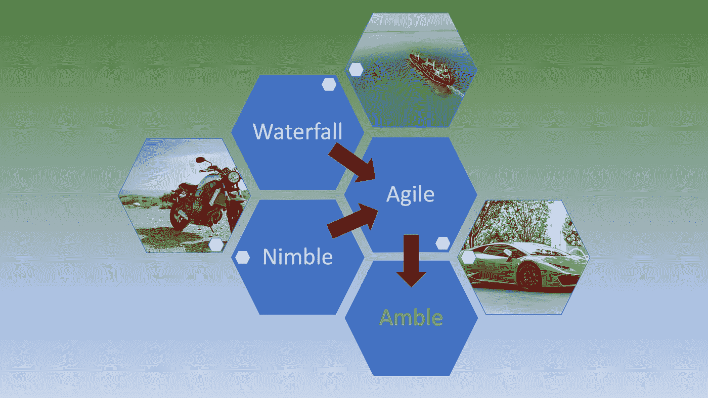

# amble——从敏捷到敏捷的失败转变

> 原文：<https://blog.devgenius.io/amble-a-failed-transition-from-agile-to-nimble-75a9a5efe04c?source=collection_archive---------10----------------------->

诺埃米·马卡韦-卡特茨在 [Unsplash](https://unsplash.com?utm_source=medium&utm_medium=referral) 上拍摄的照片

# 最佳意图的意外效果

当你混合敏捷和敏捷时会发生什么？

好吧，我们最好从什么是敏捷和灵活开始:

***敏捷*** *—敏捷轻巧*

敏捷企业、人员和软件开发的特征:

*   快速做出**决定**并付诸行动(并不意味着他们总是正确的，但他们可以快速决定-行动-修改)。
*   有一个**被理解的过程**(这比以前做的要快，并且通常没有记录，更多的是一种共同的感觉)。
*   **接受想法**、反馈和创新(乐意跳过工作软件、设计模式、COTS 库)。
*   能否**快速理解**背景、情况、约束和目标。
*   能够**适应**并使用手边的任何东西(他们可以用螺丝刀做一个粗糙的锤子)。
*   **对自己的能力充满信心**无论如何都要把事情做好。
*   能够赢得交易并快速推出新产品(针对小批量的专用机会)。
*   专门关注近期的**。**
*   **学得快**(只要能胜任工作并领先一步，不需要成为某个领域的专家大师)。
*   诚实——很乐意承认他们没有遵循“真正的”方法，但希望得到比以前更好的认可。

***敏捷*** *—快速且配合良好*

***敏捷框架****——基于敏捷宣言的原则，交付软件的迭代方法，具有频繁的反馈。*

那些快速工作(或比以前更快)的人是如此敏捷(或对纯粹主义者来说是虚假的敏捷)，或者那些相信他们正在进行敏捷，但并没有真正遵循文档化框架的所有过程和信念的人是如此敏捷。

# 敏捷到敏捷的转变

从敏捷(认为自己是敏捷的)到真正敏捷的转变应该是成功的，能够使用和采用更加一致和通用的框架。一个失败的转变只会让团队处于和以前一样的敏捷状态。

# 敏捷到敏捷的过渡，即缓行

相反的观点是，当敏捷开始退化，其他非标准技巧和技术的影响如此广泛，以至于任何常见的敏捷足迹和感觉都被稀释，希望变得更快或规模更大，然后变成一个**缓行**。

***缓行****——缓慢地行走或移动*

作者图片

# 进一步阅读

 [## 敏捷类比和灵感

### 为什么滑板设计师不应该制造汽车

blog.devgenius.io](/agile-analogies-and-inspiration-d8bfac847bfb)  [## 如何在敏捷中发现敏捷

### 介于良好意图和迷失方向之间的是灵活的原则

levelup.gitconnected.com](https://levelup.gitconnected.com/how-to-spot-nimble-amongst-agile-2718f7702192) 

# 关于作者的更多信息

**Greg** 是一名经验丰富的软件专业人士兼首席技术官，曾在多家公司工作过。他现在热衷于帮助他人在软件开发、管理和外包方面取得成功。他刚刚写了一本名为“**”的短篇小说。**

**如果你喜欢这篇文章，请鼓掌👏和**关注**我或者 [**订阅**](https://greg-billington.medium.com/subscribe) 一封邮件✉️。**