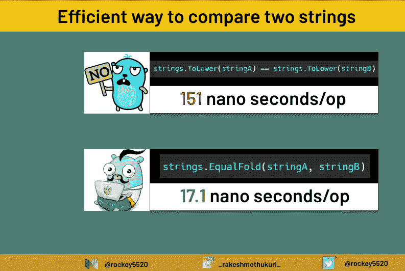

# 围棋中比较字符串的有效方法

> 原文：<https://blog.devgenius.io/an-efficient-way-to-compare-strings-in-go-66b61844071f?source=collection_archive---------1----------------------->

## 权威指南

## 有没有比在 Golang 中使用==更好的比较字符串的方法？让我们看看



# 介绍

最容易被忽略的操作之一是比较两个字符串，这可能不会导致系统开销，但可以肯定的是，尽可能编写高效的代码是一个很好的实践。当应用程序在生产中面临真正的压力时，这些小红利最终肯定会得到回报。

**注:**我是围棋业余爱好者，如果你是一名经验丰富的围棋专业人士，在这里发现任何错误都不要生气。如果你能指出错误，我会相应地改正。

经常使用的字符串比较之一是:

```
strings.ToLower(stringA) == strings.ToLower(stringB)
```

但是这种比较方式每次操作都要花费很多时间，原因是，在围棋中，字符串是不可变的符文序列。 [*围棋中的符文*](https://blog.golang.org/strings) 是一个代表 [*码位的整数值*](https://en.wikipedia.org/wiki/Code_point)

Rob Pike 在博客中给出了更详细、更明智的解释:[https://blog.golang.org/strings](https://blog.golang.org/strings)这是一本非常好的睡前读物，它概括了编程语言中字符串的基础知识。

这里[*to lower*](https://golang.org/src/strings/strings.go?s=14301:14330#L574)strings 包中的一个标准函数，当使用它遍历整个字符串时，将它转换成小写并返回一个新的字符串，因为 Go 中的 strings 是不可变的，这意味着 [*strings。ToLower*](https://golang.org/pkg/strings/#ToLower) 为这两个字符串分配新的内存空间。

**样本代码:**

```
func CompareStringsInCrudeWay(stringA, stringB string) (bool, error) {
	if strings.ToLower(stringA) == strings.ToLower(stringB) {
		return true, nil
	} else {
		return false, nil
	}
}
```

**基准:**

```
Input: stringA = "rakesh123456789mothukuri123456789" stringB = "ramesh123456789mothukuri123456789"BenchmarkCompare-8       8304722               151 ns/op               0 B/op          0 allocs/op
```

如果我们注意到在早期的性能指标评测数据中，每次操作都需要`151 nanoseconds`。但是我们需要谈论的太多了吗？不，但是如果字符串比较的方式有一个简单的改变，我们可以把它降低到 30 纳秒，为什么不呢？

**优化**

为了优化，我们可以找到一种方法，而不是遍历每个字符串的符文，比较字符串中的每个字符，如果符文不匹配，我们会将符文转换为小写，然后再次比较，如果它们仍然不匹配，我们打破循环，打破循环，并返回字符串不相同。此过程将节省比较字符串所花费的操作时间。

**伪代码**

```
func Compare(stringA, stringB string) bool {
	for i := 0; i < len(stringA); i++ {
		if stringA[i] == stringB[i] {
			continue
		}
		if unicode.ToLower(stringA[i]) != unicode.ToLower(stringB[i]) {
			return false
		}
	}
	return true
}
```

但是这有更多的逻辑需要记住，并且在每次我们比较字符串的时候，如果有一个简单的方法的话。Go [*strings*](https://golang.org/pkg/strings/) 包有一个以这种方式执行的方法，就是 [strings。相等倍数](https://golang.org/src/strings/strings.go?s=24780:24812#L964)

**使用 EqualFold 的示例代码**

```
func CompareStringsInEfficientWay(stringA, stringB string) (bool, error) {
   if strings.EqualFold(stringA, stringB) {
      return true, nil
   } else {
      return false, nil
   }
}
```

**基准:**

```
Input:
  stringA = "rakesh123456789mothukuri123456789"
  stringB = "ramesh123456789mothukuri123456789"
BenchmarkCompare-8      76842292                17.1 ns/op             0 B/op          0 allocs/op
```

现在，每个操作花费了 **17 纳秒**秒，这些小的成功在一段时间内肯定会有回报，不仅他们有回报，它还有助于促进编写代码的有效方式。

博客到此结束。如果你认为在 Go 中比较字符串有更有效的方法，请给我留言，我会给你添加属性并修改内容。